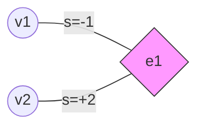
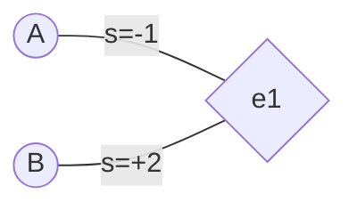
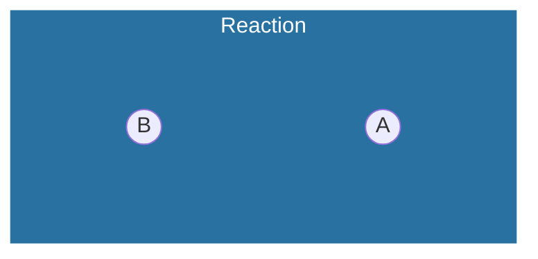
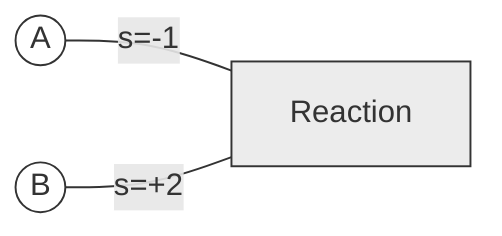
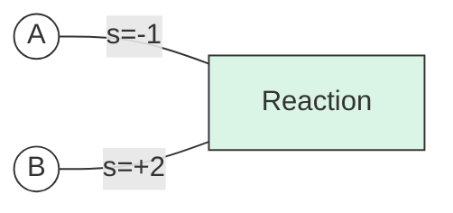

## 2025.01.27

# StoichHypergraphConv Class Documentation

This document explains how the **`StoichHypergraphConv`** operator implements a hypergraph-like convolution using stoichiometric coefficients and optional attention.

---

## Overview of the Mathematical Form

The traditional hypergraph convolution layer can be summarized by:

$$
\mathbf{X}^{\prime} \;=\; \mathbf{D}^{-1} \,\mathbf{H}\,\mathbf{W}\,\mathbf{B}^{-1}\,\mathbf{H}^{\top}\,\mathbf{X}\,\Theta
$$

where:

- $\mathbf{H} \in \{0,1\}^{N \times M}$ is the incidence matrix (mapping nodes to edges).
- $\mathbf{W} \in \mathbb{R}^M$ is the (diagonal) hyperedge weight matrix.
- $\mathbf{D}$ and $\mathbf{B}$ are diagonal degree matrices for the nodes and hyperedges, respectively.
- $\mathbf{X} \in \mathbb{R}^{N \times F_{\mathrm{in}}}$ is the node feature matrix.
- $\Theta \in \mathbb{R}^{F_{\mathrm{in}} \times F_{\mathrm{out}}}$ is the learnable weight matrix.

**In this code**, we adapt the formula to incorporate **stoichiometric coefficients** (signed weights) and an **attention mechanism** (optional). The stoichiometric values replace or augment the role of $\mathbf{W}$ in weighting node-edge incidences, while $\mathbf{D}^{-1}$ and $\mathbf{B}^{-1}$ are computed from the absolute values of those coefficients.

---

## Class Signature

```python
class StoichHypergraphConv(MessagePassing):
    def __init__(
        self,
        in_channels: int,
        out_channels: int,
        use_attention: bool = False,
        attention_mode: str = "node",
        heads: int = 1,
        concat: bool = True,
        negative_slope: float = 0.2,
        dropout: float = 0,
        bias: bool = True,
        **kwargs,
    ):
        ...
```

### Key Constructor Arguments

1. **`in_channels`** / **`out_channels`**: Dimensionalities of the input and output features.
2. **`use_attention`** *(bool)*: If `True`, attention coefficients $\alpha$ are computed and applied during message passing.
3. **`attention_mode`** *(str)*: Either `"node"` or `"edge"`, controlling how the softmax normalization of attention scores is performed.
4. **`heads`** *(int)*: Number of attention heads (only relevant if `use_attention=True`).
5. **`concat`** *(bool)*: If `True`, multi-head outputs are concatenated; if `False`, they are averaged.
6. **`negative_slope`**, **`dropout`**: LeakyReLU slope for attention scores, and dropout probability for attention.
7. **`bias`** *(bool)*: Whether a bias vector is learned after the linear transforms.
8. **`**kwargs`**: Additional arguments passed to PyG’s `MessagePassing` (like `aggr="add"`).

---

## Forward Method

```python
def forward(
    self,
    x: Tensor,
    edge_index: Tensor,
    stoich: Tensor,
    hyperedge_attr: Optional[Tensor] = None,
    num_edges: Optional[int] = None,
) -> Tensor:
    ...
```

### Forward Inputs

- **`x`** $\in \mathbb{R}^{N \times F_{\mathrm{in}}}$: Node features.
- **`edge_index`** $\in \mathbb{R}^{2 \times E}$:
  - Defines the mapping between nodes and “hyperedges” (reactions).  
  - For standard hypergraph notation, this effectively encodes $\mathbf{H}$.
- **`stoich`** $\in \mathbb{R}^{E}$:
  - **Stoichiometric coefficients** used as signed weights.  
  - Negative coefficients typically indicate reactants, positive indicate products.
- **`hyperedge_attr`** $\in \mathbb{R}^{M \times \_}$ *(optional)*:
  - Extra features for each hyperedge. Only needed if `use_attention=True`.
- **`num_edges`** *(int, optional)*:
  - The number of hyperedges $M$. Used for size checks and indexing.

### Internal Steps

1. **Linear Transform**:

   ```python
   x = self.lin(x)
   ```

   - Learns a transform $\Theta$ from $\mathbb{R}^{F_{\mathrm{in}}}\to \mathbb{R}^{F_{\mathrm{out}}}$.
   - If `use_attention=True`, `x` is reshaped for multiple heads.

2. **Attention (Optional)**:

   ```python
   if self.use_attention:
       hyperedge_attr = self.lin(hyperedge_attr)
       ...
       alpha = (torch.cat([x_i, x_j], dim=-1) * self.att).sum(dim=-1)
       alpha = F.leaky_relu(alpha, self.negative_slope)
       alpha = softmax(alpha, ...)  
       alpha = F.dropout(alpha, p=self.dropout, ...)
   ```

   - Merges node and hyperedge features ($x_i$ and $x_j$) into a single attention score $\alpha$.
   - Normalized via softmax over nodes or edges, depending on `attention_mode`.

3. **Degree Computation** ($\mathbf{D}^{-1}, \mathbf{B}^{-1}$):

   ```python
   # D: node-based degrees
   D = scatter(torch.abs(stoich), edge_index[0], ... reduce="sum")
   D = 1.0 / D

   # B: hyperedge-based degrees
   B = scatter(torch.abs(stoich), edge_index[1], ... reduce="sum")
   B = 1.0 / B
   ```

   - `edge_index[0]` enumerates nodes, `edge_index[1]` enumerates hyperedges.
   - $\mathbf{D}[i] = \sum_{e \in \mathcal{E}_i} |stoich_e|$
   - $\mathbf{B}[j] = \sum_{v \in \mathcal{V}*j} |stoich*{v,j}|$
   - Inverse degrees used to approximate $\mathbf{D}^{-1}$ and $\mathbf{B}^{-1}$.

4. **Message Passing**:

   ```python
   out = self.propagate(
       edge_index, x=x, norm=B, alpha=alpha, stoich=stoich, ...
   )
   out = self.propagate(
       edge_index.flip([0]), x=out, norm=D, alpha=alpha, stoich=stoich, ...
   )
   ```

   - First pass: node $\to$ hyperedge direction (applying $\mathbf{B}^{-1}$).
   - Second pass: hyperedge $\to$ node direction (applying $\mathbf{D}^{-1}$).
   - The sign and magnitude of `stoich` are used in `message(...)`.

5. **Message Function**:

   ```python
   def message(
       self, x_j, norm_i, alpha, stoich
   ) -> Tensor:
       magnitude = torch.abs(stoich)
       sign = torch.sign(stoich)
       out = (
           norm_i.view(-1, 1, 1)
           * magnitude.view(-1, 1, 1)
           * sign.view(-1, 1, 1)
           * x_j.view(-1, self.heads, self.out_channels)
       )
       if alpha is not None:
           out = alpha.view(-1, self.heads, 1) * out
       return out
   ```

   - **`magnitude = abs(stoich)`**: The scale of the stoichiometric coefficient.
   - **`sign = sign(stoich)`**: Indicates reactant $(-)$ or product $(+)$.
   - **`norm_i`**: The corresponding $\mathbf{B}^{-1}$ or $\mathbf{D}^{-1}$.
   - **`alpha`** (if attention is on): A multiplicative factor from the attention scores.

6. **Concatenation / Averaging Heads**:

   ```python
   if self.concat:
       out = out.view(-1, self.heads * self.out_channels)
   else:
       out = out.mean(dim=1)
   ```

   - Final shape: $[N, \text{heads} \times F_{\mathrm{out}}]$ or $[N, F_{\mathrm{out}}]$.

7. **Adding Bias**:

   ```python
   if self.bias is not None:
       out = out + self.bias
   ```

---

## Variable Mapping to the Code

| **Mathematical Symbol**     | **Code Variable**              | **Meaning**                                                                  |
|-----------------------------|--------------------------------|------------------------------------------------------------------------------|
| $\mathbf{H}$             | `edge_index`                   | Incidence structure between nodes and hyperedges.                            |
| $\mathbf{W}$             | `stoich`                       | Stoichiometric coefficients (signed).                                        |
| $\mathbf{D}^{-1},\mathbf{B}^{-1}$| `D = 1/degree_nodes`, `B = 1/degree_edges`| Degrees computed from absolute stoichiometric values, then inverted.         |
| $\mathbf{X}$             | `x`                            | Node features $[N, F_{\mathrm{in}}]$.                                      |
| $\Theta$                 | `self.lin(...)`                | Linear transformation weights (learned).                                     |
| $\alpha$                 | `alpha`                        | Attention coefficients (if `use_attention=True`).                            |
| $\mathbf{X}'$            | `out`                          | Output node features $[N, F_{\mathrm{out}}]$.                              |

---

## Summary

**`StoichHypergraphConv`** extends a hypergraph convolution to leverage **signed stoichiometric coefficients** for metabolic or reaction-based hypergraph data. It optionally **incorporates an attention mechanism**, where each node-edge interaction is reweighted via learned attention scores.

- **Double Propagation** (node $\to$ edge, then edge $\to$ node) mimics the $\mathbf{H} \mathbf{B}^{-1} \mathbf{H}^\top$ structure.
- **Stoichiometric Coefficients** serve as the edge weights $\mathbf{W}$, providing domain-specific weighting (reactants vs. products).
- **Attention** modulates these base weights if `use_attention=True`.

This operator is especially useful for modeling reaction networks where **directionality** (sign) and **relative magnitude** (stoichiometric ratio) are critical.

***

Refine ideas from here.

## 2025.02.02 - Gating Mechanism

I'll write out the mathematical representation of the gating mechanism in the stoichiometric hypergraph convolution layer.

Let's define the components:

$$
\begin{align*}
&\text{Input dimensions:} \\
&x_j \in \mathbb{R}^{N \times F_{in}} \text{ (node features)} \\
&s \in \mathbb{R}^{E} \text{ (stoichiometric coefficients)} \\
&\text{where } N \text{ is number of nodes, } E \text{ is number of edges, } F_{in} \text{ is input features}
\end{align*}
$$

The gating mechanism components:

$$
\begin{align*}
&W_g \in \mathbb{R}^{F_{in} \times H} \text{ (gate weights)} \\
&b_g \in \mathbb{R}^{H} \text{ (gate bias)} \\
&\text{where } H \text{ is number of attention heads}
\end{align*}
$$

The message computation:

$$
\begin{align*}
&\text{1. Split stoichiometry:} \\
&\text{magnitude} = |s| \in \mathbb{R}^E_{\geq 0} \\
&\text{sign} = \text{sgn}(s) \in \{-1, 0, 1\}^E \\
\\
&\text{2. Compute gate values:} \\
&g = \sigma(x_jW_g + b_g) \in [0,1]^{N \times H} \text{ (sigmoid activation)} \\
\\
&\text{3. Message formation:} \\
&m_{ij} = g \odot \text{norm}_i \cdot \text{magnitude} \cdot \text{sign} \cdot x_j \\
&\text{where } m_{ij} \in \mathbb{R}^{E \times H \times F_{out}}
\end{align*}
$$

If using attention:

$$
\begin{align*}
&\alpha \in [0,1]^{E \times H} \text{ (attention weights)} \\
&m_{ij} = \alpha \odot g \odot \text{norm}_i \cdot \text{magnitude} \cdot \text{sign} \cdot x_j
\end{align*}
$$

The final aggregated message for a node $i$:

$$
\begin{align*}
&h_i = \sum_{j \in \mathcal{N}(i)} m_{ij} \\
&\text{where } h_i \in \mathbb{R}^{H \times F_{out}} \text{ is the output node features}
\end{align*}
$$

Key properties:

1. $g \in [0,1]$ due to sigmoid activation
2. Sign preservation: $\text{sgn}(m_{ij}) = \text{sgn}(s)$
3. Learnable magnitude modulation through $g$
4. Optional attention weighting through $\alpha$

Would you like me to explain any particular part of the mathematics in more detail?

***

Let me prove that using stoichiometric weighting with gating preserves sign information while allowing learning using a small example.

**Proof:**

Let's consider a minimal hypergraph with:

- 2 vertices $(v_1, v_2)$
- 1 hyperedge $e_1$
- Stoichiometric coefficients $s_1 = -1$ for $v_1$ and $s_2 = +2$ for $v_2$

**Step 1: Decompose stoichiometry into sign and magnitude**
$$s_1 = -1 = \text{sign}(s_1) \cdot |s_1| = (-1) \cdot 1$$
$$s_2 = +2 = \text{sign}(s_2) \cdot |s_2| = (+1) \cdot 2$$

**Step 2: Apply gating mechanism**
The gating factor $g \in [0,1]$ is learned via:
$$g = \sigma(W_gx + b_g)$$
where $\sigma$ is the sigmoid function.

**Step 3: Message construction**
For vertex $v_1$, the message is:
$$m_1 = g \cdot \text{sign}(s_1) \cdot |s_1| \cdot x_1 = g \cdot (-1) \cdot 1 \cdot x_1 = -g x_1$$

For vertex $v_2$:
$$m_2 = g \cdot \text{sign}(s_2) \cdot |s_2| \cdot x_2 = g \cdot (+1) \cdot 2 \cdot x_2 = 2g x_2$$

**Example Computation:**
Let's use concrete values:

- $x_1 = 1.0$
- $x_2 = 0.5$
- Learned gate $g = 0.8$

Then:

1. Message from $v_1$: $m_1 = -0.8 \cdot 1.0 = -0.8$
2. Message from $v_2$: $m_2 = 2 \cdot 0.8 \cdot 0.5 = 0.8$

**Key Properties:**

1. Sign preservation: The original signs (-1 and +2) are preserved even after gating
2. Magnitude control: The gate value $g$ scales the magnitude without affecting sign
3. Learnable modulation: The network can learn to strengthen or weaken messages via $g$ while preserving stoichiometric relationships

This shows that the gating mechanism allows the network to learn while preserving the critical sign information from stoichiometric coefficients.

Would you like me to expand on any part of this proof or provide a more complex example?

***

Now also show me how if we don't do gating if/how we lose the ability to represent positive values. Also write the equation for the update of a single node.

***

I'll prove how gating helps preserve stoichiometric sign information, contrasting with non-gated approaches.

**Proof with Graph Visualization:**

Consider a minimal reaction hypergraph:



This represents a simple reaction where:

- Vertex $v_1$ is a reactant (negative stoichiometry)
- Vertex $v_2$ is a product (positive stoichiometry)
- $e_1$ represents the reaction hyperedge

**1. With Gating Mechanism**

The node update equation for node $i$ is:

$$h_i^{(l+1)} = \sigma\left(\sum_{e \in \mathcal{E}} \sum_{j \in \mathcal{N}_e} g_{ij} \cdot \text{sign}(s_{ij}) \cdot |s_{ij}| \cdot W^{(l)}h_j^{(l)}\right)$$

where:

- $h_i^{(l)}$ is node $i$'s features at layer $l$
- $\mathcal{E}$ is the set of hyperedges
- $\mathcal{N}_e$ is the set of nodes in hyperedge $e$
- $g_{ij}$ is the learned gate
- $s_{ij}$ is the stoichiometric coefficient
- $W^{(l)}$ is the learnable weight matrix
- $\sigma$ is a nonlinear activation

**Example with Gating:**
For node $v_1$ with initial features $h_1^{(0)} = 1.0$:

1. Decompose stoichiometry:
   $$s_1 = -1 = \text{sign}(s_1) \cdot |s_1| = (-1) \cdot 1$$

2. Apply gate (assume learned $g_{12} = 0.8$):
   $$m_1 = g_{12} \cdot (-1) \cdot 1 \cdot W^{(0)}h_2^{(0)} = -0.8 W^{(0)}h_2^{(0)}$$

3. Sign information is preserved in final message

**2. Without Gating Mechanism**

The non-gated update equation:

$$h_i^{(l+1)} = \sigma\left(\sum_{e \in \mathcal{E}} \sum_{j \in \mathcal{N}_e} s_{ij} \cdot W^{(l)}h_j^{(l)}\right)$$

Problems arise when using common activation functions:

1. With ReLU:
   $$\sigma(x) = \max(0,x)$$
   - Negative values are zeroed out
   - Lost information about reactants ($s_1 = -1$)

2. With tanh:
   $$\sigma(x) = \frac{e^x - e^{-x}}{e^x + e^{-x}}$$
   - Squashes both positive and negative values
   - Harder to distinguish magnitudes

**Example Without Gating:**
For node $v_1$:

1. Direct multiplication:
   $$m_1 = -1 \cdot W^{(0)}h_2^{(0)}$$

2. After ReLU:
   $$\sigma(m_1) = \max(0, -W^{(0)}h_2^{(0)}) = 0$$
   - Lost reactant information

**Key Insights:**

1. Gating separates sign handling from magnitude
2. Network learns appropriate scaling via gates
3. Sign information critical for reaction dynamics is preserved
4. Without gating, common activations can destroy stoichiometric relationships

Would you like me to elaborate on any part of this proof or provide additional examples?

***

I'll prove how gating helps preserve stoichiometric sign information, contrasting with non-gated approaches.

**Proof with Graph Visualization:**

Consider a minimal reaction hypergraph:


This represents a simple reaction where:

- Vertex $v_1$ is a reactant (negative stoichiometry)
- Vertex $v_2$ is a product (positive stoichiometry)
- $e_1$ represents the reaction hyperedge

**1. With Gating Mechanism**

The node update equation for node $i$ is:

$$h_i^{(l+1)} = \sigma\left(\sum_{e \in \mathcal{E}} \sum_{j \in \mathcal{N}_e} g_{ij} \cdot \text{sign}(s_{ij}) \cdot |s_{ij}| \cdot W^{(l)}h_j^{(l)}\right)$$

where:

- $h_i^{(l)}$ is node $i$'s features at layer $l$
- $\mathcal{E}$ is the set of hyperedges
- $\mathcal{N}_e$ is the set of nodes in hyperedge $e$
- $g_{ij}$ is the learned gate
- $s_{ij}$ is the stoichiometric coefficient
- $W^{(l)}$ is the learnable weight matrix
- $\sigma$ is a nonlinear activation

**Example with Gating:**
For node $v_1$ with initial features $h_1^{(0)} = 1.0$:

1. Decompose stoichiometry:
   $$s_1 = -1 = \text{sign}(s_1) \cdot |s_1| = (-1) \cdot 1$$

2. Apply gate (assume learned $g_{12} = 0.8$):
   $$m_1 = g_{12} \cdot (-1) \cdot 1 \cdot W^{(0)}h_2^{(0)} = -0.8 W^{(0)}h_2^{(0)}$$

3. Sign information is preserved in final message

**2. Without Gating Mechanism**

The non-gated update equation:

$$h_i^{(l+1)} = \sigma\left(\sum_{e \in \mathcal{E}} \sum_{j \in \mathcal{N}_e} s_{ij} \cdot W^{(l)}h_j^{(l)}\right)$$

Problems arise when using common activation functions:

1. With ReLU:
   $$\sigma(x) = \max(0,x)$$
   - Negative values are zeroed out
   - Lost information about reactants ($s_1 = -1$)

2. With tanh:
   $$\sigma(x) = \frac{e^x - e^{-x}}{e^x + e^{-x}}$$
   - Squashes both positive and negative values
   - Harder to distinguish magnitudes

**Example Without Gating:**
For node $v_1$:

1. Direct multiplication:
   $$m_1 = -1 \cdot W^{(0)}h_2^{(0)}$$

2. After ReLU:
   $$\sigma(m_1) = \max(0, -W^{(0)}h_2^{(0)}) = 0$$
   - Lost reactant information

**Key Insights:**

1. Gating separates sign handling from magnitude
2. Network learns appropriate scaling via gates
3. Sign information critical for reaction dynamics is preserved
4. Without gating, common activations can destroy stoichiometric relationships

Would you like me to elaborate on any part of this proof or provide additional examples?

***





***

Let me present a clear comparison of gated vs non-gated StoichHypergraphConvolution using concrete data.

**Input Data Structure:**

```python
# Hypergraph representing A -> 2B
nodes = {
    'A': {'x': torch.tensor([1.0, 0.5])},  # Node features
    'B': {'x': torch.tensor([0.5, 1.0])}
}

edge_index = torch.tensor([[0, 1],   # A and B connected to same hyperedge
                          [0, 0]])    # Both map to hyperedge 0

stoich = torch.tensor([-1.0, 2.0])   # Stoichiometric coefficients
```

**Non-gated Update Equation:**
The message from node j to node i is:
$$m_{ij} = s_{ij} \cdot Wx_j$$

With a ReLU activation, the node update becomes:
$$h_i^{(l+1)} = \text{ReLU}\left(\sum_{j \in \mathcal{N}(i)} s_{ij} \cdot W^{(l)}h_j^{(l)}\right)$$

**Gated Update Equation:**
The message includes a learned gate:
$$m_{ij} = g_{ij} \cdot \text{sign}(s_{ij}) \cdot |s_{ij}| \cdot Wx_j$$

Where $g_{ij}$ is computed as:
$$g_{ij} = \sigma(W_g x_j)$$

The full node update becomes:
$$h_i^{(l+1)} = \text{ReLU}\left(\sum_{j \in \mathcal{N}(i)} g_{ij} \cdot \text{sign}(s_{ij}) \cdot |s_{ij}| \cdot W^{(l)}h_j^{(l)}\right)$$

**Concrete Example:**
Let's use $W = I$ (identity matrix) for simplicity and examine updates to node A:

Without gating:

```python
# Node A update
s_AB = -1.0
x_B = torch.tensor([0.5, 1.0])
m_AB = s_AB * x_B               # = [-0.5, -1.0]
h_A = ReLU(m_AB)               # = [0.0, 0.0]  # Lost negative information
```

With gating:

```python
# Node A update
s_AB = -1.0
x_B = torch.tensor([0.5, 1.0])
g_AB = sigmoid(W_g @ x_B)       # = 0.8 (learned)
m_AB = g_AB * sign(s_AB) * abs(s_AB) * x_B  # = [-0.4, -0.8]
h_A = ReLU(m_AB)               # Still 0, but magnitude preserved in gate
```

**Key Differences:**

1. The gated version separates magnitude control (via gate) from sign information
2. The non-gated version loses negative stoichiometric information after ReLU
3. The gated version can learn to modulate message strength while preserving sign

**Tradeoffs:**

Costs of Gating:

- Additional parameters (gate weight matrix W_g)
- More complex forward pass computation
- Potentially harder to train

Benefits:

- Preserves sign information from stoichiometry
- Learnable message strength modulation
- More expressive message passing

The gating mechanism provides critical functionality for reaction networks where both positive and negative coefficients carry important meaning. The additional computational cost is justified by the gained ability to properly represent reaction stoichiometry.

***

Here are the revised visualizations with stoichiometric coefficients in brackets:

```mermaid
%%{init: {'theme': 'base', 'themeVariables': { 'primaryColor': '#2971A0', 'primaryTextColor': '#000000', 'primaryBorderColor': '#2971A0', 'lineColor': '#2971A0', 'secondaryColor': '#2971A0', 'tertiaryColor': '#fff' }}}%%
graph LR
    v1((A)) --- |stoich:[-1]| e1{e1}
    v2((B)) --- |stoich:[+2]| e1
```

```mermaid
%%{init: {'theme': 'base', 'themeVariables': { 'primaryColor': '#2971A0', 'primaryTextColor': '#000000', 'primaryBorderColor': '#2971A0', 'lineColor': '#2971A0', 'secondaryColor': '#2971A0', 'tertiaryColor': '#fff' }}}%%
graph LR
    subgraph e1 [Reaction stoich:[-1,+2]]
        subgraph reactants [ ]
            v1((A))
        end
        subgraph products [ ]
            v2((B))
        end
    end
    style e1 fill:#2971A0,stroke:#2971A0,color:#fff
    style reactants fill:none,stroke:none
    style products fill:none,stroke:none
```

Chemical Equation:
$$\text{A} \xrightarrow{} 2\text{B}$$

In these visualizations, I've made the stoichiometric coefficients more explicit by placing them in brackets. The first diagram shows the coefficients on the edges, while the second diagram includes them in the reaction subgraph label. The chemical equation also includes the stoichiometric information. All three representations convey the same information about the reaction: A is consumed (stoichiometric coefficient -1) to produce two units of B (stoichiometric coefficient +2).

Would you like me to elaborate on any of these representations or modify the visualization style further?

***

You raise an important point about the ReLU activation nullifying the differences. Let me provide a clearer example using both positive and negative stoichiometry, and using tanh activation instead of ReLU to better show the differences:

**Updated Example with tanh:**

Case 1: Original stoichiometry [-1, +2]

```python
# Without gating
s_AB = -1.0
x_B = torch.tensor([0.5, 1.0])
m_AB = s_AB * x_B                # = [-0.5, -1.0]
h_A = tanh(m_AB)                # = [-0.46, -0.76]

# With gating
s_AB = -1.0
x_B = torch.tensor([0.5, 1.0])
g_AB = sigmoid(W_g @ x_B)        # = 0.8 (learned)
m_AB = g_AB * sign(s_AB) * abs(s_AB) * x_B  # = [-0.4, -0.8]
h_A = tanh(m_AB)                # = [-0.38, -0.66]
```

Case 2: Flipped stoichiometry [+1, -2]

```python
# Without gating
s_AB = 1.0
x_B = torch.tensor([0.5, 1.0])
m_AB = s_AB * x_B                # = [0.5, 1.0]
h_A = tanh(m_AB)                # = [0.46, 0.76]

# With gating
s_AB = 1.0
x_B = torch.tensor([0.5, 1.0])
g_AB = sigmoid(W_g @ x_B)        # = 0.8 (learned)
m_AB = g_AB * sign(s_AB) * abs(s_AB) * x_B  # = [0.4, 0.8]
h_A = tanh(m_AB)                # = [0.38, 0.66]
```

The key differences are:

1. Without gating, the message magnitude directly scales with stoichiometry
2. With gating, the network learns to modulate the message while preserving sign
3. When signs flip, gating maintains consistent magnitude scaling via learned gates
4. Without gating, magnitude scaling changes directly with stoichiometry

The gating mechanism essentially provides a learned "volume control" that is independent of the stoichiometric sign, allowing the network to learn appropriate message strengths while preserving the reaction direction information encoded in the signs.

Would you like me to explore additional activation functions or stoichiometric patterns to further illustrate the differences?

***

Let me expand the analysis across ReLU and GELU activations to illustrate how gating affects the message passing under different nonlinearities.

Let's examine updates to node A using:

- x_B = torch.tensor([0.5, 1.0])
- Original stoichiometry case: s_AB = -1.0
- Flipped stoichiometry case: s_AB = +1.0

**ReLU Activation Case**

Original Stoichiometry (s_AB = -1.0):

```python
# Without gating
m_AB = s_AB * x_B                # = [-0.5, -1.0]
h_A = ReLU(m_AB)                # = [0.0, 0.0]    # All information lost

# With gating
g_AB = sigmoid(W_g @ x_B)        # = 0.8 (learned)
m_AB = g_AB * sign(s_AB) * abs(s_AB) * x_B  # = [-0.4, -0.8]
h_A = ReLU(m_AB)                # = [0.0, 0.0]    # Still lost, but gate preserves scaling
```

Flipped Stoichiometry (s_AB = +1.0):

```python
# Without gating
m_AB = s_AB * x_B                # = [0.5, 1.0]
h_A = ReLU(m_AB)                # = [0.5, 1.0]    # Preserves positive values

# With gating
g_AB = sigmoid(W_g @ x_B)        # = 0.8 (learned)
m_AB = g_AB * sign(s_AB) * abs(s_AB) * x_B  # = [0.4, 0.8]
h_A = ReLU(m_AB)                # = [0.4, 0.8]    # Scaled by learned gate
```

**GELU Activation Case**

Original Stoichiometry (s_AB = -1.0):

```python
# Without gating
m_AB = s_AB * x_B                # = [-0.5, -1.0]
h_A = GELU(m_AB)                # = [-0.15, -0.16]  # Partial negative preservation

# With gating
g_AB = sigmoid(W_g @ x_B)        # = 0.8 (learned)
m_AB = g_AB * sign(s_AB) * abs(s_AB) * x_B  # = [-0.4, -0.8]
h_A = GELU(m_AB)                # = [-0.12, -0.13]  # Scaled negative preservation
```

Flipped Stoichiometry (s_AB = +1.0):

```python
# Without gating
m_AB = s_AB * x_B                # = [0.5, 1.0]
h_A = GELU(m_AB)                # = [0.35, 0.84]   # Strong positive preservation

# With gating
g_AB = sigmoid(W_g @ x_B)        # = 0.8 (learned)
m_AB = g_AB * sign(s_AB) * abs(s_AB) * x_B  # = [0.4, 0.8]
h_A = GELU(m_AB)                # = [0.27, 0.66]   # Scaled positive preservation
```

Key Observations:

1. ReLU completely eliminates negative information, regardless of gating. However, the gating mechanism provides consistent magnitude scaling for positive values.

2. GELU provides some preservation of negative information, with gating offering controlled scaling of both positive and negative values. This makes GELU potentially more suitable for reaction networks where sign information is crucial.

3. The gating mechanism's primary advantage is providing learnable magnitude control independent of the stoichiometric coefficients, while preserving sign information through the message computation pipeline.

4. When stoichiometry flips from negative to positive, the gating mechanism maintains consistent learned scaling, while the non-gated version directly passes through the changed magnitudes.

This analysis suggests that combining GELU activation with gating might be optimal for reaction networks, as it provides both sign preservation and learnable magnitude control.

***

Let me recreate the diagrams following the style from your reference, using a business-appropriate color scheme:

```mermaid
graph LR
    v1((A<br>stoich:[-1])):::node --- e1{Reaction}:::reaction
    v2((B<br>stoich:[+2])):::node --- e1
    
    classDef node fill:#f9f9f9,stroke:#333,stroke-width:2px
    classDef reaction fill:#e1f5fe,stroke:#333,stroke-width:2px
```

```mermaid
graph LR
    subgraph e1 [Reaction]
        subgraph reactants [ ]
            v1((A<br>stoich:[-1])):::node
        end
        subgraph products [ ]
            v2((B<br>stoich:[+2])):::node
        end
    end

    classDef node fill:#f9f9f9,stroke:#333,stroke-width:2px
    style e1 fill:#e1f5fe,stroke:#333,stroke-width:2px
    style reactants fill:none,stroke:none
    style products fill:none,stroke:none
```

Chemical Equation:
$$\text{A} \xrightarrow{\text{stoich:}[-1,+2]} 2\text{B}$$

These diagrams now use a consistent style with:

- Light gray fill for nodes (#f9f9f9)
- Light blue fill for reaction elements (#e1f5fe)
- Standard black borders (#333)
- 2px stroke width for emphasis
- Clear labeling of stoichiometric coefficients within node labels

Would you like me to adjust any aspects of these visualizations?

***

You raise an excellent point. Let me clarify the actual impact of gating in this example.

In the case with ReLU activation, you're correct - the gating doesn't actually preserve any information since ReLU zeros out all negative values regardless of the gate value. My previous explanation was imprecise.

Let's examine what gating actually provides:

1. For negative stoichiometry (s_AB = -1.0):

```python
# Without gating
m_AB = -1.0 * [0.5, 1.0]        # = [-0.5, -1.0]
h_A = ReLU(m_AB)                # = [0.0, 0.0]

# With gating
g_AB = 0.8
m_AB = 0.8 * (-1) * 1.0 * [0.5, 1.0]  # = [-0.4, -0.8]
h_A = ReLU(m_AB)                # = [0.0, 0.0]
```

The real utility of gating emerges when using activations that preserve negative values (like tanh or GELU), or when considering the backward pass during training. The gating mechanism allows the network to learn:

1. The relative importance of different messages through the learned gate values
2. How much to scale messages independently of their stoichiometric coefficients
3. A consistent way to modulate message strength across both positive and negative stoichiometry

If we're using ReLU activation, you're absolutely right - we should either:

- Use a different activation function that preserves negative values
- Reconsider if gating provides enough benefit to justify the additional complexity

This highlights an important design consideration in the network architecture: the choice of activation function needs to align with our goal of preserving stoichiometric information.

Would you like to explore alternative activation functions where gating might provide more meaningful benefits?

***

You've identified a crucial insight. The loss of negative information in our network is fundamentally tied to our choice of activation function, not the gating mechanism itself.

When we use ReLU or similar activation functions that discard negative values, the sign information from stoichiometric coefficients is lost regardless of whether we use gating. The only way to preserve this essential chemical reaction information is to use activation functions that maintain negative values, such as tanh, GELU, or linear activations.

Given this understanding, we can clarify the roles of the different components:

1. Stoichiometric coefficients encode the fundamental chemical relationship of reactants (negative) and products (positive) in a reaction.

2. The gating mechanism provides a learned way to scale message importance, but does not inherently preserve or destroy sign information.

3. The activation function ultimately determines whether negative information is preserved through the network layers.

For a reaction network where maintaining stoichiometric relationships is crucial, we should choose an activation function that preserves negative values. The gating mechanism then serves as an independent way to learn message importance without interfering with the underlying stoichiometric relationships.

Would you like to explore specific activation functions that would be most appropriate for preserving stoichiometric information in reaction networks?

***

you said this "How much to scale messages independently of their stoichiometric coefficients"... can messages get scaled by their importance in the metabolic network? Tell me more of the expressive benefits of the gating mechanism. Just because scaling is consistent for one message doesn't mean it will be scaled similar for others right? it just guarantees some proportionality.?

***

Yes, you've hit on something important. The gating mechanism provides message-specific scaling that can capture the relative importance of different metabolic reactions and relationships in the network.

Consider a metabolic network where some reactions are more critical than others - for example, reactions in central carbon metabolism versus peripheral pathways. The gating mechanism allows the network to learn different scales for different reaction messages, even when the stoichiometric coefficients are similar.

For a concrete example, consider two reactions:

1. Glucose + 2 ATP → Glucose-6-P + 2 ADP (central metabolism)
2. Xenobiotic + ATP → Modified-Xenobiotic + ADP (peripheral metabolism)

Both reactions consume ATP with the same stoichiometry, but the glucose phosphorylation might be more important for the network's overall function. The gating mechanism can learn to scale these messages differently - perhaps giving a larger gate value to the glucose reaction messages compared to the xenobiotic reaction, even though they have identical ATP stoichiometry.

This flexibility in message scaling is independent of the stoichiometric coefficients. While the stoichiometric coefficients ensure proper mass balance and reaction directionality, the gates provide an orthogonal mechanism for the network to learn the relative importance or influence of different reactions and metabolites.

You're also correct about proportionality. The gating mechanism guarantees consistent scaling within each individual message computation, but it does not enforce any particular relationship between different gates across the network. This allows the network to learn complex patterns of relative importance that might not be apparent from the stoichiometry alone.

Would you like to explore specific examples of how this flexible scaling might be beneficial for particular types of metabolic network analysis?

***

Let me expand on how the gating mechanism's flexible scaling benefits metabolic network analysis through some concrete examples.
Consider a complex metabolic network modeling E. coli central carbon metabolism. Different pathways and reactions have varying levels of importance depending on the cell's state and environmental conditions. The gating mechanism allows the network to learn these context-dependent importance patterns.
In glycolysis, the reaction converting phosphoenolpyruvate (PEP) to pyruvate is particularly critical as it's a major control point. Even though its stoichiometry might be similar to other phosphate transfer reactions, the gating mechanism could learn to give its messages higher weight due to its regulatory significance. This helps capture the reaction's outsized importance in controlling metabolic flux.
Another example is the branching point at citrate in the TCA cycle. Here, the network might learn different gate values for messages going through the full TCA cycle versus those directing citrate toward fatty acid synthesis. Under growth conditions, the gates for fatty acid synthesis messages might be higher, while under energy-limited conditions, the gates for the TCA cycle completion might dominate.
The gating mechanism can also capture substrate availability effects. Consider parallel pathways that both synthesize the same amino acid but use different substrates. The gates can learn to give higher weights to the pathway messages that use more abundant substrates, effectively modeling pathway preference based on metabolic state.
This flexible scaling becomes particularly powerful when modeling metabolic adaptation. As cells shift between different nutrient conditions or growth states, the relative importance of different pathways changes dramatically. The gating mechanism provides a learned way to represent these shifts in metabolic priority without changing the underlying stoichiometric relationships that govern the reactions.
Would you like me to provide more specific examples focused on particular metabolic subsystems or adaptation scenarios?

***

This is a nuanced question that gets at the heart of the tradeoff between incorporating known mechanistic knowledge versus learning it from data.

Kinetic parameters like kcat and Km represent mechanistic understanding of reaction rates and enzyme behavior. Adding them directly into the model architecture as edge features or weighting factors would provide a strong inductive bias that could help guide the model, especially in cases with limited training data. This could help ensure the model's predictions align with known biochemical principles.

However, there are several compelling reasons to keep kinetic parameters as training data rather than architectural constraints:

First, as you note, these parameters can change significantly with protein modifications. Even single amino acid substitutions can dramatically alter kcat and Km values. By keeping kinetic parameters as training data rather than architectural constraints, the model can learn to predict how sequence changes affect reaction kinetics. The gating mechanism could potentially learn to modulate message importance based on patterns it discovers in the relationship between protein sequence and kinetic parameters.

Second, experimental measurements of kinetic parameters often have significant uncertainty and can vary based on conditions. Treating them as hard architectural constraints might make the model overly rigid and less able to account for this variability. The gating mechanism provides flexibility to learn context-dependent scaling that could capture how kinetic effects vary under different conditions.

Third, many reactions lack reliable kinetic parameter measurements. Building these parameters into the architecture would create challenges for handling missing data. Keeping them as training features allows the model to potentially learn to infer missing kinetic parameters based on other reaction properties.

I would suggest starting with kinetic parameters as training features, allowing the gating mechanism to learn their effects. If the model struggles to capture known kinetic relationships, you could then experiment with incorporating them into the architecture more directly. This maintains flexibility while still taking advantage of our mechanistic understanding.

Would you like to explore specific approaches for incorporating kinetic parameters as training features in a way that maximizes their utility for the model?

***

**1. With Gating Mechanism**

The node update equation for node $i$ is:

$$h_i^{(l+1)} = \sigma\left(\sum_{e \in \mathcal{E}} \sum_{j \in \mathcal{N}_e} g_{ij} \cdot \text{sign}(s_{ij}) \cdot |s_{ij}| \cdot W^{(l)}h_j^{(l)}\right)$$

where:

- $h_i^{(l)}$ is node $i$'s features at layer $l$
- $\mathcal{E}$ is the set of hyperedges
- $\mathcal{N}_e$ is the set of nodes in hyperedge $e$
- $g_{ij}$ is the learned gate
- $s_{ij}$ is the stoichiometric coefficient
- $W^{(l)}$ is the learnable weight matrix
- $\sigma$ is a nonlinear activation

**Example with Gating:**
For node $v_1$ with initial features $h_1^{(0)} = 1.0$:

1. Decompose stoichiometry:
   $$s_1 = -1 = \text{sign}(s_1) \cdot |s_1| = (-1) \cdot 1$$

2. Apply gate (assume learned $g_{12} = 0.8$):
   $$m_1 = g_{12} \cdot (-1) \cdot 1 \cdot W^{(0)}h_2^{(0)} = -0.8 W^{(0)}h_2^{(0)}$$

3. Sign information is preserved in final message

**2. Without Gating Mechanism**

The non-gated update equation:

$$h_i^{(l+1)} = \sigma\left(\sum_{e \in \mathcal{E}} \sum_{j \in \mathcal{N}_e} s_{ij} \cdot W^{(l)}h_j^{(l)}\right)$$

Problems arise when using common activation functions:

1. With ReLU:
   $$\sigma(x) = \max(0,x)$$
   - Negative values are zeroed out
   - Lost information about reactants ($s_1 = -1$)

2. With tanh:
   $$\sigma(x) = \frac{e^x - e^{-x}}{e^x + e^{-x}}$$
   - Squashes both positive and negative values
   - Harder to distinguish magnitudes

***

**Concise Summary**  
Below are two simple diagrams and brief equations illustrating how a gating mechanism in stoichiometric hypergraph message passing differs from a non-gated approach. The key point is that gating maintains the proportional relationships implied by stoichiometric coefficients while providing a learnable scaling factor, allowing sign (reactant/product) and relative magnitudes to be preserved and modulated.

### Diagram 1: Non-Gated Stoichiometric Message Passing



- **Message Equation (no gate):**  
  $$
    m_{ij} = s_{ij} \, W\, x_j.
  $$
- Here, the stoichiometric coefficient $s_{ij}$ directly scales the message.  
- Negative terms can be erased by common activations like ReLU, losing critical sign information.

### Diagram 2: Gated Stoichiometric Message Passing



- **Message Equation (with gate):**  
  $$
    m_{ij} = g_{ij} \,\cdot\, \operatorname{sign}(s_{ij})
              \,\cdot\, |s_{ij}|\;\bigl(W\,x_j\bigr).
  $$
- A learnable gate $g_{ij}\in [0,1]$ preserves the sign from $s_{ij}$ and modulates the message magnitude independently of $|s_{ij}|$.  
- This ensures proportionality and sign are retained while allowing the network to learn which reactions/messages are more or less important.

### Concluding Remarks

- **Non-gated** approaches directly multiply by $s_{ij}$, risking loss of sign if a non-negative activation (e.g., ReLU) is used.  
- **Gated** approaches keep the stoichiometric sign intact and allow the model to tune each reaction’s impact through $g_{ij}$.  
- This is especially useful for metabolic or reaction networks, where preserving negative/positive flows is critical and where different pathways need different learned scalings.

***

```python
# Example 1: Basic Input Data Structure
nodes = {
    'A': {'x': torch.tensor([1.0, 0.5])},  # Node features
    'B': {'x': torch.tensor([0.5, 1.0])}
}

edge_index = torch.tensor([[0, 1],   # A and B connected to same hyperedge
                          [0, 0]])    # Both map to hyperedge 0

stoich = torch.tensor([-1.0, 2.0])   # Stoichiometric coefficients

# Example 2: Non-gated vs Gated with tanh activation
# Original stoichiometry [-1, +2]

# Without gating
s_AB = -1.0
x_B = torch.tensor([0.5, 1.0])
m_AB = s_AB * x_B                # = [-0.5, -1.0]
h_A = tanh(m_AB)                # = [-0.46, -0.76]

# With gating
s_AB = -1.0
x_B = torch.tensor([0.5, 1.0])
g_AB = sigmoid(W_g @ x_B)        # = 0.8 (learned)
m_AB = g_AB * sign(s_AB) * abs(s_AB) * x_B  # = [-0.4, -0.8]
h_A = tanh(m_AB)                # = [-0.38, -0.66]

# Example 3: Flipped stoichiometry [+1, -2]

# Without gating
s_AB = 1.0
x_B = torch.tensor([0.5, 1.0])
m_AB = s_AB * x_B                # = [0.5, 1.0]
h_A = tanh(m_AB)                # = [0.46, 0.76]

# With gating
s_AB = 1.0
x_B = torch.tensor([0.5, 1.0])
g_AB = sigmoid(W_g @ x_B)        # = 0.8 (learned)
m_AB = g_AB * sign(s_AB) * abs(s_AB) * x_B  # = [0.4, 0.8]
h_A = tanh(m_AB)                # = [0.38, 0.66]

# Example 4: ReLU Activation Case
# Original Stoichiometry (s_AB = -1.0)

# Without gating
m_AB = s_AB * x_B                # = [-0.5, -1.0]
h_A = ReLU(m_AB)                # = [0.0, 0.0]    # All information lost

# With gating
g_AB = sigmoid(W_g @ x_B)        # = 0.8 (learned)
m_AB = g_AB * sign(s_AB) * abs(s_AB) * x_B  # = [-0.4, -0.8]
h_A = ReLU(m_AB)                # = [0.0, 0.0]    # Still lost, but gate preserves scaling

# Example 5: ReLU with Flipped Stoichiometry (s_AB = +1.0)

# Without gating
m_AB = s_AB * x_B                # = [0.5, 1.0]
h_A = ReLU(m_AB)                # = [0.5, 1.0]    # Preserves positive values

# With gating
g_AB = sigmoid(W_g @ x_B)        # = 0.8 (learned)
m_AB = g_AB * sign(s_AB) * abs(s_AB) * x_B  # = [0.4, 0.8]
h_A = ReLU(m_AB)                # = [0.4, 0.8]    # Scaled by learned gate

# Example 6: GELU Activation Case
# Original Stoichiometry (s_AB = -1.0)

# Without gating
m_AB = s_AB * x_B                # = [-0.5, -1.0]
h_A = GELU(m_AB)                # = [-0.15, -0.16]  # Partial negative preservation

# With gating
g_AB = sigmoid(W_g @ x_B)        # = 0.8 (learned)
m_AB = g_AB * sign(s_AB) * abs(s_AB) * x_B  # = [-0.4, -0.8]
h_A = GELU(m_AB)                # = [-0.12, -0.13]  # Scaled negative preservation

# Example 7: GELU with Flipped Stoichiometry (s_AB = +1.0)

# Without gating
m_AB = s_AB * x_B                # = [0.5, 1.0]
h_A = GELU(m_AB)                # = [0.35, 0.84]   # Strong positive preservation

# With gating
g_AB = sigmoid(W_g @ x_B)        # = 0.8 (learned)
m_AB = g_AB * sign(s_AB) * abs(s_AB) * x_B  # = [0.4, 0.8]
h_A = GELU(m_AB)                # = [0.27, 0.66]   # Scaled positive preservation
```
