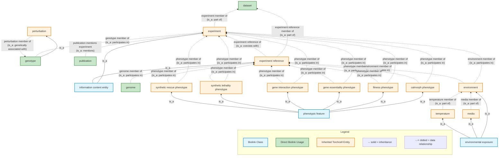

```mermaid
graph BT

    %% Biolink Classes (Parent Entity Types)
    EnvironmentalExposure["environmental exposure"]
    Genotype["genotype"]
    InformationContentEntity["information content entity"]
    PhenotypicFeature["phenotypic feature"]

    %% Direct Biolink Usage (No Inheritance)
    Dataset["dataset"]
    Genome["genome"]
    Genotype["genotype"]
    Publication["publication"]

    %% Torchcell Entities (Inherited from Biolink)
    CalmorphPhenotype["calmorph phenotype"]
    Environment["environment"]
    Experiment["experiment"]
    ExperimentReference["experiment reference"]
    FitnessPhenotype["fitness phenotype"]
    GeneEssentialityPhenotype["gene essentiality phenotype"]
    GeneInteractionPhenotype["gene interaction phenotype"]
    Media["media"]
    Perturbation["perturbation"]
    SyntheticLethalityPhenotype["synthetic lethality phenotype"]
    SyntheticRescuePhenotype["synthetic rescue phenotype"]
    Temperature["temperature"]

    %% Class Inheritance
    EnvironmentalExposure -->|is_a| Environment
    EnvironmentalExposure -->|is_a| Media
    EnvironmentalExposure -->|is_a| Temperature
    Genotype -->|is_a| Perturbation
    InformationContentEntity -->|is_a| Experiment
    InformationContentEntity -->|is_a| ExperimentReference
    PhenotypicFeature -->|is_a| CalmorphPhenotype
    PhenotypicFeature -->|is_a| FitnessPhenotype
    PhenotypicFeature -->|is_a| GeneEssentialityPhenotype
    PhenotypicFeature -->|is_a| GeneInteractionPhenotype
    PhenotypicFeature -->|is_a| SyntheticLethalityPhenotype
    PhenotypicFeature -->|is_a| SyntheticRescuePhenotype

    %% Data Relationships
    CalmorphPhenotype -.->|"phenotype member of<br/>(is_a: participates in)"| Experiment
    CalmorphPhenotype -.->|"phenotype member of<br/>(is_a: participates in)"| ExperimentReference
    Environment -.->|"environment member of<br/>(is_a: participates in)"| Experiment
    Environment -.->|"environment member of<br/>(is_a: participates in)"| ExperimentReference
    Experiment -.->|"experiment member of<br/>(is_a: part of)"| Dataset
    ExperimentReference -.->|"experiment reference member of<br/>(is_a: part of)"| Dataset
    ExperimentReference -.->|"experiment reference of<br/>(is_a: coexists with)"| Experiment
    FitnessPhenotype -.->|"phenotype member of<br/>(is_a: participates in)"| Experiment
    FitnessPhenotype -.->|"phenotype member of<br/>(is_a: participates in)"| ExperimentReference
    GeneEssentialityPhenotype -.->|"phenotype member of<br/>(is_a: participates in)"| Experiment
    GeneEssentialityPhenotype -.->|"phenotype member of<br/>(is_a: participates in)"| ExperimentReference
    GeneInteractionPhenotype -.->|"phenotype member of<br/>(is_a: participates in)"| Experiment
    GeneInteractionPhenotype -.->|"phenotype member of<br/>(is_a: participates in)"| ExperimentReference
    Genome -.->|"genome member of<br/>(is_a: participates in)"| ExperimentReference
    Genotype -.->|"genotype member of<br/>(is_a: participates in)"| Experiment
    Media -.->|"media member of<br/>(is_a: part of)"| Environment
    Perturbation -.->|"perturbation member of<br/>(is_a: genetically associated with)"| Genotype
    Publication -.->|"publication mentions experiment<br/>(is_a: mentions)"| Experiment
    SyntheticLethalityPhenotype -.->|"phenotype member of<br/>(is_a: participates in)"| Experiment
    SyntheticLethalityPhenotype -.->|"phenotype member of<br/>(is_a: participates in)"| ExperimentReference
    SyntheticRescuePhenotype -.->|"phenotype member of<br/>(is_a: participates in)"| Experiment
    SyntheticRescuePhenotype -.->|"phenotype member of<br/>(is_a: participates in)"| ExperimentReference
    Temperature -.->|"temperature member of<br/>(is_a: part of)"| Environment

    %% Legend
    subgraph Legend
        L1["Biolink Class"]
        L2["Direct Biolink Usage"]
        L3["Inherited Torchcell Entity"]
        L4["→ solid = inheritance"]
        L5["-.-> dotted = data relationship"]
    end

    %% Styling
    classDef biolinkClassStyle fill:#e1f5ff,stroke:#0288d1,stroke-width:2px
    classDef autoMappedStyle fill:#c8e6c9,stroke:#388e3c,stroke-width:2px
    classDef torchcellEntityStyle fill:#fff3e0,stroke:#f57c00,stroke-width:2px
    class EnvironmentalExposure,Genotype,InformationContentEntity,PhenotypicFeature,L1 biolinkClassStyle
    class Dataset,Genome,Genotype,Publication,L2 autoMappedStyle
    class CalmorphPhenotype,Environment,Experiment,ExperimentReference,FitnessPhenotype,GeneEssentialityPhenotype,GeneInteractionPhenotype,Media,Perturbation,SyntheticLethalityPhenotype,SyntheticRescuePhenotype,Temperature,L3 torchcellEntityStyle
```
