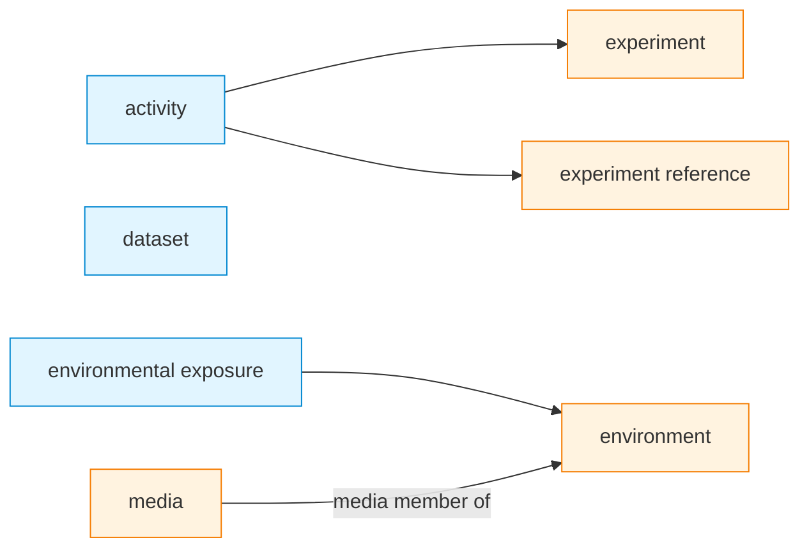

## 2026.01.21 - Mermaid Diagram Generator & Schema Validation

### Overview

Create a system to:

1. Generate Mermaid diagrams from BioCypher schema YAML
2. Validate schema completeness (YAML ↔ Python ↔ cell_adapter)
3. Ensure deterministic output for clean git diffs
4. Detect changes before overwriting files

### File Locations

**Input Files:**

- Schema YAML: `biocypher/config/torchcell_schema_config.yaml`
- Python Models: `torchcell/datamodels/schema.py`
- Adapter: `torchcell/adapters/cell_adapter.py`

**Output Files:**

- Generator: `torchcell/ontology/mermaid_generator.py`
- Diagrams: `notes/torchcell.ontology.mermaid_diagram.{horizontal,vertical}.md`

---

## Phase 1: Mermaid Diagram Generator

### Requirements

1. **Parse YAML Schema**
   - Extract all nodes with `is_a` relationships
   - Extract all edges with source/target
   - Handle auto-mapped nodes (no explicit `is_a`)

2. **Generate Mermaid Syntax**
   - Two orientations: `LR` (horizontal) and `TD` (vertical)
   - Nodes: `NodeName[label]`
   - Edges: `Source -->|relationship| Target`
   - Biolink concepts: styled differently from torchcell entities

3. **Deterministic Ordering**
   - Alphabetically sort all nodes
   - Alphabetically sort all edges
   - Consistent formatting (2-space indent)

4. **Change Detection**
   - Compare new diagram content with existing file
   - Only update if content differs (ignore Dendron frontmatter)
   - Print status: "No changes" or "Updated diagram"

### Implementation Structure

```python
# torchcell/ontology/mermaid_generator.py

class MermaidDiagramGenerator:
    def __init__(self, schema_config_path: str):
        """Load and parse BioCypher schema YAML."""
        pass

    def generate_diagram(self, orientation: str = "LR") -> str:
        """Generate Mermaid diagram string.

        Args:
            orientation: "LR" (left-to-right) or "TD" (top-down)

        Returns:
            Mermaid diagram as string
        """
        pass

    def write_diagram(self, output_path: str, orientation: str):
        """Write diagram to file, preserving Dendron frontmatter."""
        pass

    def has_changed(self, new_content: str, file_path: str) -> bool:
        """Check if diagram content differs from existing file."""
        pass
```

### Example Output Structure

**Horizontal (LR):**



---

## Phase 2: Schema Validation

### Validation Rules

#### Rule 1: YAML Nodes ↔ Python Classes

- Every node in YAML should map to a Pydantic class in `schema.py`
- **Exceptions:**
  - `dataset` → infrastructure (Neo4jCellDataset)
  - Auto-mapped nodes (e.g., `genome`, `publication`)

#### Rule 2: YAML Edges → cell_adapter Methods

- Every edge in YAML should have a corresponding method in `cell_adapter.py`
- Edge name format: `{relationship_label}` in cell_adapter
- Example: `mentions` edge → `_publication_to_experiment_edge()` with `relationship_label="mentions"`

#### Rule 3: Tuple Components Coverage

All components returned by dataset `create_experiment()` methods need ontology relationships:

```python
# From costanzo2016.py:218-318
return experiment, reference, publication

# Required edges in YAML:
# - publication → experiment (mentions)
# - reference → experiment (experiment reference of)
# - experiment → dataset (experiment member of)
```

#### Rule 4: Complete Graph Connectivity

- All nodes must be reachable from `dataset` node
- No orphaned nodes (except Biolink root concepts)

### Validator Implementation

```python
# torchcell/ontology/schema_validator.py

class SchemaValidator:
    def __init__(
        self,
        schema_config_path: str,
        python_schema_path: str,
        adapter_path: str
    ):
        """Load all schema sources."""
        pass

    def validate_yaml_to_python(self) -> List[ValidationError]:
        """Check YAML nodes map to Python classes."""
        pass

    def validate_yaml_to_adapter(self) -> List[ValidationError]:
        """Check YAML edges map to adapter methods."""
        pass

    def validate_connectivity(self) -> List[ValidationError]:
        """Check graph is fully connected."""
        pass

    def report(self) -> str:
        """Generate validation report."""
        pass
```

---

## Special Cases Documentation

### Dataset Node

**YAML:**

```yaml
dataset:
    represented_as: node
```

**Reality:** Not a biological entity, but infrastructure

- Maps to `Neo4jCellDataset` class
- Represents collection of experiments
- Root node for graph connectivity

### Publication Node

**YAML:**

```yaml
publication:
    represented_as: node
    properties:
        pubmed_id: str
        doi: str
```

**Usage:** Standalone evidence entity

- Not embedded in experiment
- Enables cross-dataset queries
- Links experiments from different datasets by shared publications
- Maps to `Publication` Pydantic model

### Experiment Reference

**YAML:**

```yaml
experiment reference:
    represented_as: node
    is_a: activity
```

**Usage:** Control/reference conditions

- Few per dataset (e.g., wildtype at different temperatures)
- Phenotypes computed relative to reference
- Enables dataset comparisons

---

## Implementation Steps

### Step 1: Create Generator (High Priority)

```bash
# Create mermaid generator
touch torchcell/ontology/mermaid_generator.py

# Test generation
python -c "
from torchcell.ontology.mermaid_generator import MermaidDiagramGenerator
gen = MermaidDiagramGenerator('biocypher/config/torchcell_schema_config.yaml')
gen.write_diagram('notes/torchcell.ontology.mermaid_diagram.horizontal.md', 'LR')
gen.write_diagram('notes/torchcell.ontology.mermaid_diagram.vertical.md', 'TD')
"
```

### Step 2: Add Makefile Commands

```makefile
.PHONY: tc-onto-diagram
tc-onto-diagram:
 python -m torchcell.ontology.mermaid_generator

.PHONY: tc-onto-validate
tc-onto-validate:
 python -m torchcell.ontology.schema_validator
```

### Step 3: Create Validator (Medium Priority)

```bash
touch torchcell/ontology/schema_validator.py
```

### Step 4: Update tc-onto Command

Integrate diagram generation and validation into existing `tc-onto` workflow.

---

## Testing Plan

### Test 1: Deterministic Output

```bash
# Generate twice, diff should be empty
make tc-onto-diagram
cp notes/torchcell.ontology.mermaid_diagram.horizontal.md /tmp/first.md
make tc-onto-diagram
diff /tmp/first.md notes/torchcell.ontology.mermaid_diagram.horizontal.md
# Expected: no differences
```

### Test 2: Change Detection

```bash
# No changes
make tc-onto-diagram
# Expected output: "No changes in ontology since last update"

# Make a change to YAML
# ... edit biocypher/config/torchcell_schema_config.yaml ...
make tc-onto-diagram
# Expected output: "Updated diagram: notes/torchcell.ontology.mermaid_diagram.horizontal.md"
```

### Test 3: Validation

```bash
make tc-onto-validate
# Expected: List of any validation errors/warnings
# Should pass cleanly for current schema
```

---

## Open Questions

1. **Biolink hierarchy display:** Should we show full path to root or just immediate parent?
2. **Multiple orientations:** Both LR and TD, or pick one default?
3. **Styling:** How to visually distinguish Biolink concepts from torchcell entities?
4. **Auto-mapped nodes:** Should we explicitly mark these in the diagram?
5. **Edge multiplicities:** Show when edges have multiple sources/targets?

---

## References

- BioCypher ontology docs: <https://biocypher.org/BioCypher/learn/tutorials/tutorial002_handling_ontologies/>
- Mermaid graph syntax: <https://mermaid.js.org/syntax/flowchart.html>
- Biolink model: <https://biolink.github.io/biolink-model/>

---

## Status Update - 2026.01.21

### Phase 1: Complete ✅

Implemented `torchcell/ontology/mermaid_diagram.py` with:

- Three node types: Biolink classes (blue), direct Biolink usage (green), inherited torchcell entities (orange)
- Biolink predicate inheritance shown inline on edge labels (e.g., `"phenotype member of<br/>(is_a: participates in)"`)
- Deterministic output (alphabetically sorted)
- Change detection (only rewrites when schema changes)
- Both horizontal (RL) and vertical (BT) orientations
- Makefile command: `make tc-onto-mermaid`

**Key Design Decisions:**

- Changed experiments from `activity` (process/occurrent) → `information content entity` (data record/continuant)
- Dataset membership uses `part of` (not `has output`) - experiments are components of datasets

### Phase 2: Deferred 🔮

Schema validation (`schema_validator.py`) postponed. Current visualization is sufficient for ontology exploration and detecting mapping issues visually.

---

## Next Actions

1. ✅ Create plan (this file)
2. ✅ Implement `mermaid_diagram.py`
3. ✅ Add Makefile command (`make tc-onto-mermaid`)
4. 🔮 **Deferred:** Implement `schema_validator.py`
5. 🔮 **Deferred:** Integration testing
6. **Current:** Use diagrams for ontology exploration
