## S288C DB Feature Types

```bash
00: 'ARS'
01: 'ARS_consensus_sequence'
02: 'CDS'
03: 'LTR_retrotransposon'
04: 'W_region'
05: 'X_element'
06: 'X_element_combinatorial_repeat'
07: 'X_region'
08: 'Y_prime_element'
09: 'Y_region'
10: 'Z1_region'
11: 'Z2_region'
12: 'blocked_reading_frame'
13: 'centromere'
14: 'centromere_DNA_Element_I'
15: 'centromere_DNA_Element_II'
16: 'centromere_DNA_Element_III'
17: 'chromosome'
18: 'external_transcribed_spacer_region'
19: 'five_prime_UTR_intron'
20: 'gene'
21: 'intein_encoding_region'
22: 'internal_transcribed_spacer_region'
23: 'intron'
24: 'long_terminal_repeat'
25: 'mRNA'
26: 'mating_type_region'
27: 'matrix_attachment_site'
28: 'ncRNA'
29: 'ncRNA_gene'
30: 'non_transcribed_region'
31: 'noncoding_exon'
32: 'origin_of_replication'
33: 'plus_1_translational_frameshift'
34: 'pseudogene'
35: 'rRNA'
36: 'rRNA_gene'
37: 'recombination_enhancer'
38: 'region'
39: 'silent_mating_type_cassette_array'
40: 'snRNA'
41: 'snRNA_gene'
42: 'snoRNA'
43: 'snoRNA_gene'
44: 'tRNA'
45: 'tRNA_gene'
46: 'telomerase_RNA'
47: 'telomerase_RNA_gene'
48: 'telomere'
49: 'telomeric_repeat'
50: 'transposable_element'
51: 'transposable_element_gene'
52: 'uORF'
```

## Selecting Gene Sequence

We select representative DNA sequences in a `DnaSelectionResult` to adhere to the DNA language models. We specifically have `SpeciesLM` in mind.

It seems the only genes with no start codons are genes with `five_prime_UTR_intron` or an internal `intron` with a `1bp` five prime CDS.

This is a summarizing figure of the sequence selection process.


### Selecting Gene Sequence - Based on CDS with Five prime UTR intron

[YBL092W five prime UTR intron](https://www.yeastgenome.org/locus/S000000188)

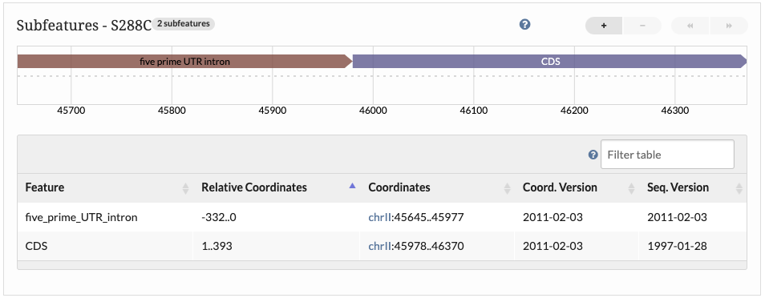

### Selecting Gene Sequence - Adjust -1 on Start for Negative Sequence

```python
genome['YFL039C']
>>> DnaSelectionResult(id=YFL039C, chromosome=6, strand=-, start=53260, end=54696,  seq=ATGGATTCTGGTATGTTCTAGCGCTTGCACCATCCCATTTAACTGTAAGAAGAATTGCACGGTCCCAATTGCTCGAGAGATTTCTCTTTTACCTTTTTTTACTATTTTTCACTCTCCCATAACCTCCTATATTGACTGATCTGTAATAACCACGATATTATTGGAATAAATAGGGGCTTGAAATTTGGAAAAAAAAAAAAAACTGAAATATTTTCGTGATAAGTGATAGTGATATTCTTCTTTTATTTGCTACTGTTACTAAGTCTCATGTACTAACATCGATTGCTTCATTCTTTTTGTTGCTATATTATATGTTTAGAGGTTGCTGCTTTGGTTATTGATAACGGTTCTGGTATGTGTAAAGCCGGTTTTGCCGGTGACGACGCTCCTCGTGCTGTCTTCCCATCTATCGTCGGTAGACCAAGACACCAAGGTATCATGGTCGGTATGGGTCAAAAAGACTCCTACGTTGGTGATGAAGCTCAATCCAAGAGAGGTATCTTGACTTTACGTTACCCAATTGAACACGGTATTGTCACCAACTGGGACGATATGGAAAAGATCTGGCATCATACCTTCTACAACGAATTGAGAGTTGCCCCAGAAGAACACCCTGTTCTTTTGACTGAAGCTCCAATGAACCCTAAATCAAACAGAGAAAAGATGACTCAAATTATGTTTGAAACTTTCAACGTTCCAGCCTTCTACGTTTCCATCCAAGCCGTTTTGTCCTTGTACTCTTCCGGTAGAACTACTGGTATTGTTTTGGATTCCGGTGATGGTGTTACTCACGTCGTTCCAATTTACGCTGGTTTCTCTCTACCTCACGCCATTTTGAGAATCGATTTGGCCGGTAGAGATTTGACTGACTACTTGATGAAGATCTTGAGTGAACGTGGTTACTCTTTCTCCACCACTGCTGAAAGAGAAATTGTCCGTGACATCAAGGAAAAACTATGTTACGTCGCCTTGGACTTCGAACAAGAAATGCAAACCGCTGCTCAATCTTCTTCAATTGAAAAATCCTACGAACTTCCAGATGGTCAAGTCATCACTATTGGTAACGAAAGATTCAGAGCCCCAGAAGCTTTGTTCCATCCTTCTGTTTTGGGTTTGGAATCTGCCGGTATTGACCAAACTACTTACAACTCCATCATGAAGTGTGATGTCGATGTCCGTAAGGAATTATACGGTAACATCGTTATGTCCGGTGGTACCACCATGTTCCCAGGTATTGCCGAAAGAATGCAAAAGGAAATCACCGCTTTGGCTCCATCTTCCATGAAGGTCAAGATCATTGCTCCTCCAGAAAGAAAGTACTCCGTCTGGATTGGTGGTTCTATCTTGGCTTCTTTGACTACCTTCCAACAAATGTGGATCTCAAAACAAGAATACGACGAAAGTGGTCCATCTATCGTTCACCACAAGTGTTTCTAA)
```

Eliminated new lines on fasta

```fasta
>ACT1 YFL039C SGDID:S000001855, Chromosome VI:53260..54696
ATGGATTCTGGTATGTTCTAGCGCTTGCACCATCCCATTTAACTGTAAGAAGAATTGCACGGTCCCAATTGCTCGAGAGATTTCTCTTTTACCTTTTTTTACTATTTTTCACTCTCCCATAACCTCCTATATTGACTGATCTGTAATAACCACGATATTATTGGAATAAATAGGGGCTTGAAATTTGGAAAAAAAAAAAAAACTGAAATATTTTCGTGATAAGTGATAGTGATATTCTTCTTTTATTTGCTACTGTTACTAAGTCTCATGTACTAACATCGATTGCTTCATTCTTTTTGTTGCTATATTATATGTTTAGAGGTTGCTGCTTTGGTTATTGATAACGGTTCTGGTATGTGTAAAGCCGGTTTTGCCGGTGACGACGCTCCTCGTGCTGTCTTCCCATCTATCGTCGGTAGACCAAGACACCAAGGTATCATGGTCGGTATGGGTCAAAAAGACTCCTACGTTGGTGATGAAGCTCAATCCAAGAGAGGTATCTTGACTTTACGTTACCCAATTGAACACGGTATTGTCACCAACTGGGACGATATGGAAAAGATCTGGCATCATACCTTCTACAACGAATTGAGAGTTGCCCCAGAAGAACACCCTGTTCTTTTGACTGAAGCTCCAATGAACCCTAAATCAAACAGAGAAAAGATGACTCAAATTATGTTTGAAACTTTCAACGTTCCAGCCTTCTACGTTTCCATCCAAGCCGTTTTGTCCTTGTACTCTTCCGGTAGAACTACTGGTATTGTTTTGGATTCCGGTGATGGTGTTACTCACGTCGTTCCAATTTACGCTGGTTTCTCTCTACCTCACGCCATTTTGAGAATCGATTTGGCCGGTAGAGATTTGACTGACTACTTGATGAAGATCTTGAGTGAACGTGGTTACTCTTTCTCCACCACTGCTGAAAGAGAAATTGTCCGTGACATCAAGGAAAAACTATGTTACGTCGCCTTGGACTTCGAACAAGAAATGCAAACCGCTGCTCAATCTTCTTCAATTGAAAAATCCTACGAACTTCCAGATGGTCAAGTCATCACTATTGGTAACGAAAGATTCAGAGCCCCAGAAGCTTTGTTCCATCCTTCTGTTTTGGGTTTGGAATCTGCCGGTATTGACCAAACTACTTACAACTCCATCATGAAGTGTGATGTCGATGTCCGTAAGGAATTATACGGTAACATCGTTATGTCCGGTGGTACCACCATGTTCCCAGGTATTGCCGAAAGAATGCAAAAGGAAATCACCGCTTTGGCTCCATCTTCCATGAAGGTCAAGATCATTGCTCCTCCAGAAAGAAAGTACTCCGTCTGGATTGGTGGTTCTATCTTGGCTTCTTTGACTACCTTCCAACAAATGTGGATCTCAAAACAAGAATACGACGAAAGTGGTCCATCTATCGTTCACCACAAGTGTTTCTAA
```

### Selecting Gene Sequence - five_prime_UTR_intron

- [ ] Use this as case to ask for authors to descrive how they processed their data.

```python
genome["YBL072C"]
>>>DnaSelectionResult(id=YBL072C, chromosome=2, strand=-, start=88523, end=89440,  seq=GTATGTGCTATGGTCATATGAGTAATGGAACTACATATTATTTTGAATGCTACAGGACCTCTCTTTGAATGGAATAGATAGTGGAAAAAGTAAACTTAACTAAAAGGGATGATATAAATTGTGACAGGAGCAGTGCACTAAACTGAATCCTTTGTGTACCCAAAAAATCAAGCCTCTTATGAAACGCCGAGTTTTTCACAAGAAGAGATGAAAAGAAACCAAAGCATATTTCAAGATAAGAAAAAAATTCCGCAACTTTTGTACGTTCTTTATTTTACTAACAAGCGTCATTAAATTTTCTATTACAGTTACAAAATGGGTATTTCTCGTGATTCTCGTCACAAAAGATCCGCTACCGGTGCCAAGCGTGCTCAATTCAGAAAGAAGAGAAAGTTCGAATTAGGCCGTCAACCAGCCAACACCAAGATCGGTGCTAAGAGAATTCACTCTGTTAGAACTAGAGGTGGTAACAAGAAATACAGAGCTCTAAGAATTGAAACCGGTAACTTTTCTTGGGCTTCTGAAGGTATCTCCAAGAAGACCAGAATTGCTGGTGTTGTTTACCATCCATCCAACAATGAATTGGTTAGAACTAACACTTTGACCAAGGCTGCCATTGTCCAAATTGATGCTACTCCATTCAGACAATGGTTCGAAGCTCACTACGGTCAAACCTTGGGTAAGAAGAAGAACGTCAAGGAAGAAGAAACTGTTGCCAAGAGCAAGAACGCTGAAAGAAAGTGGGCTGCTAGAGCTGCTTCTGCCAAGATCGAATCTTCCGTTGAATCTCAATTCAGCGCCGGTAGATTATACGCTTGTATCTCTTCCAGACCAGGTCAATCCGGTAGATGTGATGGTTACATCTTGGAAGGTGAAGAATTAGCTTTCTACCTAAGAAGATTGACTGCTAAGAAATAG)
```

This sequence is much longer because it contains the gff db feature `five_prime_UTR_intron`. This is not visualized on SGD.

Eliminated new lines on fasta

```fasta
>RPS8A YBL072C SGDID:S000000168, Chromosome II:88523..89125
ATGGGTATTTCTCGTGATTCTCGTCACAAAAGATCCGCTACCGGTGCCAAGCGTGCTCAATTCAGAAAGAAGAGAAAGTTCGAATTAGGCCGTCAACCAGCCAACACCAAGATCGGTGCTAAGAGAATTCACTCTGTTAGAACTAGAGGTGGTAACAAGAAATACAGAGCTCTAAGAATTGAAACCGGTAACTTTTCTTGGGCTTCTGAAGGTATCTCCAAGAAGACCAGAATTGCTGGTGTTGTTTACCATCCATCCAACAATGAATTGGTTAGAACTAACACTTTGACCAAGGCTGCCATTGTCCAAATTGATGCTACTCCATTCAGACAATGGTTCGAAGCTCACTACGGTCAAACCTTGGGTAAGAAGAAGAACGTCAAGGAAGAAGAAACTGTTGCCAAGAGCAAGAACGCTGAAAGAAAGTGGGCTGCTAGAGCTGCTTCTGCCAAGATCGAATCTTCCGTTGAATCTCAATTCAGCGCCGGTAGATTATACGCTTGTATCTCTTCCAGACCAGGTCAATCCGGTAGATGTGATGGTTACATCTTGGAAGGTGAAGAATTAGCTTTCTACCTAAGAAGATTGACTGCTAAGAAATAG
```

When we print out the feautres in the gene region we get the following

```python
[feature for feature in features]
>>>[<Feature chromosome ...2b64dba90>, <Feature mRNA (chrII...2b6739190>, <Feature mRNA (chrII...2b679d050>, <Feature CDS (chrII:...2b679c210>, <Feature gene (chrII...2b679d4d0>, <Feature five_prime_...2b679c890>]
special variables
function variables
0: <Feature chromosome (chrII:1-813184[.]) at 0x2b64dba90>
1: <Feature mRNA (chrII:88246-89465[-]) at 0x2b6739190>
2: <Feature mRNA (chrII:88246-89467[-]) at 0x2b679d050>
3: <Feature CDS (chrII:88523-89125[-]) at 0x2b679c210>
4: <Feature gene (chrII:88523-89440[-]) at 0x2b679d4d0>
5: <Feature five_prime_UTR_intron (chrII:89133-89440[-]) at 0x2b679c890>
len(): 6
```

It looks like SGD uses the `CDS` in this case.

This is using their publisted "SpeciesLM/data/Sequences/Annotation/Assembled/five_prime.parquet".

```python
# "SpeciesLM/data/Sequences/Annotation/Assembled/five_prime.parquet"
dataset_five_prime.loc[dataset_five_prime['gene_id'] == "YBL072C", "five_prime_seq"].iloc[0]
>>>"AGCTGGGACAAACAGCAACTTTTTCGCCCTCAAACATGTCATCCAGATATATTTGAAACCTATCTCCACAGGGACAAGGATAGGTGAACATTTGATTTTCAGGCTCAAACGTCATATCTTCGATTTCGATTTCGTCATATGTTGACATTTCAGCTGGTAATGTATTGTACAAATGATGTGCTTACAGTCGTGGTATGTATGTGTCTTTGAAAAAAAAAAGCGATGAGAAGCTCTTTATAGCGATAATATAGGTCCTTTTTCGGATTTGTCTCCACCCATTTCTTTTTCATCTGCTCTAACTTTTGTGACTTTACATCCATACACCCTCTTTAACACCCTTACACTTTTACAAATTTTCCTTTTTCATCAACTTTAAAATTATTGCGTGAGAAGTTCCTATTTTCTGATTTTCTCAGCGGAATAACCTTTTAGAATCCTGAGCTGCGAGCAGAGCGGCCTCGCCAAACCCGTGCTGGGCCTAGTTCCCCCCTCCATGTTCGGTCCTACACACGAGCATCGCTGGGAAAGCTTGAGGGCTTTCTCTTACGCAGTGTTCATGGTGTTACGGGATGGAACTGTTTCATATACGTTATTTACAGGCCTATCTTAAAGTTATAGGAAATTACACTTGCCATTTGCTTTTTGGTACTCACAAGAAGACGTTATAAACACACCAGGACAAAAAGTATGTGCTATGGTCATATGAGTAATGGAACTACATATTATTTTGAATGCTACAGGACCTCTCTTTGAATGGAATAGATAGTGGAAAAAGTAAACTTAACTAAAAGGGATGATATAAATTGTGACAGGAGCAGTGCACTAAACTGAATCCTTTGTGTACCCAAAAAATCAAGCCTCTTATGAAACGCCGAGTTTTTCACAAGAAGAGATGAAAAGAAACCAAAGCATATTTCAAGATAAGAAAAAAATTCCGCAACTTTTGTACGTTCTTTATTTTACTAACAAGCGTCATTAAATTTTCTATTACAGTTACAAAATG"
```

```python
genome['YBL072C'].window_5utr(1000).seq
>>>'TGTATAAAATAATCATATACACCTACCCAGTATCCTTATATGCAGTAAAAGAGCTCAACCTGAGCAAAACGTTTTCCATCAGTGCACTTGGAATTTTGAATAGTAATTCCAACCGGAGTCCAGCGAAGAAGCAAACCTTCTTTTCTGCTTGCGTTGCTAAGTCATATAGCTCTTTCTTTATTTCTATTTGTATTCTCGATCTAGCCTCTCATCTTTAGGCAGCAGCGGCAATAGGCTCAGGGGGGTGGATGCCTGCCTCTTCGTAGTACTCAGCCAAGTCTTCTTTATCGAAAACTACATCGATCATCAGTGAGCAGCTGGGACAAACAGCAACTTTTTCGCCCTCAAACATGTCATCCAGATATATTTGAAACCTATCTCCACAGGGACAAGGATAGGTGAACATTTGATTTTCAGGCTCAAACGTCATATCTTCGATTTCGATTTCGTCATATGTTGACATTTCAGCTGGTAATGTATTGTACAAATGATGTGCTTACAGTCGTGGTATGTATGTGTCTTTGAAAAAAAAAAGCGATGAGAAGCTCTTTATAGCGATAATATAGGTCCTTTTTCGGATTTGTCTCCACCCATTTCTTTTTCATCTGCTCTAACTTTTGTGACTTTACATCCATACACCCTCTTTAACACCCTTACACTTTTACAAATTTTCCTTTTTCATCAACTTTAAAATTATTGCGTGAGAAGTTCCTATTTTCTGATTTTCTCAGCGGAATAACCTTTTAGAATCCTGAGCTGCGAGCAGAGCGGCCTCGCCAAACCCGTGCTGGGCCTAGTTCCCCCCTCCATGTTCGGTCCTACACACGAGCATCGCTGGGAAAGCTTGAGGGCTTTCTCTTACGCAGTGTTCATGGTGTTACGGGATGGAACTGTTTCATATACGTTATTTACAGGCCTATCTTAAAGTTATAGGAAATTACACTTGCCATTTGCTTTTTGGTACTCACAAGAAGACGTTATAAACACACCAGGACAAAAA'
```

### Selecting Gene Sequence - YBL092W upsteam five prime UTR intron

Again this one contains a five prime UTR intron. This one is marked on [SGD YBL092W](https://www.yeastgenome.org/locus/S000000188). Sometimes genes contain a five prime UTR intron but they are not marked on SGD. I write "upsteam five prime UTR intron" because sometimes there are "five prime UTR intron" between two CDS.

On SGD we have `RPL32 Location: Chromosome II 45978..46370`

```fasta
>RPL32 YBL092W SGDID:S000000188, Chromosome II:45978..46370
ATGGCCTCCTTACCTCACCCAAAGATTGTCAAGAAGCACACCAAGAAGTTCAAGCGTCATCACTCTGACCGTTACCACAGAGTTGCTGAAAACTGGAGAAAGCAAAAGGGTATTGACTCTGTTGTTAGAAGAAGATTCAGAGGTAACATCTCTCAACCAAAGATCGGTTACGGTTCTAACAAGAAGACCAAGTTTTTGTCACCATCTGGTCACAAGACTTTCTTAGTCGCTAACGTTAAGGATTTGGAAACCTTGACCATGCACACCAAGACTTACGCCGCTGAAATTGCTCACAACATCTCCGCTAAGAACAGAGTTGTCATTTTGGCTAGAGCTAAGGCTTTGGGTATCAAGGTCACCAACCCAAAGGGTCGTTTGGCTTTGGAAGCTTAA
```

```python
genome['YBL092W']
DnaSelectionResult(id=YBL092W, chromosome=2, strand=+, start=45978, end=46370,  seq=ATGGCCTCCTTACCTCACCCAAAGATTGTCAAGAAGCACACCAAGAAGTTCAAGCGTCATCACTCTGACCGTTACCACAGAGTTGCTGAAAACTGGAGAAAGCAAAAGGGTATTGACTCTGTTGTTAGAAGAAGATTCAGAGGTAACATCTCTCAACCAAAGATCGGTTACGGTTCTAACAAGAAGACCAAGTTTTTGTCACCATCTGGTCACAAGACTTTCTTAGTCGCTAACGTTAAGGATTTGGAAACCTTGACCATGCACACCAAGACTTACGCCGCTGAAATTGCTCACAACATCTCCGCTAAGAACAGAGTTGTCATTTTGGCTAGAGCTAAGGCTTTGGGTATCAAGGTCACCAACCCAAAGGGTCGTTTGGCTTTGGAAGCTTAA)
```

```python
genome['YBL092W'].window(1000)
DnaWindowResult(id='YBL092W', chromosome=2, strand='+', start_window=45673, end_window=46673, seq='TAGCCTAGACTGCATTGTTATGAGAGCAACGTTTGATATTTGTGGCGATTGGAACAAACATAGTACATGCCAAAATGAGATGAAATGTCCAATTTGAACTGATTAACATACACGCGCAAGCTCGTATTTGTTTACTGGTACACCTAGAGTTAGCCGATCAAAGAGACAGTGGCAGATATATGGGAAAATTTTCTCCGGAAGATTGCATGCGAGAGTCTCATAACCAGTCATTTCCCAAGATACAATTCTCGGAGCTGTTATACTAACAAACTTTTAATTTTCATTTTTTTTTTTTTTTGATTAGATGGCCTCCTTACCTCACCCAAAGATTGTCAAGAAGCACACCAAGAAGTTCAAGCGTCATCACTCTGACCGTTACCACAGAGTTGCTGAAAACTGGAGAAAGCAAAAGGGTATTGACTCTGTTGTTAGAAGAAGATTCAGAGGTAACATCTCTCAACCAAAGATCGGTTACGGTTCTAACAAGAAGACCAAGTTTTTGTCACCATCTGGTCACAAGACTTTCTTAGTCGCTAACGTTAAGGATTTGGAAACCTTGACCATGCACACCAAGACTTACGCCGCTGAAATTGCTCACAACATCTCCGCTAAGAACAGAGTTGTCATTTTGGCTAGAGCTAAGGCTTTGGGTATCAAGGTCACCAACCCAAAGGGTCGTTTGGCTTTGGAAGCTTAAATTAAATAAAGATTTACAAAATAATAACCTTCATTTAATTTTAAATTTCAATAAAAAAATATCAAATCAAACATGACTTTTAAATCTACCATTAGATAATTGTATAAAGTGATTTATTGTTTTTTAATTTTGTTTTCATTATCTATCAAAACTAGGGCATTCTTCCTCACTTTTAGTGATAAACTTTTGTAAACTCAGTAGTATATCCAGCCGACGAGCAATGCGATAACGGTGATGATAAGCAATGCTCTGGAACTCAGACTTTGCCCGTTACCTGCTGATGGCGCTCTTGCTGATTCTGCA')
```

```python
genome['YBL092W'].window_5utr(1000).seq
>>>'ATGTGCTATTTGACCACCTTTACCATTTTCTCTGGTCGGTATGGTGGAGAATTTACCTGAAAGATCTGCTATCTGGTTCTTGTAAGATTTTCTTAGCTTCACGGCTTTAGTGCCGTCCAAATTTGTTCTTGCCACTTGCCTGGAGATGTCATCCAAGCCATACACCGATATCAAGTCCTGTAGAGGATTTGGTTGTTGGTACGTATATGTAGTTTCCGGATCCACGTAATAGTAGTATGAGGGGACTGTAGTTTCGTCCACTCTAGAAGCCATTATTATCGTATTCCTTTTTCGTTCACTTACTATTGCTATTCGCACTCACTACAGATCTATATTTTATGTTCCACCCTGTTGTCAGATCAGGAAAGGAATGAAGAGGCTCTATTTAAACCAAATACACCTCTTCGTTTCTCAATATTGTTGGGCTTTCCTTTTTTTTTTCCTTCCACGTCTATCTATTGTCTCTATCAAAATTAGGAAAAAGAAATGAAGAACGATGAGCCAAACGAGGCTGAGACAATCATGCATCCGTACATTCTATGTATGTTTGGGTGTATCTTTCCAGATTCGGTTCTTTTTTTTTTTCAGTCCAATTGAAAAAAAAAAGGAACAGGAACAACGGGTCGAAATTTGCCGTCACATTCAGAGCGAAGAGCGACAGGGGAATTGGTGGGCTAACCACCTGTTGAGCCCAGCTAGCAGCTGTCGGTAAACCGTCGTTGGGCGGGGCGCGACAATGCAGCCAGCGGAGGCATTGTATGGTTTCCGTCTGGAGAGTGGGCTTAGCCGGCCTGGCACTCCTTCTCTAAGCAGAGTGAGAAGGGAATCTTTTTACTGGAGAAGAGTGTTTGAATCCAGCAGAAGGTAATACGCACCTTTCTCATCTATTTGCAGAATCGTTTTATTAAAATACTTTTAAAGAATTTAGATTTTGATAATTAGTTCATTCTCTTTTACAAAGATAATCACCAAACAGGGACAATACACTGAACGATAAAAG'
```

```python
# "SpeciesLM/data/Sequences/Annotation/Assembled/five_prime.parquet"
dataset_five_prime.loc[dataset_five_prime['gene_id'] == "YBL092W", "five_prime_seq"].iloc[0]
>>>"TATTTTATGTTCCACCCTGTTGTCAGATCAGGAAAGGAATGAAGAGGCTCTATTTAAACCAAATACACCTCTTCGTTTCTCAATATTGTTGGGCTTTCCTTTTTTTTTTCCTTCCACGTCTATCTATTGTCTCTATCAAAATTAGGAAAAAGAAATGAAGAACGATGAGCCAAACGAGGCTGAGACAATCATGCATCCGTACATTCTATGTATGTTTGGGTGTATCTTTCCAGATTCGGTTCTTTTTTTTTTTCAGTCCAATTGAAAAAAAAAAGGAACAGGAACAACGGGTCGAAATTTGCCGTCACATTCAGAGCGAAGAGCGACAGGGGAATTGGTGGGCTAACCACCTGTTGAGCCCAGCTAGCAGCTGTCGGTAAACCGTCGTTGGGCGGGGCGCGACAATGCAGCCAGCGGAGGCATTGTATGGTTTCCGTCTGGAGAGTGGGCTTAGCCGGCCTGGCACTCCTTCTCTAAGCAGAGTGAGAAGGGAATCTTTTTACTGGAGAAGAGTGTTTGAATCCAGCAGAAGGTAATACGCACCTTTCTCATCTATTTGCAGAATCGTTTTATTAAAATACTTTTAAAGAATTTAGATTTTGATAATTAGTTCATTCTCTTTTACAAAGATAATCACCAAACAGGGACAATACACTGAACGATAAAAGTATGTGACATATAGAATGCTAGAATGAATAGCCTAGACTGCATTGTTATGAGAGCAACGTTTGATATTTGTGGCGATTGGAACAAACATAGTACATGCCAAAATGAGATGAAATGTCCAATTTGAACTGATTAACATACACGCGCAAGCTCGTATTTGTTTACTGGTACACCTAGAGTTAGCCGATCAAAGAGACAGTGGCAGATATATGGGAAAATTTTCTCCGGAAGATTGCATGCGAGAGTCTCATAACCAGTCATTTCCCAAGATACAATTCTCGGAGCTGTTATACTAACAAACTTTTAATTTTCATTTTTTTTTTTTTTTGATTAGATG"
```

⛔️ Previous query was incorrect, which led to the following BLASTn

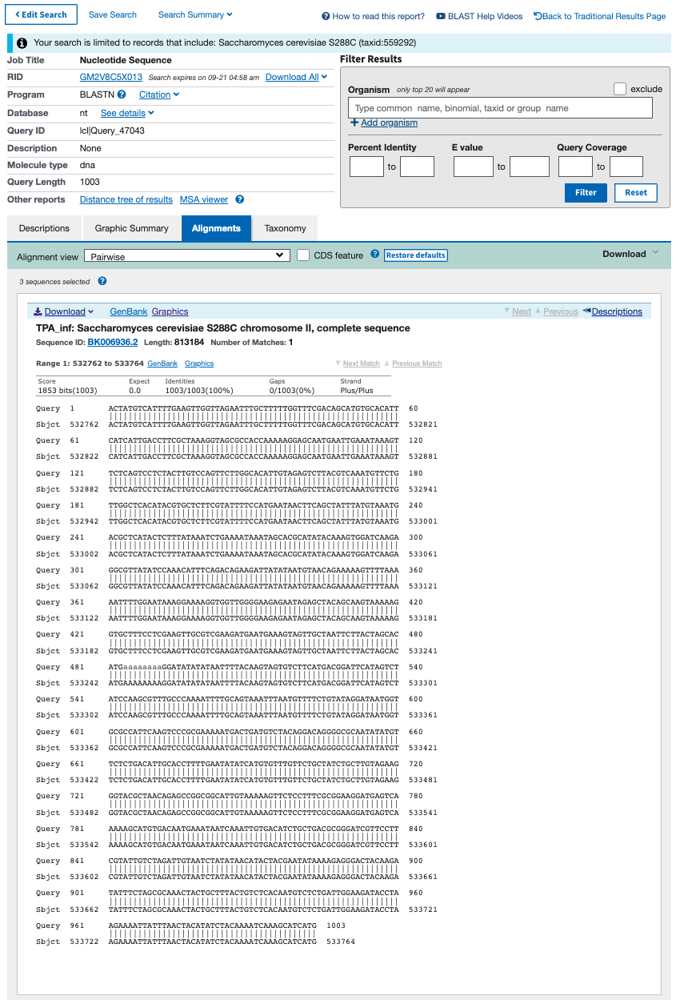

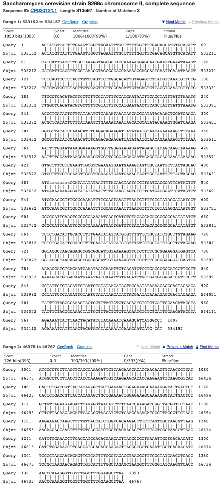

BLASTn says that this sequence exists at chromosome = chrII ,start = 532762, end = 533764. This is much further from the position of "YBL092W". Again I cannot make sense of their selection. They must be using a different genome.

### Selecting Gene Sequence - YBR089C-A upsteam five prime UTR intron

[SGD - YBR089C-A](https://www.yeastgenome.org/locus/S000002157)

```python
genome["YBR089C-A"]
>>>DnaSelectionResult(id=YBR089C-A, chromosome=2, strand=-, start=426190, end=426873,  seq=GTATGTAAGGCGCTGGGTGAGCCCAGCGGACGAGGATGGGCTTAATAAGAACGTACAGTTTAGCACAGCTAGAACAGGATACAGCTAAGGGCAACTCTGCTTTTCGGGAGAAGTTAAAGAGGGGTAGACAATGATGGTAATCTTATAAACCGGCTACAATGAAGGTTGTAGCAGCAAGGAAGATGATATTTTAATACGGTTCAGGTGAAATGAAATAGCCGCCCATAACGGCATGCTCAAGTTGTAAGTCAGGACTCTAGCTTTCTACTGTAGTATCCTCTAAAGGACTGCTGTTCTGTGCACCCCCTTCCTTTGTTTATCATAGCGCACGACAAGAGTACTAACTAATTAACTTAGAACATTAACATATATAAAACTAGCGCTATGGCCGCAACTAAAGAAGCAAAGCAACCAAAGGAACCAAAGAAGAGGACCACCAGGAGAAAGAAGGATCCTAACGCCCCTAAGAGGGGCTTGTCAGCTTATATGTTCTTTGCTAATGAAAACAGAGACATTGTCCGTTCCGAGAATCCTGACGTAACTTTTGGCCAAGTAGGCAGAATATTGGGTGAGAGGTGGAAGGCCTTAACTGCTGAAGAAAAGCAACCCTATGAATCTAAGGCTCAAGCAGACAAGAAGAGATACGAATCTGAAAAGGAATTGTACAATGCTACACGTGCTTGA)
```

```python
genome["YBR089C-A"].window_5utr(1000)
>>>DnaWindowResult(id='YBR089C-A', chromosome=2, strand='-', start_window=426873, end_window=427873, seq='CCGGCCCAGGGTTCTCTTGTGAAATCAATGATTTCTACGACTATGCTGAAAAGAGAGTAGCTGGTACTGACTTCCTAAAGGTCTGTAACGTCAGCAGTGTCAGTAACGTCACCGAATTGACCTTCTACTGGGACTGGAATACTACTCACTACAACGATACCCTATTAAAACAATAAATTGTATAAATAAATAATATTGCAAATATAAATAAATACCCATCGATTCTGATCTTCTTTTATGTACTAGTAGGGTAACGAGTTTGTAGATTAGCGGCAGAATGAAAAGAAAAAAGTTAACTAAAAAGTAAGAACAGCAAAGTTGATTGTAGTCTATATTGCTGAAATAGATATCGGAGCTCCCGTATAATATTAAAGTGCACCAAGAAAAGGATGTCGTTCTTTTTAAATAGTCTAAGGGGCAACCAGGAGGTCTCGCAAGAGAAGCTAGACGTTGCAGGAGTGCAATTCGATGCGATGTGCTCGACTTTCAACAATATTCTCAGTACGTGTCTTGAGAAATGTATTCCGCATGAGGGCTTTGGTGAGCCTGATCTAACGAAAGGTGAGCAATGCTGCATAGACAGATGTGTGGCAAAGATGCATTACAGCAATCGCCTCATTGGAGGATTTGTACAAACACGAGGTTTCGGGCCAGAGAATCAGCTACGACATTATTCGCGATTTGTGGCCAAAGAAATAGCTGATGATTCCAAAAAATAGCTGTAAATATGAGGACTGTCTGTGCTGTTTGTATATAATAGTAACCTGCATATATAGCATTATAAGCTGTGTAGACAATTTTAGAAGTACATTTATATGGTACCCGCACCTGGGTCACGTGCATTCCCCTCACCCGTTTTTTTAGGTGGTGTCTTTTTTGTTTTTTTTTTTAGGTGGCGCGGCAACTATAAAGTACAGCAAGTGAGGTTGAGGCAATACTGGGAGTTTACACTATGGGAGACAGCTCCTAACACCAAGCAGAAAAACGACTTTTTCGCAAA')
```

```python
# "SpeciesLM/data/Sequences/Annotation/Assembled/five_prime.parquet"
dataset_five_prime.loc[dataset_five_prime['gene_id'] == "YBR089C-A", "five_prime_seq"].iloc[0]
>>>"AAAGGATGTCGTTCTTTTTAAATAGTCTAAGGGGCAACCAGGAGGTCTCGCAAGAGAAGCTAGACGTTGCAGGAGTGCAATTCGATGCGATGTGCTCGACTTTCAACAATATTCTCAGTACGTGTCTTGAGAAATGTATTCCGCATGAGGGCTTTGGTGAGCCTGATCTAACGAAAGGTGAGCAATGCTGCATAGACAGATGTGTGGCAAAGATGCATTACAGCAATCGCCTCATTGGAGGATTTGTACAAACACGAGGTTTCGGGCCAGAGAATCAGCTACGACATTATTCGCGATTTGTGGCCAAAGAAATAGCTGATGATTCCAAAAAATAGCTGTAAATATGAGGACTGTCTGTGCTGTTTGTATATAATAGTAACCTGCATATATAGCATTATAAGCTGTGTAGACAATTTTAGAAGTACATTTATATGGTACCCGCACCTGGGTCACGTGCATTCCCCTCACCCGTTTTTTTAGGTGGTGTCTTTTTTGTTTTTTTTTTTAGGTGGCGCGGCAACTATAAAGTACAGCAAGTGAGGTTGAGGCAATACTGGGAGTTTACACTATGGGAGACAGCTCCTAACACCAAGCAGAAAAACGACTTTTTCGCAAAGTATGTAAGGCGCTGGGTGAGCCCAGCGGACGAGGATGGGCTTAATAAGAACGTACAGTTTAGCACAGCTAGAACAGGATACAGCTAAGGGCAACTCTGCTTTTCGGGAGAAGTTAAAGAGGGGTAGACAATGATGGTAATCTTATAAACCGGCTACAATGAAGGTTGTAGCAGCAAGGAAGATGATATTTTAATACGGTTCAGGTGAAATGAAATAGCCGCCCATAACGGCATGCTCAAGTTGTAAGTCAGGACTCTAGCTTTCTACTGTAGTATCCTCTAAAGGACTGCTGTTCTGTGCACCCCCTTCCTTTGTTTATCATAGCGCACGACAAGAGTACTAACTAATTAACTTAGAACATTAACATATATAAAACTAGCGCTATG"
```

```python
(str(genome.fasta_sequences[genome.chr_to_nc[2]].seq[257973 :258975]))
>>>'ATTAGTAAATTGCGCGGCGGGATATCCTGTTCTATAGACCTAAGGGACAACAAATCAAAATAGATGATTAAGAAAGTAAGTATTCAAAAACAAGTTGTAAATGAACTAACCTTCCTAACTTCGACGCGACCTTAAAACGTCGAAAAAAAACGAGAAAAAGTCATCATGAGACTATCGTATCTAATGACTGTGGCTTCTCCCAACAACCTTAGCGTCTGCGATGACGATATTTTGAAGAACAGTCAAATCCGTTTGAATAGTGCGCCACACAGGGATAATAATAGCACATTGGCATCTCCTTCTGTGAATGAAACACTTCTACCTGGGCTTCAAAGTCCCGCAACCTTTTAGTTACATAAAATTCGGCGGCTAAATCATGATATTATATTGATGGGTAATGTAGCGTTCAGTAAAACGGTTCCTATGTATTACTATCACGTGGGTGGGGAAGACCACATTCTTAGAGAAGAGTAATCATTTTAGCAGATTATTTTTACCTTTTTCAACTCATGAACTCATGTTCAAAGGTACAATATATTACCCTTTCTTCAAAGTATCCGAATGATTTGAACCGCACTCTGAGGGAGCCATCAAATTCTATTGAGCGACTTCGAATCGAACAATCCAATTAAATCAGCCTTTAGCGCCATATTTCTCCTTGTATCCATTGTTTACTTCTCCCTTGTATCTTGTATATGAGAATTATGGGAATAAGATAATTGTTGGGATTCCATTGTTTTCAAAGGCTGTAATATTAGGTACACAGATTATACTAGAAGTTCTTTTCGAGGATATAGGAATCCACAAAAGGAAATCGATAGTTATACATAATAATATTATTGTATCTTACTTCCTTTTATATGTTGTCACTCATTATTGTGTCGTGCATTCCATTAGATTGGATGACTGTTTCTCAATCTTTATGCCATCCTCTTACACCGCATGTGATATAATAGTAACATGAGTGCTGCGAAATAGATGATATTAAAATTTCATTCCAAC'
```

### Selecting Gene Sequence - YDL061C upsteam five prime UTR intron

[SGD - YDL061C](https://www.yeastgenome.org/locus/S000002219)

[[YDL061C Annotated|/notes/assets/sequence-docx/SpeciesLM-FASTA-S288c_Genome.docx]]

```python
# "SpeciesLM/data/Sequences/Annotation/Assembled/five_prime.parquet"
dataset_five_prime.loc[dataset_five_prime['gene_id'] == "YDL061C", "five_prime_seq"].iloc[0]
>>>"TTGTTTTGCCTTGTTTTTACGTTGCAATTTTGAAACTTGTTTGTCTGGTTTGCCAGTGCCCACGGGTTCTTTTTCCACTTTCCCCTTGTATAATCTTTTCAAAGCACCTTTAGAAGCATGTTTGGATTTGTAAGATTTGTGTCCGTTTTTTAATGATGACCTGTGTGAATGACCTGCCATTCTGATGCCTGCGTAAAACTACCGCTCTTCAACTAACAAATAAATTTCTGCGATTAATATCACAACTCATATCAACTTCTAACTCACACATTTTTTTACTGGTGATGAGATGAGCAGAACTGAAAATTTTTCTTAGCTGTAATTGAATATCGAGTCTACTTTTCCATCCGTACATTTTAACACCCAGTCCTAAGTAGGCCTATTTATTTCACTTGGGGGGAACATCTGGGTACTCTTTATAAAGATCTTCTCGCGTTGTACGAACAGCGCGGTGGAAAATGTTACATTTTGCCTGGGAAAGCGTCAAGTCTTAAAGGTATAACCGTCAGTACAAGAAGTGGTTATTAGGTATTGGGATTAGTAGTTTGAGAAATTCTTTGAAAGAAACTATAGCTAAATGTATGTGGAAACGCGGATTGAAGAGACAAGGGACGTGTATGCAGAATGAAGGAACAGCAGGAAAGTATCTGCGCTGATTTGGATTTGTAACTAAAATTTACAACTAAAAGAATTGAAAATTCGAGGAAAATATCTGTGGCTAGCAGTAGGGGGGAGCCTTTCTGGTGGCCCCATGGTGGAATAAGACGATGTGTTTATTGAATGTAGCAACAAGCATCAAACATCAACAAAGCTTCAAATTATGTCAAATACAATGAGCCATAGCATAAGCTTATATTTATTTCCTTTTAACTTCGATAGTCGAAAAATTCTATTGTACACGTCCATGGAACTCCTGGAAAACATAAAAACTGCAAAAATTATAATACTAACATTTTTCTATTCAATTTTGAAAACTTATTGGTTATAGAATATATACAAAATG"
```

```python
genome["YDL061C"].window(3000).seq
>>>'ACATGATCAATAAATTCAAATGATTCGGAACTCAAATCATAAATGAGATCAAGAGTGGTATTGAACAGATTAATTGGCAGTTTCTCGACACCATATTTTAATAGCTGTGAAATGACCTGAAAAATTTCATTTATTTTACTTTCCGTTAATATCTCATTAAGAATATCGTCGGATCCATTAGACAGAGCCACCACTAACGACAGTAAGTTATCGGCAAAATCGAATAACAACCTTTTAGATTCTATTTTGGATTTTCCTGCAGGTTTTAGCTGCGGTTGCTGTTCTGCTGCTTGCAAAGCGGATAACGATTCAACAATCCTGCCAAAATTACTTGTTATACTTGTCCATATATCAGATCTCCAAAGGTAGATTGACACATCATAACCTTCTTCCAAAGACAAGTTCCTTAATAAGCCGAACGACTCCACAACTATGTCCGAATTAGAATCGTTCAGCAATTTATTCAAAATGATAGGAACTAATTTCTCTTTCAGTAAAAGTTGTCTCATATGTGCATCCTCACAAAGAACACTGATGGAACTCAAAGCAATACTTCTATCATTAGGCACCACACTTGACAAATTCTGCAATAGCGGCTGGAGTTTTTTATTAACGACGTTGGTATCTTTATTATTGTCATTTGACCCAGCTTTGCGTAGTGGATTTAATCGAGACGAAGATGCTCTTGATCTTTTCTTTGATCTGCCCATTCTTTTCTGCCCTAAAAAGTCGATTTCTGCGTCCTTGTACAAACTCGAAAATCTGATCGAAAGTACTTGGAATCCAGTAAGAATAATGGGGGCGTTGCTACGAAGATTTAATTTTACAATACATAGACCTTTAAACAATGGTAGATAAATGGATGAGATGAGATGAGATGAGATGAGATGAGATGAAAAATTTTCTGAATAAGAGAACTACTCGTTCTAAATGATTATTGTACATTTTGCATAGAAAAATGGCAATAAACAGGGCAGTACTATTTCATCATCATCACTAAACATTAGTTGGCAAACTTATTAAGCCAACAGTACTTGTGACTAGAATTTTTTATTATATCGCCAATATTTAATGATAAACATAATATAGTAATACCAAAAATAATTATGATAACTTATACAAAAGAAGTGGAAAGAAAAGGAAAGAAGTAATCAAAGTAACTCAAAAAAGGTTAATGATTACGATGTTACAATCGCTCTTGACTTATCTGTACTTGTGGAAACCAATGTCGTTAGCCTTTTCTCTGAAACATTGACGACAGATGTTTAAGTCGTACTTTCTGACCAAACCAGTGTGGGAGGAGCAGACACGACATTGACGGGAACCTTTACCGAATCTTCTTGGGTGGGAGAACCAAACGTTTTCGTGAGCCATTTTGTATATATTCTATAACCAATAAGTTTTCAAAATTGAATAGAAAAATGTTAGTATTATAATTTTTGCAGTTTTTATGTTTTCCAGGAGTTCCATGGACGTGTACAATAGAATTTTTCGACTATCGAAGTTAAAAGGAAATAAATATAAGCTTATGCTATGGCTCATTGTATTTGACATAATTTGAAGCTTTGTTGATGTTTGATGCTTGTTGCTACATTCAATAAACACATCGTCTTATTCCACCATGGGGCCACCAGAAAGGCTCCCCCCTACTGCTAGCCACAGATATTTTCCTCGAATTTTCAATTCTTTTAGTTGTAAATTTTAGTTACAAATCCAAATCAGCGCAGATACTTTCCTGCTGTTCCTTCATTCTGCATACACGTCCCTTGTCTCTTCAATCCGCGTTTCCACATACATTTAGCTATAGTTTCTTTCAAAGAATTTCTCAAACTACTAATCCCAATACCTAATAACCACTTCTTGTACTGACGGTTATACCTTTAAGACTTGACGCTTTCCCAGGCAAAATGTAACATTTTCCACCGCGCTGTTCGTACAACGCGAGAAGATCTTTATAAAGAGTACCCAGATGTTCCCCCCAAGTGAAATAAATAGGCCTACTTAGGACTGGGTGTTAAAATGTACGGATGGAAAAGTAGACTCGATATTCAATTACAGCTAAGAAAAATTTTCAGTTCTGCTCATCTCATCACCAGTAAAAAAATGTGTGAGTTAGAAGTTGATATGAGTTGTGATATTAATCGCAGAAATTTATTTGTTAGTTGAAGAGCGGTAGTTTTACGCAGGCATCAGAATGGCAGGTCATTCACACAGGTCATCATTAAAAAACGGACACAAATCTTACAAATCCAAACATGCTTCTAAAGGTGCTTTGAAAAGATTATACAAGGGGAAAGTGGAAAAAGAACCCGTGGGCACTGGCAAACCAGACAAACAAGTTTCAAAATTGCAACGTAAAAACAAGGCAAAACAATTAAGGGCCCAAAGGATCTTGGATTCCATTGAAAACAGGAAATTATTCGAAGGAAAAAATGGCGCTGCCAAAATCATTACTATTGTTCCGTTAGTGAATGATTTAGACCCATTGGACATTCTTTACAAGCTATTAAAGTGTGCAGATGATGAAGGAATCATGGTGCAGGAAGTAGACTCAAAACGTATATTTAATGTTCATATAAAGAAGTTTAAAAGCAATCTTAAAATCATAATTCCAGACATGACCAATTTTTTGAACATTTTAGATTGCGCTAAAGTAGCAGACTTTGTTGTGTTTGGGCTCAGTGGTGTCCAAGAAGTCGATGAAGAATTTGGTGAGCAGATCATCCGTGCGTTAGAACTACAAGGTATTGCTTCATATATCGGTGTCATAAGCAACCTCTCAGCAGTCCATGAAAAGGAGAAATTCCAATTGGATGTCAAGCAATCCTTAGAAAGTTATTTCAAGCACTTTTTCCCAAGTGAAGAACGTGTTTATAATTTGGAAAAAAACTCAGACGCTTTAAACGTCTTGAGAACATTGTGCCAGAGGCTACCAAGATCAATCAATTGGAGAGACAATAGAGGTTACGTAGTCGCTGACTTTGTTGATTTCGTTGAAAC'
```

### Selecting Gene Sequence - YAL037W Normal Gene Selection

[SGD - YAL037W](https://www.yeastgenome.org/locus/S000000035)

[[YAL037W Annotated|/notes/assets/sequence-docx/SpeciesLM-FASTA-S288c_Genome.docx]]

```python
# Gene YAL037W from the Fungal UTR five prime data
# output is actually a pandas Series not str
# "SpeciesLM/data/Sequences/Annotation/Assembled/five_prime.parquet"
dataset_five_prime.loc[0,'five_prime_seq']
>>>'CCAAGTACAGACCAAACTGTCCAATCATCTTGGTTACCAGATGCCCAAGAGCTGCTAGATTCTCTCACTTGTACAGAGGTGTCTTCCCATTCGTTTTCGAAAAGGAACCTGTCTCTGACTGGACTGATGATGTTGAAGCCCGTATCAACTTCGGTATTGAAAAGGCTAAGGAATTCGGTATCTTGAAGAAGGGTGACACTTACGTTTCCATCCAAGGTTTCAAGGCCGGTGCTGGTCACTCCAACACTTTGCAAGTCTCTACCGTTTAAAAAAAGAATCATGATTGAATGAAGATATTATTTTTTTGAATTATATTTTTTAAATTTTATATAAAGACATGGTTTTTCTTTTCAACTCAAATAAAGATTTATAAGTTACTTAAATAACATACATTTTATAAGGTATTCTATAAAAAGAGTATTATGTTATTGTTAACCTTTTTGTCTCCAATTGTCGTCATAACGATGAGGTGTTGCATTTTTGGAAACGAGATTGACATAGAGTCAAAATTTGCTAAATTTGATCCCTCCCATCGCAAGATAATCTTCCCTCAAGGTTATCATGATTATCAGGATGGCGAAAGGATACGCTAAAAATTCAATAAAAAATTCAATATAATTTTCGTTTCCCAAGAACTAACTTGGAAGGTTATACATGGGTACATAAATGCAGATGCCAGTGAACTATGTTCAGCTTCTGGCCTTCGTTTGGTGGTTTAATCTATTTTTTATAAAAAATGACGCGGGCAGATTCAATTAGTGTCCTAAATTTATTCGCGTTTCAAGATTTCAAAGGATTGATCCTCTTATCAGAAACGATAAGTGCTACTCCGTCCTATTCTTCTAGCCATCTAGTACGTATTCTTTTCATAACATAATCCCTTATTTACAGAATGTGTTTCGAAGAAAAATTAATTAGATGGGAAGAAAACTGAAGTGGCTTATATAATCAGTGACATAGTGCCAATAATTACGCAAAAAGCAAAGGAAATAACACTGCTATG'
```

The entire selection is contained within my `genome['YAL037W'].window(3000)`.

The `five_prime_UTR_intron` is `408bp`

```python
genome['YAL037W'].window(3000)
>>>DnaWindowResult(id='YAL037W', chromosome=1, strand='+', start_window=72921, end_window=75921, seq='CGAAACCGTCGCTGCCTCCGCTGTCGCTGCTGTTTTCGAACAAAAGGCCAAGGCTATCATTGTCTTGTCCACTTCCGGTACCACCCCAAGATTGGTTTCCAAGTACAGACCAAACTGTCCAATCATCTTGGTTACCAGATGCCCAAGAGCTGCTAGATTCTCTCACTTGTACAGAGGTGTCTTCCCATTCGTTTTCGAAAAGGAACCTGTCTCTGACTGGACTGATGATGTTGAAGCCCGTATCAACTTCGGTATTGAAAAGGCTAAGGAATTCGGTATCTTGAAGAAGGGTGACACTTACGTTTCCATCCAAGGTTTCAAGGCCGGTGCTGGTCACTCCAACACTTTGCAAGTCTCTACCGTTTAAAAAAAGAATCATGATTGAATGAAGATATTATTTTTTTGAATTATATTTTTTAAATTTTATATAAAGACATGGTTTTTCTTTTCAACTCAAATAAAGATTTATAAGTTACTTAAATAACATACATTTTATAAGGTATTCTATAAAAAGAGTATTATGTTATTGTTAACCTTTTTGTCTCCAATTGTCGTCATAACGATGAGGTGTTGCATTTTTGGAAACGAGATTGACATAGAGTCAAAATTTGCTAAATTTGATCCCTCCCATCGCAAGATAATCTTCCCTCAAGGTTATCATGATTATCAGGATGGCGAAAGGATACGCTAAAAATTCAATAAAAAATTCAATATAATTTTCGTTTCCCAAGAACTAACTTGGAAGGTTATACATGGGTACATAAATGCAGATGCCAGTGAACTATGTTCAGCTTCTGGCCTTCGTTTGGTGGTTTAATCTATTTTTTATAAAAAATGACGCGGGCAGATTCAATTAGTGTCCTAAATTTATTCGCGTTTCAAGATTTCAAAGGATTGATCCTCTTATCAGAAACGATAAGTGCTACTCCGTCCTATTCTTCTAGCCATCTAGTACGTATTCTTTTCATAACATAATCCCTTATTTACAGAATGTGTTTCGAAGAAAAATTAATTAGATGGGAAGAAAACTGAAGTGGCTTATATAATCAGTGACATAGTGCCAATAATTACGCAAAAAGCAAAGGAAATAACACTGCTATGGATATGGAAATCGAAGATTCAAGCCCCATAGATGACCTGAAGTTACAAAAACTGGATACCAATGTTTATTTTGGACCCTGTGAGATATTGACACAACCTATTCTTTTGCAATATGAAAATATTAAGTTCATCATTGGTGTCAATCTAAGTACTGAAAAGATAGCGTCGTTTTATACCCAGTATTTCAGGAACTCTAATTCGGTAGTCGTGAATCTTTGCTCACCAACTACAGCAGCAGTAGCAACAAAGAAGGCCGCAATTGATTTGTATATACGAAACAATACAATACTACTACAGAAATTCGTTGGACAGTACTTGCAGATGGGCAAAAAGATAAAAACATCTTTAACACAGGCACAAACCGATACAATCCAATCACTGCCCCAGTTTTGTAATTCGAATGTCCTCAGTGGTGAGCCCTTGGTACAGTACCAGGCATTCAACGATCTGTTGGCACTCTTTAAGTCATTTAGTCATTTTGGAAATATCTTGGTTATATCATCACATTCCTATGATTGCGCACTTCTCAAATTTCTTATTTCCAGGGTGATGACCTACTATCCACTAGTGACCATCCAGGATTCTTTGCAATATATGAAAGCAACCCTGAACATATCCATCAGTACATCCGATGAGTTCGATATTCTGAATGATAAAGAACTGTGGGAGTTTGGCCAAACCCAGGAAATTCTAAAACGTAGGCAGACGAGCTCAGTCAAGAGGAGATGTGTCAATTTACCAGAAAACTCTACGATCGATAACAGAATGCTTATGGGTACCACAAAGCGAGGTCGCTTTTGAAGAGCCCTCGGTAGCATAACATTTTTAATTATTACGACTGTTTTTTTTATTCATTATGTAGAGATAATTAAATGTTATAGATGCTCTATACTCAAACGGTGGAAGAAAAACAGCGAAAAAAAATAACCGATACCCCCTTTTCGAATACAAATGCTTGTATATTCAATTATGAATTATTTTTTTTTTTTTTCATTTCTTATATTATTTTTTGTTCGAGAATCACTTTTTCAAGATGGTAACAACATCTTCGTCTTCCAAAATGTGACTCAACCCCACGTATTGAGGTTGATGTTTGACACTGCTACCGTAAACCAGAGCATTTCTAAAGTCGTCCACTAAAGATTTATGAATTTGGTTACAAAAATCCTTGACACTGCAACGGTCTGATCTTAGCACCACAGGGTCGGTAAAATCTGGTATTTGGCCCTTTGGTTTAGTGTAAATACGGACTAGATTTAGTCTATCCCACATGACTTGCAACAGCTCGTCCAAGTTCCAATCTTGACCAGACGAAATAGGCACGGCATTAGGAATTCGGTAAAGTAATTCCAATTCCTCTATTGACAGAGAATCAATCTTGTTTAACACATAGATGGCAGGCATGTATCTTCTTGACGAAGCTTCCAAAACATCAATCAAATCATCCACAGTGGCATCACACCTGAAGGCAATCTCAGCGCTATTTATTCTGTACTCGCTCATAACGGCTCTGATTTCGTCATTCCCCAGATGGGTCAATGGGACTGTGTTTGTGATGGAAATACCACCTTTCTCTTTTTTTTTGATCAAGATATCTGGCGGAGTTTTATTCAGACGAATCCCCACACCTTCCAGTTCCTTCTCAATGATTTGCTTATGATGCAAGGGTTTGTTCACATCTAGGATGATAAATAACAGGTTACAGGTTCTTGCCACGGCAATAACTTGCTTACCTCTACCTCTACCATCCTTAGCACCATCGATAATACCAGGTAAATCCAACATTTGGATCTTGGCACCTTTATAACGAATGACACCGGGGACGGTAACCAGGGTGGTAAACTCGTACTCAGCTGCTTCAGACTCAGTACCAGTCAACTTGGACAGTAATGTAGATTT')
```

### Selecting Gene Sequence - Genes with Multiple CDS

Number of genes with multiple CDS: 1459

[[S288C_genes_multiple_CDS|dendron://torchcell/experiments.s288c_genes_multiple_CDS]]

`"data/sgd/genome/S288C_reference_genome_R64-3-1_20210421/orf_coding_all_R64-3-1_20210421.fasta"`

Eliminated newlines from `fsa`.

```fsa
>YAL003W EFB1 SGDID:S000000003, Chr I from 142174-142253,142620-143160, Genome Release 64-3-1, Verified ORF, "Translation elongation factor 1 beta; stimulates nucleotide exchange to regenerate EF-1 alpha-GTP for the next elongation cycle; part of the EF-1 complex, which facilitates binding of aminoacyl-tRNA to the ribosomal A site; human homolog EEF1B2 can complement yeast efb1 mutants"
ATGGCATCCACCGATTTCTCCAAGATTGAAACTTTGAAACAATTAAACGCTTCTTTGGCTGACAAGTCATACATTGAAGGTACTGCTGTTTCTCAAGCTGACGTCACTGTCTTCAAGGCTTTCCAATCTGCTTACCCAGAATTCTCCAGATGGTTCAACCACATCGCTTCCAAGGCCGATGAATTCGACTCTTTCCCAGCTGCCTCTGCTGCCGCTGCCGAAGAAGAAGAAGATGACGATGTCGATTTATTCGGTTCCGACGATGAAGAAGCTGACGCTGAAGCTGAAAAGTTGAAGGCTGAAAGAATTGCCGCATACAACGCTAAGAAGGCTGCTAAGCCAGCTAAGCCAGCTGCTAAGTCCATTGTCACTCTAGATGTCAAGCCATGGGATGATGAAACCAATTTGGAAGAAATGGTTGCTAACGTCAAGGCCATCGAAATGGAAGGTTTGACCTGGGGTGCTCACCAATTTATCCCAATTGGTTTCGGTATCAAGAAGTTGCAAATTAACTGTGTTGTCGAAGATGACAAGGTTTCCTTGGATGACTTGCAACAAAGCATTGAAGAAGACGAAGACCACGTCCAATCTACCGATATTGCTGCTATGCAAAAATTATAA
```

[SGD - YAL003W](https://www.yeastgenome.org/locus/S000000003)

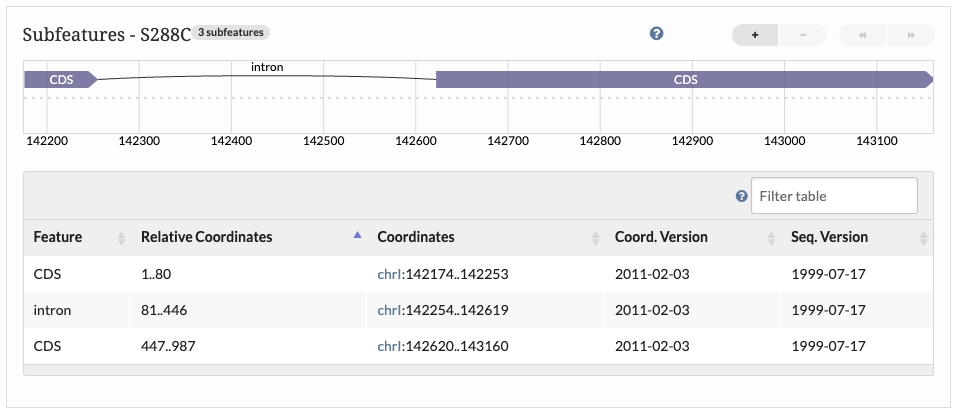

### Selecting Gene Sequence - Genes with 2 CDS and First CDS is 1bp

These genes have no start codon because they have a `1bp` CDS. Neither CDS has a start codon. This case is unsolvable in the sense of guaranteeing that the genes has a start and stop codon. We satisfy our desired output by making sure all CDS DNA are contained in the selection and allow these four genes to go without a start codon.

[SGD - YIL111W](https://www.yeastgenome.org/locus/S000001373)

[SGD - YJL041W](https://www.yeastgenome.org/locus/S000003577)

[SGD - YMR242C](https://www.yeastgenome.org/locus/S000004855)

[SGD - YOR312C](https://www.yeastgenome.org/locus/S000005839)

Eliminated newlines in `fsa`.

[[YIL111W Annotated|/notes/assets/sequence-docx/SpeciesLM-FASTA-S288c_Genome.docx]]

```fsa
>COX5B YIL111W SGDID:S000001373, Chromosome IX:155222..155765
AGCATGTATAACAAACACTGATTTTTGTTTTGAGTTTTAAAAGATATCCATTTACTAACATTCGAGGTGTACAAGCACAAGTTTTGCAGTGTTGCGTACTTCTCTTACTAAAGGGGCACGGCTAACTGGGACAAGATTTGTTCAAACAAAGGCCCTTTCGAAGGCAACATTGACAGATCTGCCCGAAAGATGGGAAAATATGCCAAACTTAGAACAGAAAGAGATTGCAGATAATTTGACAGAACGTCAAAAGCTTCCATGGAAAACTCTCAATAACGAGGAAATCAAAGCAGCTTGGTACATATCCTACGGCGAGTGGGGACCTAGAAGACCTGTACACGGAAAAGGCGATGTTGCATTTATAACTAAAGGAGTATTTTTAGGGTTAGGAATCTCATTTGGGCTCTTTGGTTTAGTGAGACTATTAGCCAATCCTGAAACTCCAAAGACTATGAACAGGGAATGGCAGTTGAAATCAGACGAGTATCTGAAGTCAAAAAATGCCAATCCTTGGGGAGGTTATTCTCAAGTTCAATCTAAATAA
```

```python
# "SpeciesLM/data/Sequences/Annotation/Assembled/five_prime.parquet"
dataset_five_prime.loc[dataset_five_prime['gene_id'] == "YIL111W", "five_prime_seq"].iloc[0]
>>>"AAAAACGATAAATTTGTGCTCGACTTGCAAGTAATGATATTGTTGAAGGATATCGACTTGCTCTCAAAGGACAACCAACCAACTTCTGAGAAGATTCCCGTCGATCCCTCGCACCTGACTCCATTGTGGAATATGTTGAAATTCATTTTCCTGTATGGAGGTAGTTATGATGATAAAAAGAACAACATGGAAAATAAAAGATATGTTGTAAACTTTGATGGGGTTGATTTGGACACAAAGATTGGGTATGAGCTTTTGGAGTACAAAAAATTTGTTAGTTTGCCCATGGCGTGGATTAAATGGGATAACGTTGTTATTGAAAACCACGCAAAAAGAAAAGAAATTGAAGGAAATATGATTCAAATATCAATAAACGAATTTGCACGATGGAGAAACGATAAGCTGAACAAAGCGCAGCAGCCGACGCGCAAACAGCGTTCTCTAAAAATACCTCGAGAGTTACCGGTTAAATTTCAACACCGTATGAGCATATCCTCCGTCCTCCAGCAGACATCCAAAGAACCATTTTGGTAAAACAATTCATCGGTCCGTTGGCATATGCTCATACATAGTTGCATTTTCGATTCATTAAATACTATTCATGTTAACATAATTCCATATAATCGTACTGTTTTGTCATTATTATATCGGCATGACACTCACCAATTTCTTTTTTTGATTTTGTATTGTTCGATAAGGCAACGAACGAGTACTCGAAAAAATGTCATGGACCCCTTAAAATTACTGAGGGGTTCAGAAAATACCGTGCAAAAGACGAAAAAAGACGAATTTCATTTGATTTATATTTTATAAATGACTGTTGCATTAAACAATAGACCAATTATTTCAATTTAATATTCTTTGCAGGAAACTTTCACAATGGAATAACGCCACATATTCATTGTAAAGAGCATGTATAACAAACACTGATTTTTGTTTTGAGTTTTAAAAGATATCCATTTACTAACATTCGAGGTGTACAAGCACAAGTTTTGCAGTGTTG"
```

[[S288c_stop_start_codons|dendron://torchcell/experiments.s288c_stop_start_codons]]

```python
no_start_codon
>>>['YIL111W', 'YJL041W', 'YMR242C', 'YOR312C']
```

### Selecting Gene Sequence - Genes Using CDS Sequence

For 24 genes we used some logic that is a bit convoluted to use the CDS sequence in an attempt to select the portion of the gene that begins with a start codon and ends with a stop codon. This logic is contained in the `__post_init__`.

```bash
YBL072C - Using CDS Sequence
YBL092W - Using CDS Sequence
YBR089C-A - Using CDS Sequence
YDL061C - Using CDS Sequence
YDL137W - Using CDS Sequence
YDL189W - Using CDS Sequence
YDR099W - Using CDS Sequence
YER102W - Using CDS Sequence
YER131W - Using CDS Sequence
YFR032C-A - Using CDS Sequence
YGL031C - Using CDS Sequence
YGL187C - Using CDS Sequence
YGL189C - Using CDS Sequence
YGR027C - Using CDS Sequence
YGR148C - Using CDS Sequence
YIL123W - Using CDS Sequence
YJL130C - Using CDS Sequence
YKL150W - Using CDS Sequence
YKL186C - Using CDS Sequence
YLR333C - Using CDS Sequence
YLR367W - Using CDS Sequence
YLR388W - Using CDS Sequence
YNL066W - Using CDS Sequence
YPL230W - Using CDS Sequence
```

### Selecting Gene Sequence - A well behaved gene YAL068C

Removed newline from fasta

```fasta
>PAU8 YAL068C SGDID:S000002142, Chromosome I:1807..2169
ATGGTCAAATTAACTTCAATCGCCGCTGGTGTCGCTGCCATCGCTGCTACTGCTTCTGCAACCACCACTCTAGCTCAATCTGACGAAAGAGTCAACTTGGTGGAATTGGGTGTCTACGTCTCTGATATCAGAGCTCACTTAGCCCAATACTACATGTTCCAAGCCGCCCACCCAACTGAAACCTACCCAGTCGAAGTTGCTGAAGCCGTTTTCAACTACGGTGACTTCACCACCATGTTGACCGGTATTGCTCCAGACCAAGTGACCAGAATGATCACCGGTGTTCCATGGTACTCCAGCAGATTAAAGCCAGCCATCTCCAGTGCTCTATCCAAGGACGGTATCTACACTATCGCAAACTAG
```

## Adding Protein to Genome

- Automatic download of `orf_trans_all.fasta`. These contain the proper proteins without having to reconstruct them via translation. This is better than using `Bio.Seq` `translate` function since this foces us to deal directly with introns. Can do something like `genome[gene].protein`
- [orf protein](http://sgd-archive.yeastgenome.org/sequence/S288C_reference/orf_protein)

## S288C DNA length for DNA LLMs

Around 32 genes are under 6kb... need to find a way around this. Also made mistake thinking the nucleotide transformer could handle 60kb... whoops. We can still use the Enformer for these large windows. Could also use 3 embeddings to capture the gene with nt transformer. Looks like this is the largest gene in yeast `YKR054C, length: 12278`

## Gene class looks more like ORF

This is actually looks more like an ORF since we care most about seq between start and stop codons. We should be able to move most of the Gene methods into the `ABC` then require an `abstractmethod` for setup where defining dictionaries etc.

## SpeciesLM FASTA S288c Genome Comparison for GitHub Issue

[[Annotated Docx|/notes/assets/sequence-docx/SpeciesLM-FASTA-S288c_Genome.docx]]

Updated 2023.09.24

### SpeciesLM FASTA S288c Genome Comparison for GitHub Issue - YAL037W

[[Selecting Gene Sequence - YAL037W Normal Gene Selection|dendron://torchcell/torchcell.sequence.genome.scerevisiae.s288c#selecting-gene-sequence---yal037w-normal-gene-selection]]


### SpeciesLM FASTA S288c Genome Comparison for GitHub Issue - YDL061C

[[Selecting Gene Sequence - YDL061C upsteam five prime UTR intron|dendron://torchcell/torchcell.sequence.genome.scerevisiae.s288c#selecting-gene-sequence---ydl061c-upsteam-five-prime-utr-intron]]

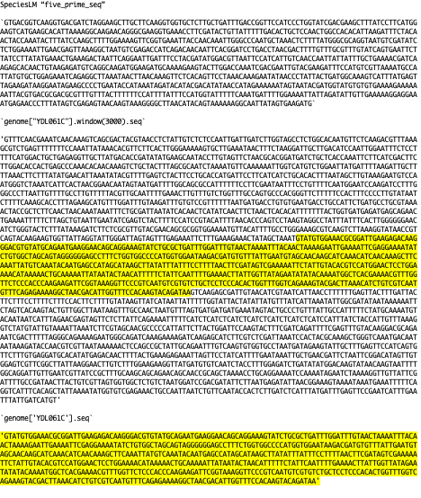

### SpeciesLM FASTA S288c Genome Comparison for GitHub Issue - YIL111W

[[Selecting Gene Sequence - Genes with 2 CDS and First CDS is 1bp|dendron://torchcell/torchcell.sequence.genome.scerevisiae.s288c#selecting-gene-sequence---genes-with-2-cds-and-first-cds-is-1bp]]

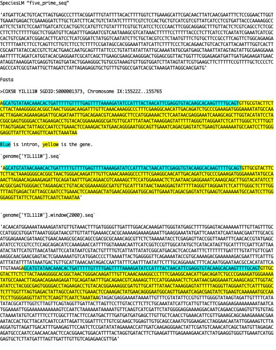

### SpeciesLM FASTA S288c Genome Comparison for GitHub Issue - YBL092W

[[Selecting Gene Sequence - YBL092W upsteam five prime UTR intron|dendron://torchcell/torchcell.sequence.genome.scerevisiae.s288c#selecting-gene-sequence---ybl092w-upsteam-five-prime-utr-intron]]

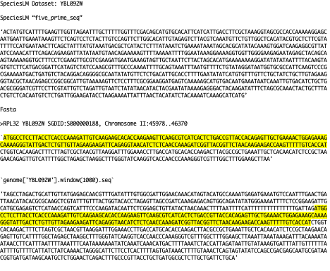

## SpeciesLM FASTA S288c Genome Comparison GitHub Issue Response with Correct Query

Updated 2023.09.25

[[Annotated Docx|/notes/assets/sequence-docx/SpeciesLM-FASTA-S288c_Genome.docx]]

### SpeciesLM FASTA S288c Genome Comparison GitHub Issue Response with Correct Query - YAL037W

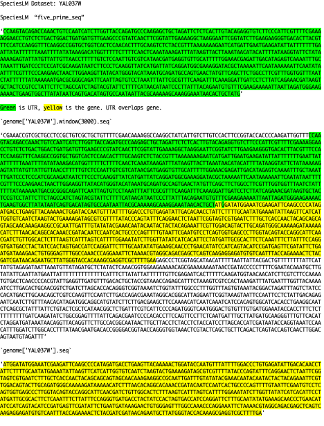

Looks good

### SpeciesLM FASTA S288c Genome Comparison GitHub Issue Response with Correct Query - YDL061C

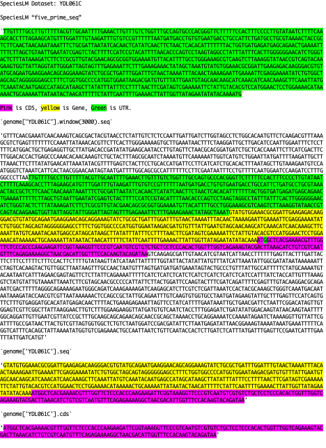

Looks good but actually ignores the annotated UTR of the gene and takes CDS.

### SpeciesLM FASTA S288c Genome Comparison GitHub Issue Response with Correct Query - YIL11W

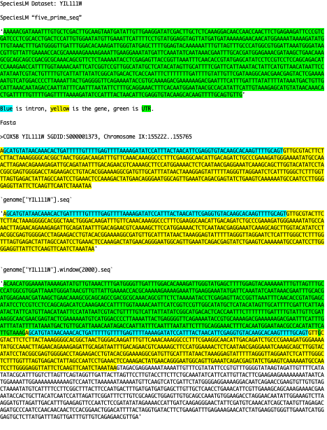

Need to know logic here. Gene has one intron and a single `bp` CDS. How was the position to start the UTR determined? Is it an issue that this CDS doesn't start with a start codon?

## S288c Genes Without 1003 bp Upstream

```python
not_1003_upstream = ['YAL068W-A', 'YAL069W', 'YBL113W-A', 'YCR108C', 'YDR545C-A', 'YEL077W-A', 'YER190C-B', 'YFL067W', 'YFL068W', 'YGR296C-B', 'YHL050W-A', 'YHR219C-A', 'YIL177W-A', 'YJL225W-A', 'YJR162C', 'YKL225W', 'YLL067W-A', 'YLR467C-A', 'YML133W-B', 'YMR326C', 'YNL339W-B', 'YNR077C', 'YOL166W-A', 'YOR396C-A']
```

### SpeciesLM Five Prime S288c Genes Less Than 1003 bp

`dataset_five_prime` reads "SpeciesLM/data/Sequences/Annotation/Assembled/five_prime.parquet".

24 genes total

```python
>>> print({i:len(dataset_five_prime.loc[dataset_five_prime['gene_id'] == i, "five_prime_seq"].iloc[0]) for i in not_1003_upstream})
{'YAL068W-A': 540
'YAL069W': 337
'YBL113W-A': 648
'YCR108C': 435
'YDR545C-A': 594
'YEL077W-A': 632
'YER190C-B': 715
'YFL067W': 838
'YFL068W': 55
'YGR296C-B': 715
'YHL050W-A': 813
'YHR219C-A': 965
'YIL177W-A': 848
'YJL225W-A': 831
'YJR162C': 493
'YKL225W': 453
'YLL067W-A': 845
'YLR467C-A': 648
'YML133W-B': 829
'YMR326C': 632
'YNL339W-B': 736
'YNR077C': 795
'YOL166W-A': 587
'YOR396C-A': 797}
```

### Window Five Prime S288c Genes Less Than 1003 bp

26 genes total

```python
>>>print(
    {
        gene: len(
            genome[gene]
            .window_five_prime(1003, include_start_codon=True, allow_undersize=True)
            .seq
        )
        for gene in genome.gene_set
        if len(
            genome[gene]
            .window_five_prime(1003, include_start_codon=True, allow_undersize=True)
            .seq
        )
        < 1003
    }
)
{'YAL068W-A': 540, 'YAL069W': 337, 'YBL113W-A': 648, 'YCR108C': 435, 'YDR545C-A': 594, 'YEL077W-A': 632, 'YER190C-B': 715, 'YFL067W': 838, 'YFL068W': 55, 'YGR296C-B': 715, 'YHL050W-A': 813, 'YHR219C-A': 965, 'YIL177W-A': 848, 'YJL225W-A': 831, 'YJR162C': 493, 'YKL225W': 453, 'YLL067W-A': 845, 'YLR467C-A': 648, 'YML133W-B': 829, 'YMR326C': 632, 'YNL339W-B': 736, 'YNR077C': 795, 'YOL166W-A': 587, 'YOR396C-A': 797, 'YPL283W-B': 645, 'YPR204C-A': 731}
```

### Window Three Prime S288c Genes Less Than 300 bp

5 genes total. We don't really need to worry about these becuase [[Fungal_up_down_transformer|dendron://torchcell/torchcell.models.fungal_up_down_transformer]] can encode them.

```python
>>>print(
    {
        gene: len(
            genome[gene]
            .window_three_prime(300, include_stop_codon=True, allow_undersize=True)
            .seq
        )
        for gene in genome.gene_set
        if len(
            genome[gene]
            .window_three_prime(300, include_stop_codon=True, allow_undersize=True)
            .seq
        )
        < 300
    }
)
{'YBL113C': 282, 'YDR545W': 225, 'YEL077C': 266, 'YLR467W': 282, 'YPL283C': 282}
```

## DDP sqlite gff error

This solves some of the issues with `ddp` but I think it general it is a bad setting. Default to overwriting is a better setting so you don't do a bunch of manipulations to a genome and then accidentally load this genome. We could save strains as a path taken from a given genome.

```python
if os.path.exists(db_path):
    self.db = gffutils.FeatureDB(db_path)
else:
self.db = gffutils.create_db(
    self._gff_path,
    dbfn=db_path,
    force=True,
    keep_order=True,
    merge_strategy="merge",
    sort_attribute_values=True,
)
```

## 6 Pseudogenes From cmd F orf_trans_all_R64-4-1_20230830.fasta

SGD YAR064W Pseudogene with Regulation Interactions. We should keep genes if there are in anyway tied to other genes via any of the biological networks. This isn't absolutely necessary, but for now it is a nice heuristic with yeast.

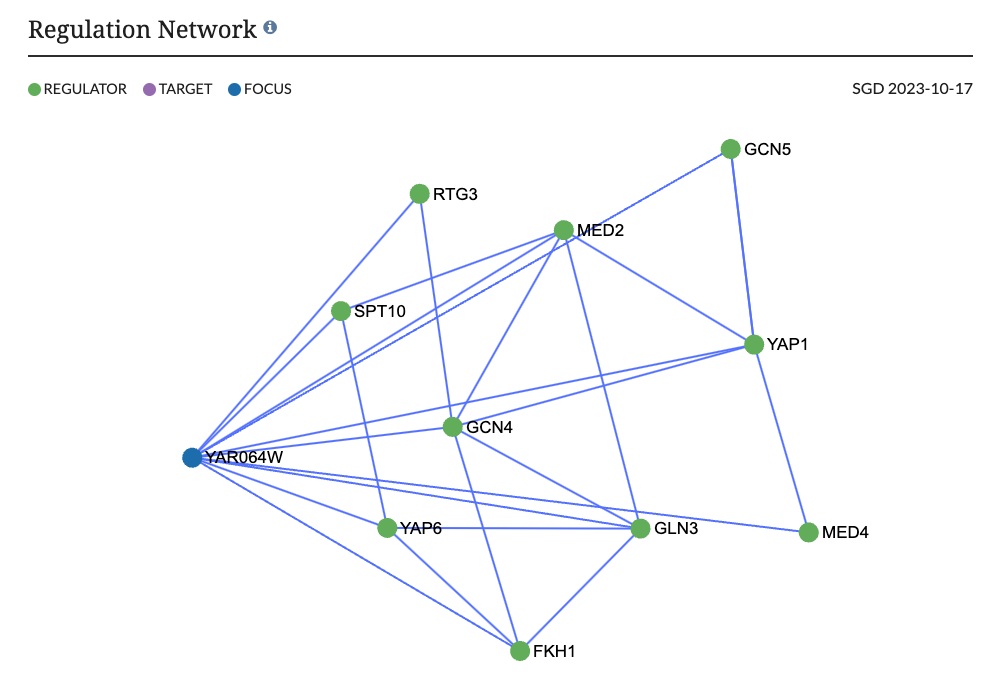

## Dubious ORFs are Unlikley to Encode an Expressed Protein

According to the [Yeast OrFan Gene Project](https://www.yeastorfanproject.com/orfans/) dubious open reading frames are unlikely to encode an expressed protein and should therefore not be encoded by the protein language models for embedding proteins.

```python
>>> load_dotenv()
>>> DATA_ROOT = os.getenv("DATA_ROOT")
>>>
>>> genome = SCerevisiaeGenome(
>>>     data_root=osp.join(DATA_ROOT, "data/sgd/genome"), overwrite=True
>>> )
>>> orf_classes = []
>>> for gene in genome.gene_set:
>>>     orf_classes.append(genome[gene].orf_classification[0])
>>> print(pd.Series(orf_classes).value_counts())

Verified           5255
Dubious             684
Uncharacterized     668
Name: count, dtype: int64
```

## 2025.05.14 - Adding GO from Gene Ontology Source

```python
    def remove_deprecated_go_terms(self):
        # Create a list to hold updated features
        updated_features = []

        # Iterate over each feature in the database
        invalid_go_terms = {"not_in_go_dag": [], "obsolete": []}
        for feature in self.db.features_of_type("gene"):
            # Check if the feature has the "Ontology_term" attribute
            if "Ontology_term" in feature.attributes: # FLAG BREAKPOINT HERE
                # Filter out deprecated GO terms
                valid_onto_terms = []
                valid_go_terms = []
                for term in feature.attributes["Ontology_term"]:
                    if term.startswith("GO:"):
                        if term not in self.go_dag:
                            invalid_go_terms["not_in_go_dag"].append(term)
                        elif self.go_dag[term].is_obsolete:
                            invalid_go_terms["obsolete"].append(term)
                        else:
                            valid_go_terms.append(term)
                    else:
                        valid_onto_terms.append(term)
                # Update the "Ontology_term" attribute for the feature
                if valid_go_terms:
                    feature.attributes["Ontology_term"] = (
                        valid_go_terms + valid_onto_terms
                    )
                else:
                    del feature.attributes["Ontology_term"]

                # Add the updated feature to the list
                updated_features.append(feature)

        # Update all features in the database at once
        self.db.update(updated_features, merge_strategy="replace")

        # Commit the changes to the database
        self.db.conn.commit()
```

```python
feature.attributes
<gffutils.attributes.Attributes object at 0x17ef51010>
special variables
function variables
_MutableMapping__marker =
<object object at 0x104b34150>
_abc_impl =
<_abc._abc_data object at 0x108a0b940>
_d =
{'ID': ['YAL069W'], 'Name': ['YAL069W'], 'Ontology_term': ['GO:0003674', 'GO:0005575', 'GO:0008150', 'SO:0000704'], 'Note': ['Dubious open reading frame; unlikely to encode a functional protein, based on availab...experimental and comparative sequence data'], 'display': ['Dubious open reading frame'], 'dbxref': ['SGD:S000002143'], 'orf_classification': ['Dubious'], 'curie': ['SGD:S000002143']}
special variables
function variables
'ID' =
['YAL069W']
'Name' =
['YAL069W']
'Ontology_term' =
['GO:0003674', 'GO:0005575', 'GO:0008150', 'SO:0000704']
'Note' =
['Dubious open reading frame; unlikely to encode a functional protein, based on availab...experimental and comparative sequence data']
'display' =
['Dubious open reading frame']
'dbxref' =
['SGD:S000002143']
'orf_classification' =
['Dubious']
'curie' =
['SGD:S000002143']
len() =
8```
