## S288C DB Feature Types

```bash
00: 'ARS'
01: 'ARS_consensus_sequence'
02: 'CDS'
03: 'LTR_retrotransposon'
04: 'W_region'
05: 'X_element'
06: 'X_element_combinatorial_repeat'
07: 'X_region'
08: 'Y_prime_element'
09: 'Y_region'
10: 'Z1_region'
11: 'Z2_region'
12: 'blocked_reading_frame'
13: 'centromere'
14: 'centromere_DNA_Element_I'
15: 'centromere_DNA_Element_II'
16: 'centromere_DNA_Element_III'
17: 'chromosome'
18: 'external_transcribed_spacer_region'
19: 'five_prime_UTR_intron'
20: 'gene'
21: 'intein_encoding_region'
22: 'internal_transcribed_spacer_region'
23: 'intron'
24: 'long_terminal_repeat'
25: 'mRNA'
26: 'mating_type_region'
27: 'matrix_attachment_site'
28: 'ncRNA'
29: 'ncRNA_gene'
30: 'non_transcribed_region'
31: 'noncoding_exon'
32: 'origin_of_replication'
33: 'plus_1_translational_frameshift'
34: 'pseudogene'
35: 'rRNA'
36: 'rRNA_gene'
37: 'recombination_enhancer'
38: 'region'
39: 'silent_mating_type_cassette_array'
40: 'snRNA'
41: 'snRNA_gene'
42: 'snoRNA'
43: 'snoRNA_gene'
44: 'tRNA'
45: 'tRNA_gene'
46: 'telomerase_RNA'
47: 'telomerase_RNA_gene'
48: 'telomere'
49: 'telomeric_repeat'
50: 'transposable_element'
51: 'transposable_element_gene'
52: 'uORF'
```

## Selecting Gene Sequence

We select representative DNA sequences in a `DnaSelectionResult` to adhere to the DNA language models. We specifically have `SpeciesLM` in mind.

It seems the only genes with no start codons are genes with `five_prime_UTR_intron` or an internal `intron` with a `1bp` five prime CDS.

This is a summarizing figure of the sequence selection process.


### Selecting Gene Sequence - Based on CDS with Five prime UTR intron

[YBL092W five prime UTR intron](https://www.yeastgenome.org/locus/S000000188)

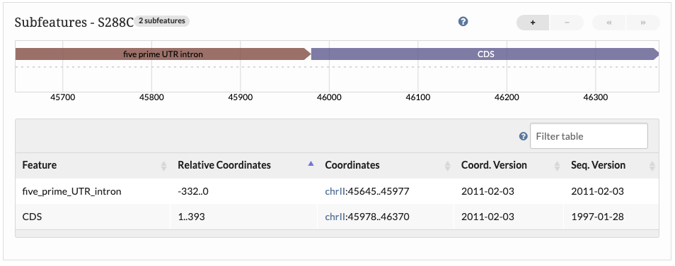

### Selecting Gene Sequence - Adjust -1 on Start for Negative Sequence

```python
genome['YFL039C']
>>> DnaSelectionResult(id=YFL039C, chromosome=6, strand=-, start=53260, end=54696,  seq=ATGGATTCTGGTATGTTCTAGCGCTTGCACCATCCCATTTAACTGTAAGAAGAATTGCACGGTCCCAATTGCTCGAGAGATTTCTCTTTTACCTTTTTTTACTATTTTTCACTCTCCCATAACCTCCTATATTGACTGATCTGTAATAACCACGATATTATTGGAATAAATAGGGGCTTGAAATTTGGAAAAAAAAAAAAAACTGAAATATTTTCGTGATAAGTGATAGTGATATTCTTCTTTTATTTGCTACTGTTACTAAGTCTCATGTACTAACATCGATTGCTTCATTCTTTTTGTTGCTATATTATATGTTTAGAGGTTGCTGCTTTGGTTATTGATAACGGTTCTGGTATGTGTAAAGCCGGTTTTGCCGGTGACGACGCTCCTCGTGCTGTCTTCCCATCTATCGTCGGTAGACCAAGACACCAAGGTATCATGGTCGGTATGGGTCAAAAAGACTCCTACGTTGGTGATGAAGCTCAATCCAAGAGAGGTATCTTGACTTTACGTTACCCAATTGAACACGGTATTGTCACCAACTGGGACGATATGGAAAAGATCTGGCATCATACCTTCTACAACGAATTGAGAGTTGCCCCAGAAGAACACCCTGTTCTTTTGACTGAAGCTCCAATGAACCCTAAATCAAACAGAGAAAAGATGACTCAAATTATGTTTGAAACTTTCAACGTTCCAGCCTTCTACGTTTCCATCCAAGCCGTTTTGTCCTTGTACTCTTCCGGTAGAACTACTGGTATTGTTTTGGATTCCGGTGATGGTGTTACTCACGTCGTTCCAATTTACGCTGGTTTCTCTCTACCTCACGCCATTTTGAGAATCGATTTGGCCGGTAGAGATTTGACTGACTACTTGATGAAGATCTTGAGTGAACGTGGTTACTCTTTCTCCACCACTGCTGAAAGAGAAATTGTCCGTGACATCAAGGAAAAACTATGTTACGTCGCCTTGGACTTCGAACAAGAAATGCAAACCGCTGCTCAATCTTCTTCAATTGAAAAATCCTACGAACTTCCAGATGGTCAAGTCATCACTATTGGTAACGAAAGATTCAGAGCCCCAGAAGCTTTGTTCCATCCTTCTGTTTTGGGTTTGGAATCTGCCGGTATTGACCAAACTACTTACAACTCCATCATGAAGTGTGATGTCGATGTCCGTAAGGAATTATACGGTAACATCGTTATGTCCGGTGGTACCACCATGTTCCCAGGTATTGCCGAAAGAATGCAAAAGGAAATCACCGCTTTGGCTCCATCTTCCATGAAGGTCAAGATCATTGCTCCTCCAGAAAGAAAGTACTCCGTCTGGATTGGTGGTTCTATCTTGGCTTCTTTGACTACCTTCCAACAAATGTGGATCTCAAAACAAGAATACGACGAAAGTGGTCCATCTATCGTTCACCACAAGTGTTTCTAA)
```

Eliminated new lines on fasta

```fasta
>ACT1 YFL039C SGDID:S000001855, Chromosome VI:53260..54696
ATGGATTCTGGTATGTTCTAGCGCTTGCACCATCCCATTTAACTGTAAGAAGAATTGCACGGTCCCAATTGCTCGAGAGATTTCTCTTTTACCTTTTTTTACTATTTTTCACTCTCCCATAACCTCCTATATTGACTGATCTGTAATAACCACGATATTATTGGAATAAATAGGGGCTTGAAATTTGGAAAAAAAAAAAAAACTGAAATATTTTCGTGATAAGTGATAGTGATATTCTTCTTTTATTTGCTACTGTTACTAAGTCTCATGTACTAACATCGATTGCTTCATTCTTTTTGTTGCTATATTATATGTTTAGAGGTTGCTGCTTTGGTTATTGATAACGGTTCTGGTATGTGTAAAGCCGGTTTTGCCGGTGACGACGCTCCTCGTGCTGTCTTCCCATCTATCGTCGGTAGACCAAGACACCAAGGTATCATGGTCGGTATGGGTCAAAAAGACTCCTACGTTGGTGATGAAGCTCAATCCAAGAGAGGTATCTTGACTTTACGTTACCCAATTGAACACGGTATTGTCACCAACTGGGACGATATGGAAAAGATCTGGCATCATACCTTCTACAACGAATTGAGAGTTGCCCCAGAAGAACACCCTGTTCTTTTGACTGAAGCTCCAATGAACCCTAAATCAAACAGAGAAAAGATGACTCAAATTATGTTTGAAACTTTCAACGTTCCAGCCTTCTACGTTTCCATCCAAGCCGTTTTGTCCTTGTACTCTTCCGGTAGAACTACTGGTATTGTTTTGGATTCCGGTGATGGTGTTACTCACGTCGTTCCAATTTACGCTGGTTTCTCTCTACCTCACGCCATTTTGAGAATCGATTTGGCCGGTAGAGATTTGACTGACTACTTGATGAAGATCTTGAGTGAACGTGGTTACTCTTTCTCCACCACTGCTGAAAGAGAAATTGTCCGTGACATCAAGGAAAAACTATGTTACGTCGCCTTGGACTTCGAACAAGAAATGCAAACCGCTGCTCAATCTTCTTCAATTGAAAAATCCTACGAACTTCCAGATGGTCAAGTCATCACTATTGGTAACGAAAGATTCAGAGCCCCAGAAGCTTTGTTCCATCCTTCTGTTTTGGGTTTGGAATCTGCCGGTATTGACCAAACTACTTACAACTCCATCATGAAGTGTGATGTCGATGTCCGTAAGGAATTATACGGTAACATCGTTATGTCCGGTGGTACCACCATGTTCCCAGGTATTGCCGAAAGAATGCAAAAGGAAATCACCGCTTTGGCTCCATCTTCCATGAAGGTCAAGATCATTGCTCCTCCAGAAAGAAAGTACTCCGTCTGGATTGGTGGTTCTATCTTGGCTTCTTTGACTACCTTCCAACAAATGTGGATCTCAAAACAAGAATACGACGAAAGTGGTCCATCTATCGTTCACCACAAGTGTTTCTAA
```

### Selecting Gene Sequence - five_prime_UTR_intron

- [ ] Use this as case to ask for authors to descrive how they processed their data.

```python
genome["YBL072C"]
>>>DnaSelectionResult(id=YBL072C, chromosome=2, strand=-, start=88523, end=89440,  seq=GTATGTGCTATGGTCATATGAGTAATGGAACTACATATTATTTTGAATGCTACAGGACCTCTCTTTGAATGGAATAGATAGTGGAAAAAGTAAACTTAACTAAAAGGGATGATATAAATTGTGACAGGAGCAGTGCACTAAACTGAATCCTTTGTGTACCCAAAAAATCAAGCCTCTTATGAAACGCCGAGTTTTTCACAAGAAGAGATGAAAAGAAACCAAAGCATATTTCAAGATAAGAAAAAAATTCCGCAACTTTTGTACGTTCTTTATTTTACTAACAAGCGTCATTAAATTTTCTATTACAGTTACAAAATGGGTATTTCTCGTGATTCTCGTCACAAAAGATCCGCTACCGGTGCCAAGCGTGCTCAATTCAGAAAGAAGAGAAAGTTCGAATTAGGCCGTCAACCAGCCAACACCAAGATCGGTGCTAAGAGAATTCACTCTGTTAGAACTAGAGGTGGTAACAAGAAATACAGAGCTCTAAGAATTGAAACCGGTAACTTTTCTTGGGCTTCTGAAGGTATCTCCAAGAAGACCAGAATTGCTGGTGTTGTTTACCATCCATCCAACAATGAATTGGTTAGAACTAACACTTTGACCAAGGCTGCCATTGTCCAAATTGATGCTACTCCATTCAGACAATGGTTCGAAGCTCACTACGGTCAAACCTTGGGTAAGAAGAAGAACGTCAAGGAAGAAGAAACTGTTGCCAAGAGCAAGAACGCTGAAAGAAAGTGGGCTGCTAGAGCTGCTTCTGCCAAGATCGAATCTTCCGTTGAATCTCAATTCAGCGCCGGTAGATTATACGCTTGTATCTCTTCCAGACCAGGTCAATCCGGTAGATGTGATGGTTACATCTTGGAAGGTGAAGAATTAGCTTTCTACCTAAGAAGATTGACTGCTAAGAAATAG)
```

This sequence is much longer because it contains the gff db feature `five_prime_UTR_intron`. This is not visualized on SGD.

Eliminated new lines on fasta

```fasta
>RPS8A YBL072C SGDID:S000000168, Chromosome II:88523..89125
ATGGGTATTTCTCGTGATTCTCGTCACAAAAGATCCGCTACCGGTGCCAAGCGTGCTCAATTCAGAAAGAAGAGAAAGTTCGAATTAGGCCGTCAACCAGCCAACACCAAGATCGGTGCTAAGAGAATTCACTCTGTTAGAACTAGAGGTGGTAACAAGAAATACAGAGCTCTAAGAATTGAAACCGGTAACTTTTCTTGGGCTTCTGAAGGTATCTCCAAGAAGACCAGAATTGCTGGTGTTGTTTACCATCCATCCAACAATGAATTGGTTAGAACTAACACTTTGACCAAGGCTGCCATTGTCCAAATTGATGCTACTCCATTCAGACAATGGTTCGAAGCTCACTACGGTCAAACCTTGGGTAAGAAGAAGAACGTCAAGGAAGAAGAAACTGTTGCCAAGAGCAAGAACGCTGAAAGAAAGTGGGCTGCTAGAGCTGCTTCTGCCAAGATCGAATCTTCCGTTGAATCTCAATTCAGCGCCGGTAGATTATACGCTTGTATCTCTTCCAGACCAGGTCAATCCGGTAGATGTGATGGTTACATCTTGGAAGGTGAAGAATTAGCTTTCTACCTAAGAAGATTGACTGCTAAGAAATAG
```

When we print out the feautres in the gene region we get the following

```python
[feature for feature in features]
>>>[<Feature chromosome ...2b64dba90>, <Feature mRNA (chrII...2b6739190>, <Feature mRNA (chrII...2b679d050>, <Feature CDS (chrII:...2b679c210>, <Feature gene (chrII...2b679d4d0>, <Feature five_prime_...2b679c890>]
special variables
function variables
0: <Feature chromosome (chrII:1-813184[.]) at 0x2b64dba90>
1: <Feature mRNA (chrII:88246-89465[-]) at 0x2b6739190>
2: <Feature mRNA (chrII:88246-89467[-]) at 0x2b679d050>
3: <Feature CDS (chrII:88523-89125[-]) at 0x2b679c210>
4: <Feature gene (chrII:88523-89440[-]) at 0x2b679d4d0>
5: <Feature five_prime_UTR_intron (chrII:89133-89440[-]) at 0x2b679c890>
len(): 6
```

It looks like SGD uses the `CDS` in this case.

This is using their publisted "SpeciesLM/data/Sequences/Annotation/Assembled/five_prime.parquet".

```python
# "SpeciesLM/data/Sequences/Annotation/Assembled/five_prime.parquet"
dataset_five_prime.loc[dataset_five_prime['gene_id'] == "YBL072C", "five_prime_seq"].iloc[0]
>>>"AGCTGGGACAAACAGCAACTTTTTCGCCCTCAAACATGTCATCCAGATATATTTGAAACCTATCTCCACAGGGACAAGGATAGGTGAACATTTGATTTTCAGGCTCAAACGTCATATCTTCGATTTCGATTTCGTCATATGTTGACATTTCAGCTGGTAATGTATTGTACAAATGATGTGCTTACAGTCGTGGTATGTATGTGTCTTTGAAAAAAAAAAGCGATGAGAAGCTCTTTATAGCGATAATATAGGTCCTTTTTCGGATTTGTCTCCACCCATTTCTTTTTCATCTGCTCTAACTTTTGTGACTTTACATCCATACACCCTCTTTAACACCCTTACACTTTTACAAATTTTCCTTTTTCATCAACTTTAAAATTATTGCGTGAGAAGTTCCTATTTTCTGATTTTCTCAGCGGAATAACCTTTTAGAATCCTGAGCTGCGAGCAGAGCGGCCTCGCCAAACCCGTGCTGGGCCTAGTTCCCCCCTCCATGTTCGGTCCTACACACGAGCATCGCTGGGAAAGCTTGAGGGCTTTCTCTTACGCAGTGTTCATGGTGTTACGGGATGGAACTGTTTCATATACGTTATTTACAGGCCTATCTTAAAGTTATAGGAAATTACACTTGCCATTTGCTTTTTGGTACTCACAAGAAGACGTTATAAACACACCAGGACAAAAAGTATGTGCTATGGTCATATGAGTAATGGAACTACATATTATTTTGAATGCTACAGGACCTCTCTTTGAATGGAATAGATAGTGGAAAAAGTAAACTTAACTAAAAGGGATGATATAAATTGTGACAGGAGCAGTGCACTAAACTGAATCCTTTGTGTACCCAAAAAATCAAGCCTCTTATGAAACGCCGAGTTTTTCACAAGAAGAGATGAAAAGAAACCAAAGCATATTTCAAGATAAGAAAAAAATTCCGCAACTTTTGTACGTTCTTTATTTTACTAACAAGCGTCATTAAATTTTCTATTACAGTTACAAAATG"
```

```python
genome['YBL072C'].window_5utr(1000).seq
>>>'TGTATAAAATAATCATATACACCTACCCAGTATCCTTATATGCAGTAAAAGAGCTCAACCTGAGCAAAACGTTTTCCATCAGTGCACTTGGAATTTTGAATAGTAATTCCAACCGGAGTCCAGCGAAGAAGCAAACCTTCTTTTCTGCTTGCGTTGCTAAGTCATATAGCTCTTTCTTTATTTCTATTTGTATTCTCGATCTAGCCTCTCATCTTTAGGCAGCAGCGGCAATAGGCTCAGGGGGGTGGATGCCTGCCTCTTCGTAGTACTCAGCCAAGTCTTCTTTATCGAAAACTACATCGATCATCAGTGAGCAGCTGGGACAAACAGCAACTTTTTCGCCCTCAAACATGTCATCCAGATATATTTGAAACCTATCTCCACAGGGACAAGGATAGGTGAACATTTGATTTTCAGGCTCAAACGTCATATCTTCGATTTCGATTTCGTCATATGTTGACATTTCAGCTGGTAATGTATTGTACAAATGATGTGCTTACAGTCGTGGTATGTATGTGTCTTTGAAAAAAAAAAGCGATGAGAAGCTCTTTATAGCGATAATATAGGTCCTTTTTCGGATTTGTCTCCACCCATTTCTTTTTCATCTGCTCTAACTTTTGTGACTTTACATCCATACACCCTCTTTAACACCCTTACACTTTTACAAATTTTCCTTTTTCATCAACTTTAAAATTATTGCGTGAGAAGTTCCTATTTTCTGATTTTCTCAGCGGAATAACCTTTTAGAATCCTGAGCTGCGAGCAGAGCGGCCTCGCCAAACCCGTGCTGGGCCTAGTTCCCCCCTCCATGTTCGGTCCTACACACGAGCATCGCTGGGAAAGCTTGAGGGCTTTCTCTTACGCAGTGTTCATGGTGTTACGGGATGGAACTGTTTCATATACGTTATTTACAGGCCTATCTTAAAGTTATAGGAAATTACACTTGCCATTTGCTTTTTGGTACTCACAAGAAGACGTTATAAACACACCAGGACAAAAA'
```

### Selecting Gene Sequence - YBL092W upsteam five prime UTR intron

Again this one contains a five prime UTR intron. This one is marked on [SGD YBL092W](https://www.yeastgenome.org/locus/S000000188). Sometimes genes contain a five prime UTR intron but they are not marked on SGD. I write "upsteam five prime UTR intron" because sometimes there are "five prime UTR intron" between two CDS.

On SGD we have `RPL32 Location: Chromosome II 45978..46370`

```fasta
>RPL32 YBL092W SGDID:S000000188, Chromosome II:45978..46370
ATGGCCTCCTTACCTCACCCAAAGATTGTCAAGAAGCACACCAAGAAGTTCAAGCGTCATCACTCTGACCGTTACCACAGAGTTGCTGAAAACTGGAGAAAGCAAAAGGGTATTGACTCTGTTGTTAGAAGAAGATTCAGAGGTAACATCTCTCAACCAAAGATCGGTTACGGTTCTAACAAGAAGACCAAGTTTTTGTCACCATCTGGTCACAAGACTTTCTTAGTCGCTAACGTTAAGGATTTGGAAACCTTGACCATGCACACCAAGACTTACGCCGCTGAAATTGCTCACAACATCTCCGCTAAGAACAGAGTTGTCATTTTGGCTAGAGCTAAGGCTTTGGGTATCAAGGTCACCAACCCAAAGGGTCGTTTGGCTTTGGAAGCTTAA
```

```python
genome['YBL092W']
DnaSelectionResult(id=YBL092W, chromosome=2, strand=+, start=45978, end=46370,  seq=ATGGCCTCCTTACCTCACCCAAAGATTGTCAAGAAGCACACCAAGAAGTTCAAGCGTCATCACTCTGACCGTTACCACAGAGTTGCTGAAAACTGGAGAAAGCAAAAGGGTATTGACTCTGTTGTTAGAAGAAGATTCAGAGGTAACATCTCTCAACCAAAGATCGGTTACGGTTCTAACAAGAAGACCAAGTTTTTGTCACCATCTGGTCACAAGACTTTCTTAGTCGCTAACGTTAAGGATTTGGAAACCTTGACCATGCACACCAAGACTTACGCCGCTGAAATTGCTCACAACATCTCCGCTAAGAACAGAGTTGTCATTTTGGCTAGAGCTAAGGCTTTGGGTATCAAGGTCACCAACCCAAAGGGTCGTTTGGCTTTGGAAGCTTAA)
```

```python
genome['YBL092W'].window(1000)
DnaWindowResult(id='YBL092W', chromosome=2, strand='+', start_window=45673, end_window=46673, seq='TAGCCTAGACTGCATTGTTATGAGAGCAACGTTTGATATTTGTGGCGATTGGAACAAACATAGTACATGCCAAAATGAGATGAAATGTCCAATTTGAACTGATTAACATACACGCGCAAGCTCGTATTTGTTTACTGGTACACCTAGAGTTAGCCGATCAAAGAGACAGTGGCAGATATATGGGAAAATTTTCTCCGGAAGATTGCATGCGAGAGTCTCATAACCAGTCATTTCCCAAGATACAATTCTCGGAGCTGTTATACTAACAAACTTTTAATTTTCATTTTTTTTTTTTTTTGATTAGATGGCCTCCTTACCTCACCCAAAGATTGTCAAGAAGCACACCAAGAAGTTCAAGCGTCATCACTCTGACCGTTACCACAGAGTTGCTGAAAACTGGAGAAAGCAAAAGGGTATTGACTCTGTTGTTAGAAGAAGATTCAGAGGTAACATCTCTCAACCAAAGATCGGTTACGGTTCTAACAAGAAGACCAAGTTTTTGTCACCATCTGGTCACAAGACTTTCTTAGTCGCTAACGTTAAGGATTTGGAAACCTTGACCATGCACACCAAGACTTACGCCGCTGAAATTGCTCACAACATCTCCGCTAAGAACAGAGTTGTCATTTTGGCTAGAGCTAAGGCTTTGGGTATCAAGGTCACCAACCCAAAGGGTCGTTTGGCTTTGGAAGCTTAAATTAAATAAAGATTTACAAAATAATAACCTTCATTTAATTTTAAATTTCAATAAAAAAATATCAAATCAAACATGACTTTTAAATCTACCATTAGATAATTGTATAAAGTGATTTATTGTTTTTTAATTTTGTTTTCATTATCTATCAAAACTAGGGCATTCTTCCTCACTTTTAGTGATAAACTTTTGTAAACTCAGTAGTATATCCAGCCGACGAGCAATGCGATAACGGTGATGATAAGCAATGCTCTGGAACTCAGACTTTGCCCGTTACCTGCTGATGGCGCTCTTGCTGATTCTGCA')
```

```python
genome['YBL092W'].window_5utr(1000).seq
>>>'ATGTGCTATTTGACCACCTTTACCATTTTCTCTGGTCGGTATGGTGGAGAATTTACCTGAAAGATCTGCTATCTGGTTCTTGTAAGATTTTCTTAGCTTCACGGCTTTAGTGCCGTCCAAATTTGTTCTTGCCACTTGCCTGGAGATGTCATCCAAGCCATACACCGATATCAAGTCCTGTAGAGGATTTGGTTGTTGGTACGTATATGTAGTTTCCGGATCCACGTAATAGTAGTATGAGGGGACTGTAGTTTCGTCCACTCTAGAAGCCATTATTATCGTATTCCTTTTTCGTTCACTTACTATTGCTATTCGCACTCACTACAGATCTATATTTTATGTTCCACCCTGTTGTCAGATCAGGAAAGGAATGAAGAGGCTCTATTTAAACCAAATACACCTCTTCGTTTCTCAATATTGTTGGGCTTTCCTTTTTTTTTTCCTTCCACGTCTATCTATTGTCTCTATCAAAATTAGGAAAAAGAAATGAAGAACGATGAGCCAAACGAGGCTGAGACAATCATGCATCCGTACATTCTATGTATGTTTGGGTGTATCTTTCCAGATTCGGTTCTTTTTTTTTTTCAGTCCAATTGAAAAAAAAAAGGAACAGGAACAACGGGTCGAAATTTGCCGTCACATTCAGAGCGAAGAGCGACAGGGGAATTGGTGGGCTAACCACCTGTTGAGCCCAGCTAGCAGCTGTCGGTAAACCGTCGTTGGGCGGGGCGCGACAATGCAGCCAGCGGAGGCATTGTATGGTTTCCGTCTGGAGAGTGGGCTTAGCCGGCCTGGCACTCCTTCTCTAAGCAGAGTGAGAAGGGAATCTTTTTACTGGAGAAGAGTGTTTGAATCCAGCAGAAGGTAATACGCACCTTTCTCATCTATTTGCAGAATCGTTTTATTAAAATACTTTTAAAGAATTTAGATTTTGATAATTAGTTCATTCTCTTTTACAAAGATAATCACCAAACAGGGACAATACACTGAACGATAAAAG'
```

```python
# "SpeciesLM/data/Sequences/Annotation/Assembled/five_prime.parquet"
dataset_five_prime.loc[dataset_five_prime['gene_id'] == "YBL092W", "five_prime_seq"].iloc[0]
>>>"TATTTTATGTTCCACCCTGTTGTCAGATCAGGAAAGGAATGAAGAGGCTCTATTTAAACCAAATACACCTCTTCGTTTCTCAATATTGTTGGGCTTTCCTTTTTTTTTTCCTTCCACGTCTATCTATTGTCTCTATCAAAATTAGGAAAAAGAAATGAAGAACGATGAGCCAAACGAGGCTGAGACAATCATGCATCCGTACATTCTATGTATGTTTGGGTGTATCTTTCCAGATTCGGTTCTTTTTTTTTTTCAGTCCAATTGAAAAAAAAAAGGAACAGGAACAACGGGTCGAAATTTGCCGTCACATTCAGAGCGAAGAGCGACAGGGGAATTGGTGGGCTAACCACCTGTTGAGCCCAGCTAGCAGCTGTCGGTAAACCGTCGTTGGGCGGGGCGCGACAATGCAGCCAGCGGAGGCATTGTATGGTTTCCGTCTGGAGAGTGGGCTTAGCCGGCCTGGCACTCCTTCTCTAAGCAGAGTGAGAAGGGAATCTTTTTACTGGAGAAGAGTGTTTGAATCCAGCAGAAGGTAATACGCACCTTTCTCATCTATTTGCAGAATCGTTTTATTAAAATACTTTTAAAGAATTTAGATTTTGATAATTAGTTCATTCTCTTTTACAAAGATAATCACCAAACAGGGACAATACACTGAACGATAAAAGTATGTGACATATAGAATGCTAGAATGAATAGCCTAGACTGCATTGTTATGAGAGCAACGTTTGATATTTGTGGCGATTGGAACAAACATAGTACATGCCAAAATGAGATGAAATGTCCAATTTGAACTGATTAACATACACGCGCAAGCTCGTATTTGTTTACTGGTACACCTAGAGTTAGCCGATCAAAGAGACAGTGGCAGATATATGGGAAAATTTTCTCCGGAAGATTGCATGCGAGAGTCTCATAACCAGTCATTTCCCAAGATACAATTCTCGGAGCTGTTATACTAACAAACTTTTAATTTTCATTTTTTTTTTTTTTTGATTAGATG"
```

⛔️ Previous query was incorrect, which led to the following BLASTn

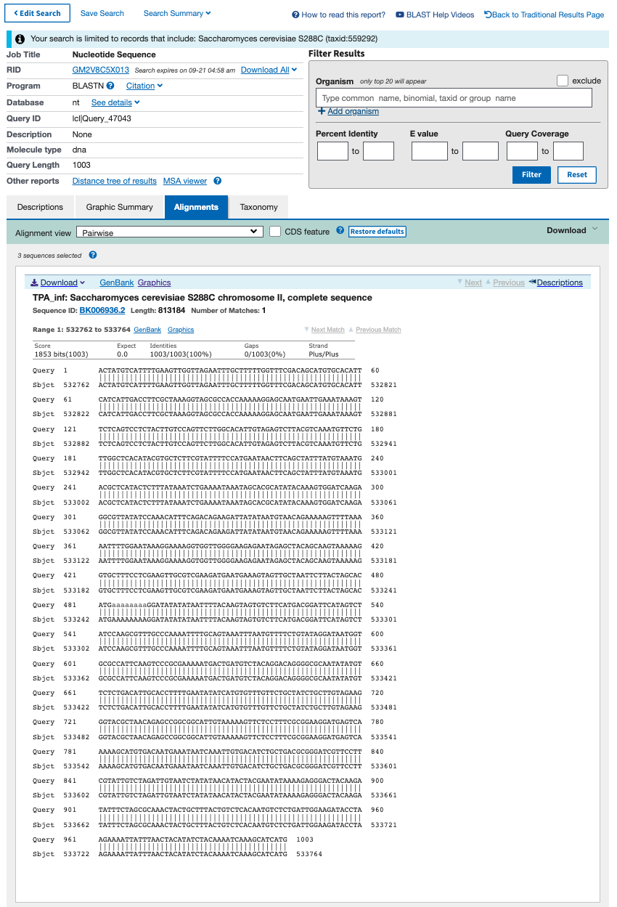

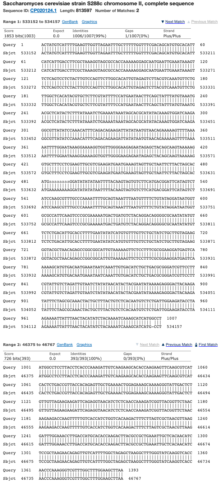

BLASTn says that this sequence exists at chromosome = chrII ,start = 532762, end = 533764. This is much further from the position of "YBL092W". Again I cannot make sense of their selection. They must be using a different genome.

### Selecting Gene Sequence - YBR089C-A upsteam five prime UTR intron

[SGD - YBR089C-A](https://www.yeastgenome.org/locus/S000002157)

```python
genome["YBR089C-A"]
>>>DnaSelectionResult(id=YBR089C-A, chromosome=2, strand=-, start=426190, end=426873,  seq=GTATGTAAGGCGCTGGGTGAGCCCAGCGGACGAGGATGGGCTTAATAAGAACGTACAGTTTAGCACAGCTAGAACAGGATACAGCTAAGGGCAACTCTGCTTTTCGGGAGAAGTTAAAGAGGGGTAGACAATGATGGTAATCTTATAAACCGGCTACAATGAAGGTTGTAGCAGCAAGGAAGATGATATTTTAATACGGTTCAGGTGAAATGAAATAGCCGCCCATAACGGCATGCTCAAGTTGTAAGTCAGGACTCTAGCTTTCTACTGTAGTATCCTCTAAAGGACTGCTGTTCTGTGCACCCCCTTCCTTTGTTTATCATAGCGCACGACAAGAGTACTAACTAATTAACTTAGAACATTAACATATATAAAACTAGCGCTATGGCCGCAACTAAAGAAGCAAAGCAACCAAAGGAACCAAAGAAGAGGACCACCAGGAGAAAGAAGGATCCTAACGCCCCTAAGAGGGGCTTGTCAGCTTATATGTTCTTTGCTAATGAAAACAGAGACATTGTCCGTTCCGAGAATCCTGACGTAACTTTTGGCCAAGTAGGCAGAATATTGGGTGAGAGGTGGAAGGCCTTAACTGCTGAAGAAAAGCAACCCTATGAATCTAAGGCTCAAGCAGACAAGAAGAGATACGAATCTGAAAAGGAATTGTACAATGCTACACGTGCTTGA)
```

```python
genome["YBR089C-A"].window_5utr(1000)
>>>DnaWindowResult(id='YBR089C-A', chromosome=2, strand='-', start_window=426873, end_window=427873, seq='CCGGCCCAGGGTTCTCTTGTGAAATCAATGATTTCTACGACTATGCTGAAAAGAGAGTAGCTGGTACTGACTTCCTAAAGGTCTGTAACGTCAGCAGTGTCAGTAACGTCACCGAATTGACCTTCTACTGGGACTGGAATACTACTCACTACAACGATACCCTATTAAAACAATAAATTGTATAAATAAATAATATTGCAAATATAAATAAATACCCATCGATTCTGATCTTCTTTTATGTACTAGTAGGGTAACGAGTTTGTAGATTAGCGGCAGAATGAAAAGAAAAAAGTTAACTAAAAAGTAAGAACAGCAAAGTTGATTGTAGTCTATATTGCTGAAATAGATATCGGAGCTCCCGTATAATATTAAAGTGCACCAAGAAAAGGATGTCGTTCTTTTTAAATAGTCTAAGGGGCAACCAGGAGGTCTCGCAAGAGAAGCTAGACGTTGCAGGAGTGCAATTCGATGCGATGTGCTCGACTTTCAACAATATTCTCAGTACGTGTCTTGAGAAATGTATTCCGCATGAGGGCTTTGGTGAGCCTGATCTAACGAAAGGTGAGCAATGCTGCATAGACAGATGTGTGGCAAAGATGCATTACAGCAATCGCCTCATTGGAGGATTTGTACAAACACGAGGTTTCGGGCCAGAGAATCAGCTACGACATTATTCGCGATTTGTGGCCAAAGAAATAGCTGATGATTCCAAAAAATAGCTGTAAATATGAGGACTGTCTGTGCTGTTTGTATATAATAGTAACCTGCATATATAGCATTATAAGCTGTGTAGACAATTTTAGAAGTACATTTATATGGTACCCGCACCTGGGTCACGTGCATTCCCCTCACCCGTTTTTTTAGGTGGTGTCTTTTTTGTTTTTTTTTTTAGGTGGCGCGGCAACTATAAAGTACAGCAAGTGAGGTTGAGGCAATACTGGGAGTTTACACTATGGGAGACAGCTCCTAACACCAAGCAGAAAAACGACTTTTTCGCAAA')
```

```python
# "SpeciesLM/data/Sequences/Annotation/Assembled/five_prime.parquet"
dataset_five_prime.loc[dataset_five_prime['gene_id'] == "YBR089C-A", "five_prime_seq"].iloc[0]
>>>"AAAGGATGTCGTTCTTTTTAAATAGTCTAAGGGGCAACCAGGAGGTCTCGCAAGAGAAGCTAGACGTTGCAGGAGTGCAATTCGATGCGATGTGCTCGACTTTCAACAATATTCTCAGTACGTGTCTTGAGAAATGTATTCCGCATGAGGGCTTTGGTGAGCCTGATCTAACGAAAGGTGAGCAATGCTGCATAGACAGATGTGTGGCAAAGATGCATTACAGCAATCGCCTCATTGGAGGATTTGTACAAACACGAGGTTTCGGGCCAGAGAATCAGCTACGACATTATTCGCGATTTGTGGCCAAAGAAATAGCTGATGATTCCAAAAAATAGCTGTAAATATGAGGACTGTCTGTGCTGTTTGTATATAATAGTAACCTGCATATATAGCATTATAAGCTGTGTAGACAATTTTAGAAGTACATTTATATGGTACCCGCACCTGGGTCACGTGCATTCCCCTCACCCGTTTTTTTAGGTGGTGTCTTTTTTGTTTTTTTTTTTAGGTGGCGCGGCAACTATAAAGTACAGCAAGTGAGGTTGAGGCAATACTGGGAGTTTACACTATGGGAGACAGCTCCTAACACCAAGCAGAAAAACGACTTTTTCGCAAAGTATGTAAGGCGCTGGGTGAGCCCAGCGGACGAGGATGGGCTTAATAAGAACGTACAGTTTAGCACAGCTAGAACAGGATACAGCTAAGGGCAACTCTGCTTTTCGGGAGAAGTTAAAGAGGGGTAGACAATGATGGTAATCTTATAAACCGGCTACAATGAAGGTTGTAGCAGCAAGGAAGATGATATTTTAATACGGTTCAGGTGAAATGAAATAGCCGCCCATAACGGCATGCTCAAGTTGTAAGTCAGGACTCTAGCTTTCTACTGTAGTATCCTCTAAAGGACTGCTGTTCTGTGCACCCCCTTCCTTTGTTTATCATAGCGCACGACAAGAGTACTAACTAATTAACTTAGAACATTAACATATATAAAACTAGCGCTATG"
```

```python
(str(genome.fasta_sequences[genome.chr_to_nc[2]].seq[257973 :258975]))
>>>'ATTAGTAAATTGCGCGGCGGGATATCCTGTTCTATAGACCTAAGGGACAACAAATCAAAATAGATGATTAAGAAAGTAAGTATTCAAAAACAAGTTGTAAATGAACTAACCTTCCTAACTTCGACGCGACCTTAAAACGTCGAAAAAAAACGAGAAAAAGTCATCATGAGACTATCGTATCTAATGACTGTGGCTTCTCCCAACAACCTTAGCGTCTGCGATGACGATATTTTGAAGAACAGTCAAATCCGTTTGAATAGTGCGCCACACAGGGATAATAATAGCACATTGGCATCTCCTTCTGTGAATGAAACACTTCTACCTGGGCTTCAAAGTCCCGCAACCTTTTAGTTACATAAAATTCGGCGGCTAAATCATGATATTATATTGATGGGTAATGTAGCGTTCAGTAAAACGGTTCCTATGTATTACTATCACGTGGGTGGGGAAGACCACATTCTTAGAGAAGAGTAATCATTTTAGCAGATTATTTTTACCTTTTTCAACTCATGAACTCATGTTCAAAGGTACAATATATTACCCTTTCTTCAAAGTATCCGAATGATTTGAACCGCACTCTGAGGGAGCCATCAAATTCTATTGAGCGACTTCGAATCGAACAATCCAATTAAATCAGCCTTTAGCGCCATATTTCTCCTTGTATCCATTGTTTACTTCTCCCTTGTATCTTGTATATGAGAATTATGGGAATAAGATAATTGTTGGGATTCCATTGTTTTCAAAGGCTGTAATATTAGGTACACAGATTATACTAGAAGTTCTTTTCGAGGATATAGGAATCCACAAAAGGAAATCGATAGTTATACATAATAATATTATTGTATCTTACTTCCTTTTATATGTTGTCACTCATTATTGTGTCGTGCATTCCATTAGATTGGATGACTGTTTCTCAATCTTTATGCCATCCTCTTACACCGCATGTGATATAATAGTAACATGAGTGCTGCGAAATAGATGATATTAAAATTTCATTCCAAC'
```

### Selecting Gene Sequence - YDL061C upsteam five prime UTR intron

[SGD - YDL061C](https://www.yeastgenome.org/locus/S000002219)

[[YDL061C Annotated|/notes/assets/sequence-docx/SpeciesLM-FASTA-S288c_Genome.docx]]

```python
# "SpeciesLM/data/Sequences/Annotation/Assembled/five_prime.parquet"
dataset_five_prime.loc[dataset_five_prime['gene_id'] == "YDL061C", "five_prime_seq"].iloc[0]
>>>"TTGTTTTGCCTTGTTTTTACGTTGCAATTTTGAAACTTGTTTGTCTGGTTTGCCAGTGCCCACGGGTTCTTTTTCCACTTTCCCCTTGTATAATCTTTTCAAAGCACCTTTAGAAGCATGTTTGGATTTGTAAGATTTGTGTCCGTTTTTTAATGATGACCTGTGTGAATGACCTGCCATTCTGATGCCTGCGTAAAACTACCGCTCTTCAACTAACAAATAAATTTCTGCGATTAATATCACAACTCATATCAACTTCTAACTCACACATTTTTTTACTGGTGATGAGATGAGCAGAACTGAAAATTTTTCTTAGCTGTAATTGAATATCGAGTCTACTTTTCCATCCGTACATTTTAACACCCAGTCCTAAGTAGGCCTATTTATTTCACTTGGGGGGAACATCTGGGTACTCTTTATAAAGATCTTCTCGCGTTGTACGAACAGCGCGGTGGAAAATGTTACATTTTGCCTGGGAAAGCGTCAAGTCTTAAAGGTATAACCGTCAGTACAAGAAGTGGTTATTAGGTATTGGGATTAGTAGTTTGAGAAATTCTTTGAAAGAAACTATAGCTAAATGTATGTGGAAACGCGGATTGAAGAGACAAGGGACGTGTATGCAGAATGAAGGAACAGCAGGAAAGTATCTGCGCTGATTTGGATTTGTAACTAAAATTTACAACTAAAAGAATTGAAAATTCGAGGAAAATATCTGTGGCTAGCAGTAGGGGGGAGCCTTTCTGGTGGCCCCATGGTGGAATAAGACGATGTGTTTATTGAATGTAGCAACAAGCATCAAACATCAACAAAGCTTCAAATTATGTCAAATACAATGAGCCATAGCATAAGCTTATATTTATTTCCTTTTAACTTCGATAGTCGAAAAATTCTATTGTACACGTCCATGGAACTCCTGGAAAACATAAAAACTGCAAAAATTATAATACTAACATTTTTCTATTCAATTTTGAAAACTTATTGGTTATAGAATATATACAAAATG"
```

```python
genome["YDL061C"].window(3000).seq
>>>'ACATGATCAATAAATTCAAATGATTCGGAACTCAAATCATAAATGAGATCAAGAGTGGTATTGAACAGATTAATTGGCAGTTTCTCGACACCATATTTTAATAGCTGTGAAATGACCTGAAAAATTTCATTTATTTTACTTTCCGTTAATATCTCATTAAGAATATCGTCGGATCCATTAGACAGAGCCACCACTAACGACAGTAAGTTATCGGCAAAATCGAATAACAACCTTTTAGATTCTATTTTGGATTTTCCTGCAGGTTTTAGCTGCGGTTGCTGTTCTGCTGCTTGCAAAGCGGATAACGATTCAACAATCCTGCCAAAATTACTTGTTATACTTGTCCATATATCAGATCTCCAAAGGTAGATTGACACATCATAACCTTCTTCCAAAGACAAGTTCCTTAATAAGCCGAACGACTCCACAACTATGTCCGAATTAGAATCGTTCAGCAATTTATTCAAAATGATAGGAACTAATTTCTCTTTCAGTAAAAGTTGTCTCATATGTGCATCCTCACAAAGAACACTGATGGAACTCAAAGCAATACTTCTATCATTAGGCACCACACTTGACAAATTCTGCAATAGCGGCTGGAGTTTTTTATTAACGACGTTGGTATCTTTATTATTGTCATTTGACCCAGCTTTGCGTAGTGGATTTAATCGAGACGAAGATGCTCTTGATCTTTTCTTTGATCTGCCCATTCTTTTCTGCCCTAAAAAGTCGATTTCTGCGTCCTTGTACAAACTCGAAAATCTGATCGAAAGTACTTGGAATCCAGTAAGAATAATGGGGGCGTTGCTACGAAGATTTAATTTTACAATACATAGACCTTTAAACAATGGTAGATAAATGGATGAGATGAGATGAGATGAGATGAGATGAGATGAAAAATTTTCTGAATAAGAGAACTACTCGTTCTAAATGATTATTGTACATTTTGCATAGAAAAATGGCAATAAACAGGGCAGTACTATTTCATCATCATCACTAAACATTAGTTGGCAAACTTATTAAGCCAACAGTACTTGTGACTAGAATTTTTTATTATATCGCCAATATTTAATGATAAACATAATATAGTAATACCAAAAATAATTATGATAACTTATACAAAAGAAGTGGAAAGAAAAGGAAAGAAGTAATCAAAGTAACTCAAAAAAGGTTAATGATTACGATGTTACAATCGCTCTTGACTTATCTGTACTTGTGGAAACCAATGTCGTTAGCCTTTTCTCTGAAACATTGACGACAGATGTTTAAGTCGTACTTTCTGACCAAACCAGTGTGGGAGGAGCAGACACGACATTGACGGGAACCTTTACCGAATCTTCTTGGGTGGGAGAACCAAACGTTTTCGTGAGCCATTTTGTATATATTCTATAACCAATAAGTTTTCAAAATTGAATAGAAAAATGTTAGTATTATAATTTTTGCAGTTTTTATGTTTTCCAGGAGTTCCATGGACGTGTACAATAGAATTTTTCGACTATCGAAGTTAAAAGGAAATAAATATAAGCTTATGCTATGGCTCATTGTATTTGACATAATTTGAAGCTTTGTTGATGTTTGATGCTTGTTGCTACATTCAATAAACACATCGTCTTATTCCACCATGGGGCCACCAGAAAGGCTCCCCCCTACTGCTAGCCACAGATATTTTCCTCGAATTTTCAATTCTTTTAGTTGTAAATTTTAGTTACAAATCCAAATCAGCGCAGATACTTTCCTGCTGTTCCTTCATTCTGCATACACGTCCCTTGTCTCTTCAATCCGCGTTTCCACATACATTTAGCTATAGTTTCTTTCAAAGAATTTCTCAAACTACTAATCCCAATACCTAATAACCACTTCTTGTACTGACGGTTATACCTTTAAGACTTGACGCTTTCCCAGGCAAAATGTAACATTTTCCACCGCGCTGTTCGTACAACGCGAGAAGATCTTTATAAAGAGTACCCAGATGTTCCCCCCAAGTGAAATAAATAGGCCTACTTAGGACTGGGTGTTAAAATGTACGGATGGAAAAGTAGACTCGATATTCAATTACAGCTAAGAAAAATTTTCAGTTCTGCTCATCTCATCACCAGTAAAAAAATGTGTGAGTTAGAAGTTGATATGAGTTGTGATATTAATCGCAGAAATTTATTTGTTAGTTGAAGAGCGGTAGTTTTACGCAGGCATCAGAATGGCAGGTCATTCACACAGGTCATCATTAAAAAACGGACACAAATCTTACAAATCCAAACATGCTTCTAAAGGTGCTTTGAAAAGATTATACAAGGGGAAAGTGGAAAAAGAACCCGTGGGCACTGGCAAACCAGACAAACAAGTTTCAAAATTGCAACGTAAAAACAAGGCAAAACAATTAAGGGCCCAAAGGATCTTGGATTCCATTGAAAACAGGAAATTATTCGAAGGAAAAAATGGCGCTGCCAAAATCATTACTATTGTTCCGTTAGTGAATGATTTAGACCCATTGGACATTCTTTACAAGCTATTAAAGTGTGCAGATGATGAAGGAATCATGGTGCAGGAAGTAGACTCAAAACGTATATTTAATGTTCATATAAAGAAGTTTAAAAGCAATCTTAAAATCATAATTCCAGACATGACCAATTTTTTGAACATTTTAGATTGCGCTAAAGTAGCAGACTTTGTTGTGTTTGGGCTCAGTGGTGTCCAAGAAGTCGATGAAGAATTTGGTGAGCAGATCATCCGTGCGTTAGAACTACAAGGTATTGCTTCATATATCGGTGTCATAAGCAACCTCTCAGCAGTCCATGAAAAGGAGAAATTCCAATTGGATGTCAAGCAATCCTTAGAAAGTTATTTCAAGCACTTTTTCCCAAGTGAAGAACGTGTTTATAATTTGGAAAAAAACTCAGACGCTTTAAACGTCTTGAGAACATTGTGCCAGAGGCTACCAAGATCAATCAATTGGAGAGACAATAGAGGTTACGTAGTCGCTGACTTTGTTGATTTCGTTGAAAC'
```

### Selecting Gene Sequence - YAL037W Normal Gene Selection

[SGD - YAL037W](https://www.yeastgenome.org/locus/S000000035)

[[YAL037W Annotated|/notes/assets/sequence-docx/SpeciesLM-FASTA-S288c_Genome.docx]]

```python
# Gene YAL037W from the Fungal UTR five prime data
# output is actually a pandas Series not str
# "SpeciesLM/data/Sequences/Annotation/Assembled/five_prime.parquet"
dataset_five_prime.loc[0,'five_prime_seq']
>>>'CCAAGTACAGACCAAACTGTCCAATCATCTTGGTTACCAGATGCCCAAGAGCTGCTAGATTCTCTCACTTGTACAGAGGTGTCTTCCCATTCGTTTTCGAAAAGGAACCTGTCTCTGACTGGACTGATGATGTTGAAGCCCGTATCAACTTCGGTATTGAAAAGGCTAAGGAATTCGGTATCTTGAAGAAGGGTGACACTTACGTTTCCATCCAAGGTTTCAAGGCCGGTGCTGGTCACTCCAACACTTTGCAAGTCTCTACCGTTTAAAAAAAGAATCATGATTGAATGAAGATATTATTTTTTTGAATTATATTTTTTAAATTTTATATAAAGACATGGTTTTTCTTTTCAACTCAAATAAAGATTTATAAGTTACTTAAATAACATACATTTTATAAGGTATTCTATAAAAAGAGTATTATGTTATTGTTAACCTTTTTGTCTCCAATTGTCGTCATAACGATGAGGTGTTGCATTTTTGGAAACGAGATTGACATAGAGTCAAAATTTGCTAAATTTGATCCCTCCCATCGCAAGATAATCTTCCCTCAAGGTTATCATGATTATCAGGATGGCGAAAGGATACGCTAAAAATTCAATAAAAAATTCAATATAATTTTCGTTTCCCAAGAACTAACTTGGAAGGTTATACATGGGTACATAAATGCAGATGCCAGTGAACTATGTTCAGCTTCTGGCCTTCGTTTGGTGGTTTAATCTATTTTTTATAAAAAATGACGCGGGCAGATTCAATTAGTGTCCTAAATTTATTCGCGTTTCAAGATTTCAAAGGATTGATCCTCTTATCAGAAACGATAAGTGCTACTCCGTCCTATTCTTCTAGCCATCTAGTACGTATTCTTTTCATAACATAATCCCTTATTTACAGAATGTGTTTCGAAGAAAAATTAATTAGATGGGAAGAAAACTGAAGTGGCTTATATAATCAGTGACATAGTGCCAATAATTACGCAAAAAGCAAAGGAAATAACACTGCTATG'
```

The entire selection is contained within my `genome['YAL037W'].window(3000)`.

The `five_prime_UTR_intron` is `408bp`

```python
genome['YAL037W'].window(3000)
>>>DnaWindowResult(id='YAL037W', chromosome=1, strand='+', start_window=72921, end_window=75921, seq='CGAAACCGTCGCTGCCTCCGCTGTCGCTGCTGTTTTCGAACAAAAGGCCAAGGCTATCATTGTCTTGTCCACTTCCGGTACCACCCCAAGATTGGTTTCCAAGTACAGACCAAACTGTCCAATCATCTTGGTTACCAGATGCCCAAGAGCTGCTAGATTCTCTCACTTGTACAGAGGTGTCTTCCCATTCGTTTTCGAAAAGGAACCTGTCTCTGACTGGACTGATGATGTTGAAGCCCGTATCAACTTCGGTATTGAAAAGGCTAAGGAATTCGGTATCTTGAAGAAGGGTGACACTTACGTTTCCATCCAAGGTTTCAAGGCCGGTGCTGGTCACTCCAACACTTTGCAAGTCTCTACCGTTTAAAAAAAGAATCATGATTGAATGAAGATATTATTTTTTTGAATTATATTTTTTAAATTTTATATAAAGACATGGTTTTTCTTTTCAACTCAAATAAAGATTTATAAGTTACTTAAATAACATACATTTTATAAGGTATTCTATAAAAAGAGTATTATGTTATTGTTAACCTTTTTGTCTCCAATTGTCGTCATAACGATGAGGTGTTGCATTTTTGGAAACGAGATTGACATAGAGTCAAAATTTGCTAAATTTGATCCCTCCCATCGCAAGATAATCTTCCCTCAAGGTTATCATGATTATCAGGATGGCGAAAGGATACGCTAAAAATTCAATAAAAAATTCAATATAATTTTCGTTTCCCAAGAACTAACTTGGAAGGTTATACATGGGTACATAAATGCAGATGCCAGTGAACTATGTTCAGCTTCTGGCCTTCGTTTGGTGGTTTAATCTATTTTTTATAAAAAATGACGCGGGCAGATTCAATTAGTGTCCTAAATTTATTCGCGTTTCAAGATTTCAAAGGATTGATCCTCTTATCAGAAACGATAAGTGCTACTCCGTCCTATTCTTCTAGCCATCTAGTACGTATTCTTTTCATAACATAATCCCTTATTTACAGAATGTGTTTCGAAGAAAAATTAATTAGATGGGAAGAAAACTGAAGTGGCTTATATAATCAGTGACATAGTGCCAATAATTACGCAAAAAGCAAAGGAAATAACACTGCTATGGATATGGAAATCGAAGATTCAAGCCCCATAGATGACCTGAAGTTACAAAAACTGGATACCAATGTTTATTTTGGACCCTGTGAGATATTGACACAACCTATTCTTTTGCAATATGAAAATATTAAGTTCATCATTGGTGTCAATCTAAGTACTGAAAAGATAGCGTCGTTTTATACCCAGTATTTCAGGAACTCTAATTCGGTAGTCGTGAATCTTTGCTCACCAACTACAGCAGCAGTAGCAACAAAGAAGGCCGCAATTGATTTGTATATACGAAACAATACAATACTACTACAGAAATTCGTTGGACAGTACTTGCAGATGGGCAAAAAGATAAAAACATCTTTAACACAGGCACAAACCGATACAATCCAATCACTGCCCCAGTTTTGTAATTCGAATGTCCTCAGTGGTGAGCCCTTGGTACAGTACCAGGCATTCAACGATCTGTTGGCACTCTTTAAGTCATTTAGTCATTTTGGAAATATCTTGGTTATATCATCACATTCCTATGATTGCGCACTTCTCAAATTTCTTATTTCCAGGGTGATGACCTACTATCCACTAGTGACCATCCAGGATTCTTTGCAATATATGAAAGCAACCCTGAACATATCCATCAGTACATCCGATGAGTTCGATATTCTGAATGATAAAGAACTGTGGGAGTTTGGCCAAACCCAGGAAATTCTAAAACGTAGGCAGACGAGCTCAGTCAAGAGGAGATGTGTCAATTTACCAGAAAACTCTACGATCGATAACAGAATGCTTATGGGTACCACAAAGCGAGGTCGCTTTTGAAGAGCCCTCGGTAGCATAACATTTTTAATTATTACGACTGTTTTTTTTATTCATTATGTAGAGATAATTAAATGTTATAGATGCTCTATACTCAAACGGTGGAAGAAAAACAGCGAAAAAAAATAACCGATACCCCCTTTTCGAATACAAATGCTTGTATATTCAATTATGAATTATTTTTTTTTTTTTTCATTTCTTATATTATTTTTTGTTCGAGAATCACTTTTTCAAGATGGTAACAACATCTTCGTCTTCCAAAATGTGACTCAACCCCACGTATTGAGGTTGATGTTTGACACTGCTACCGTAAACCAGAGCATTTCTAAAGTCGTCCACTAAAGATTTATGAATTTGGTTACAAAAATCCTTGACACTGCAACGGTCTGATCTTAGCACCACAGGGTCGGTAAAATCTGGTATTTGGCCCTTTGGTTTAGTGTAAATACGGACTAGATTTAGTCTATCCCACATGACTTGCAACAGCTCGTCCAAGTTCCAATCTTGACCAGACGAAATAGGCACGGCATTAGGAATTCGGTAAAGTAATTCCAATTCCTCTATTGACAGAGAATCAATCTTGTTTAACACATAGATGGCAGGCATGTATCTTCTTGACGAAGCTTCCAAAACATCAATCAAATCATCCACAGTGGCATCACACCTGAAGGCAATCTCAGCGCTATTTATTCTGTACTCGCTCATAACGGCTCTGATTTCGTCATTCCCCAGATGGGTCAATGGGACTGTGTTTGTGATGGAAATACCACCTTTCTCTTTTTTTTTGATCAAGATATCTGGCGGAGTTTTATTCAGACGAATCCCCACACCTTCCAGTTCCTTCTCAATGATTTGCTTATGATGCAAGGGTTTGTTCACATCTAGGATGATAAATAACAGGTTACAGGTTCTTGCCACGGCAATAACTTGCTTACCTCTACCTCTACCATCCTTAGCACCATCGATAATACCAGGTAAATCCAACATTTGGATCTTGGCACCTTTATAACGAATGACACCGGGGACGGTAACCAGGGTGGTAAACTCGTACTCAGCTGCTTCAGACTCAGTACCAGTCAACTTGGACAGTAATGTAGATTT')
```

### Selecting Gene Sequence - Genes with Multiple CDS

Number of genes with multiple CDS: 1459

[[S288C_genes_multiple_CDS|dendron://torchcell/experiments.s288c_genes_multiple_CDS]]

`"data/sgd/genome/S288C_reference_genome_R64-3-1_20210421/orf_coding_all_R64-3-1_20210421.fasta"`

Eliminated newlines from `fsa`.

```fsa
>YAL003W EFB1 SGDID:S000000003, Chr I from 142174-142253,142620-143160, Genome Release 64-3-1, Verified ORF, "Translation elongation factor 1 beta; stimulates nucleotide exchange to regenerate EF-1 alpha-GTP for the next elongation cycle; part of the EF-1 complex, which facilitates binding of aminoacyl-tRNA to the ribosomal A site; human homolog EEF1B2 can complement yeast efb1 mutants"
ATGGCATCCACCGATTTCTCCAAGATTGAAACTTTGAAACAATTAAACGCTTCTTTGGCTGACAAGTCATACATTGAAGGTACTGCTGTTTCTCAAGCTGACGTCACTGTCTTCAAGGCTTTCCAATCTGCTTACCCAGAATTCTCCAGATGGTTCAACCACATCGCTTCCAAGGCCGATGAATTCGACTCTTTCCCAGCTGCCTCTGCTGCCGCTGCCGAAGAAGAAGAAGATGACGATGTCGATTTATTCGGTTCCGACGATGAAGAAGCTGACGCTGAAGCTGAAAAGTTGAAGGCTGAAAGAATTGCCGCATACAACGCTAAGAAGGCTGCTAAGCCAGCTAAGCCAGCTGCTAAGTCCATTGTCACTCTAGATGTCAAGCCATGGGATGATGAAACCAATTTGGAAGAAATGGTTGCTAACGTCAAGGCCATCGAAATGGAAGGTTTGACCTGGGGTGCTCACCAATTTATCCCAATTGGTTTCGGTATCAAGAAGTTGCAAATTAACTGTGTTGTCGAAGATGACAAGGTTTCCTTGGATGACTTGCAACAAAGCATTGAAGAAGACGAAGACCACGTCCAATCTACCGATATTGCTGCTATGCAAAAATTATAA
```

[SGD - YAL003W](https://www.yeastgenome.org/locus/S000000003)

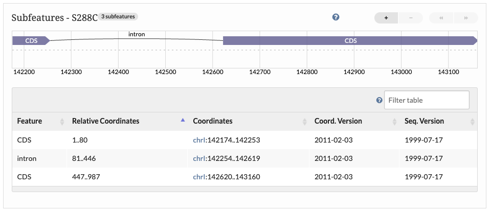

### Selecting Gene Sequence - Genes with 2 CDS and First CDS is 1bp

These genes have no start codon because they have a `1bp` CDS. Neither CDS has a start codon. This case is unsolvable in the sense of guaranteeing that the genes has a start and stop codon. We satisfy our desired output by making sure all CDS DNA are contained in the selection and allow these four genes to go without a start codon.

[SGD - YIL111W](https://www.yeastgenome.org/locus/S000001373)

[SGD - YJL041W](https://www.yeastgenome.org/locus/S000003577)

[SGD - YMR242C](https://www.yeastgenome.org/locus/S000004855)

[SGD - YOR312C](https://www.yeastgenome.org/locus/S000005839)

Eliminated newlines in `fsa`.

[[YIL111W Annotated|/notes/assets/sequence-docx/SpeciesLM-FASTA-S288c_Genome.docx]]

```fsa
>COX5B YIL111W SGDID:S000001373, Chromosome IX:155222..155765
AGCATGTATAACAAACACTGATTTTTGTTTTGAGTTTTAAAAGATATCCATTTACTAACATTCGAGGTGTACAAGCACAAGTTTTGCAGTGTTGCGTACTTCTCTTACTAAAGGGGCACGGCTAACTGGGACAAGATTTGTTCAAACAAAGGCCCTTTCGAAGGCAACATTGACAGATCTGCCCGAAAGATGGGAAAATATGCCAAACTTAGAACAGAAAGAGATTGCAGATAATTTGACAGAACGTCAAAAGCTTCCATGGAAAACTCTCAATAACGAGGAAATCAAAGCAGCTTGGTACATATCCTACGGCGAGTGGGGACCTAGAAGACCTGTACACGGAAAAGGCGATGTTGCATTTATAACTAAAGGAGTATTTTTAGGGTTAGGAATCTCATTTGGGCTCTTTGGTTTAGTGAGACTATTAGCCAATCCTGAAACTCCAAAGACTATGAACAGGGAATGGCAGTTGAAATCAGACGAGTATCTGAAGTCAAAAAATGCCAATCCTTGGGGAGGTTATTCTCAAGTTCAATCTAAATAA
```

```python
# "SpeciesLM/data/Sequences/Annotation/Assembled/five_prime.parquet"
dataset_five_prime.loc[dataset_five_prime['gene_id'] == "YIL111W", "five_prime_seq"].iloc[0]
>>>"AAAAACGATAAATTTGTGCTCGACTTGCAAGTAATGATATTGTTGAAGGATATCGACTTGCTCTCAAAGGACAACCAACCAACTTCTGAGAAGATTCCCGTCGATCCCTCGCACCTGACTCCATTGTGGAATATGTTGAAATTCATTTTCCTGTATGGAGGTAGTTATGATGATAAAAAGAACAACATGGAAAATAAAAGATATGTTGTAAACTTTGATGGGGTTGATTTGGACACAAAGATTGGGTATGAGCTTTTGGAGTACAAAAAATTTGTTAGTTTGCCCATGGCGTGGATTAAATGGGATAACGTTGTTATTGAAAACCACGCAAAAAGAAAAGAAATTGAAGGAAATATGATTCAAATATCAATAAACGAATTTGCACGATGGAGAAACGATAAGCTGAACAAAGCGCAGCAGCCGACGCGCAAACAGCGTTCTCTAAAAATACCTCGAGAGTTACCGGTTAAATTTCAACACCGTATGAGCATATCCTCCGTCCTCCAGCAGACATCCAAAGAACCATTTTGGTAAAACAATTCATCGGTCCGTTGGCATATGCTCATACATAGTTGCATTTTCGATTCATTAAATACTATTCATGTTAACATAATTCCATATAATCGTACTGTTTTGTCATTATTATATCGGCATGACACTCACCAATTTCTTTTTTTGATTTTGTATTGTTCGATAAGGCAACGAACGAGTACTCGAAAAAATGTCATGGACCCCTTAAAATTACTGAGGGGTTCAGAAAATACCGTGCAAAAGACGAAAAAAGACGAATTTCATTTGATTTATATTTTATAAATGACTGTTGCATTAAACAATAGACCAATTATTTCAATTTAATATTCTTTGCAGGAAACTTTCACAATGGAATAACGCCACATATTCATTGTAAAGAGCATGTATAACAAACACTGATTTTTGTTTTGAGTTTTAAAAGATATCCATTTACTAACATTCGAGGTGTACAAGCACAAGTTTTGCAGTGTTG"
```

[[S288c_stop_start_codons|dendron://torchcell/experiments.s288c_stop_start_codons]]

```python
no_start_codon
>>>['YIL111W', 'YJL041W', 'YMR242C', 'YOR312C']
```

### Selecting Gene Sequence - Genes Using CDS Sequence

For 24 genes we used some logic that is a bit convoluted to use the CDS sequence in an attempt to select the portion of the gene that begins with a start codon and ends with a stop codon. This logic is contained in the `__post_init__`.

```bash
YBL072C - Using CDS Sequence
YBL092W - Using CDS Sequence
YBR089C-A - Using CDS Sequence
YDL061C - Using CDS Sequence
YDL137W - Using CDS Sequence
YDL189W - Using CDS Sequence
YDR099W - Using CDS Sequence
YER102W - Using CDS Sequence
YER131W - Using CDS Sequence
YFR032C-A - Using CDS Sequence
YGL031C - Using CDS Sequence
YGL187C - Using CDS Sequence
YGL189C - Using CDS Sequence
YGR027C - Using CDS Sequence
YGR148C - Using CDS Sequence
YIL123W - Using CDS Sequence
YJL130C - Using CDS Sequence
YKL150W - Using CDS Sequence
YKL186C - Using CDS Sequence
YLR333C - Using CDS Sequence
YLR367W - Using CDS Sequence
YLR388W - Using CDS Sequence
YNL066W - Using CDS Sequence
YPL230W - Using CDS Sequence
```

### Selecting Gene Sequence - A well behaved gene YAL068C

Removed newline from fasta

```fasta
>PAU8 YAL068C SGDID:S000002142, Chromosome I:1807..2169
ATGGTCAAATTAACTTCAATCGCCGCTGGTGTCGCTGCCATCGCTGCTACTGCTTCTGCAACCACCACTCTAGCTCAATCTGACGAAAGAGTCAACTTGGTGGAATTGGGTGTCTACGTCTCTGATATCAGAGCTCACTTAGCCCAATACTACATGTTCCAAGCCGCCCACCCAACTGAAACCTACCCAGTCGAAGTTGCTGAAGCCGTTTTCAACTACGGTGACTTCACCACCATGTTGACCGGTATTGCTCCAGACCAAGTGACCAGAATGATCACCGGTGTTCCATGGTACTCCAGCAGATTAAAGCCAGCCATCTCCAGTGCTCTATCCAAGGACGGTATCTACACTATCGCAAACTAG
```

## Adding Protein to Genome

- Automatic download of `orf_trans_all.fasta`. These contain the proper proteins without having to reconstruct them via translation. This is better than using `Bio.Seq` `translate` function since this foces us to deal directly with introns. Can do something like `genome[gene].protein`
- [orf protein](http://sgd-archive.yeastgenome.org/sequence/S288C_reference/orf_protein)

## S288C DNA length for DNA LLMs

Around 32 genes are under 6kb... need to find a way around this. Also made mistake thinking the nucleotide transformer could handle 60kb... whoops. We can still use the Enformer for these large windows. Could also use 3 embeddings to capture the gene with nt transformer. Looks like this is the largest gene in yeast `YKR054C, length: 12278`

## Gene class looks more like ORF

This is actually looks more like an ORF since we care most about seq between start and stop codons. We should be able to move most of the Gene methods into the `ABC` then require an `abstractmethod` for setup where defining dictionaries etc.

## SpeciesLM FASTA S288c Genome Comparison for GitHub Issue

[[Annotated Docx|/notes/assets/sequence-docx/SpeciesLM-FASTA-S288c_Genome.docx]]

Updated 2023.09.24

### SpeciesLM FASTA S288c Genome Comparison for GitHub Issue - YAL037W

[[Selecting Gene Sequence - YAL037W Normal Gene Selection|dendron://torchcell/torchcell.sequence.genome.scerevisiae.s288c#selecting-gene-sequence---yal037w-normal-gene-selection]]

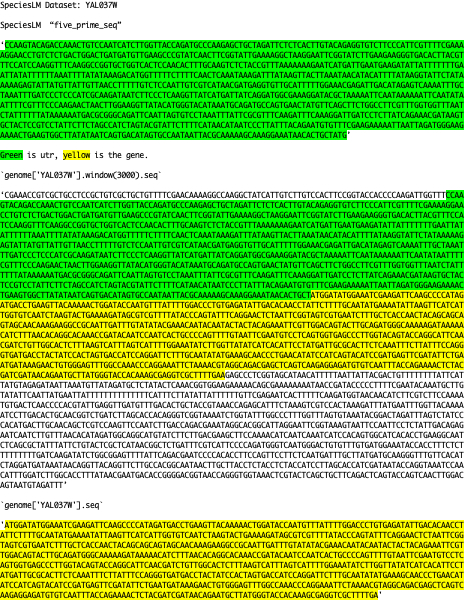

### SpeciesLM FASTA S288c Genome Comparison for GitHub Issue - YDL061C

[[Selecting Gene Sequence - YDL061C upsteam five prime UTR intron|dendron://torchcell/torchcell.sequence.genome.scerevisiae.s288c#selecting-gene-sequence---ydl061c-upsteam-five-prime-utr-intron]]

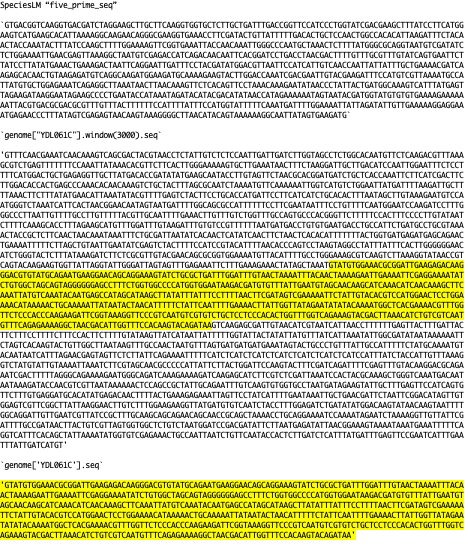

### SpeciesLM FASTA S288c Genome Comparison for GitHub Issue - YIL111W

[[Selecting Gene Sequence - Genes with 2 CDS and First CDS is 1bp|dendron://torchcell/torchcell.sequence.genome.scerevisiae.s288c#selecting-gene-sequence---genes-with-2-cds-and-first-cds-is-1bp]]

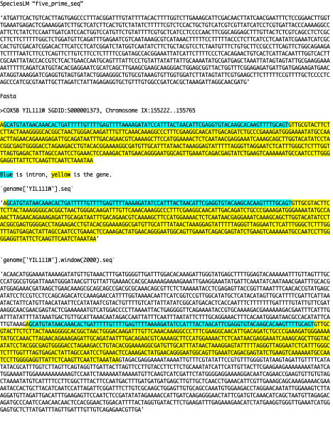

### SpeciesLM FASTA S288c Genome Comparison for GitHub Issue - YBL092W

[[Selecting Gene Sequence - YBL092W upsteam five prime UTR intron|dendron://torchcell/torchcell.sequence.genome.scerevisiae.s288c#selecting-gene-sequence---ybl092w-upsteam-five-prime-utr-intron]]

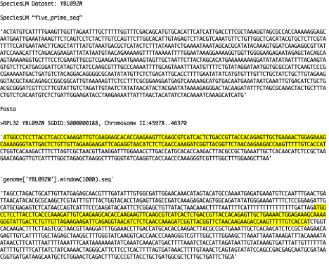

## SpeciesLM FASTA S288c Genome Comparison GitHub Issue Response with Correct Query

Updated 2023.09.25

[[Annotated Docx|/notes/assets/sequence-docx/SpeciesLM-FASTA-S288c_Genome.docx]]

### SpeciesLM FASTA S288c Genome Comparison GitHub Issue Response with Correct Query - YAL037W

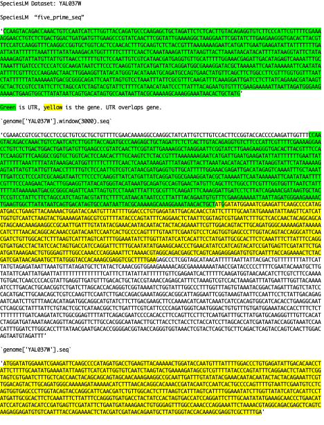

Looks good

### SpeciesLM FASTA S288c Genome Comparison GitHub Issue Response with Correct Query - YDL061C

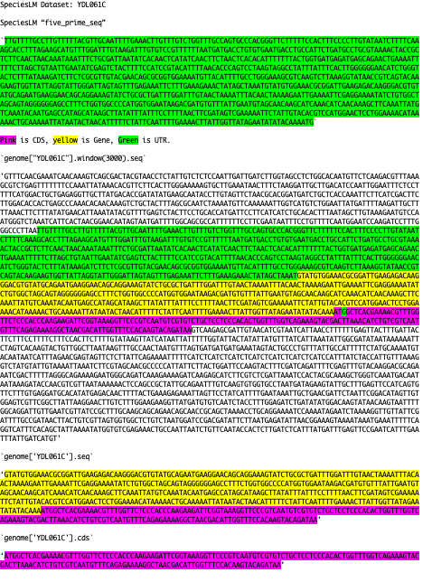

Looks good but actually ignores the annotated UTR of the gene and takes CDS.

### SpeciesLM FASTA S288c Genome Comparison GitHub Issue Response with Correct Query - YIL11W

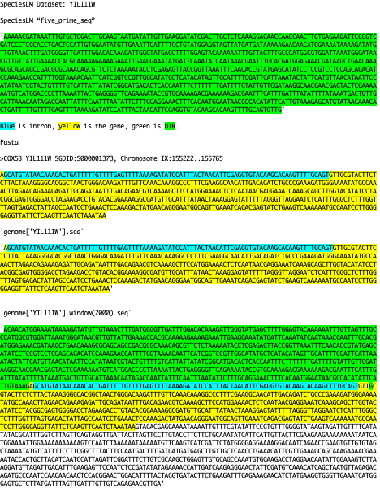

Need to know logic here. Gene has one intron and a single `bp` CDS. How was the position to start the UTR determined? Is it an issue that this CDS doesn't start with a start codon?

## S288c Genes Without 1003 bp Upstream

```python
not_1003_upstream = ['YAL068W-A', 'YAL069W', 'YBL113W-A', 'YCR108C', 'YDR545C-A', 'YEL077W-A', 'YER190C-B', 'YFL067W', 'YFL068W', 'YGR296C-B', 'YHL050W-A', 'YHR219C-A', 'YIL177W-A', 'YJL225W-A', 'YJR162C', 'YKL225W', 'YLL067W-A', 'YLR467C-A', 'YML133W-B', 'YMR326C', 'YNL339W-B', 'YNR077C', 'YOL166W-A', 'YOR396C-A']
```

### SpeciesLM Five Prime S288c Genes Less Than 1003 bp

`dataset_five_prime` reads "SpeciesLM/data/Sequences/Annotation/Assembled/five_prime.parquet".

24 genes total

```python
>>> print({i:len(dataset_five_prime.loc[dataset_five_prime['gene_id'] == i, "five_prime_seq"].iloc[0]) for i in not_1003_upstream})
{'YAL068W-A': 540
'YAL069W': 337
'YBL113W-A': 648
'YCR108C': 435
'YDR545C-A': 594
'YEL077W-A': 632
'YER190C-B': 715
'YFL067W': 838
'YFL068W': 55
'YGR296C-B': 715
'YHL050W-A': 813
'YHR219C-A': 965
'YIL177W-A': 848
'YJL225W-A': 831
'YJR162C': 493
'YKL225W': 453
'YLL067W-A': 845
'YLR467C-A': 648
'YML133W-B': 829
'YMR326C': 632
'YNL339W-B': 736
'YNR077C': 795
'YOL166W-A': 587
'YOR396C-A': 797}
```

### Window Five Prime S288c Genes Less Than 1003 bp

26 genes total

```python
>>>print(
    {
        gene: len(
            genome[gene]
            .window_five_prime(1003, include_start_codon=True, allow_undersize=True)
            .seq
        )
        for gene in genome.gene_set
        if len(
            genome[gene]
            .window_five_prime(1003, include_start_codon=True, allow_undersize=True)
            .seq
        )
        < 1003
    }
)
{'YAL068W-A': 540, 'YAL069W': 337, 'YBL113W-A': 648, 'YCR108C': 435, 'YDR545C-A': 594, 'YEL077W-A': 632, 'YER190C-B': 715, 'YFL067W': 838, 'YFL068W': 55, 'YGR296C-B': 715, 'YHL050W-A': 813, 'YHR219C-A': 965, 'YIL177W-A': 848, 'YJL225W-A': 831, 'YJR162C': 493, 'YKL225W': 453, 'YLL067W-A': 845, 'YLR467C-A': 648, 'YML133W-B': 829, 'YMR326C': 632, 'YNL339W-B': 736, 'YNR077C': 795, 'YOL166W-A': 587, 'YOR396C-A': 797, 'YPL283W-B': 645, 'YPR204C-A': 731}
```

### Window Three Prime S288c Genes Less Than 300 bp

5 genes total. We don't really need to worry about these becuase [[Fungal_up_down_transformer|dendron://torchcell/torchcell.models.fungal_up_down_transformer]] can encode them.

```python
>>>print(
    {
        gene: len(
            genome[gene]
            .window_three_prime(300, include_stop_codon=True, allow_undersize=True)
            .seq
        )
        for gene in genome.gene_set
        if len(
            genome[gene]
            .window_three_prime(300, include_stop_codon=True, allow_undersize=True)
            .seq
        )
        < 300
    }
)
{'YBL113C': 282, 'YDR545W': 225, 'YEL077C': 266, 'YLR467W': 282, 'YPL283C': 282}
```

## DDP sqlite gff error

This solves some of the issues with `ddp` but I think it general it is a bad setting. Default to overwriting is a better setting so you don't do a bunch of manipulations to a genome and then accidentally load this genome. We could save strains as a path taken from a given genome.

```python
if os.path.exists(db_path):
    self.db = gffutils.FeatureDB(db_path)
else:
self.db = gffutils.create_db(
    self._gff_path,
    dbfn=db_path,
    force=True,
    keep_order=True,
    merge_strategy="merge",
    sort_attribute_values=True,
)
```

## 6 Pseudogenes From cmd F orf_trans_all_R64-4-1_20230830.fasta

SGD YAR064W Pseudogene with Regulation Interactions. We should keep genes if there are in anyway tied to other genes via any of the biological networks. This isn't absolutely necessary, but for now it is a nice heuristic with yeast.

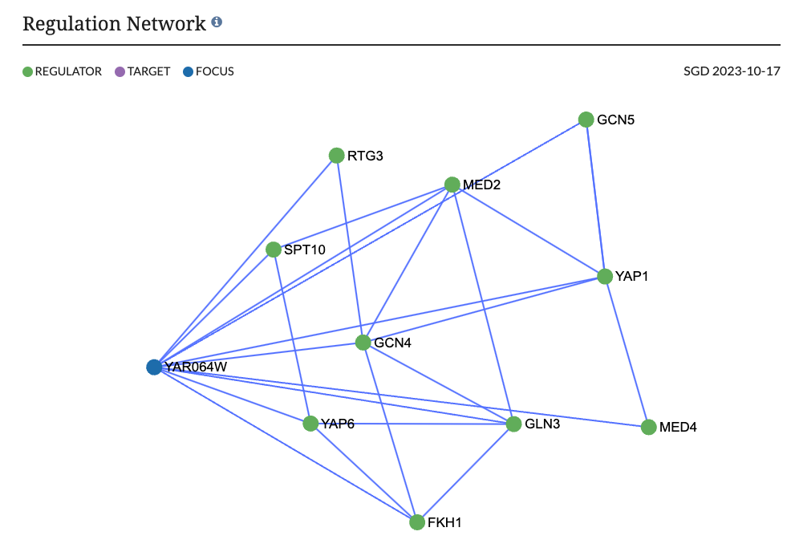

## Dubious ORFs are Unlikley to Encode an Expressed Protein

According to the [Yeast OrFan Gene Project](https://www.yeastorfanproject.com/orfans/) dubious open reading frames are unlikely to encode an expressed protein and should therefore not be encoded by the protein language models for embedding proteins.

```python
>>> load_dotenv()
>>> DATA_ROOT = os.getenv("DATA_ROOT")
>>>
>>> genome = SCerevisiaeGenome(
>>>     data_root=osp.join(DATA_ROOT, "data/sgd/genome"), overwrite=True
>>> )
>>> orf_classes = []
>>> for gene in genome.gene_set:
>>>     orf_classes.append(genome[gene].orf_classification[0])
>>> print(pd.Series(orf_classes).value_counts())

Verified           5255
Dubious             684
Uncharacterized     668
Name: count, dtype: int64
```

## 2025.05.14 - Adding GO from Gene Ontology Source

```python
    def remove_deprecated_go_terms(self):
        # Create a list to hold updated features
        updated_features = []

        # Iterate over each feature in the database
        invalid_go_terms = {"not_in_go_dag": [], "obsolete": []}
        for feature in self.db.features_of_type("gene"):
            # Check if the feature has the "Ontology_term" attribute
            if "Ontology_term" in feature.attributes: # FLAG BREAKPOINT HERE
                # Filter out deprecated GO terms
                valid_onto_terms = []
                valid_go_terms = []
                for term in feature.attributes["Ontology_term"]:
                    if term.startswith("GO:"):
                        if term not in self.go_dag:
                            invalid_go_terms["not_in_go_dag"].append(term)
                        elif self.go_dag[term].is_obsolete:
                            invalid_go_terms["obsolete"].append(term)
                        else:
                            valid_go_terms.append(term)
                    else:
                        valid_onto_terms.append(term)
                # Update the "Ontology_term" attribute for the feature
                if valid_go_terms:
                    feature.attributes["Ontology_term"] = (
                        valid_go_terms + valid_onto_terms
                    )
                else:
                    del feature.attributes["Ontology_term"]

                # Add the updated feature to the list
                updated_features.append(feature)

        # Update all features in the database at once
        self.db.update(updated_features, merge_strategy="replace")

        # Commit the changes to the database
        self.db.conn.commit()
```

```python
feature.attributes
<gffutils.attributes.Attributes object at 0x17ef51010>
special variables
function variables
_MutableMapping__marker =
<object object at 0x104b34150>
_abc_impl =
<_abc._abc_data object at 0x108a0b940>
_d =
{'ID': ['YAL069W'], 'Name': ['YAL069W'], 'Ontology_term': ['GO:0003674', 'GO:0005575', 'GO:0008150', 'SO:0000704'], 'Note': ['Dubious open reading frame; unlikely to encode a functional protein, based on availab...experimental and comparative sequence data'], 'display': ['Dubious open reading frame'], 'dbxref': ['SGD:S000002143'], 'orf_classification': ['Dubious'], 'curie': ['SGD:S000002143']}
special variables
function variables
'ID' =
['YAL069W']
'Name' =
['YAL069W']
'Ontology_term' =
['GO:0003674', 'GO:0005575', 'GO:0008150', 'SO:0000704']
'Note' =
['Dubious open reading frame; unlikely to encode a functional protein, based on availab...experimental and comparative sequence data']
'display' =
['Dubious open reading frame']
'dbxref' =
['SGD:S000002143']
'orf_classification' =
['Dubious']
'curie' =
['SGD:S000002143']
len() =
```

## 2025.09.10 - alias_to_systematic vs gene_attribute_table

### Key Differences

#### 1. **alias_to_systematic** (property method, lines 216-228)

- **Source**: Built from gene objects' `alias` field which contains multiple aliases per gene
- **Structure**: Dict mapping alias → List[systematic_names]
- **Problem**: One-to-many mappings occur when multiple genes share the same alias
  - Example: `GAT2` → `['YBL011W', 'YMR136W']`
  - The current implementation logs warnings but keeps both mappings
- **Construction**: Iterates through all genes and their aliases, building reverse mapping
- **Trust level**: Lower - can have ambiguous mappings

#### 2. **gene_attribute_table** (DataFrame)

- **Source**: Direct from GFF3 file annotations (SGD official)
- **Structure**: DataFrame with columns:
  - `ID`: Systematic name (e.g., YAL068C)
  - `gene`: Primary common name (e.g., PAU8)
  - `Alias`: Additional alias (often NaN)
- **Advantage**: One-to-one mapping between systematic ID and gene name
- **Trust level**: Higher - official SGD annotation, no ambiguity
- **Example**:

  ```
  ID: YAL068C, gene: PAU8, Alias: NaN
  ID: YFL039C, gene: ACT1, Alias: NaN
  ```

### Why One-to-Many Happens in alias_to_systematic

The issue arises because:

1. Some gene names historically referred to multiple loci
2. Gene duplications/paralogs may share common names
3. The alias field in gene objects aggregates ALL known aliases

Example with GAT2:

- YBL011W has GAT2 as an alias (one paralog)
- YMR136W also has GAT2 as an alias (another paralog)
- Both are valid, but context determines which is meant

### Recommended Usage

1. **For Kemmeren2014 dataset**:
   - Primary: Use Excel's gene → orf name mapping (experiment-specific, authoritative)
   - Secondary: Use gene_attribute_table for genes not in Excel (one-to-one, reliable)
   - Avoid: alias_to_systematic due to ambiguity

2. **For general conversions**:
   - Prefer gene_attribute_table when one-to-one mapping needed
   - Use alias_to_systematic only when you need to find ALL possible systematic names
   - Always log/handle one-to-many cases explicitly

### Implementation Strategy

```python
# Order of preference for gene name conversion:
# 1. Excel mapping (for Kemmeren2014)
if gene_name in excel_common_to_systematic:
    return excel_common_to_systematic[gene_name]

# 2. Gene attribute table (one-to-one)
if gene_name in genome.gene_attribute_table['gene'].values:
    return genome.gene_attribute_table[
        genome.gene_attribute_table['gene'] == gene_name
    ].iloc[0]['ID']

# 3. Keep as-is if no conversion found
return gene_name
```

## 2026.07.15 - Layered gene-name resolver (resolve_gene_name)

Added a shared, layered gene-name resolver to `SCerevisiaeGenome` so datasets stop
reinventing (inconsistent, error-prone) per-loader ORF-name reconciliation. Motivation: two
divergent "gene universes" existed -- Ohya/Ohnuki validated against the `orf_coding_all`
FASTA headers while Cachera validated against `gene_set` (GFF `"gene"` features) -- so the
same name (e.g. `YER109C`/FLO8) resolved in one loader and dropped in another.

`resolve_gene_name(name) -> GeneNameResolution` (pydantic) walks layers and returns a
`GeneNameStatus`:

- **CURRENT** -- exact live `"gene"` (in `gene_set`).
- **NON_GENE_FEATURE** -- a valid non-`"gene"` LOCUS (RNA gene, transposon gene, pseudogene,
  `blocked_reading_frame`). `_LOCUS_FEATURE_TYPES` whitelists the 10 gene-like types so
  non-locus features (`region`, `CDS`, `mRNA`, `ARS`, ...) never shadow a real gene name --
  a `region` literally id'd `ADE1` must not intercept the gene ADE1.
- **RENAMED** -- resolved to a current gene via the **standard name** (GFF `gene` attribute)
  or a secondary `Alias`. The standard-name layer runs FIRST so a common name resolves to the
  gene that OWNS it (`AAP1` -> `YHR047C`, standard name AAP1) not to one that merely lists it
  as a secondary alias (`Q0080`).
- **AMBIGUOUS** -- maps to >1 current gene (e.g. `FEN1` = YCR034W/YKL113C); never silently
  picked.
- **RETIRED** -- absent from R64-4-1 (dubious ORF removed since 2005); returned verbatim as a
  legacy name.

Pure/per-name, applies NO drop policy -- callers own retention + batch collision handling.
Consumed by `ohya2005` and `cachera2023`; unit tests in `test_s288c.py` (`test_resolve_*`).
Backing index (`feature_index`) is cached and covers only `_LOCUS_FEATURE_TYPES`.

## 2026.09.14 - Release files come from the genomes tier; the download path is gone

`__attrs_post_init__` now resolves the four consumed files (`.fsa`, `.gff`,
`orf_trans_all`, `orf_coding_all`) through `torchcell.sequence.genome.registry.resolve`
against `ASSEMBLY_SET = sgd_S288C_R64-4-1_20230830`, sha256-verified on every
construction. `download_and_extract_genome_files`, `untar_tgz_file` and
`gunzip_all_files_in_dir` are deleted: they fetched an unpinned tgz from the SGD archive
and deleted the container, so no build could say which bytes it had read. A machine
without the tier fails here with the rsync that seeds it; there is no fallback to
`data/sgd/genome`. `genome_root` keeps its meaning as the cache root (`data.db`, and via
`SCerevisiaeGraph.sgd_root` the `genes/` and `graph/` caches), the constructor and the
pickle contract are unchanged, and `overwrite` keeps its default (the DDP-safe
build-when-absent is a separate follow-up). Measured with `overwrite=False` on GilaHyper
(`scratchpad/genomes-tier/smoke.py`, 2026-09-14): construction 0.3 s through the
registry against 0.1 s on the legacy paths, gene set 6,607 either way, pickle round trip
reconstructs the same paths. `test_s288c.py` was not run in this pass because its fixture
uses the default `overwrite=True` while four 027 jobs held `data.db`. Plan:
[[plan.genomes-tier.2026.09.14]]; registry: [[torchcell.sequence.genome.registry]].

## 2026.09.30 - Plus-strand 5' window off by one (issue #543)

`window_five_prime(w, include_start_codon=False)` on the `+` strand set the end to the 1-based start, so the window `[start - w, start)` ended at 0-based `start` and included the gene's first base. It now uses the 0-based start, `[start0 - w, start0)`, matching the minus strand, which never included a gene base. The `include_start_codon=True` path (used by the nucleotide transformer, fungal up/down and species LM datasets) was already correct and is unchanged. The docstring now states both strands' bounds. `s288c_ncbi.py` has the same `self.start` bound in its own `window_five_prime` and was not changed here. Tests: [[tests.torchcell.sequence.genome.scerevisiae.test_s288c_synthetic]], [[tests.torchcell.sequence.genome.scerevisiae.test_s288c]].

## 2026.09.30 - Named gene-construction errors, get_seq validation, drop_chrmt caches (issue #538)

- A gene with a 5' UTR intron and no CDS, or several CDS none Verified, raised `UnboundLocalError`; both now raise `ValueError` naming the gene. A CDS without `orf_classification` raised `KeyError`, which `__getitem__` turned into None and a "not found" print; it now raises `ValueError` naming the gene, the CDS id and its span. No R64-4-1 gene takes any of these branches (scanned on a copy of the served `data.db`, 6,607 genes).
- A gene with strand `.` built with `seq` None and failed in every window; it is now refused at construction with the strand and the id. No R64-4-1 gene is unstranded.
- `get_seq` accepted a FASTA key as `chr` and failed later in `DnaSelectionResult` validation, and a `.` strand left `seq` unbound. Both are refused by name before slicing; the chromosome must be one of the `chr_to_nc` numbers. (`get_seq` still reads the undefined `self.id`, a separate pinned finding.)
- `drop_chrmt` left `_feature_index` and `_go_genes` built from the pre-drop database, so Q0010 still resolved as CURRENT. It now resets both, and the next access rebuilds without chrmt (Q0010 resolves as RETIRED). In the usual flow, drop right after construction, the caches were empty and nothing changes.
- `main` builds with `overwrite=False`.
- Evidence: `tests/torchcell/sequence/genome/scerevisiae/test_s288c_synthetic.py` (`test_five_prime_intron_without_a_usable_cds_is_refused`, `test_cds_without_orf_classification_names_the_cds`, `test_unstranded_gene_is_refused_at_construction`, `test_get_seq_with_an_id_reverse_complements_and_refuses_a_named_chromosome`, `test_drop_chrmt_rebuilds_the_locus_index_and_go_genes`, `test_main_builds_under_data_root_with_overwrite_false`).

## 2026.09.30 - drop_empty_go resets the locus index and GO map (issue #570)

- Previous behavior: `drop_empty_go` removed genes from `_gene_set` and the database but kept a warm `_feature_index` and `_go_genes`, the stale-cache class PR #568 fixed for `drop_chrmt`. A dropped gene still resolved as CURRENT through `resolve_gene_name`.
- Fix: `drop_empty_go` sets `_feature_index = None` and `_go_genes = None` after the commit, as `drop_chrmt` does, so both rebuild from the post-drop gene set.
- Evidence: `tests/torchcell/sequence/genome/scerevisiae/test_s288c_synthetic.py::test_drop_empty_go_rebuilds_the_locus_index_and_go_genes` (YBL001W resolves RETIRED after the drop; the index lists the five surviving genes; `go_genes` is a fresh map with the exact three terms). A dropped gene has no GO term, so it never appeared in `go_genes`; the observable stale cache was the locus index.

## 2026.10.01 - Shared data.db is immutable, recorded, verified at open (issue #606)

Previous behavior:

- `overwrite` defaulted to `True`, which ran `gffutils.create_db(..., force=True)` in place on `<genome_root>/data.db`: unlink, then write. Every construction that omitted the argument (46 under `torchcell/`, 49 under `experiments/`) rebuilt the shared database under every concurrent reader.
- `overwrite=False` never built anything and opened an existing file with no check that it came from the sha256-pinned GFF `resolve` returns. A missing or relative `genome_root` failed at the first database read.
- `drop_chrmt`, `drop_empty_go` and `remove_deprecated_go_terms` wrote to the shared file in place, and gffutils `FeatureDB.delete`/`update` default to `make_backup=True` (a whole-file copy to `data.db.bak` per call).
- `__reduce_ex__` reconstructed with the original `overwrite`, so pickling a genome built with `True` rebuilt `data.db` once per worker.

Now:

- `overwrite` defaults to `False`. `genome_root` must exist unless `overwrite=True` (`GenomeRootNotFoundError`).
- The shared `data.db` is never written after it is built. A build goes to `data.db.<host>.<pid>.<random>.building` inside `genome_root` (removed on any failure) carrying a one-row `torchcell_genome_db_source` table (`GenomeDatabaseRecord`: the `GenomeDatabaseSource` pins, per-featuretype row counts, the `relations` count, and the sqlite file change counter the record transaction leaves) and is renamed into place.
- Opening with `overwrite=False`: missing, build it; record, counts and change counter matching, open it; a record for a different source, `GenomeDatabaseSourceError`; no record, different counts or a moved change counter (a pre-change build, or an in-place rebuild, delete or rewrite by old code), migrate (`migrate_genome_database`): build fresh, then if the untrusted rows equal the fresh build's (`database_content_digest` over `features` and `relations`) replace it and keep nothing; otherwise copy it to the single file `data.db.untrusted` (replacing any earlier one) and replace it. One WARNING names the case. A concurrent migrator that finds `data.db` trusted again discards its build. When the root is not writable, a needed build or migration raises `GenomeRootNotWritableError` and the untrusted file is never opened.
- Construction removes this host's `data.db.*.building` files whose writer pid is dead.
- Writes act on a private copy, `torchcell-genome-<host>-<pid>-<random>.db` in `tempfile.gettempdir()` (`TMPDIR` controls it), made on the first write with `make_backup=False`, deleted when the instance is collected in the process that made it. Each creation removes this host's and this user's copies of dead pids. Writes are logged in `_db_writes`; a pickled instance whose parent's copy is gone rebuilds its own from the shared file and replays the log at its first read.
- Unpickling reconstructs with `overwrite=False` on the same database file. It never rebuilds a trusted shared file, but the reconstruction runs the same open logic, so it builds when the shared file is missing, migrates when it is untrusted (for example after an old-code rebuild between pickling and unpickling), and raises when its source changed.
- Data-gated tests call `tests/torchcell/conftest.py::require_trusted_genome_database` (backed by the read-only `genome_database_untrusted_reason`) and fail by name rather than migrate a real root. Run against the real root (read only), `test_s288c.py --data` fails with "refusing to build or migrate the real genome database ... it carries no torchcell_genome_db_source record", and the real file's inode and mtime are unchanged.

Behavior change at the call sites, stated plainly: against main on a FULL shared file (today's real `data.db`, 28,322 features) nothing these sites compute changes. On main, though, a site that passes `overwrite=False` and never calls `drop_chrmt` got whatever the last writer left in the shared file. The reviewer measured, on copies of the real `data.db.bak` and `data_alt.db` (both chrmt-dropped), main giving 6,579 genes and `resolve_gene_name("Q0045")` RETIRED where this code gives 6,607 and CURRENT. 156 files (115 under `experiments/`, 41 under `torchcell/`) are in that class, e.g. `experiments/010-kuzmin-tmi/scripts/equivariant_cell_graph_transformer.py`, `torchcell/database/build_dataset_lmdb.py`, `torchcell/datasets/scerevisiae/gene_name_reconcile.py`. Stored gene sets (corrected 2026.10.01 in the fourth-review section below). No store was rebuilt by this change.

Evidence:

- Equivalence with main (scratch harness, `git show origin/main:` module, 16 public accessors including `genome.db` rows, `__getitem__` of every gene and `resolve_gene_name` of every name): identical on the synthetic release (no drop, `drop_chrmt`, both, `drop_empty_go`, second instance after drops) and on a scratch copy of the real genome for the four drop scenarios: 6,607 / 6,579 / 6,579 / 6,607 genes.
- Today's real `data.db` has the same 28,322 features and 33,367 relations as a fresh build.
- Real-size measurements on scratch copies: construction 171 ms median against main's 151 ms (+20 ms); open-time check (record, counts, change counter) 1.72 ms; migration-only content digest 115 ms; one-time migration construction 1.92 s. Ping-pong of main's `overwrite=True` and this code for 8 cycles: 0 kept files. 8 processes migrating one legacy database at once with 2 readers: all 8 ok, 0 kept files, 0 temporaries left.
- Tests: `tests/torchcell/sequence/genome/scerevisiae/test_s288c_synthetic.py`, the 2026.10.01 block; mutants of the pid guard, `make_backup`, `remove_deprecated_go_terms` as first write, the build temp location, the change-counter check, the keep-nothing case, the build sweep, the replay and the writable check each fail at least one test.

Memory: genome-overwrite-true-rebuild-race.

## 2026.10.01 - Second review: concurrent sweeps, unpickled ownership, record version

- `_sweep_dead` crashed when two processes swept the same dead-pid leftovers (`listdir`, then `stat`, then `remove`; the loser raised `FileNotFoundError`). It now uses `lstat`, skips a file that vanished before `lstat` or before `remove`, skips non-regular files and names whose pid is outside `1..2**31-1` (a crafted 20-digit pid raised `OverflowError`), and checks uid before liveness. The build-temp pattern also matches the `...building-journal` a kill inside the record transaction leaves. Reviewer's `sweep_race.py` / `sweep_launch.py`: 0 crashes in 10 + 10 barrier trials, 12 realistic construct-plus-drop trials and 15 unsynchronized-launch trials (8 processes, 20 dead leftovers each).
- Ownership of the private copy was `(pid, id(self))`; CPython reuses a collected parent's address, so an instance unpickled after its parent was collected could believe it owned the deleted copy. Ownership is now `(pid, _instance_token)` (a random token per instance), and `__reduce_ex__` resets the pickled owner to None and the token to a fresh one.
- The record carries `version` (`RECORD_VERSION = 1`). A lower or absent version is migrated once; a higher one raises `GenomeDatabaseVersionError`, so two code versions never rebuild the file back and forth. The draft-era catch of `ValidationError` is gone: a same-version record that does not validate raises.
- `tests/torchcell/conftest.py::_never_migrate_a_real_genome_root` applies `require_trusted_genome_database` to every `data`/`slow` test, so a loader-driven construction (`load_sample_data_batch` in `test_cell_data.py`, `test_hetero_cell_nsa.py`, `test_graph_processor_equivalence.py`, `test_masked_gin_performance.py`) can no longer perform the first migration of a real root. On a scratch legacy root, the 11 genome-touching data tests of those modules failed by name and the `data.db` inode and mtime were unchanged.
- `docs/source/guide/quickstart.md` no longer says `overwrite=True` is the default.

## 2026.10.01 - Third review: named record errors, no downgrade, isolated copies

- A current-version record that does not validate (a field added or removed without a version bump), a `version` that is not an integer, or a record that is not a JSON object raised a bare `pydantic_core.ValidationError` or `TypeError` without the database path. Each now raises `GenomeDatabaseRecordError` naming the path, the validation summary and the remedy ("Update this checkout, or resubmit the job from an updated checkout."), and the file is left alone. `RECORD_VERSION` and both record models state that any field change bumps the version; `test_record_field_sets_are_pinned_to_the_record_version` fails CI otherwise.
- `overwrite=True` skipped the version check, so an older checkout rewrote a version 2 database as version 1. `refuse_newer_record` now runs before every build: an explicit rebuild over a newer record raises `GenomeDatabaseVersionError` too.
- `copy.copy` shared `_db_writes` and `_gene_set` with the original (after `copy.copy(g).drop_chrmt()` the original's cache showed 6,579 genes over a 6,607-gene database and its log held the copy's delete). `__reduce_ex__` now gives every copy its own log and gene-set cache; shallow copy, deep copy and pickle are tested.
- Tests now pin the ownership token (`(pid, token)` after the first write, a fresh token per unpickled instance), the replay order (asserted on the applied calls; the log of `remove_deprecated_go_terms`, `drop_chrmt`, `drop_empty_go` drops YAL002W only because the GO cleanup ran first), the pid range independently of the liveness probe, and the autouse real-root guard (`guard_real_genome_root`, tested for `data`, `slow`, unmarked without reading `DATA_ROOT`, and autouse).
- Reviewer's second-delta mutant lists (29 on `s288c.py`, 5 on `conftest.py`) plus 7 adapted or new ones at this head: 38 applied, 38 killed, 0 survived; 2 originals (E8, C5) no longer apply verbatim and were run as adapted equivalents (E8', C5').

## 2026.10.01 - Fourth review: unreadable databases, record JSON, pinned types

- A file sqlite cannot read (an in-place rebuild by pre-2026.10.01 code killed mid-write: truncated, garbage bytes, zero length, zeroed pages) raised an unnamed `sqlite3.DatabaseError` on every construction, and `overwrite=True` no longer repaired it, because `refuse_newer_record` read it first. Now `refuse_newer_record` treats an unreadable file as carrying no newer record, so the explicit rebuild proceeds. On the default path it is untrusted ("sqlite cannot read it (<message>)", from the record read or the count read), and its digest is unavailable, so it is kept as the single `data.db.untrusted` and a recorded build is renamed on. Only `sqlite3.DatabaseError` is caught, at the three read points. Reviewer's `probe_kill.py 60 1.5` rerun at this head: 60 SIGKILLed main-code in-place rebuilds (50 readable empty-schema, 8 complete, 1 malformed, 1 missing); the branch default and `overwrite=True` opened or rebuilt all 60 with 0 raises.
- A record that is not JSON raised a bare `json.JSONDecodeError`; it is now `GenomeDatabaseRecordError`. `refuse_newer_record` names every error it raises.
- The write log holds immutable `(op, tuple(ids))` entries, so a copy's new list shares nothing mutable.
- Tests pin both record models' field names and annotations to `RECORD_VERSION`, the full validation summary (two errors), sha256 unchanged for every refusal kind, `overwrite=True` over an older record, the full downgrade message, the guard's tier-absent return, and the autouse fixture's own body (`never_migrate_a_real_genome_root`, registered unchanged as the fixture).
- Stored gene sets, re-listed read-only (`find` of `processed/gene_set.json` under the dev data root, 29 files). 11 hold 6,579 genes (the chrmt-dropped count): `002-dmi-tmi` 1e03, 1e04, 1e05 (2024-08); `smf-dmf-tmf` 1e02, 1e03, 1e04, 1e05, 5e04 (2024-03 to 2024-08); `007-kuzmin-tm/001-small-build` (2025-10); `009-kuzmin-tmi/001-small-build` (2026-02-04); `010-kuzmin-tmi/001-small-build` (2026-02-05). 17 hold 6,607 and one smoke build holds 8. Whether each 6,579 came from the build's own `drop_chrmt` or from a shared file another process left dropped is not determined.
- Reviewer's `mutate4.py` (the 29 + 5 + round-2 lists and 48 new) plus adapted equivalents at this head: every applicable mutant killed except R6b, which is equivalent (`UPDATE ... SET record = record` leaves the file's bytes identical, checked).

## 2026.10.02 - Validation summary sorted

CI (pydantic 2.13.5, pydantic-core 2.46.5) reported a record's two validation errors in the opposite order to this machine (pydantic 2.12.3, pydantic-core 2.41.4), so `GenomeDatabaseRecordError`'s message differed between them. `validation_summary` now sorts the errors by location, then message. The genome test modules pass under both versions (149 passed, 1 skipped each; under 2.13.5 the previous source fails the two-error test).

## 2026.10.02 - Fifth review: classify sqlite errors, never pair an old journal with a new build

- The catch points treated every `sqlite3.DatabaseError` as damage. `require_damage` now classifies by `sqlite_errorcode`. Only `SQLITE_CORRUPT`, `SQLITE_NOTADB`, `SQLITE_ERROR` (a missing table) and `SQLITE_READONLY_ROLLBACK` (a hot rollback journal left by a killed in-place writer) mean damaged, so untrusted. A lock (`SQLITE_BUSY` / `SQLITE_LOCKED`), a file this process cannot open (`SQLITE_CANTOPEN` / `SQLITE_PERM`, named with its mode) and any other error (I/O) raise `GenomeDatabaseUnavailableError` and leave every file alone, on both paths. A healthy locked database is no longer migrated, and `overwrite=True` no longer downgrades a newer record under a lock.
- `install_genome_database` moves a companion file of the old database (`-journal`, `-wal`, `-shm`) beside the kept copy (`data.db.untrusted-journal`, ...), or removes it when nothing is kept, before the rename. Previously a hot journal beside the old file was rolled into the new recorded build at the constructor's first read-write open. A failed rename removes the build and raises `GenomeDatabaseInstallError`.
- Under concurrent migration the copy taken for `data.db.untrusted` could be another process's freshly installed build. A copy that is itself trusted is now discarded with no "kept" WARNING.
- Out-of-band damage in pages the open-time check never reads (the counts come from covering indexes) still opens as trusted, and the first read that reaches the page raises `database disk image is malformed`; `overwrite=True` repairs it. No old-code kill produced this, and main behaves the same, so no per-open `integrity_check` is added (cost). The class docstring says so.

## 2026.10.02 - Sixth review: code-less errors, silent hot journals, companion edges

- A TEXT cell that does not decode as UTF-8 (a 0xFF byte out of band) makes Python's sqlite3 layer raise an `OperationalError` with no `sqlite_errorcode`; `require_damage` crashed on it. A code-less error at these reads is now damage, so the default path migrates and `overwrite=True` rebuilds.
- A trusted file beside a hot journal whose writer spilled table pages but never page 1 copies as trusted. The constructor used to build, discard and return, leaving the hot journal for gffutils' read-write open to roll back into the shared file in place. Now the copy is discarded only when `data.db` itself is trusted again; otherwise the pair is kept (`data.db.untrusted` with its `-journal`), the recorded build installed, and one WARNING says only a companion journal made it unreadable.
- A hot journal no longer hides a newer or unreadable record. On `SQLITE_READONLY_ROLLBACK` the record is read from a private copy of the file's own pages and checked, on both paths, naming `data.db`.
- Companions: one another migrator moved first is skipped. When a different file replaces the kept copy, the earlier kept copy's companions are removed first, so a kept file and its journal always belong together. When another migrator has just kept the same bytes, the kept file and its journal are left as they are. A directory named `data.db` is refused as such.
- Tests kill the reviewer's surviving mutants: `SQLITE_LOCKED`, `SQLITE_PERM`, primary-code masking with extended codes, `-wal`/`-shm`, companions before the rename, the rows-equal path's companion handling, the OS error in the install message, the count and digest catches widened to `Exception`. The mode-000/200 test no longer depends on the uid.

## 2026.10.02 - Seventh review: one root lock, crash windows, URIs, non-regular files

- **Root lock.** The keep and install steps of a migration, and the install of an explicit rebuild, run under an exclusive `fcntl.flock` on the genome-root directory (`_root_lock`). Under it, a migration first re-checks that `data.db` is still untrusted (another migrator may have finished) and that it is the same file it inspected (inode, size, mtime; otherwise refused by name). Concurrent migrators could otherwise delete the journal another had just kept (the reviewer saw 9 of 25 trials). A filesystem that cannot take the lock is refused by name and nothing proceeds unlocked. The real root is on local ext4 (`/scratch`). On NFS, Linux implements `flock` with POSIX byte-range locks, which exclude other clients when the server supports locking (NLM or NFSv4). Mounted with `nolock` or `local_lock=flock` it excludes only processes on the same client. An unsupported lock (`ENOLCK`) is refused.
- **Removed as unnecessary under the lock:** the pre-lock early returns (data.db trusted again before the digest; copy and data.db both trusted before the keep). The in-lock re-check subsumes both; the cost in a race is one wasted digest and copy.
- **Kept, because they still have work under the lock:**
  - The equal-bytes branch of `_keep_copy`: a migration killed after keeping the file and moving its journal leaves exactly that pair, and replacing it would drop the journal.
  - The vanished-companion skip: absent companions are the common case, and pre-2026.10.01 processes (gffutils deleting its journal at commit) do not take the lock.
- **Kept copy:** a non-regular `data.db.untrusted` (directory, symlink) is refused by name. One this process cannot read counts as different. The copy gets the original's mode instead of mkstemp's 0600.
- **Crash windows.** Kill points of a pair migration:
  - K1 (copy kept, journal still beside `data.db`): the file stays untrusted through its hot journal.
  - K2 (journal moved, build not renamed): `_journal_moved_to_kept` marks the torn file untrusted (byte-identical to the kept copy, kept journal present, none of its own).
  - The explicit rebuild over a hot journal now keeps the pair the same way instead of removing the journal, so it has the same kill points.
- **URIs.** Read-only opens use `_ro_uri` (an encoded `file:` URI), so `?`, `#` and `%` in a directory name stay part of the path.
- **Non-regular `data.db`.** A FIFO (which blocked every open), a dangling symlink or a symlink loop is refused by name on both paths.
- **Committed-record peek.** On a hot journal the record is read from a private copy of the file AND its journal, rolled back, so the refusal sees the committed record; a defective record table names `data.db`. The peek copies are named for the dead-pid sweep.
- **In-place rebuild under a reader.** gffutils' bare `TypeError` on an empty `meta` table (old code rebuilding in place) is now `GenomeDatabaseUnavailableError` at the first read.

## 2026.10.02 - Eighth review: moved-journal false positive, vanishing data.db

- `_journal_moved_to_kept` fired on a healthy file when a fresh build equalled a kept copy whose hot journal never reached its pages (a writer killed between its journal sync and its first page write). Every later construction then rebuilt and warned, a process that cannot write the root was refused, and 7 of 8 concurrent constructors were refused. The state is now reported only when rolling back a private copy of the kept file plus its journal CHANGES it (`_rollback_equals`). The rollback runs only when `data.db` is byte-identical to the kept copy and a kept journal exists, so a root without a kept pair, or with a kept pair that differs from `data.db` (the normal state after any pair migration), pays at most a stat and a byte comparison that stops at the first differing byte.
- A `data.db` that vanishes during a migration (pre-2026.10.01 `create_db(force=True)` unlinks it) raised an unnamed `FileNotFoundError` from `_identity` or the copy; it now raises `GenomeDatabaseUnavailableError` saying so.
- The refusal of a record seen in the copy taken for keeping names `data.db`, not the private copy.
- The class docstring states the lock contract (no timeout; trusted readers never take it; SIGKILL releases it; a forked child keeps it until it exits) and the symlink contract (a link to a trusted database is followed; an untrusted target or `overwrite=True` replaces the link with a regular file and never writes the target).
- Not named, deliberately: during an old-code in-place rebuild, a first read at the "absent" stage raises `FileNotFoundError` and at the "zero bytes" stage `sqlite3.OperationalError` (main behaves the same). Naming them is not a two-line change at the same site, so it was left.
