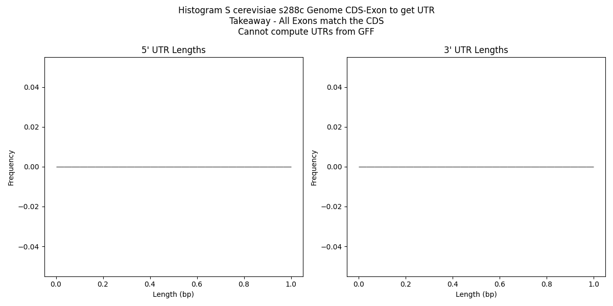

## Using the NCBI s288c we cannot compute UTR lengths

We copied the NCBI `gff` downloaded from [NCBI Genome Assembly R64](https://www.ncbi.nlm.nih.gov/datasets/genome/GCF_000146045.2/) into `torchcell/data/sgd/genome/S288C_reference_genome_R64-4-1_20230830/ncbi_genomic.gff`



Copying code here as it is in `main` and if we pursue the `ncbi` root we will need to overwrite it.

```python
def main() -> None:
    from dotenv import load_dotenv
    import matplotlib.pyplot as plt

    load_dotenv()
    DATA_ROOT = os.getenv("DATA_ROOT")

    # Open the gffutils database
    db = SCerevisiaeGenome(data_root=osp.join(DATA_ROOT, "data/sgd/genome")).db

    # Initialize a dictionary to store UTR lengths for each gene
    utr_lengths = {}

    # Iterate over each gene in the database
    for gene in db.features_of_type("gene"):
        gene_id = (
            gene.id
        )  # or gene['ID'] or gene.attributes['ID'][0] based on your gff file format

        # Get the outermost positions of the CDS within the gene
        cds_list = list(db.children(gene, featuretype="CDS"))
        if not cds_list:
            continue  # Skip genes without CDS

        min_cds_start = min(cds.start for cds in cds_list)
        max_cds_end = max(cds.end for cds in cds_list)

        # Initialize UTR lengths for this gene
        utr_lengths[gene_id] = {"5utr": 0, "3utr": 0}

        # Iterate over each exon within the gene to calculate UTR lengths
        for exon in db.children(gene, featuretype="exon"):
            if gene.strand == "+":
                utr_lengths[gene_id]["5utr"] += max(0, min_cds_start - exon.start)
                utr_lengths[gene_id]["3utr"] += max(0, exon.end - max_cds_end)
            else:  # for genes on the '-' strand, swap 5' and 3' UTRs
                utr_lengths[gene_id]["3utr"] += max(0, min_cds_start - exon.start)
                utr_lengths[gene_id]["5utr"] += max(0, exon.end - max_cds_end)

    # Print the resulting UTR lengths
    # Extract lengths to plot
    utr_5_lengths = [
        lengths["5utr"] for lengths in utr_lengths.values() if lengths["5utr"] > 0
    ]
    utr_3_lengths = [
        lengths["3utr"] for lengths in utr_lengths.values() if lengths["3utr"] > 0
    ]

    # Plot histograms
    plt.figure(figsize=(12, 6))
    plt.suptitle(
        "Histogram S cerevisiae s288c Genome CDS-Exon to get UTR\nTakeaway - All Exons match the CDS\nCannot compute UTRs from GFF"
    )
    plt.subplot(1, 2, 1)
    plt.hist(utr_5_lengths, bins=30, edgecolor="k", color="blue", alpha=0.7)
    plt.title("5' UTR Lengths")
    plt.xlabel("Length (bp)")
    plt.ylabel("Frequency")

    plt.subplot(1, 2, 2)
    plt.hist(utr_3_lengths, bins=30, edgecolor="k", color="red", alpha=0.7)
    plt.title("3' UTR Lengths")
    plt.xlabel("Length (bp)")
    plt.ylabel("Frequency")

    plt.tight_layout()
    plt.savefig(
        "notes/assets/images/Histogram_S_cerevisiae_s288c_Genome_CDS-Exon_to_get_UTR_cannot_compute_UTRs_from_GFF.png"
    )
    plt.show()


if __name__ == "__main__":
    main()
```
