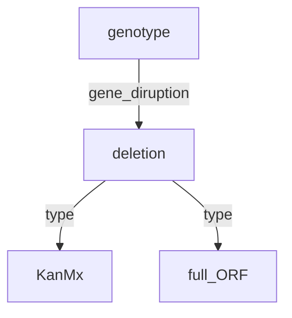

![[user.mjvolk3.torchcell.tasks.future#future]]

## 2023.08.30

- [x] Run test run with dmf → [[M1 Test Run Batch 16 Very Slow|experiments.dmf_costanzo_deepset#m1-test-run-batch-16-very-slow]]
- [x] hydra config experiments → [[experiments/conf/dmf_costanzo_deepset.yaml]]
- [x] Start transfer data to Delta with Globus → This is a bit slow
- [x] Install lua. → Not compatible with Delta Redhat:

```bash mjvolk3@dt-login02 torch % lsb_release -a                                                                                                                                             13:56
LSB Version: :core-4.1-amd64:core-4.1-noarch:cxx-4.1-amd64:cxx-4.1-noarch:desktop-4.1-amd64:desktop-4.1-noarch:languages-4.1-amd64:languages-4.1-noarch:printing-4.1-amd64:printing-4.1-noarch
Distributor ID: RedHatEnterprise
Description: Red Hat Enterprise Linux release 8.8 (Ootpa)
Release: 8.8
Codename: Ootpa
mjvolk3@dt-login02 torch % bash install-deps                                                                                                                                          13:56
==> Only Ubuntu, elementary OS, Fedora, Archlinux, OpenSUSE, Debian, CentOS and KDE neon distributions are supported.
```

- [x] Build ontology... We will build DCell in `torchcell` since DCell requires, both the curation of data and the building of the ontology which couuld be error prone. There model is clear enough to build. → Building ontology requires getting multigraph data.
- [x] Get all multigraph data from SGD API → Delaying this for `gff`solution
- [x] Build base multidigraph with no edges and data classes stored in network graph. In future transformations on top of multidigraph, will be used to move node data to edges. Then transformations on edged filled graph are used to get pytorch graphs. All along we only need to be check for not compatibility. → Delaying this for `gff`solution
- [ ] GO and other useful information also exists in the `gff` file annotating the genome. It will be easier for now to GO out of this. This is probably also more extensible to other organisms too since it is more likely they will have a `gff` than some sort of manually constructed multidigraph. Pull out useful db in an aesthetically appleasing way 🦋.

## 2023.08.29

- [x] Launch experiment on [delta](https://wiki.ncsa.illinois.edu/display/DSC/Delta+User+Guide). → Just to load data takes over 1 hr [[File Existence Check on Dataset|src.torchcell.datasets.scerevisiae.costanzo2016#file-existence-check-on-dataset]]
- [x] Rename [[profiles/DMFCostanzo2016LargeDataset_threads_write_data-2023.08.25-22.29.48.prof]] to write since it looks like we will need to use threads in the file check.
- [x] Remedy long file checks with multithreading. → Looks like it works well. Now we have diverged from `PyG`... Will need to add our own datasets module
- [x] AB pointed out some major issues with [[src/torchcell/models/fungal_utr_transformer.py]]. First embeddings need to be generated, double check. → I've confirmed issues and am diving in deeper.
- [x] Look into fungal transformer weight initialization → Looks like all [upstream models wights not initialized](https://github.com/DennisGankin/species-aware-DNA-LM/issues/4). We should not be using these models in our current experiments.
- [x] Try to recreate experiments to determine how `S. cerevisiae` embeddings are created. We need to know which tokens are used for biasing the species aware model. → There are issues with the env, and the code looks like it is out of data. I've submitted an [env issue](https://github.com/DennisGankin/species-aware-DNA-LM/issues/5).
- [x] Create `dataset.py` for quick reading of data. → [[Skip File Exist Check on Process|src.torchcell.datasets.scerevisiae.costanzo2016#skip-file-exist-check-on-process]]
- [x] printing an instance is extremely slow. Speed up. → [[Speeding up Data Getting with Len Cache|src.torchcell.datasets.scerevisiae.costanzo2016#speeding-up-data-getting-with-len-cache]]
- [x] Since moving to `Dataset` `gene_set` is no longer being computed properly. fix. → Fixed by writing to file, during process. Essentially caching the `gene_set`. This saves us from having to compute it many times, and should save us 🛟 on merges.
- [x] Refactor `CellDataset` so it can handle experiments of type `CellDatset`. → copied over the gene set property. I think writing to file is a decent solution, and will save compute. To do this had to make a small dataset `DMFCostanzo2016SmallDataset`
- [x] Transfer `DMFCostanzo2016SmallDataset` to `DMFCostanzo2016LargeDataset`
- [x] Rerun `DMFCostanzo2016LargeDataset` to get with new `gene_set`
- [x] Rerun [[src/torchcell/datasets/cell.py]] to get a new cell dataset → [[src.torchcell.datasets.cell.md]]

## 2023.08.28

- [x] Figure how to preprocess data. → This was a bit of a long exploration. I looked into using HD5 but it is relatively difficult to due vectorized operations with HD5. I started to used `polars` thinking it could solve some of my speed issues, but I still don't fully understand the API how to deal with lazy dataframes. My final solution was to add preprocess methods to the dataset. These differ from transforms in that they can operate over the entire dataset, removing duplicates, filtering etc.
- [ ] Add a dataframe property to the dataset that converts the Data object to a dataframe. This could allow for the joining of experimental datasets. → I looked into this and it seems like a bad idea, I need to be joining data objeects instead
- [ ] Run dataset locally
- [ ] Transfer datset with Globus
- [ ]

## 2023.08.22

- [x] Rerun scripts for dmf fitness → 2023.08.23 3 billion done in a day, when we have 20 billion data points. This won't scale.
- [x] Sync notability notes.
- 🔲 Restructure data with metadata. → Holding out on these. While they look like good directions they are a bit difficult ot implement.
- 🔲 Restructure data with ontology. → Holding out on these. While they look like good directions they are a bit difficult ot implement.

## 2023.08.19

- [x] Check dmf data on `Delta`. → Exceeded storage limit, ordered 10 Tb.

## 2023.08.17

- [x] Save `DmfCosanzoDataset` small. → 1000 samples
- [x] Fix pre-commit [[.pre-commit-config.yaml]] → Needed to add configuration to [[pyproject.toml]] and deleted `mypy.ini`, since the mypy config can be directly recognized from the `toml`. Needed to make sure that `isort` and `black` were compatible. For now ignoring `flake8` and `mypy` settings.
- [x] Look at `torchgeo` pre-commit → taking a lot of tips from this.o
- [x] In `cell.py` [[Cell|src.torchcell.datasets.cell]] construct base sequence graph. → It is a set but we add a dummy edge index to make it look more like the standard `pyg` graph. We know there are no edges since it is size `(2,0)`.
- [x] In `cell.py` [[Cell|src.torchcell.datasets.cell]] allow for getting diff items. → We implement this with a series of methods. We have to overwrite the `get` method of `InMemoryDatset`, then we add a few methods `_subset_graph` and `_add_label` to construct set to be trained on. This is the key part of the library will need careful consideration.
- [x] Create a lightning data module for `DmfCosanzoDataset`, using small. → [[Cell|src.torchcell.datamodules.cell]]
- [x] Build trainer for fitness prediction. → [[Regression|src.torchcell.trainers.regression]]
- [x] Add wandb log. → [[Dmf_costanzo_deepset|experiments.dmf_costanzo_deepset]]
- [x] Add fitness prediction plot to wandb log. Just plot on validation.
- [x] Setup `.env` for local for data dir
- [x] Globus transfer data
- [x] Setup `.env` for remote for data dir
- [x] Setup remote workspace
- [x] Transfer compute to `Delta`.

## 2023.08.16

- [x] Update CI → Separated out formatting, tests, and mypy. Could separate out more.
- [x] `DmfCostanzoDataset` takes too long to load, consider making it regular dataset, not `InMemory`. → Tried making a [[DmfCostanzoDataset Out Memory Dataset|src.torchcell.datasets.scerevisiae.costanzo2016#dmfcostanzodataset-out-memory-dataset]] and this takes forever to save all files.
- [x] Recover repo after accidentally deleting instead of deleting cache → missed most recent notes.

## 2023.08.15

- [x] Create an analogous sequence embedding dataset for the nucleotide transformer.
- [x] Unify the embedding datasets with a nucleotide embedding datasets → [[src.torchcell.datasets.nucleotide_embedding]]
- [x] Test goings on the nucleotide transformer and the utr transformer. → not yet tested properly.
- [x] Run the nucleotide transformer overnight. → Still took half of the next day on local. should consider batching on GPU.
- [ ] DMFCostanzo takes too long to load, consider making it regular dataset, not `InMemory`.
- [ ] Build a training loop for dmf
- [ ] Add tiling window functions for nucleotide transformer → [[user.mjvolk3.torchcell.tasks.future#future]]

## 2023.08.14

- [x] Create datasets for embeddings → `GeneEmbeddingDataset` [[src.torchcell.datasets.fungal_utr_transformer]]
- [x] Aggregate embedding datasets → `join_datasets`[[src.torchcell.datasets.fungal_utr_transformer]]

## 2023.08.13

- Might have an issue with pydantic

  ```bash
  ERROR: pip's dependency resolver does not currently take into account all the packages that are installed. This behaviour is the source of the following dependency conflicts.
  lightly 1.4.15 requires pydantic<2,>=1.10.5, but you have pydantic 2.1.1 which is incompatible.
  lightning 2.0.6 requires pydantic<2.1.0,>=1.7.4, but you have pydantic 2.1.1 which is incompatible.
  ```

## 2023.08.10

- [x] Clean up git
- [x] Dataset
- [x] One big issue is that the embeddings take time to compute. It would be better if we made a `GenomeDataset` that takes the convenience functions from the `Genome` class that is more of a raw sequence manipulation and sequence feature selection class, and we use thsese in conjunction with

## 2023.08.09

- [x] Yeastmine can query all of the availbe locusID's with [YeastMine Lists](https://yeastmine.yeastgenome.org/yeastmine/bag.do?subtab=view)
- [x] We can also retrieve all phenotypes for all genes [YeastMine Phenotypes](https://yeastmine.yeastgenome.org/yeastmine/results.do?trail=%257Cquery)

## 2023.08.08

- [x] Review `TorchGeo` data joins. → Looked over enough to get the gist. Ran debugger on this [[../torchgeo/torchgeo_tutorial.py]]. The thing I am most concerned about is joins. Joins really need to be done based on some hybrid `genotype-phenotype-environment` ontology.

```python
class GeoDataset(...)
  ...
  def __and__(self, other: "GeoDataset") -> "IntersectionDataset":
    return IntersectionDataset(self, other)

class IntersectionDataset(GeoDataset):
  ...
  def _merge_dataset_indices():
    pass
  def __getitem__():
    pass

```

Now imagine that two genes are deleted but they were deleted with different methods. This would give you a graph like so.



Now there are a few things that I think we can do relatively easily. The most precise and I believe to be in the long run the best method would be to join by a specified ontology. Since it is a DAG you would only need to specify leaf nodes. So in this instance the `deletion` node. Once this is done all `KanMx` and `full_ORF` types would need to be joined. To maintain enough abstraction, there should be a few common methods for instance `right_join`, `left_join`, `low_join`, `high_join` (taking a particular label). We also need to consider data unification. Having an overlapping ontology in this instance is a good thing, but imagine that there is a linear shift in the duplicate data, then it could be safe to assume that there would be a linear shift in all of the duplicate data. It would then be appropriate to shift all data in direction of the largest dataset.

To summarize I am seeing x major components of joins. `genotype-phenotype-env` ontology, Join types, and standardization. We don't want it to balloon to large to makes the abstraction pointless. Along with each dataset, there should be a convenience function to show the ontology, and also overlapping and conficling parts of two ontologies. This would aid in ontology selection for the actual join. A joined dataset should have methods to recall dropped data, and data that has been transformed.

There is another issue of whether or not when joining data say of two different strains to try and unify the strain, based on the users judgement. Or to just select a base strain. I think the datasets themselves don't need to store a reference genome, but instead can just have an attr that says what reference they come from.

- [ ] Clean up the `pretrain_LLM` interface. We should just be able to import models, not have to run a series of commands on them.
- [ ] Do a join between a cell dataset and costanzo dataset.
- [ ] I am thinking that `CellDataset` is going to be so complex that we will need some sort of configuration file to configure it.
- [ ] Check the genotype intersection on the `DMF` data
- [ ] Look into the environmental ontology, and the systems biology or sequence ontology for genotype.
- [ ] When I do joins of data I want to know what types of data were excluded and which were included. I think that there operations need to be part of something like `Cell.join`
- [ ] Implement Lightning Trainers
- [ ] Add deep set model
- [ ] Minimal Wandb Log
- [ ] Log fitness plot same as `Dcell`
- [ ] Train model

## 2023.08.07

- [x] Updated [[src Drawio|src#src-drawio]]. I think this view is simpler in light over the considerations over the library.
- [x] `window_5utr` and `window_3utr` selection. → Looks like they work, need to add test functions to these.
- [x] costanzo2016 data.
- [x] Yeast LLM
- 🔲 Look into the environmental ontology, and the systems biology or sequence ontology for genotype.
- 🔲 Review `TorchGeo` data joins.
- 🔲 When I do joins of data I want to know what types of data were excluded and which were included. I think that there operations need to be part of something like `Cell.join`
- 🔲 Implement Lightning Trainers
- 🔲 Add deep set model
- 🔲 Minimal Wandb Log
- 🔲 Log fitness plot same as `Dcell`
- 🔲 Train model

## 2023.08.05

- [x] Make it so genome can call on methods with `__getitem__` like so `genome["YDR210W].seq`, `genome["YDR210W].window(6e4)`, `genome["YDR210W].window(6e4, is_max_size=False)`, `genome["YDR210W].window_5utr(1000)`, `genome["YDR210W].window_3utr(300)`, etc. Think we can do this by having a wrapper object around the db. → Still need to do `window_5utr` and `window_3utr`.

## 2023.08.04

- [ ] Build out a media note. This would really be best if it is linked to the the specific publication notes that contain the necessary information on any given publication. Note that YPD a YEPD are the same. Yeast Extract Peptone Dextrose with their corresponding concentrations. YEPD + G418 for DMA (Deletion Mutant Array) Growth. Need to pay careful attention to this, may not matter if it has already been proven within reason that the addition of G418 creates a small enough deviation.
- [ ] Does the yeastmined data have the pvalues and the sga interaction scores?Looks like for trigenic they are contained in a "note" field... you've got to be kidding me... populated in a "note" field... and for they don't look populated for digenic.... they are populated for Costanzo 2016 in an "alleles" field, but they are not populated for 2010... This data for networks is probably better pulled from the original data, but then there is potential confliction `MultiDiGraph` and experiments.
- [ ] Look into why `src/package` not typically used. Looks like `.egg` is generally not comitted to project.
- [ ] Make it so genome can call on methods with `__getitem__` like so `genome["YDR210W].seq`, `genome["YDR210W].window(6e4)`, `genome["YDR210W].window(6e4, is_max_size=False)`, `genome["YDR210W].window_5utr(1000)`, `genome["YDR210W].window_3utr(300)`, etc. Think we can do this by having a wrapper object around the db.
- [ ] Allow for indexing on gene name in torch datasets. `dataset[0]`, `dataset["YDR210W"]`
- [ ] Around 32 genes are under 6kb... need to find a way around this. Also made mistake thinking the nucleotide transformer could handle 60kb... whoops. We can still use the Enformer for these large windows. Could also use 3 embeddings to capture the gene with nt transformer. Looks like this is the largest gene in yeast `YKR054C, length: 12278`

## 2023.08.03

- [x] Test [[src/torchcell/sequence/sequence.py]] window functions → [[tests/torchcell/sequence/test_sequence.py]] #ChatGPT is very useful to get quick tests off the ground that can be tweaked for proper behavior.
- [x] Switch to the [Mypy - Matan Grover](https://marketplace.visualstudio.com/items?itemName=matangover.mypy#review-details) since this uses `.ini` has cross file integration. → Switched but I think we are better off using cmd line. I added some bash scripts so I can common `tasks`.
- [ ] Implement `cell.py` [[Src|src]]
- [ ] Implement `datasets`. → [[Scerevisiae|src.torchcell.datasets.scerevisiae]] Need to split up by organism...
- [ ] Discuss different data → [[Data Experiment Philosophy|src#data-experiment-philosophy]]

- [ ] Implement `datasets.py` [[Src|src]]
- [ ] Change to something like from tochcell.genome import SCerevisiaeGenome.
- [ ] Undo the import magic and drop some of the `if __name__`s
