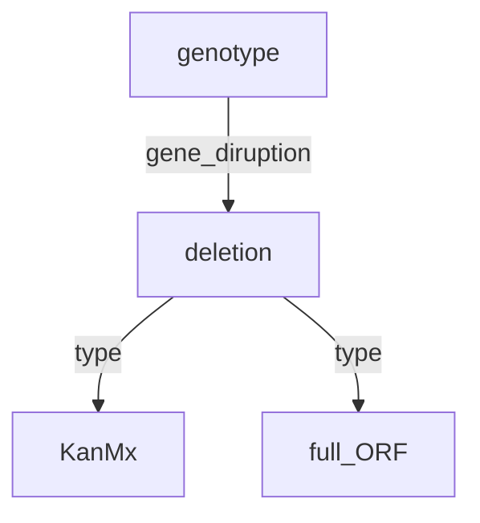

![[user.mjvolk3.torchcell.tasks.future#future]]

## 2023.08.09

- [x] Yeastmine can query all of the availbe locusID's with [YeastMine Lists](https://yeastmine.yeastgenome.org/yeastmine/bag.do?subtab=view)
- [x] We can also retrieve all phenotypes for all genes [YeastMine Phenotypes](https://yeastmine.yeastgenome.org/yeastmine/results.do?trail=%257Cquery)

## 2023.08.08

- [x] Review `TorchGeo` data joins. → Looked over enough to get the gist. Ran debugger on this [[../torchgeo/torchgeo_tutorial.py]]. The thing I am most concerned about is joins. Joins really need to be done based on some hybrid `genotype-phenotype-environment` ontology.

```python
class GeoDataset(...)
  ...
  def __and__(self, other: "GeoDataset") -> "IntersectionDataset":
    return IntersectionDataset(self, other)

class IntersectionDataset(GeoDataset):
  ...
  def _merge_dataset_indices():
    pass
  def __getitem__():
    pass

```

Now imagine that two genes are deleted but they were deleted with different methods. This would give you a graph like so.



Now there are a few things that I think we can do relatively easily. The most precise and I believe to be in the long run the best method would be to join by a specified ontology. Since it is a DAG you would only need to specify leaf nodes. So in this instance the `deletion` node. Once this is done all `KanMx` and `full_ORF` types would need to be joined. To maintain enough abstraction, there should be a few common methods for instance `right_join`, `left_join`, `low_join`, `high_join` (taking a particular label). We also need to consider data unification. Having an overlapping ontology in this instance is a good thing, but imagine that there is a linear shift in the duplicate data, then it could be safe to assume that there would be a linear shift in all of the duplicate data. It would then be appropriate to shift all data in direction of the largest dataset.

To summarize I am seeing x major components of joins. `genotype-phenotype-env` ontology, Join types, and standardization. We don't want it to balloon to large to makes the abstraction pointless. Along with each dataset, there should be a convenience function to show the ontology, and also overlapping and conficling parts of two ontologies. This would aid in ontology selection for the actual join. A joined dataset should have methods to recall dropped data, and data that has been transformed.

There is another issue of whether or not when joining data say of two different strains to try and unify the strain, based on the users judgement. Or to just select a base strain. I think the datasets themselves don't need to store a reference genome, but instead can just have an attr that says what reference they come from.

- [ ] Clean up the `pretrain_LLM` interface. We should just be able to import models, not have to run a series of commands on them.
- [ ] Do a join between a cell dataset and costanzo dataset.
- [ ] I am thinking that `CellDataset` is going to be so complex that we will need some sort of configuration file to configure it.
- [ ] Check the genotype intersection on the `DMF` data
- [ ] Look into the environmental ontology, and the systems biology or sequence ontology for genotype.
- [ ] When I do joins of data I want to know what types of data were excluded and which were included. I think that there operations need to be part of something like `Cell.join`
- [ ] Implement Lightning Trainers
- [ ] Add deep set model
- [ ] Minimal Wandb Log
- [ ] Log fitness plot same as `Dcell`
- [ ] Train model

## 2023.08.07

- [x] Updated [[src Drawio|src#src-drawio]]. I think this view is simpler in light over the considerations over the library.
- [x] `window_5utr` and `window_3utr` selection. → Looks like they work, need to add test functions to these.
- [x] costanzo2016 data.
- [x] Yeast LLM
- 🔲 Look into the environmental ontology, and the systems biology or sequence ontology for genotype.
- 🔲 Review `TorchGeo` data joins.
- 🔲 When I do joins of data I want to know what types of data were excluded and which were included. I think that there operations need to be part of something like `Cell.join`
- 🔲 Implement Lightning Trainers
- 🔲 Add deep set model
- 🔲 Minimal Wandb Log
- 🔲 Log fitness plot same as `Dcell`
- 🔲 Train model

## 2023.08.05

- [x] Make it so genome can call on methods with `__getitem__` like so `genome["YDR210W].seq`, `genome["YDR210W].window(6e4)`, `genome["YDR210W].window(6e4, is_max_size=False)`, `genome["YDR210W].window_5utr(1000)`, `genome["YDR210W].window_3utr(300)`, etc. Think we can do this by having a wrapper object around the db. → Still need to do `window_5utr` and `window_3utr`.

## 2023.08.04

- [ ] Build out a media note. This would really be best if it is linked to the the specific publication notes that contain the necessary information on any given publication. Note that YPD a YEPD are the same. Yeast Extract Peptone Dextrose with their corresponding concentrations. YEPD + G418 for DMA (Deletion Mutant Array) Growth. Need to pay careful attention to this, may not matter if it has already been proven within reason that the addition of G418 creates a small enough deviation.
- [ ] Does the yeastmined data have the pvalues and the sga interaction scores?Looks like for trigenic they are contained in a "note" field... you've got to be kidding me... populated in a "note" field... and for they don't look populated for digenic.... they are populated for Costanzo 2016 in an "alleles" field, but they are not populated for 2010... This data for networks is probably better pulled from the original data, but then there is potential confliction `MultiDiGraph` and experiments.
- [ ] Look into why `src/package` not typically used. Looks like `.egg` is generally not comitted to project.
- [ ] Make it so genome can call on methods with `__getitem__` like so `genome["YDR210W].seq`, `genome["YDR210W].window(6e4)`, `genome["YDR210W].window(6e4, is_max_size=False)`, `genome["YDR210W].window_5utr(1000)`, `genome["YDR210W].window_3utr(300)`, etc. Think we can do this by having a wrapper object around the db.
- [ ] Allow for indexing on gene name in torch datasets. `dataset[0]`, `dataset["YDR210W"]`
- [ ] Around 32 genes are under 6kb... need to find a way around this. Also made mistake thinking the nucleotide transformer could handle 60kb... whoops. We can still use the Enformer for these large windows. Could also use 3 embeddings to capture the gene with nt transformer. Looks like this is the largest gene in yeast `YKR054C, length: 12278`

## 2023.08.03

- [x] Test [[src/torchcell/sequence/sequence.py]] window functions → [[tests/torchcell/sequence/test_sequence.py]] #ChatGPT is very useful to get quick tests off the ground that can be tweaked for proper behavior.
- [x] Switch to the [Mypy - Matan Grover](https://marketplace.visualstudio.com/items?itemName=matangover.mypy#review-details) since this uses `.ini` has cross file integration. → Switched but I think we are better off using cmd line. I added some bash scripts so I can common `tasks`.
- [ ] Implement `cell.py` [[Src|src]]
- [ ] Implement `datasets`. → [[Scerevisiae|src.torchcell.datasets.scerevisiae]] Need to split up by organism...
- [ ] Discuss different data → [[Data Experiment Philosophy|src#data-experiment-philosophy]]

- [ ] Implement `datasets.py` [[Src|src]]
- [ ] Change to something like from tochcell.genome import SCerevisiaeGenome.
- [ ] Undo the import magic and drop some of the `if __name__`s

## 2023.08.09

- [x] Yeastmine can query all of the availbe locusID's with [YeastMine Lists](https://yeastmine.yeastgenome.org/yeastmine/bag.do?subtab=view)
- [x] We can also retrieve all phenotypes for all genes [YeastMine Phenotypes](https://yeastmine.yeastgenome.org/yeastmine/results.do?trail=%257Cquery)

## 2023.08.08

- [x] Review `TorchGeo` data joins. → Looked over enough to get the gist. Ran debugger on this [[../torchgeo/torchgeo_tutorial.py]]. The thing I am most concerned about is joins. Joins really need to be done based on some hybrid `genotype-phenotype-environment` ontology.

```python
class GeoDataset(...)
  ...
  def __and__(self, other: "GeoDataset") -> "IntersectionDataset":
    return IntersectionDataset(self, other)

class IntersectionDataset(GeoDataset):
  ...
  def _merge_dataset_indices():
    pass
  def __getitem__():
    pass

```

Now imagine that two genes are deleted but they were deleted with different methods. This would give you a graph like so.


Now there are a few things that I think we can do relatively easily. The most precise and I believe to be in the long run the best method would be to join by a specified ontology. Since it is a DAG you would only need to specify leaf nodes. So in this instance the `deletion` node. Once this is done all `KanMx` and `full_ORF` types would need to be joined. To maintain enough abstraction, there should be a few common methods for instance `right_join`, `left_join`, `low_join`, `high_join` (taking a particular label). We also need to consider data unification. Having an overlapping ontology in this instance is a good thing, but imagine that there is a linear shift in the duplicate data, then it could be safe to assume that there would be a linear shift in all of the duplicate data. It would then be appropriate to shift all data in direction of the largest dataset.

To summarize I am seeing x major components of joins. `genotype-phenotype-env` ontology, Join types, and standardization. We don't want it to balloon to large to makes the abstraction pointless. Along with each dataset, there should be a convenience function to show the ontology, and also overlapping and conficling parts of two ontologies. This would aid in ontology selection for the actual join. A joined dataset should have methods to recall dropped data, and data that has been transformed.

There is another issue of whether or not when joining data say of two different strains to try and unify the strain, based on the users judgement. Or to just select a base strain. I think the datasets themselves don't need to store a reference genome, but instead can just have an attr that says what reference they come from.

- [ ] Clean up the `pretrain_LLM` interface. We should just be able to import models, not have to run a series of commands on them.
- [ ] Do a join between a cell dataset and costanzo dataset.
- [ ] I am thinking that `CellDataset` is going to be so complex that we will need some sort of configuration file to configure it.
- [ ] Check the genotype intersection on the `DMF` data
- [ ] Look into the environmental ontology, and the systems biology or sequence ontology for genotype.
- [ ] When I do joins of data I want to know what types of data were excluded and which were included. I think that there operations need to be part of something like `Cell.join`
- [ ] Implement Lightning Trainers
- [ ] Add deep set model
- [ ] Minimal Wandb Log
- [ ] Log fitness plot same as `Dcell`
- [ ] Train model

## 2023.08.07

- [x] Updated [[src Drawio|src#src-drawio]]. I think this view is simpler in light over the considerations over the library.
- [x] `window_5utr` and `window_3utr` selection. → Looks like they work, need to add test functions to these.
- [x] costanzo2016 data.
- [x] Yeast LLM
- 🔲 Look into the environmental ontology, and the systems biology or sequence ontology for genotype.
- 🔲 Review `TorchGeo` data joins.
- 🔲 When I do joins of data I want to know what types of data were excluded and which were included. I think that there operations need to be part of something like `Cell.join`
- 🔲 Implement Lightning Trainers
- 🔲 Add deep set model
- 🔲 Minimal Wandb Log
- 🔲 Log fitness plot same as `Dcell`
- 🔲 Train model

## 2023.08.05

- [x] Make it so genome can call on methods with `__getitem__` like so `genome["YDR210W].seq`, `genome["YDR210W].window(6e4)`, `genome["YDR210W].window(6e4, is_max_size=False)`, `genome["YDR210W].window_5utr(1000)`, `genome["YDR210W].window_3utr(300)`, etc. Think we can do this by having a wrapper object around the db. → Still need to do `window_5utr` and `window_3utr`.

## 2023.08.04

- [ ] Build out a media note. This would really be best if it is linked to the the specific publication notes that contain the necessary information on any given publication. Note that YPD a YEPD are the same. Yeast Extract Peptone Dextrose with their corresponding concentrations. YEPD + G418 for DMA (Deletion Mutant Array) Growth. Need to pay careful attention to this, may not matter if it has already been proven within reason that the addition of G418 creates a small enough deviation.
- [ ] Does the yeastmined data have the pvalues and the sga interaction scores?Looks like for trigenic they are contained in a "note" field... you've got to be kidding me... populated in a "note" field... and for they don't look populated for digenic.... they are populated for Costanzo 2016 in an "alleles" field, but they are not populated for 2010... This data for networks is probably better pulled from the original data, but then there is potential confliction `MultiDiGraph` and experiments.
- [ ] Look into why `src/package` not typically used. Looks like `.egg` is generally not comitted to project.
- [ ] Make it so genome can call on methods with `__getitem__` like so `genome["YDR210W].seq`, `genome["YDR210W].window(6e4)`, `genome["YDR210W].window(6e4, is_max_size=False)`, `genome["YDR210W].window_5utr(1000)`, `genome["YDR210W].window_3utr(300)`, etc. Think we can do this by having a wrapper object around the db.
- [ ] Allow for indexing on gene name in torch datasets. `dataset[0]`, `dataset["YDR210W"]`
- [ ] Around 32 genes are under 6kb... need to find a way around this. Also made mistake thinking the nucleotide transformer could handle 60kb... whoops. We can still use the Enformer for these large windows. Could also use 3 embeddings to capture the gene with nt transformer. Looks like this is the largest gene in yeast `YKR054C, length: 12278`

## 2023.08.03

- [x] Test [[src/torchcell/sequence/sequence.py]] window functions → [[tests/torchcell/sequence/test_sequence.py]] #ChatGPT is very useful to get quick tests off the ground that can be tweaked for proper behavior.
- [x] Switch to the [Mypy - Matan Grover](https://marketplace.visualstudio.com/items?itemName=matangover.mypy#review-details) since this uses `.ini` has cross file integration. → Switched but I think we are better off using cmd line. I added some bash scripts so I can common `tasks`.
- [ ] Implement `cell.py` [[Src|src]]
- [ ] Implement `datasets`. → [[Scerevisiae|src.torchcell.datasets.scerevisiae]] Need to split up by organism...
- [ ] Discuss different data → [[Data Experiment Philosophy|src#data-experiment-philosophy]]

- [ ] Implement `datasets.py` [[Src|src]]
- [ ] Change to something like from tochcell.genome import SCerevisiaeGenome.
- [ ] Undo the import magic and drop some of the `if __name__`s

## 2023.08.02

- [x] Split out [[src/torchcell/sgd/sequence/sequence.py]] and [[src/torchcell/sequence/sequence.py]] → [[src/torchcell/sequence/sequence.py]] is for functions usefule to the `torchcell` library. Need to continue to build about ABCs here and pydantic classes for data validation.
- [x] Add `select_feature_window` in [[src/torchcell/sgd/sequence/sequence.py]] → Handles both `is_max_size:bool=True` where sequence will be guaranteed to be max window size. `False` leads to varying lengths of sequence but sequence is always centered.
- [x] Write tests for [[src/torchcell/sgd/sequence/sequence.py]] → [[tests/torchcell/sequence/test_sequence.py]]
- [ ] Add `select_5utr` and `select_3utr`.
- [ ] Add ABCs to [[src/torchcell/sequence/sequence.py]]
- [ ] Test [[src/torchcell/sequence/sequence.py]]

## 2023.08.01

- [x] Switch to using SGD's genome
- [x] Restructure [[src/torchcell/sgd/sequence.py]] with new data.
- [x] Brainstorm data structure → [[src Drawio|src#src-drawio]]
- [x] Add useful properties [[src/torchcell/sgd/sequence.py]] → I think that [[src/torchcell/sgd/sequence_plot.py]] should be used to split up plotting from `BaseGenome`. *S cerevisiae* is likely to have more data than other organisms so it would be best to make `BaseGenome` as minimal as possible. Could even create a `BaseGenomeSummary` object. We just need to try to force `BaseGenome` to be small. Small enough to contain it's own data, with some extra features for interoperability between the other modules that will compose `Cell`.
- [ ] Read paper on SGD genome update → reference...
- [ ] Add `Zendron`` to repo

## 2023.07.31

- [x] Check images from [[src/torchcell/sgd/validation/raw_structure.py]]
- [x] Work on [[Datasets|src.torchcell.datasets]] charting out a rough map so we don't have to do a ton of rewriting. → update 
- [x] Change [[src/torchcell/sgd/sgd.py]] from dataclass to attrs. → They are mostly drop in replacement, but `attrs` gives nice funcitonality for comparing objects.
- [ ]
- [ ] Make images SI quality no interfacing with SGD database.

## 2023.07.30

- [x] Graphs of data [[src/torchcell/sgd/validation/raw_structure.py]] → Images look ok.
- [x] Build docs. → Need to add individual modules .rst I think...
- [ ] Add CI for docs, tests, mypy check.
- [ ] Write some pattern for saving files to assets, src, and data. Right now I think the best thing is to copy the images to look the same as the `src`, but I don't think this makes much sense for `data`.
- [ ] Add graph images to note

## 2023.07.29

- [x] Review [[python.lib.pydantic]] models → [[models|python.lib.pydantic.docs.models]]
- [x] Review [[python.lib.pydantic]] field types → [[field types|python.lib.pydantic.docs.field-types]] not yet complete.
- [x] Graphs of data [[src/torchcell/sgd/validation/raw_structure.py]] → They are coming along but still not complete.

## 2023.07.28

- [x] Change the mutability of base model. I think that `BaseDataStrict` should be immutable. → this is shallow immutability, does not act on `dict`

## 2023.07.27

- [x] Process data structure to speed up data validation... will get some nice network plots along the way. → [[src/torchcell/sgd/validation/raw_structure.py]] graphs aren't quite right yet.

## 2023.07.26

- [x] Run a speed test on 10 genes → Very fast comapared to previous yeastmine. this is the way to go instead of yeastmine. [[src/torchcell/sgd.py]]
- [x] Build out pydantic data validation for each of the get data methods... → Started note [[Pydantic|python.lib.pydantic]] to help keep track of best policies and design principles. [[src/torchcell/sgd/validation/locus_related/locus.py]] a few of the test genes pass. Will need to do a more through job of documenting the different types and possibly adding example for the documentation.

## 2023.07.25

- [x] Data → Using SGD API to download data
- [x] Data Async → Sped up with async [[src/torchcell/sgd.py]]
- 🔲 CI setup

## 2023.07.24

- [x] First commit
