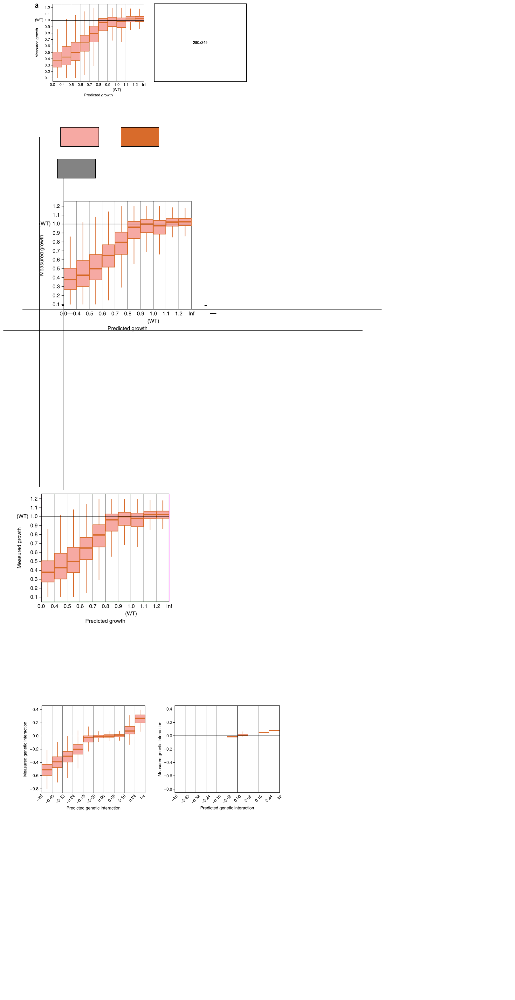
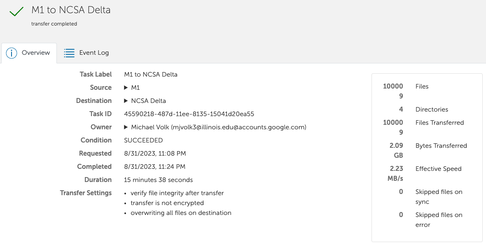

![[user.mjvolk3.torchcell.tasks.future#future]]

## 2023.11.22

- [ ] `Dcell` keeps failing typically after 2 epochs in, makes me think there is some accumulation of data.o

## 2023.11.20

- [x] Investigate launched models → There are to many workers `pid` fail
- [x] Model metrics needs to be fixed → logging root predictions and subsystem predictions

## 2023.11.19

- [x] Fix device issues with `Dcell`
- [x] Launch on `DCell`

## 2023.11.18

- [x] Fix [[src.torchcell.models.dcell]] the modules are not being passed correctly → I think these are fixed but should go back and annotate and test properly.
- [x] Quick run model locally → works on `cpu`
- 🔲 Launch on `Delta` → device issues

## 2023.11.17

- [x] Correct [[./assets/drawio/Dcell.drawio.png]] → Corrected including subsystem representation.
- [x] Fix [[src.torchcell.models.dcell]] the modules are not being passed correctly
- [ ] Check the Yeast OBO for annotations. If it contains annotations check to see if they align with the `DCell` reported annotations counts. Is this the same thing as `GAF`?

## 2023.11.16

- [x] Review GEARS paper [[./assets/drawio/GEARS.drawio.png]]

## 2023.11.14

- [x] Switching plot font to default `DejaVu Sans` since this is platform agnotic.
- [x] Train [experiments.costanzo_smd_dmf_dcell.dmf_dcell] on Delta. → Training both a fitness model an interaction model.
- [x] Recording work with pronto [[src.torchcell.datasets.pronto_ontology]]
- [ ] Build an ontology that can be used from `smf` and `dmf` [[Ontology|dendron://torchcell/src.torchcell.datasets.ontology]].

- [ ] Combine `smf` and `dmf` into one dataset. Some work has already been done on this. [[Experiment|dendron://torchcell/src.torchcell.datasets.experiment]]

## 2023.11.13

- [x] Get [experiments.costanzo_smd_dmf_dcell.dmf_dcell] running.
- [x] Globus transfer of all data → Took 4-5 hours.
- 🔲 Train [experiments.costanzo_smd_dmf_dcell.dmf_dcell] on Delta.
- 🔲 Combine `smf` and `dmf` into one dataset.

## 2023.11.04

- [x] Get the [[Cell|dendron://torchcell/src.torchcell.datasets.cell]] working since [[Graph|dendron://torchcell/src.torchcell.graph.graph]] was recently updated. It is now obvious that we need a well defined interface between `Graphs` and `CellDataset` need unit tests for these. I think we should probably use pydantic data validation. For instance I think that we need to ensure that any graphs specify a graph dictionary. I think this is a better option compared to the multigraph, because this allows us to process only individual graphs, and the current functions for conversion.
- [ ] Build out [[dataset.dcell|dendron://torchcell/src.torchcell.datasets.dcell]]

## 2023.11.03

- [x] Run some example data through [[Dcell|dendron://torchcell/src.torchcell.models.dcell]]. This turned out to be much more involved than I previoulsy thought since we have to do so much data transformation prior to passing the data to the model. [[Model Implementation|dendron://torchcell/src.torchcell.models.dcell#model-implementation]]

- [ ] Build out [[dataset.dcell|dendron://torchcell/src.torchcell.datasets.dcell]]
- [ ] Build out [[datamodules.dcell|dendron://torchcell/src.torchcell.datamodules.dcell]] data module. Test loading and a way to vary sampling frequency from different data.
- [ ] Trial bringing together DCell data for the `<6` gene in dataset criterion

## 2023.11.02

- [x] Double check GO annotations with GO file `.gaf` file. → It is terribly annoying to find that they don't overlap and they don't overlap in mysterious ways. Some of the terms from the `gaf` file are not on the GO annotations for the genes.
- [x] Allow for taking the Union between the two sets, and adding the GO information prior to joining. → In [[Adding GO Union from GAF|dendron://torchcell/src.torchcell.graph.graph#adding-go-union-from-gaf]] I deem this is as currently unnecessary as the contributurion from these terms would be small.
- [x] Build [[Dcell|dendron://torchcell/src.torchcell.models.dcell]] → prototype

## 2023.11.01

- [x] Since we aren't getting matching graphs using GO annotations processed from the SGD graphs. Double check another source. → GO has a `.gaf` file.

## 2023.10.24

- [x] Double check deletion of `IGI` and forwarding of edges. → [[Test_graph|dendron://torchcell/tests.torchcell.graph.test_graph]]
- [x] Plot histogram of GO dates with minimal possible filtering while maintaining DAG and no isolated nodes. → [[Histogram of DCell GO Gene Annotations Binned in Time|dendron://torchcell/src.torchcell.datasets.dcell#histogram-of-dcell-go-gene-annotations-binned-in-time]]
- [x] Plot of `DCell` DAG without any isolted nodes, and before filtering and with super node → [[DCell DAG No Isolated Nodes No Filtering with Super Node|dendron://torchcell/src.torchcell.datasets.dcell#dcell-dag-no-isolated-nodes-no-filtering-with-super-node]]
- [x] Allow for gene removal of annotation according to date with a date arg. → [[DCell Dataset GO Gene Annotations Time Cutoff|dendron://torchcell/src.torchcell.datasets.dcell#dcell-dataset-go-gene-annotations-time-cutoff]], added tests [[Test_graph|dendron://torchcell/tests.torchcell.graph.test_graph]]
- [x] Check total number of ontology terms with no date args, and with date args. Look for date in `Dcell` paper. → Can only get a rough estimate based on commits and paper submission dates. Even with this we cannot get the number of GO terms to match properly.

- [ ] Build out [[dataset.dcell|dendron://torchcell/src.torchcell.datasets.dcell]]
- [ ] Build out [[datamodules.dcell|dendron://torchcell/src.torchcell.datamodules.dcell]] data module. Test loading and a way to vary sampling frequency from different data.
- [ ] Trial bringing together DCell data for the `<6` gene in dataset criterion

- [ ] In any of the graphs Met, GO, Regulatory, Metabolic , PPI, GGI. What is the average degree. For the special graph graphs what is the average number of nodes perturbed. Plot histograms for these.

- [ ] I previously thought that we removed all redundant edges by removing parents with no annotations. If the number of nodes is not the same, check for nodes whose parent node has the exact same gene annotations. I think we consider these nodes redundant. Double check.
- [ ] Build DCell network takes `nx.DiGraph` as arg. Simulate some data

- [ ] Build out DCell Regression task, experiment script, and configuration.
- [ ] Run DCell locally

## 2023.10.23

- [x] Explore metabolism → `/Users/michaelvolk/Documents/projects/yeast-GEM/torchcell_test.py`. This was done in another `yeast-GEM`. It shows that we can represent metabolism with a heterogenous graph of both metabolites and reactions. I will wait off on adding metabolism right now. Need to look into hetero graph data more.
- [x] Graph object, get other relevant networks including GO
- [x] GO graph add DCell options. → Need to double check `IGI`, and the 6 genes criterion nees to be handled after [[DCell|dendron://torchcell/src.torchcell.datamodules.DCell]]

- [ ] Figure out multigraph with `pyg`. We do not need a custom `Data` object yet for batching data, but we will eventually if we have some heterogenous graph structures. Graph matching case, or bipartite case.
- [ ] Verify graph subsetting. I am thinking there has to be a series of objects that can pass around the standard data. Not sure if this would involve writing a new `Data` type object.
- [ ] Add in single fitness

- [ ] Change `self.genome.go` to `self.genome.go_set` and make it an ordered set.
- [ ] Add method for `available_graphs` that tell you which graph constructor classes have been implemented, and which graphs have already been saved.
- [ ] Implement option to train on fitness and interaction simultaneously. Both work for now, but individuals need to work.

- [ ] Solve issue with `genome.gene_set` vs `genome` had to use `gene_set`. Had to use `gene_set`, but we will likely want to use `genome` for data validation.[[Graph|dendron://torchcell/src.torchcell.graph.graph]]

- [ ] Embedding overlay plot for `FungalCIS` and `mean expression`
- [ ] switch to `torch_geometric.utils.scatter`

## 2023.10.22

- [x] Check if PPIs do overlap with GGI. → They do to some extent.
- [x] Read on data batching [PyG data batch](https://pytorch-geometric.readthedocs.io/en/latest/advanced/batching.html)
- [x] Regroup
- [x] Workout saving graphs objects, this will greatly reduce dev time → Saving as `json` for now because this avoids some serialization issues. `nx` has removed their `gpickle` methods.
- [x] Graph object add regulatory graph. → `locus1` regulates `locus2` [SGD YER125W](https://www.yeastgenome.org/locus/S000000927/regulation)
- [x] Add GGI
- 🔲 Graph object, get other relevant networks including GO, Met.
- 🔲 Figure out multigraph with `pyg`. We do not need a custom `Data` object yet for batching data, but we will eventually if we have some heterogenous graph structures. Graph matching case, or bipartite case.
- 🔲 Verify graph subsetting. I am thinking there has to be a series of objects that can pass around the standard data. Not sure if this would involve writing a new `Data` type object.
- 🔲 Add in single fitness
- 🔲 Implement option to train on fitness and interaction simultaneously. Both work for now, but individuals need to work.
- 🔲 Solve issue with `genome.gene_set` vs `genome` had to use `gene_set`. Had to use `gene_set`, but we will likely want to use `genome` for data validation.[[Graph|dendron://torchcell/src.torchcell.graph.graph]]
- 🔲 Embedding overlay plot for `FungalCIS` and `mean expression`
- 🔲 switch to `torch_geometric.utils.scatter`

## 2023.10.20

- 🔲 Read on data batching [PyG data batch](https://pytorch-geometric.readthedocs.io/en/latest/advanced/batching.html)
- 🔲 Regroup
- 🔲 Graph object, get other relevant networks including PPI, Reg, GGI, GO, Met.
- 🔲 Workout saving graphs objects, this will greatly reduce dev time
- 🔲 Verify graph subsetting. I am thinking there has to be a series of objects that can pass around the standard data. Not sure if this would involve writing a new `Data` type object. The subset graph procedure that interacts with all data is probably
- 🔲 Implement option to train on fitness and interaction simultaneously. Find more general dataset structures for box plots etc... This might be an issue with num_workers instead.

## 2023.10.19

- [x] Models didn't work with one hop neighborhood. Try to zero out the embeddings. → `zero_pert` bool, this doesn't seem to work either. I suspect that the issue is that we are using the embedding of 1 hop neighborhood which can be quite large. We could possibly pull out the embedding of the perturbed nodes themselves, but this would require keeping indices in the data object. After now going through 3-4 modelling designs, I think I the subset of data is the key part. It would be nice to specify a very specific transformations like the `pert_graph`, while building out a key to track `edge_index` and ed,
- [x] Prepare presentation

## 2023.10.18

`funal_up` and `fungal_down` work. `one_hot_gene` and the `prot_T5` datasets don't work

- [x] Something looks strange with the interaction distribution. → 0.04 is about one std away so the genetic interaction score plots show the range of one std.
- [x] In `nx.compose` the second graph will overwrite data if there are duplicate keys. →
- [x] Hack to using graphs on perturbation graph → one hop for removed nodes, not yet zeroing out node features. Not sure if it'll be necessary. [[Cell|dendron://torchcell/src.torchcell.datasets.cell]]
- [x] Hack for e issue with `genome.gene_set` vs `genome` → using `gene_set` as arg [[Graph|dendron://torchcell/src.torchcell.graph.graph]], when using `genome` things get hung up on `Sanity Checking:`.
- [x] Implement a trainer for graph convolution network → [[Graph_convolution_regression|dendron://torchcell/src.torchcell.trainers.graph_convolution_regression]]
- [x] Implement option to train on fitness and interaction simultaneously → set up the beginnings of this, but it is going to be a lot of work.
- [x] Issue with `genome.gene_set` vs `genome` might instead be an issue with `num_workers`. When I set `num_workers=0` things run. `num_workers=4` things don't run. Gets hung up at `Sanity Checking:` → `num_workers=2` works but it takes a very long time to get going. `num_workers=4` probably also works
- [x] Launch on `Delta`.
- 🔲 Add in single fitness
- 🔲 Solve issue with `genome.gene_set` vs `genome` had to use `gene_set`. Had to use `gene_set`, but we will likely want to use `genome` for data validation.[[Graph|dendron://torchcell/src.torchcell.graph.graph]]
- 🔲 Plan graph merge
- 🔲 Add single fitness data
- 🔲 Embedding overlay plot for `FungalCis` and `mean expression`
- 🔲 switch to `torch_geometric.utils.scatter`

## 2023.10.17

- [x] [[455 Proteins in s288c that are geq 1022 Amino Acids|dendron://torchcell/src.torchcell.models.esm2#455-proteins-in-s288c-that-are-geq-1022-amino-acids]]
- [x] See if T5 Model can handle max protein size. "Here, we trained models that were affected by this limitations (ProtBERT, ProtAlbert, ProtElectra) first on proteins of length 512, then on proteins 1024. Only setting the length of the positional encoding to 40k after pre-training allowed the models to process protein sequences up to a length of 40k. ([Elnaggar et al., 2022, p. 7114](zotero://select/library/items/6FEQEKR6)) ([pdf](zotero://open-pdf/library/items/HMD9SDQ2?page=3&annotation=PTEJIYQC))" → We can embed all proteins with this.
- [x] Figure out how to handle pseudogenes [[6 Pseudogenes From cmd F orf_trans_all_R64-4-1_20230830.fasta|dendron://torchcell/src.torchcell.sequence.genome.scerevisiae.s288c#6-pseudogenes-from-cmd-f-orf_trans_all_r64-4-1_20230830fasta]]
- [x] Figure out how to identify noncoding → [[Dubious ORFs are Unlikley to Encode an Expressed Protein|dendron://torchcell/src.torchcell.sequence.genome.scerevisiae.s288c#dubious-orfs-are-unlikley-to-encode-an-expressed-protein]]
- [x] Compute protT5 embeddings → This had to be done on `Delta` because the model is not working for me on cpu currently. [Github Issue](https://github.com/agemagician/ProtTrans/issues/130). More on embeddings - [[Embed all Proteins Can Like 0 Non Expressed Protein|dendron://torchcell/src.torchcell.datasets.protT5#embed-all-proteins-can-like-0-non-expressed-protein]]
- [x] Check if we can add in protein embeddings. → We used `protein_data` as an attribute, which prevents us from adding embeddings datasets.
- [x] Close `genetic_interaction_score`,`dmf_costanzo_linear` [Wandb_Log](https://wandb.ai/zhao-group/torchcell/groups/2514760_3e78b6beb5b847285ef128c72f402d96b88fbb592e9ecb98a745b43db0a857c1/workspace?workspace=user-mjvolk3). You cannot learn the `genetic_interaction_score` by simply `one_hot` encoding the genes.
- [x] Recompute `ProtT5Dataset` → Had to debug `self.initialize`. There are not some inconsistencies with the embeddings models. I can sort this out later. Added to [[user.mjvolk3.torchcell.tasks.future]]
- [x] Check we can add the `ProtT5Dataset` to the other datasets. → This is works since we are using the `dna_windows` hack. [[ProtT5 Embedding Input and Output|dendron://torchcell/src.torchcell.models.protT5#prott5-embedding-input-and-output]]
- [x] Fix indexing [[Embedding|dendron://torchcell/src.torchcell.datasets.embedding]] → now `dataset[0]` and `dataset["Q0010"]` match as they should.
- [x] Compute `"prot_t5_xl_uniref50_all"` and `"prot_t5_xl_uniref50_no_dubious"` and globus transfer. → Changed my mind on making these separate datasets [[Embed all Proteins Can Like 0 Non Expressed Protein|dendron://torchcell/src.torchcell.datasets.protT5#embed-all-proteins-can-like-0-non-expressed-protein]]
- [x] Add option to combine zero-like out non-expressing proteins denoted as `'dubious'`. → Separate datasets [[Embed all Proteins Can Like 0 Non Expressed Protein|dendron://torchcell/src.torchcell.datasets.protT5#embed-all-proteins-can-like-0-non-expressed-protein]]
- [x] Fix bug "dubious" to "Dubious" and "uncharacterized" to "Uncharacterized" and recompute and transfer embeddings.
- [x] Test `dmf_costanzo_deepset` with different protein embeddings.
- [x] Launch `dmf_costanzo_deepset` with `no_dubious` protein embeddings.
- [x] Check [[dmf Genetic Interaction Score Mean|dendron://torchcell/src.torchcell.datasets.scerevisiae.costanzo2016#dmf-genetic-interaction-score-mean]]
- [x] Check `PyG` → [[Graph|dendron://torchcell/src.torchcell.graph.graph]]
- [x] Create graph object starting with `PPI` and `mean_expression`. Note that since we aren't using the data validation right now, that the structure of each gene is not consistent. No `None` for empty data. We are doing this for two reasons. One we want it for visualization overlay, and the other is for PPI message passing.
- [x] Launch `prot_T5_no_dubious`, `costanzo_1e6

- [ ] Add multigraph to prediction

- [ ] Add double prediction of `fitness` and `gene_interaction_score`
- [ ] Embedding overlay plot for `FungalCis` and `mean expression`
- [ ] Set default font to `Helvetica`

## 2023.10.16

- [x] Make a simple SGD linear model. We use a linear model because the dataset won't fit into memory otherwise.
- [x] Launch linear `fitness` model on Delta. → Probably could use cpu for this.
- [x] Launch linear `genetic_interaction_score` model on Delta.
- [x] Bring in ESM embeddings → Brought in models but not sure if we should bring in embeddings yet since they can't handle 455 protines in that are > 1022 amino acids [[Esm2|dendron://torchcell/src.torchcell.models.esm2]]

## 2023.10.15

- [x] Launch linear on delta. → Failed due to memory error.
- [x] Make a simple SGD linear model. → started... the issue is with the dataloader, so we could probably append to some file instead of keeping every in memory. Try SGD first.

## 2023.10.14

Big results to report. one hot is best on fitness, can't learn epistatic interactions. Linear  models for fitness on one hot. Add to report

- [x] Set up linear models → [[Dmf_costanzo_linear|dendron://torchcell/experiments.costanzo_smf_dmf_supervised.dmf_costanzo_linear]]
- [ ] DCell model
- [ ] Run full linear model.
- [ ] Add full dataset with `smf` and `dmf`.
- [ ] Joint prediction of fitness and genetic interaction

## 2023.10.13

- [x] Add codon frequency dataset.
- [x] Add one-hot positional encoding dataset, this will make task transductive (check).
- [ ] Train one hot on `1e6` → wandb log we get much better correlation compared to any of the previous models
- [ ] Add cell morphology dataset
- [ ] Add ESM2 dataset

## 2023.10.12

- [x] Rewrite `SmfCostanzoDataset` [[Costanzo2016|dendron://torchcell/src.torchcell.datasets.scerevisiae.costanzo2016]] to use `Dataset`instead of in memory dataset. This might be unnecessary overkill, but it should allow for inheritance from a generalized `Dataset` class and will make `+` and merges easier. [[Summing vs. Merging Experiment Datasets|dendron://torchcell/src#summing-vs-merging-experiment-datasets]] → converted over, but haven't done any testing.
- [x] Check for duplicates in `SmfCostanzoDataset` → Add many duplicate methods. I thing the `both_` methods might abuse the `duplicate` notation.
- [x] `dmf + smf` dataset. → This creates some issues. I've pursued it some, but the main issue is that another database should be constructed. I think this is the most straightforward way, although it will create duplicate data. This is the easiest solution for now.
- [x] Implement `MergeExperiments` → We had to move away from Dunder add. [[Dunder Adding of Experiments is a Bad Idea|dendron://torchcell/src.torchcell.datasets.experiment#dunder-adding-of-experiments-is-a-bad-idea]] I took from the individual experiment design and modified it to do simple merges, where are really concatentations. [[Use Dataset Logic but Use Process for Merger Operations|dendron://torchcell/src.torchcell.datasets.experiment#use-dataset-logic-but-use-process-for-merger-operations]]
- [x] Fix dmf data_list iteration.
- [x] Make box plot for [[Genetic_interaction_score|dendron://torchcell/src.torchcell.viz.genetic_interaction_score]] → If we want a closer match we could make a few more adjustments.
- [x] Train `1e6` on interaction. → queued priority.

- [ ] Add codon frequency dataset.

- [ ] Add assertion in the addition to make sure that at least the sizes are the same.
- [ ] Read about `pyg` collate to see if all data objects must be same

- [ ] Create new ModelStrict for CodonSelection Result, or use multiple `DnaSelectionResults`. Try multiple `DnaSelectionResults`first

- [ ] Add additional only CDS dataset [[Nucleotide_transformer|dendron://torchcell/src.torchcell.datasets.nucleotide_transformer]]

- [ ] Add additional `five_prime + partial_CDS + three_prime` dataset [[Nucleotide_transformer|dendron://torchcell/src.torchcell.datasets.nucleotide_transformer]]

- [ ] Plot Umap overlays with new datasets
- [ ] Optional dimensionality reduction of embeddings

- [ ] Bring the the `Culley` data in properly and correct [[experiments/fitness_expr_data_exploration/smf_ge_box_plot.py]]
- [ ] Need to bring in `SGD` data in properly and correct [[experiments/protein_concentration_nt_projection.py]]

- [ ] Give str `__repr__` to `DnaSelectionResult` like `DnaWindowResult`

- [ ] Change the `FungalUpDown` to `FungalCRE` for fungal cis regulatory element

- [ ] Try dbfn=`“:memory:"` in genome to solve the sqlite remove deprectaed GO issue.
- [ ] Need tex for plotting settings on delta → [conda install texlive-core](https://anaconda.org/conda-forge/texlive-core)

## 2023.10.11

- [x] Cancel run on `upstream + downstream` → [wandb upstream and downstream](https://wandb.ai/zhao-group/torchcell/groups/2498195_6e7d3de812c0282976a4afcf00b099283e3b054397d8d3b967a99dc89cba9fea/workspace?workspace=user-mjvolk3)
- [x] Start run on all `costanzo`
- [x] Fix plotting of box plots to match `Dcell` →  used template to adjust figures [[torchcell.viz.fitness|dendron://torchcell/src.torchcell.viz.fitness]] should be publication qualtiy now.
- [x] log wandb artifacts in training.
- [x] Check if 'Arial' is on `Delta`. → `conda install -c conda-forge mscorefonts`
- [x] Start run on all `costanzo`, with artifact logging and new box plots.
- 🔲 Add assertion in the addition to make sure that at least the sizes are the same.

## 2023.10.10

- [x] Launch experiment with all `FungalCRE` features.
- [x] Check if pytorch collate works if the Data Objects are different. This is important for eventually combining datasets. → It looks like add only works if all objects have the same data types and sizes, but need to look into more
- 🔲 Add assertion in the addition to make sure that at least the sizes are the same.
- 🔲 Create new ModelStrict for CodonSelection Result, or use multiple `DnaSelectionResults`. Try multiple `DnaSelectionResults`first
- 🔲 Add codon frequency dataset.
- 🔲 Add additional only CDS dataset [[Nucleotide_transformer|dendron://torchcell/src.torchcell.datasets.nucleotide_transformer]]
- 🔲 Add additional `five_prime + partial_CDS + three_prime` dataset [[Nucleotide_transformer|dendron://torchcell/src.torchcell.datasets.nucleotide_transformer]]
- 🔲 Summarize the setting under which models can be successfully trained, or rather where training can at least be started. Create table.
- 🔲 Plot Umap overlays with new datasets
- 🔲 Optional dimensionality reduction of embeddings
- 🔲 Bring the the `Culley` data in properly and correct [[experiments/fitness_expr_data_exploration/smf_ge_box_plot.py]]
- 🔲 Need to bring in `SGD` data in properly and correct [[experiments/protein_concentration_nt_projection.py]]
- 🔲 Give str `__repr__` to `DnaSelectionResult` like `DnaWindowResult`
- 🔲 Test speed of nucleotide transformer speed up.
- 🔲 Change the `FungalUpDown` to `FungalCRE` for fungal cis regulatory element
- 🔲 Try dbfn=`“:memory:"` in genome to solve the sqlite remove deprectaed GO issue.
- 🔲 Need tex for plotting settings on delta → [conda install texlive-core](https://anaconda.org/conda-forge/texlive-core)

## 2023.10.09

- [x] Launch experiment with just upstream features and add to [[dmf_costanzo_deepset.results.01|dendron://torchcell/experiments.dmf_costanzo_deepset.results.01]] → Delta login is currently down.
- [x] Write report for @Yunan-Luo → [[results.01.report|dendron://torchcell/experiments.dmf_costanzo_deepset.results.01.report]]
- [x] Send report to @Yunan-Luo
- [x] Rerun embeddings on full `s288c`genome. This allows for the proper collation when combining datasets with add. → This can lead to some pernicious bugs, where you don't recognize that the dataset is smaller and if the designed net always adapts to feature size you never catch this bug. [[Perturbation Nodes Benchmark Model - Adding Bug|dendron://torchcell/experiments.dmf_costanzo_deepset.results.01.report#perturbation-nodes-benchmark-model---adding-bug]]. Might want to consider adding some sort of assertion in the addition to make sure that at least the sizes are the same.
- [x] Configure type of dataset to train on. → got paritally there but it is difficult to add datasets with `sum` → [[Difficult to Add Datasets with Sum operator|dendron://torchcell/src.torchcell.datasets.embedding#difficult-to-add-datasets-with-sum-operator]]

## 2023.10.08

- [x] On train wt try to overfit the wt before moving to train batch. → Tried this but doesn't seem to work very well. There are a lot of instabilities.
- 🔲 Create new ModelStrict for CodonSelection Result, or use multiple `DnaSelectionResults`. Try multiple `DnaSelectionResults`first
- 🔲 Add codon frequency dataset.
- 🔲 Add additional only CDS dataset [[Nucleotide_transformer|dendron://torchcell/src.torchcell.datasets.nucleotide_transformer]]
- 🔲 Add additional `five_prime + partial_CDS + three_prime` dataset [[Nucleotide_transformer|dendron://torchcell/src.torchcell.datasets.nucleotide_transformer]]
- 🔲 Summarize the setting under which models can be successfully trained, or rather where training can at least be started. Create table.
- 🔲 Plot Umap overlays with new datasets
- 🔲 Optional dimensionality reduction of embeddings
- 🔲 Bring the the `Culley` data in properly and correct [[experiments/fitness_expr_data_exploration/smf_ge_box_plot.py]]
- 🔲 Need to bring in `SGD` data in properly and correct [[experiments/protein_concentration_nt_projection.py]]
- 🔲 Give str `__repr__` to `DnaSelectionResult` like `DnaWindowResult`
- 🔲 Test speed of nucleotide transformer speed up.
- 🔲 Change the `FungalUpDown` to `FungalCRE` for fungal cis regulatory element
- 🔲 Try dbfn=`“:memory:"` in genome to solve the sqlite remove deprectaed GO issue.
- 🔲 Need tex for plotting settings on delta → [conda install texlive-core](https://anaconda.org/conda-forge/texlive-core)

## 2023.10.07

- [x] Summarize some of the successful run. [[dmf_costanzo_deepset.results.01|dendron://torchcell/experiments.dmf_costanzo_deepset.results.01]]
- [x] Add codon frequency dataset → This is a bit more difficult than I anticipated since we have codon frequency of gene with intron and codon frequency of mRNA. → paritally finished.
- 🔲 Add additional only CDS dataset [[Nucleotide_transformer|dendron://torchcell/src.torchcell.datasets.nucleotide_transformer]]
- 🔲 Add additional `five_prime + partial_CDS + three_prime` dataset [[Nucleotide_transformer|dendron://torchcell/src.torchcell.datasets.nucleotide_transformer]]
- 🔲 Summarize the setting under which models can be successfully trained, or rather where training can at least be started. Create table.
- 🔲 Plot Umap overlays with new datasets
- 🔲 Optional dimensionality reduction of embeddings
- 🔲 Bring the the `Culley` data in properly and correct [[experiments/fitness_expr_data_exploration/smf_ge_box_plot.py]]
- 🔲 Need to bring in `SGD` data in properly and correct [[experiments/protein_concentration_nt_projection.py]]
- 🔲 Give str `__repr__` to `DnaSelectionResult` like `DnaWindowResult`
- 🔲 Test speed of nucleotide transformer speed up.
- 🔲 Change the `FungalUpDown` to `FungalCRE` for fungal cis regulatory element
- 🔲 Try dbfn=`“:memory:"` in genome to solve the sqlite remove deprectaed GO issue.
- 🔲 Need tex for plotting settings on delta → [conda install texlive-core](https://anaconda.org/conda-forge/texlive-core)

## 2023.10.06

- [x] Try training on `x_pert`. Allow for easy switching between `x` and `x_pert`.
- [x] Launch experiment on Delta for `x_pert`

## 2023.10.02

- [x] Implement `LayerNorm` normalization and activation parameterization
- [x] Implement gradient clipping. → No implementation needed. This is easy on pytorch lightning as it can be done by simply passing args to the `Trainer`
- [x] Add option to include skip connections in instance layers and set layers of [[src.torchcell.models.deep_set]]. Of course skip connections can only be applied to layers of the same dimension so the boolean corresponds to layers with repeat of the same dimension.
- [x] Automatic clipping only works if we don't use manual backward... [[Manual Backward with Forcing Node Wt to Ones|dendron://torchcell/src.torchcell.trainers.regression#manual-backward-with-forcing-node-wt-to-ones]] → This along with layer norm has appeared to smooth out the loss.
- [x] Implement set transformer → [[Deep_set_transformer|dendron://torchcell/src.torchcell.models.deep_set_transformer]]
- [x] Add weighted MSE in case the models don't learn distribution but instead just predict the mean. → [[Weighted_mse|dendron://torchcell/src.torchcell.losses.weighted_mse]]
- 🔲 Create a sweep locally for `1e4` data.

## 2023.09.29

- [x] Send query to @Yunan-Luo about [[Training Instability with Wildtype Embedding Difference|dendron://torchcell/src.torchcell.trainers.regression#training-instability-with-wildtype-embedding-difference]]
- [x] Kill run → [Wandb Run](https://wandb.ai/zhao-group/torchcell/groups/2459252_ad9b6cf8e9b4acd6438053d0ff7a6d814888f8e2931913741695b28cdffa1030/workspace?workspace=user-mjvolk3), some sides notes on this run [[Training Instability with Wildtype Embedding Difference|dendron://torchcell/src.torchcell.trainers.regression#training-instability-with-wildtype-embedding-difference]]
- [x] [[Fixing Padding on Upstream Model to Match GitHub Issue Recommendation|dendron://torchcell/src.torchcell.models.fungal_up_down_transformer#fixing-padding-on-upstream-model-to-match-github-issue-recommendation]]
- [x] Delete old upstream embeddings and rerun [[Fungal_up_down_transformer|dendron://torchcell/src.torchcell.datasets.fungal_up_down_transformer]]. → Tried running but there is an issue [[Parse Genome and Return None For Dunder Add - Need Genome in Process|dendron://torchcell/src.torchcell.datasets.fungal_up_down_transformer#parse-genome-and-return-none-for-dunder-add---need-genome-in-process]]
- [x] Try to regularize by forcing `wt` embedding to 1, can also try 0 which should be fine because you can get to 1 with bias from linear.

## 2023.09.28

- [x] Unify `wandb` when training on multiple gpus previous is slurm job id and date. Don't think this will work across sweeps. Add agent id. → Agent id is not accessible. Instead I chose to use a hashing of the config. I also got rid of date because if the launch on different gpus happens right around midnight this could create some error. The Hashing method should be unique to the model config.
- [x] Track value of `WT` embedding.
- [x] Launch experiments on [[Delta|dendron://Kbase/computer.delta]]
- [x] `DDP` is with genome `sqlite` → First tracked this error [[2023.09.09|dendron://torchcell/user.Mjvolk3.torchcell.tasks#20230909]], made some proper documentation [[DDP sqlite gff error|dendron://torchcell/src.torchcell.sequence.genome.scerevisiae.s288c#ddp-sqlite-gff-error]] → I still have not confirmed if this is the issue because there was another issue related to combining data
- [x] Fix issue related to combining data. → There is some dark magic 🪄 that I am unfamiliar with here, but I found a workable solution for now. [[Parse Genome and Return None For Dunder Add|dendron://torchcell/src.torchcell.datasets.fungal_up_down_transformer#parse-genome-and-return-none-for-dunder-add]]
- [x] Configure `weight_decay` and `learning_rate`
- [x] Launch [Wandb - 1e5 Deep Set DDP Find Unused](https://wandb.ai/zhao-group/torchcell/groups/2459252_ad9b6cf8e9b4acd6438053d0ff7a6d814888f8e2931913741695b28cdffa1030/workspace?workspace=user-mjvolk3)
- [x] Try to fix forced ddp find unused by passing two `wt` instances and only computing the loss for one. We lose significant speedups according to [GitHub Issue](https://github.com/Lightning-AI/lightning/issues/17212) [[Deep Set Model Only Works with DDP Find Unused|dendron://torchcell/experiments.costanzo_smf_dmf_supervised.dmf_costanzo_deepset_1e5#deep-set-model-only-works-with-ddp-find-unused]] → This works, using a batch of `wt` [[Deep Set Model Only Works with DDP Find Unused - Solution|dendron://torchcell/experiments.costanzo_smf_dmf_supervised.dmf_costanzo_deepset_1e5#deep-set-model-only-works-with-ddp-find-unused---solution]]
- [x] Write set transformer model → Threw something quick together [[Regression_deep_set_transformer|dendron://torchcell/src.torchcell.trainers.regression_deep_set_transformer]]
- 🔲 Add codon frequency dataset → This is a bit more difficult than I anticipated since we have codon frequency of gene with intron and codon frequency of mRNA.
- 🔲 Need tex for plotting settings on delta → [conda install texlive-core](https://anaconda.org/conda-forge/texlive-core)
- 🔲 Add additional only CDS dataset [[Nucleotide_transformer|dendron://torchcell/src.torchcell.datasets.nucleotide_transformer]]
- 🔲 Add additional `five_prime + partial_CDS + three_prime` dataset [[Nucleotide_transformer|dendron://torchcell/src.torchcell.datasets.nucleotide_transformer]]
- 🔲 Summarize the setting under which models can be successfully trained, or rather where training can at least be started. Create table.
- 🔲 Plot Umap overlays with new datasets
- 🔲 Optional dimensionality reduction of embeddings
- 🔲 Bring the the `Culley` data in properly and correct [[experiments/fitness_expr_data_exploration/smf_ge_box_plot.py]]
- 🔲 Need to bring in `SGD` data in properly and correct [[experiments/protein_concentration_nt_projection.py]]
- 🔲 Give str `__repr__` to `DnaSelectionResult` like `DnaWindowResult`
- 🔲 Test speed of nucleotide transformer speed up.

## 2023.09.27

- [x] Respose to [Github Issue Selecting Upstream Sequence](https://github.com/gagneurlab/SpeciesLM/issues/2) → [[How input_ids_len Changes with Different Sequences|dendron://torchcell/src.torchcell.models.fungal_up_down_transformer#how-input_ids_len-changes-with-different-sequences]], [[Window Five Prime S288c Genes Less Than 1003 bp|dendron://torchcell/src.torchcell.sequence.genome.scerevisiae.s288c#window-five-prime-s288c-genes-less-than-1003-bp]], [[Window Three Prime S288c Genes Less Than 300 bp|dendron://torchcell/src.torchcell.sequence.genome.scerevisiae.s288c#window-three-prime-s288c-genes-less-than-300-bp]]
- [x] [[Test_fungal_up_down_transformer|dendron://torchcell/tests.torchcell.models.test_fungal_up_down_transformer]]
- [x] Document [[Fungal_up_down_transformer|dendron://torchcell/src.torchcell.models.fungal_up_down_transformer]] → Added some documentation and made docs. Still difficult for me to tell how the raw strings will render using sphinx.
- [x] Generate new embeddings using upstream model change.
- [x] Think more on label adding → [[Adding Fitness Labels|dendron://torchcell/src.torchcell.datasets.scerevisiae.costanzo2016#adding-fitness-labels]] using a temporary solution for now to handle multiple different cases `dmf`, 'fitness', and mapping them all to `fitness`.
- [x] Implement wt difference embedding → This has gotten a bit complicated, I am often running into this error `Trying to backward through the graph a second time (or directly access saved tensors after they have already been freed)` when trying to embed the wild type and instances from the batch. I overcame this with explicityly handling the optimization. → [[Explicitly Optimising the training_step and train_wt|dendron://torchcell/src.torchcell.trainers.regression#explicitly-optimising-the-training_step-and-train_wt]]
- [x] Change [[src.torchcell.models.deep_set]] to have only dropout on last layer - [[Dropout on Last Layer Only|dendron://torchcell/src.torchcell.models.deep_set#dropout-on-last-layer-only]]
- [x] Glbous transfer `cell_1e4`, `cell_1e5`, `costanzo2016_1e4`, `costanzo2016_1e5`. →  running `cell` and `costanzo` for later transfer.
- [x] Review [Github issue](https://github.com/gagneurlab/SpeciesLM/issues/2#issuecomment-1737756856) → It appears there is nothing to do about sequences like this. 🚂 Moving on .
- [x] Prepare trainer and run models locally for `FungalUpDownTransformer`
- [x] Run experiments locally
- 🔲 Unify `wandb` when training on multiple gpus previous is slurm job id and date. Don't this will work across sweeps. Add period delimited time or something else.
- 🔲 Launch experiments on [[Delta|dendron://Kbase/computer.delta]]
- 🔲 Add additional only CDS dataset [[Nucleotide_transformer|dendron://torchcell/src.torchcell.datasets.nucleotide_transformer]]
- 🔲 Add additional `five_prime + partial_CDS + three_prime` dataset [[Nucleotide_transformer|dendron://torchcell/src.torchcell.datasets.nucleotide_transformer]]
- 🔲 Summarize the setting under which models can be successfully trained, or rather where training can at least be started. Create table.
- 🔲 Write set transformer model
- 🔲 Plot Umap overlays with new datasets
- 🔲 Optional dimensionality reduction of embeddings
- 🔲 Bring the the `Culley` data in properly and correct [[experiments/fitness_expr_data_exploration/smf_ge_box_plot.py]]
- 🔲 Need to bring in `SGD` data in properly and correct [[experiments/protein_concentration_nt_projection.py]]
- 🔲 Give str `__repr__` to `DnaSelectionResult` like `DnaWindowResult`
- 🔲 Test speed of nucleotide transformer speed up.

## 2023.09.26

- [x] Downselect by `costanzo` gene interaction scores or `1e5` → Tabling this for now. This would bias training. Unseen data would then be expected to have interactions, when they were specificially selected to not have an interaction. Also this doesn't make much sense. It would make more sense to takes the `abs` then select upper quantiles of high interaction scores, dropping low interaction. → [[DmfCostanzo2016Dataset Genetic Interaction Score Histogram|dendron://torchcell/src.torchcell.datasets.scerevisiae.costanzo2016#dmfcostanzo2016dataset-genetic-interaction-score-histogram]]
- [x] Check how many genes now are outside of the [[nucleotide_transformer|src.torchcell.datasets.nucleotide_transformer]] window. → [[Genes Larger than Nucleotide Transformer Window|dendron://torchcell/src.torchcell.datasets.nucleotide_transformer#genes-larger-than-nucleotide-transformer-window]]
- [x] Plot `Dmf` fitness → [[DmfCostanzo2016Dataset Double Mutant Fitness Score Histogram|dendron://torchcell/src.torchcell.datasets.scerevisiae.costanzo2016#dmfcostanzo2016dataset-double-mutant-fitness-score-histogram]]
- [x] Check dna transformers are using `SortedSet`
- [x] Check we can index on gene name in torch datasets. `dataset[0]`, `dataset["YDR210W"]` →  This only makes sense for more generic types of datasets like embeddings datasets, [[Nucleotide_transformer|dendron://torchcell/src.torchcell.datasets.nucleotide_transformer]]. We cannot do this for things like `DmfCostanzo2016Dataset` becuase there are two genes being removed and we cannot index on both.
- [x] Implement wildtype property → [[Wildtype Property|dendron://torchcell/src.torchcell.datasets.scerevisiae.costanzo2016#wildtype-property]]
- [x] Implement wt difference embedding → Got decently far writing a [[src.torchcell.models.mlp]] so this can be used on top of aggegated embeddings from `wt` and instance.
- 🔲 Prepare trainer and run models locally for `FungalUpDownTransformer`
- 🔲 Change [[Dcell|dendron://torchcell/src.torchcell.models.dcell]] to have only dropout on last layer - `zendron_citation`
- 🔲 Run experiments locally
- 🔲 Unify `wandb` when training on multiple gpus previous is slurm job id and date. Don't this will work across sweeps. Add period delimited time or something else.
- 🔲 Add additional only CDS dataset [[Nucleotide_transformer|dendron://torchcell/src.torchcell.datasets.nucleotide_transformer]]
- 🔲 Add additional `five_prime + partial_CDS + three_prime` dataset [[Nucleotide_transformer|dendron://torchcell/src.torchcell.datasets.nucleotide_transformer]]
- 🔲 Summarize the setting under which models can be successfully trained, or rather where training can at least be started. Create table.
- 🔲 Launch experiments on [[Delta|dendron://Kbase/computer.delta]]
- 🔲 Write set transformer model
- 🔲 Plot Umap overlays with new datasets
- 🔲 Optional dimensionality reduction of embeddings
- 🔲 Bring the the `Culley` data in properly and correct [[experiments/fitness_expr_data_exploration/smf_ge_box_plot.py]]
- 🔲 Need to bring in `SGD` data in properly and correct [[experiments/protein_concentration_nt_projection.py]]
- 🔲 Give str `__repr__` to `DnaSelectionResult` like `DnaWindowResult`
- 🔲 Test speed of nucleotide transformer speed up.

## 2023.09.25

- [x] GitHub issue response since used incorrect query `dataset_five_prime.loc[dataset[dataset['gene_id'] == "YDL061C"].index.tolist()]` → [Github Issue Selecting Upstream Sequence](https://github.com/gagneurlab/SpeciesLM/issues/2)
- [x] GitHub issue response. There are genes that don't have 1003 `bp` upstream because they are against a chromosome. → [Github Issue Upstream less than 1003 bp](https://github.com/gagneurlab/SpeciesLM/issues/1)
- [x] In plotting we have some `dmf` data that has only one perturbation on the gene set. fix. → changed `any()` to `all()`
- 🔲 Check dna transformers are using `SortedSet`
- 🔲 Check we can index on gene name in torch datasets. `dataset[0]`, `dataset["YDR210W"]`
- 🔲 Summarize the setting under which models can be successfully trained, or rather where training can at least be started. Create table.
- 🔲 Downselect by `costanzo` gene interaction scores or `1e5`
- 🔲 Prepare trainer and run models locally for `FungalUtrTransformer`
- 🔲 Change [[Dcell|dendron://torchcell/src.torchcell.models.dcell]] to have only dropout on last layer - `zendron_citation`
- 🔲 Implement wt difference embedding
- 🔲 Run experiments locally
- 🔲 Unify `wandb` when training on multiple gpus previous is slurm job id and date. Don't this will work across sweeps. Add period delimited time or something else.
- 🔲 Launch experiments on [[Delta|dendron://Kbase/computer.delta]]
- 🔲 Write set transformer model
- 🔲 Plot Umap overlays with new datasets
- 🔲 Optional dimensionality reduction of embeddings
- 🔲 Bring the the `Culley` data in properly and correct [[experiments/fitness_expr_data_exploration/smf_ge_box_plot.py]]
- 🔲 Need to bring in `SGD` data in properly and correct [[experiments/protein_concentration_nt_projection.py]]
- 🔲 Give str `__repr__` to `DnaSelectionResult` like `DnaWindowResult`
- 🔲 Test speed of nucleotide transformer speed up.

## 2023.09.23

- [x] Test genome [[src.torchcell.sequence.genome.scerevisiae.s288c]] → [[Gene class looks more like ORF|dendron://torchcell/src.torchcell.sequence.genome.scerevisiae.s288c#gene-class-looks-more-like-orf]], forgot about 1 bp shift, this was messing up all windows [[Selecting Gene Sequence - Adjust -1 on Start for Negative Sequence|dendron://torchcell/src.torchcell.sequence.genome.scerevisiae.s288c#selecting-gene-sequence---adjust--1-on-start-for-negative-sequence]]. We still report the start and end as they are reported in `gff` so the length of seq is `1bp` longer than `end-start`.
- [x] Write fungal utr model → done but there are still some issues with deciding how to pad the upstream sequence. [[ModelUsage.py Padding for Upstream Models|dendron://torchcell/src.torchcell.models.fungal_up_down_transformer#modelusagepy-padding-for-upstream-models]]
- [x] Email `SpeciesLM` Model authors about this [[ModelUsage.py Padding for Upstream Models|dendron://torchcell/src.torchcell.models.fungal_up_down_transformer#modelusagepy-padding-for-upstream-models]]
- [x] Write fungal utr dataset → [[Model Variants Support|dendron://torchcell/src.torchcell.datasets.fungal_up_down_transformer#model-variants-support]]
- [x] Recompute `nt dataset` with SortedSet and fixed windows
- [x] Compute `FungalUtrTransformerDataset`
- 🔲 In plotting we have some `dmf` data that has only one perturbation on the gene set. fix.
- 🔲 Make sure dna transformers are using `SortedSet`
- 🔲 Check we can index on gene name in torch datasets. `dataset[0]`, `dataset["YDR210W"]`
- 🔲 Summarize the setting under which models can be successfully trained, or rather where training can at least be started. Create table.
- 🔲 Downselect by `costanzo` gene interaction scores or `1e5`
- 🔲 Prepare trainer and run models locally for `FungalUtrTransformer`
- 🔲 Change [[Dcell|dendron://torchcell/src.torchcell.models.dcell]] to have only dropout on last layer - `zendron_citation`
- 🔲 Implement wt difference embedding
- 🔲 Run experiments locally
- 🔲 Unify `wandb` when training on multiple gpus previous is slurm job id and date. Don't this will work across sweeps. Add period delimited time or something else.
- 🔲 Launch experiments on [[Delta|dendron://Kbase/computer.delta]]
- 🔲 Write set transformer model
- 🔲 Plot Umap overlays with new datasets
- 🔲 Optional dimensionality reduction of embeddings
- 🔲 Bring the the `Culley` data in properly and correct [[experiments/fitness_expr_data_exploration/smf_ge_box_plot.py]]
- 🔲 Need to bring in `SGD` data in properly and correct [[experiments/protein_concentration_nt_projection.py]]

## 2023.09.22

- [x] Make docs → Changed to `pyg` template as it is simpler
- [x] Make  `pytest --cov=torchcell --cov-report html tests/` task → have to use full paths to executables.
- [x] Check non-coding exons `noncoding_exon` features to see if they can imply `3'utr`. There are no `exons` in the sgd `.gff` → [[Using the NCBI s288c we cannot compute UTR lengths|dendron://torchcell/src.torchcell.sequence.genome.scerevisiae.s288c_ncbi#using-the-ncbi-s288c-we-cannot-compute-utr-lengths]]
- 🔲 Test genome [[src.torchcell.sequence.genome.scerevisiae.s288c]]

## 2023.09.21

- [x] Complete coverage on [[Data|dendron://torchcell/src.torchcell.sequence.data]]
- 🔲 Check non-coding exons `noncoding_exon` features to see if they can imply `3'utr`

## 2023.09.20

- [x] Email Fungal UTR authors to clarify some of the 5 utr selections
- [x] The genbank files `.gbff` contain all information in one file, which could be streamline for creating the genome class. See if it is worth converting to genbank files. → I explored [[GeneBank for Constructing Genome|dendron://torchcell/src.torchcell.sequence.genome.scerevisiae.s288c_gb#genebank-for-constructing-genome]] and decided against it for now. We show that any missing information can be recovered from various APIs [[GFF File Does not Contain EC Number|dendron://torchcell/src.torchcell.multidigraph.uniprot_api_ec#gff-file-does-not-contain-ec-number]]
- [x] Complete coverage on data → [[Data|dendron://torchcell/src.torchcell.sequence.data]] made some progress
- [x] Previous task was to organize Umap visualization overlays. Now delete since these are now invalid.
- 🔲 Make  `pytest --cov=torchcell --cov-report html tests/` task
- 🔲 Test genome
- 🔲 Write fungal utr model
- 🔲 Write fungal utr dataset
- 🔲 In plotting we have some `dmf` data that has only one perturbation on the gene set. fix.
- 🔲 Make sure dna transformers are using `SortedSet`
- 🔲 Recompute `nt dataset` with SortedSet and fixed windows
- 🔲 Compute `f-utr-t dataset`
- 🔲 Check we can index on gene name in torch datasets. `dataset[0]`, `dataset["YDR210W"]`
- 🔲 Summarize the setting under which models can be successfully trained, or rather where training can at least be started. Create table.
- 🔲 Plot Umap overlays with new datasets
- 🔲 Implement wt difference embedding
- 🔲 Optional dimensionality reduction of embeddings
- 🔲 Downselect by `costanzo` gene interaction scores or `1e5`
- 🔲 Unify `wandb` when training on multiple gpus previous is slurm job id and date. Don't this will work across sweeps. Add period delimited time or something else.
- 🔲 Bring the the `Culley` data in properly and correct [[experiments/fitness_expr_data_exploration/smf_ge_box_plot.py]]
- 🔲 Need to bring in `SGD` data in properly and correct [[experiments/protein_concentration_nt_projection.py]]
- 🔲 Change [[Dcell|dendron://torchcell/src.torchcell.models.dcell]] to have only dropout on last layer - `zendron_citation`

## 2023.09.19

- [x] Clarify notes on [[Selecting Gene Sequence|dendron://torchcell/src.torchcell.sequence.genome.scerevisiae.s288c#selecting-gene-sequence]]
- [x] Add protein to `Genome` → [[Adding Protein to Genome|dendron://torchcell/src.torchcell.sequence.genome.scerevisiae.s288c#adding-protein-to-genome]]
- [x] Resolve start and stop codon issues → [[Selecting Gene Sequence|dendron://torchcell/src.torchcell.sequence.genome.scerevisiae.s288c#selecting-gene-sequence]]
- [x] There is a very annoying issue where the gff annoation  `self.seq = str(self.fasta_dna[chr].seq[self.start - 1 : self.end])`. The issue is that gff files are genearlly 1-indexed. → I think we are able to mostly bypass having to rewrite the `calculate_window` functions in [[Data|dendron://torchcell/src.torchcell.sequence.data]] since we can just pass in `self.start-1`

## 2023.09.18

- [x] Looks like we are a base pair short when selecting DNA sequences. This is why we don't have stop codons in the last `3bp`. Fix. → fixed with `1bp` shift when selecting from fasta sequences but will need to change this for window selection.
- [x] Change `window_5utr`, and `window_3utr` to `window_upstream` and `window_downstream` since the sequences in question are not isomorophic to `utr`, `upstream` and `downstream` are more accurate. → changed instead to `window_five_prime`, and `window_three_prime`, since downstream sounds like it the absolute coordinates of genome ignoring `+` or `-` strand. This naming scheme tells us relevant information relative to `CDS`.
- [x] Adjust `1bp` for window selection, and 5utr and 3utr selection. → `1bp` shift
- [x] I've found a bug in the previous window selection where we were not taking the reverse complement of the strand for the `window()` method. This invalidates the visualizations and models that have been used `nt_embeddings`. → I think it's fixed
- [x] Write fungal utr model → There is a discrepancy between fungal utr model instructions and the model itself. They say to select the stop codon and the `297bp` after but they never actually check for any stop codon. [ModelUsage.py GitHub](https://github.com/gagneurlab/SpeciesLM/blob/main/ModelUsage.ipynb) → I think I have a decent grasp now on using the model after playing with the notebook.
- 🔲 Write fungal utr dataset
- 🔲 Fungal UTR authors to clarify some of the 5 utr

## 2023.09.17

- [x] Download updated fungal UTR transformer. → Got things to work in their jupyter notebooks, but it is not as straight forward as the `nt_transformer`. [[Tokenizing Data Procedure Taken from ModelUsage.py|dendron://torchcell/src.torchcell.models.fungal_up_down_transformer#tokenizing-data-procedure-taken-from-modelusagepy]]
- 🔲 In plotting we have some `dmf` data that has only one perturbation on the gene set. fix.
- 🔲 Recompute `nt dataset` with SortedSet

## 2023.09.15

- [x] We have an issue where where if `drop_mt` isn't changing data. fix this. I found that `drop_mt` and `drop_empty_go` aren't reducing `gene_set` size. This might have to do with the reading and writing of the `db`. This is indeed the case. I am not sure if this is the behavior we want. We should try to go back to always writing the `db`, since I think the `sqlite` errors were due to not removing the `db` then double check `ddp`. I think better behavior is to start with the fresh genome each time. → changed back but haven't tested.
- [x] Make sqlite db removal less hacky and change the `CellDataset` arg to take `genome` again. →  [[Genome Sqlite DB Removal For Dataset Pickling|dendron://torchcell/src.torchcell.datasets.cell#genome-sqlite-db-removal-for-dataset-pickling]]. I've also added a `GeneSet` object to enfoce `SortedSet[str]` for gene sets.
- 🔲 In plotting we have some `dmf` data that has only one perturbation on the gene set. fix.
- 🔲 Recompute `nt dataset` with SortedSet
- 🔲 Organize Umap visualization overlays
- 🔲 Summarize the setting under which models can be successfully trained, or rather where training can at least be started. Create table.
- 🔲 Make sure dna transformers are using `SortedSet`
- 🔲 Change [[src/torchcell/models/dcell.py]] to have only dropout on last layer - `zendron_citation`
- 🔲 Rerun [[src/torchcell/datasets/nucleotide_transformer.py]] to comply with `SortedSet`
- 🔲 wt difference embedding
- 🔲 optional dimensionality reduction
- 🔲 Downselect by gene interaction scores or `1e5`...
- 🔲 Unify `wandb` when training on multiple gpus previous is slurm job id and date. Don't this will work across sweeps. Add period delimited time or something else.
- 🔲 Scale up model training
- 🔲 Bring the the `Culley` data in properly and correct [[ experiments/fitness_expr_data_exploration/smf_ge_box_plot.py]]
- 🔲 Need to bring in `SGD` data in properly and correct [[experiments/protein_concentration_nt_projection.py]]

## 2023.09.14

- 🔲 Change [[src/torchcell/models/dcell.py]] to have only dropout on last layer - `zendron_citation`
- 🔲 Unify `wandb` when training on multiple gpus previous is slurm job id and date. Don't this will work across sweeps. Add period delimited time or something else.
- 🔲 Scale up model training
- 🔲 Launch job.

## 2023.09.13

- 🔲 In plotting we have some `dmf` data that has only one perturbation on the gene set. fix.

## 2023.09.12

- [x] Figure out why `Delta` batch job fails → [Jira - Delta Batch Job Failing](https://jira.ncsa.illinois.edu/browse/DELTA-2412) → `Delta` should be Thursday 10 pm.
- [x] git clean up across computers
- [x] See if `Dcell` number of layers idea checks out (50 min) →
- [x] Add removed vectors to data object
- [x] Add dataframe cached property to datasets → [[DMF stats dmf and dmf_std with low_dmf_std preprocess|dendron://torchcell/experiments.dmf_costanzo_deepset#dmf-stats-dmf-and-dmf_std-with-low_dmf_std-preprocess]]
- 🔲 visualize the dependency of the library (10 min) → moved to [[user.mjvolk3.torchcell.tasks.future]]
- [x] reorganize task list around
- [x] UMAP visualization with `dmf` overlay → Organize results.
- 🔲 Summarize the setting under which models can be successfully trained, or rather where training can at least be started.
- 🔲 Make sqlite db removal less hacky
- 🔲 wt difference embedding
- 🔲 optional dimensionality reduction
- 🔲 Downselect by gene interaction scores or `1e5`...

## 2023.09.11

- [x] Investigate why the previous `dmf` `1e6` failed. → Ran out of gpu memory. Memory increased gpu process memory increased epochs... my suspicion is that tracking model gradients leads to this, but I am unsure. Trying again without gradient tracking. → Now that I think this doesn't make much sense since I was able to track weights for large models. Maybe it has something to do with size of data?
- [x] Review system metrics → Still unsure why some models fail with large gpu memory allocation still available. We get a gpu shut down message, but I think it has to do with running out of cpu memory on the node. Also it looks like the amount of cpu memory used for `num_workers` is much higher than the amount of allocated memory on gpu. Clearly there are gaps in understanding the allocation. Some anecdotal evidence [[2 gpus A40x4-sbatch - Training Speedup with 1e5 CellDataset cont. 1|dendron://torchcell/experiments.dmf_costanzo_deepset#2-gpus-a40x4-sbatch---training-speedup-with-1e5-celldataset-cont-1]]
- 🔲 git clean up across computers
- 🔲 wt difference embedding
- 🔲 optional dimensionality reduction
- 🔲 Downselect by gene interaction scores or `1e5`...
- 🔲 Unify `wandb` when training on multiple gpus previous is slurm job id and date. Don't this will work across sweeps.
- 🔲 add period delimited time

## 2023.09.10

- [x] Add job id and date stamp to the grouped runs → cannot easily add date.
- [x] Find smaller model that can avoid overfitting → Training smaller model, but haven't found one that can avoid overfitting.
- [x] Unify `wandb` when training on multiple gpus. → slurm job id and date
- 🔲 Try dimensionality reduction
- 🔲 Downselect by gene interaction score for `1e5`

## 2023.09.09

- [x] Fix genome sqlite database issue → checking if database already exists and reading in fixes issue with `ddp` over multiple gpus
- [x] Find max slurm `--mem` for A40x4 → `SBATCH --mem=243g`... this must be because there is some overhead somewhere. [ncsa delta A40x4](https://wiki.ncsa.illinois.edu/display/DSC/Delta+User+Guide#DeltaUserGuide-Table.4-wayNVIDIAA40GPUComputeNodeSpecifications)
- [x] Adjust number of GPUS on tasks. This is good for interactive, and also serves as documentation.
- 🔲 Unify `wandb` when training on multiple gpus.
- 🔲 Launch 100 epochs on `1e4`.

## 2023.09.08

- [x] Recreate the `1e5` dataset, only was able to complete 2e4 data in 10 hrs on 1 A40.
- [x] Globus transfer data
- [x] Run `1e5` training loop speed tests. → [[Training Speedup with 1e5 CellDataset|dendron://torchcell/experiments.dmf_costanzo_deepset#training-speedup-with-1e5-celldataset]]
- [x] Since `1e5` dataset is taking some time to run through in interactive node, make `1e4` dataset.
- [x] Globus `1e4` datset to `Delta`.
- [x] Move notes in tasks to proper note
- [x] Try MI100 interactive → created new task for launch, MI100 is discounted on Delta. → `>>> torch.cuda.is_available(); False`
- 🔲 Profile `1e5`
- 🔲 We need reason to believe that using llm should work. Collect `1e5` dataset, `add`, `mean`, vectors of missing data, umap visualize, with dmf overlay → Moved to [[user.mjvolk3.torchcell.tasks.future#future]]
- 🔲 Do same `umap` for `smf` alone. → Moved to [[user.mjvolk3.torchcell.tasks.future#future]]
- 🔲 If both of `smf` and `dmf` umap look to work, do a combined umap, with `smf` as a different shape. → Moved to [[user.mjvolk3.torchcell.tasks.future#future]]
- 🔲 Gene ontology for `DCell` → Moved to [[user.mjvolk3.torchcell.tasks.future#future]]
- 🔲 `DCell` model → Moved to [[user.mjvolk3.torchcell.tasks.future#future]]
- 🔲 Write `DCell` network as perturbation to GO graph → Moved to [[user.mjvolk3.torchcell.tasks.future#future]]
- 🔲 WT difference for loss function... thinking dataset should have a reference object at highest level. → Moved to [[user.mjvolk3.torchcell.tasks.future#future]]
- 🔲 WL-Lehman for fitness prediction → Moved to [[user.mjvolk3.torchcell.tasks.future#future]]
- 🔲 Add in gene essentiality dataset `smf` → Moved to [[user.mjvolk3.torchcell.tasks.future#future]]
- 🔲 Add in synthetic lethality dataset `dmf` [synthetic lethality db](https://synlethdb.sist.shanghaitech.edu.cn/v2/#/) this doesn't look like it has media conditions. → Moved to [[user.mjvolk3.torchcell.tasks.future#future]]
- 🔲 Rewrite single cell fitness for `lmdb` → Moved to [[user.mjvolk3.torchcell.tasks.future#future]]
- 🔲 Work on merge single cell fitness data → Moved to [[user.mjvolk3.torchcell.tasks.future#future]]
- 🔲 Add triple mutant fitness dataset `tmf` → Moved to [[user.mjvolk3.torchcell.tasks.future#future]]
- 🔲 Add gene expression for `smf` data → Moved to [[user.mjvolk3.torchcell.tasks.future#future]]
- 🔲 Add gene expression data for `dmf` data → Moved to [[user.mjvolk3.torchcell.tasks.future#future]]
- 🔲 Add morphology dataset → Moved to [[user.mjvolk3.torchcell.tasks.future#future]]
- 🔲 Add plotting functionality on genomes → Moved to [[user.mjvolk3.torchcell.tasks.future#future]]

## 2023.09.07

- [x] Run test run on `cell.py` on interactive cpu. → `20it/s` very slow, M1 is nearly `2000 it/s`
- [x] Filter in cell dataset talking a terribly long time. Can Globus transfer for now but should figure out how we can speed up filtering. → Started transfer
- [x] Write on dataset merge issues → [[Merging Dataset Issues|dendron://torchcell/src.torchcell.datasets.cell#merging-dataset-issues]]
- [x] The limitation again looks like IO from reading data from `lmdb`. We should be able to take advantage of multithreading for this. Try multithreading filtering delta interactive cpu. → There does look to be a speed up to `120it/s` on 16 cpu. With this the job with finish in 30 hrs... For now just going to run things locally and tranfer with Globus, since it takes around 2 hours to transfer the data... This isn't a great solution for the library.
- [x] Try a cpu slurm job with 32 cpu. → This fails due to some `sqlite3` error. To use `num_workers > 0` we need to be to pickle the dataset for multiprocessing, this cannot be done if there is a database open. `self.genome` is using a `sqlite3` database.
- [x] Fix `dmf` dataset so it can work with `lmdb` and `num_workers > 0`  → [[Using LMDB with Dataloader num_workers ge 0|dendron://torchcell/src.torchcell.datasets.scerevisiae.costanzo2016#using-lmdb-with-dataloader-num_workers-ge-0]]
- [x] Fix `cell` dataset so it can work with `lmdb` and `num_workers > 0`, we will also need to handle removing the genome sql db from the init. → This is a bit Hacky for now. Also had to make sure we removed `seq_embedding` datasets. [[Data Loader Speed with Number of Workers for CellDataset|dendron://torchcell/experiments.dmf_costanzo_deepset#data-loader-speed-with-number-of-workers-for-celldataset]]
- [x] Launch experiment on whole dataset `dmf` → We have speed issues[[Training Speed with Number of Workers for CellDataset|dendron://torchcell/experiments.dmf_costanzo_deepset#training-speed-with-number-of-workers-for-celldataset]]
- 🔲 WT difference for loss function... thinking dataset should have a reference object at highest level.
- 🔲 Gene ontology for `DCell`
- 🔲 Consider making an `smf` dataset that comes from the `dmf` data. → moving to [[user.mjvolk3.torchcell.tasks.future]]
- 🔲 Write `DCell` network as perturbation to GO graph
- 🔲 Add in gene essentiality dataset `smf`
- 🔲 Add in synthetic lethality dataset `dmf` [synthetic lethality db](https://synlethdb.sist.shanghaitech.edu.cn/v2/#/) this doesn't look like it has media conditions.
- 🔲 Rewrite single cell fitness for `lmdb`
- 🔲 Work on merge single cell fitness data
- 🔲 Add triple mutant fitness dataset `tmf`
- 🔲 Add gene expression for `smf` data
- 🔲 Add gene expression data for `dmf` data
- 🔲 Add morphology dataset
- 🔲 Add plotting functionality on genomes

## 2023.09.06

- [x] Try to archive files in `5e5` at a time. → I was able to write the entire `lmdb` before this finished.
- [x] Follow up on Jira issue → met with @Craig-Steffen → Suggestion was to write files on Delta to `/tmp` which is essentially an `ssd`, tar on node, then copy to parallel file system `/scrath`. First trying to write database on `delta`.
- [x] Write database on `delta` → This took 24 mins. Very fast!
- [x] Remove mitochondria genes. → added methods to [[src/torchcell/sequence/genome/scerevisiae/s288c.py]] `drop_chrmt()` and `drop_empty_go`
- [x] Move sequence download into scerevisiae genome
- [x] Correct `go` methods [[src/torchcell/sequence/genome/scerevisiae/s288c.py]]
- [x] Create cell dataset locally. → Added `lmdb`
- [x] Review run and launch another exp. → Reviewed but didn't launch
- 🔲 WT difference for loss function... thinking dataset should have a reference object at highest level.
- 🔲 Gene ontology for `DCell`
- 🔲 Add in gene essentiality dataset.
- 🔲 Add plotting functionality on genomes [[Rough Plots of Gene Ontology Terms per Gene|dendron://torchcell/src.torchcell.datasets.scerevisiae.costanzo2016#rough-plots-of-gene-ontology-terms-per-gene]]
- 🔲 Filtering cell takes a long time on `Delta` filter is `123.78it/s` on `M1` filter is `2000it/s`. Try to speed up. → [[Cell|dendron://torchcell/src.torchcell.datasets.cell]]

## 2023.09.05

- [x] Summarize major takeaways from meeting → [[Adam Stewart Meeting|meet.Adam-Stewart.2023.09.01]]
- 🔲 Try to archive files in one million at a time.
- [x] 10 min reserach on HDF and LMDB → LMDB looks like a good option for quick reads and HDF look like a good option for hierarchy, but will be slower reading. If I am already using hierearcy within the Torch Data object it might be best to try LMDB first.
- 🔲 Jira issue followup, include HDF, and LMDB as mentioned by @Yunan-Luo .
- 🔲 Review run and launch another exp.
- 🔲 WT difference for loss function... thinking dataset should have a reference object at highest level.
- 🔲 Gene ontology for `DCell`
- 🔲 Add in gene essentiality dataset.

## 2023.09.01

- [x] Respond to Jira request. → Gave enough info to get the conversation started but need to add a lot more details.
- u Prepare markdown for Adam
- 🔲 Cluster nt embeddings of genes and look at smf
- 🔲 Add in gene essentiality dataset.

## 2023.08.31

- [x] Work on deleting files → [[src/torchcell/delete_subset.py]] tried to see if array and mutlithreading could help. Doesn't seem to help that much.
- [x] Submit a Jira Ticket for data transfer issues → [jira-ticket-2023.09.01](https://jira.ncsa.illinois.edu/browse/DELTA-2385)
- [x] Removing the Costanzo folder with  `~2e6` million files. → Done with Globus. I think this is the most robust method moving forward for deleting large set of files.
- [x] Try to send files with Globus again. → This is still very slow, and warning give no progress message. 
- [x] Cancel Globus Job, no zip. → After cancelling get  this has happened almost every time I've cancelled even after only cancelling an hour or so after starting the transfer, so it must not be representative of the number of files transferred. We see that no process files were even transferred.
- [x] Try to Zip dir. → This ran for 20 minutes...
- [x] Globus subset dataset of `1e5` `.pt` →  Globus transfer completed. We see here that the number of files was clear. For large transfer attempts we only see 1 or two files. I think these are the `.json` files from other dirs. We also see a `MB/s` rate, whereas the other large runs get stuck and just have a `B/s` rate.

- [x] Launch Experiment on A40. → [wandb experiment](https://wandb.ai/zhao-group/torchcell/table?workspace=user-mjvolk3) #wandb.tags.poc, #wandb.tags.subset, poc for proof of concept and subset, since for subset of all data.
- 🔲 Respond to Jira request.

## 2023.08.30

- [x] Run test run with dmf → [[M1 Test Run Batch 16 Very Slow|experiments.dmf_costanzo_deepset#m1-test-run-batch-16-very-slow]]
- [x] hydra config experiments → [[experiments/conf/dmf_costanzo_deepset.yaml]]
- [x] Start transfer data to Delta with Globus → This is a bit slow
- [x] Install lua. → Not compatible with Delta Redhat [[Lua Not Compatible with Delta Redhat|dendron://torchcell/src.torchcell.models.dcell#lua-not-compatible-with-delta-redhat]]
- [x] Build ontology... We will build DCell in `torchcell` since DCell requires, both the curation of data and the building of the ontology which couuld be error prone. There model is clear enough to build. → Building ontology requires getting multigraph data.
- [x] Get all multigraph data from SGD API → Delaying this for `gff`solution
- [x] Build base multidigraph with no edges and data classes stored in network graph. In future transformations on top of multidigraph, will be used to move node data to edges. Then transformations on edged filled graph are used to get pytorch graphs. All along we only need to be check for not compatibility. → Delaying this for `gff`solution
- [x] GO and other useful information also exists in the `gff` file annotating the genome. It will be easier for now to GO out of this. This is probably also more extensible to other organisms too since it is more likely they will have a `gff` than some sort of manually constructed multidigraph. Pull out useful db in an aesthetically appleasing way 🦋. → Easier than I thought, all needed info stored in `db.attributes`, added attrs for these.
- [x] Download GO [GO website](http://geneontology.org/docs/download-ontology/) → We could just download the slim set for yeast, but for now this seems like a more general solution. We can do this this if things are slow.
- [x] Look into how we can subset GO by date. → From the looks of this is not possible with the `gff`, but this data does exists in SGD. Just showing one term... We would have to cross reference with this data to get the GO subset. → [[Subsetting GO by Date|dendron://torchcell/src.torchcell.models.dcell#subsetting-go-by-date]]

## 2023.08.29

- [x] Launch experiment on [delta](https://wiki.ncsa.illinois.edu/display/DSC/Delta+User+Guide). → Just to load data takes over 1 hr [[File Existence Check on Dataset|src.torchcell.datasets.scerevisiae.costanzo2016#file-existence-check-on-dataset]]
- [x] Rename [[profiles/DMFCostanzo2016LargeDataset_threads_write_data-2023.08.25-22.29.48.prof]] to write since it looks like we will need to use threads in the file check.
- [x] Remedy long file checks with multithreading. → Looks like it works well. Now we have diverged from `PyG`... Will need to add our own datasets module
- [x] AB pointed out some major issues with [[src/torchcell/models/fungal_utr_transformer.py]]. First embeddings need to be generated, double check. → I've confirmed issues and am diving in deeper.
- [x] Look into fungal transformer weight initialization → Looks like all [upstream models wights not initialized](https://github.com/DennisGankin/species-aware-DNA-LM/issues/4). We should not be using these models in our current experiments.
- [x] Try to recreate experiments to determine how `S. cerevisiae` embeddings are created. We need to know which tokens are used for biasing the species aware model. → There are issues with the env, and the code looks like it is out of data. I've submitted an [env issue](https://github.com/DennisGankin/species-aware-DNA-LM/issues/5).
- [x] Create `dataset.py` for quick reading of data. → [[Skip File Exist Check on Process|src.torchcell.datasets.scerevisiae.costanzo2016#skip-file-exist-check-on-process]]
- [x] printing an instance is extremely slow. Speed up. → [[Speeding up Data Getting with Len Cache|src.torchcell.datasets.scerevisiae.costanzo2016#speeding-up-data-getting-with-len-cache]]
- [x] Since moving to `Dataset` `gene_set` is no longer being computed properly. fix. → Fixed by writing to file, during process. Essentially caching the `gene_set`. This saves us from having to compute it many times, and should save us 🛟 on merges.
- [x] Refactor `CellDataset` so it can handle experiments of type `CellDatset`. → copied over the gene set property. I think writing to file is a decent solution, and will save compute. To do this had to make a small dataset `DMFCostanzo2016SmallDataset`
- [x] Transfer `DMFCostanzo2016SmallDataset` to `DMFCostanzo2016LargeDataset`
- [x] Rerun `DMFCostanzo2016LargeDataset` to get with new `gene_set`
- [x] Rerun [[src/torchcell/datasets/cell.py]] to get a new cell dataset → [[src.torchcell.datasets.cell.md]]

## 2023.08.28

- [x] Figure how to preprocess data. → This was a bit of a long exploration. I looked into using HD5 but it is relatively difficult to due vectorized operations with HD5. I started to used `polars` thinking it could solve some of my speed issues, but I still don't fully understand the API how to deal with lazy dataframes. My final solution was to add preprocess methods to the dataset. These differ from transforms in that they can operate over the entire dataset, removing duplicates, filtering etc.
- [x] Add a dataframe property to the dataset that converts the Data object to a dataframe. This could allow for the joining of experimental datasets. → I looked into this and it seems like a bad idea since we will need to populate arbitrary columns, I need to be joining data objects instead
- 🔲 Run dataset locally
- 🔲 Transfer datset with Globus

## 2023.08.22

- [x] Rerun scripts for dmf fitness → 2023.08.23 3 billion done in a day, when we have 20 billion data points. This won't scale.
- [x] Sync notability notes.
- 🔲 Restructure data with metadata. → Holding out on these. While they look like good directions they are a bit difficult ot implement.
- 🔲 Restructure data with ontology. → Holding out on these. While they look like good directions they are a bit difficult ot implement.

## 2023.08.19

- [x] Check dmf data on `Delta`. → Exceeded storage limit, ordered 10 Tb.

## 2023.08.17

- [x] Save `DmfCosanzoDataset` small. → 1000 samples
- [x] Fix pre-commit [[.pre-commit-config.yaml]] → Needed to add configuration to [[pyproject.toml]] and deleted `mypy.ini`, since the mypy config can be directly recognized from the `toml`. Needed to make sure that `isort` and `black` were compatible. For now ignoring `flake8` and `mypy` settings.
- [x] Look at `torchgeo` pre-commit → taking a lot of tips from this.o
- [x] In `cell.py` [[Cell|src.torchcell.datasets.cell]] construct base sequence graph. → It is a set but we add a dummy edge index to make it look more like the standard `pyg` graph. We know there are no edges since it is size `(2,0)`.
- [x] In `cell.py` [[Cell|src.torchcell.datasets.cell]] allow for getting diff items. → We implement this with a series of methods. We have to overwrite the `get` method of `InMemoryDatset`, then we add a few methods `_subset_graph` and `_add_label` to construct set to be trained on. This is the key part of the library will need careful consideration.
- [x] Create a lightning data module for `DmfCosanzoDataset`, using small. → [[Cell|src.torchcell.datamodules.cell]]
- [x] Build trainer for fitness prediction. → [[Regression|src.torchcell.trainers.regression]]
- [x] Add wandb log. → [[Dmf_costanzo_deepset|experiments.dmf_costanzo_deepset]]
- [x] Add fitness prediction plot to wandb log. Just plot on validation.
- [x] Setup `.env` for local for data dir
- [x] Globus transfer data
- [x] Setup `.env` for remote for data dir
- [x] Setup remote workspace
- [x] Transfer compute to `Delta`.

## 2023.08.16

- [x] Update CI → Separated out formatting, tests, and mypy. Could separate out more.
- [x] `DmfCostanzoDataset` takes too long to load, consider making it regular dataset, not `InMemory`. → Tried making a [[DmfCostanzoDataset Out Memory Dataset|src.torchcell.datasets.scerevisiae.costanzo2016#dmfcostanzodataset-out-memory-dataset]] and this takes forever to save all files.
- [x] Recover repo after accidentally deleting instead of deleting cache → missed most recent notes.

## 2023.08.15

- [x] Create an analogous sequence embedding dataset for the nucleotide transformer.
- [x] Unify the embedding datasets with a nucleotide embedding datasets → [[src.torchcell.datasets.embedding]]
- [x] Test goings on the nucleotide transformer and the utr transformer. → not yet tested properly.
- [x] Run the nucleotide transformer overnight. → Still took half of the next day on local. should consider batching on GPU.
- 🔲 DMFCostanzo takes too long to load, consider making it regular dataset, not `InMemory`.
- 🔲 Build a training loop for dmf
- 🔲 Add tiling window functions for nucleotide transformer → [[user.mjvolk3.torchcell.tasks.future#future]]

## 2023.08.14

- [x] Create datasets for embeddings → `GeneEmbeddingDataset` [[src.torchcell.datasets.fungal_up_down_transformer]]
- [x] Aggregate embedding datasets → `join_datasets`[[src.torchcell.datasets.fungal_up_down_transformer]]

## 2023.08.13

- Might have an issue with pydantic → [[Pytorch Lightning Compatibility with Pydantic|dendron://torchcell/src.torchcell.datamodels.pydantic#pytorch-lightning-compatibility-with-pydantic]]

## 2023.08.10

- [x] Clean up git
- [x] Dataset
- [x] One big issue is that the embeddings take time to compute. It would be better if we made a `GenomeDataset` that takes the convenience functions from the `Genome` class that is more of a raw sequence manipulation and sequence feature selection class, and we use thsese in conjunction with

## 2023.08.09

- [x] Yeastmine can query all of the availbe locusID's with [YeastMine Lists](https://yeastmine.yeastgenome.org/yeastmine/bag.do?subtab=view)
- [x] We can also retrieve all phenotypes for all genes [YeastMine Phenotypes](https://yeastmine.yeastgenome.org/yeastmine/results.do?trail=%257Cquery)

## 2023.08.08

- [x] Review `TorchGeo` data joins. → Looked over enough to get the gist. Ran debugger on this [[../torchgeo/torchgeo_tutorial.py]]. The thing I am most concerned about is joins. Joins really need to be done based on some hybrid `genotype-phenotype-environment` ontology. → [[Genotype-Phenotype-Environment Ontology For Data Merge|dendron://torchcell/src.torchcell.datasets.cell#genotype-phenotype-environment-ontology-for-data-merge]]
- 🔲 Clean up the `pretrain_LLM` interface. We should just be able to import models, not have to run a series of commands on them.
- 🔲 Do a join between a cell dataset and costanzo dataset.
- 🔲 I am thinking that `CellDataset` is going to be so complex that we will need some sort of configuration. → moved to [[user.mjvolk3.torchcell.tasks.future]]
- 🔲 Check the genotype intersection on the `DMF` data
- [x] Look into the environmental ontology, and the systems biology or sequence ontology for genotype. → I did some of this and the ontologies seem incomplete for my purposes.
- 🔲 When I do joins of data I want to know what types of data were excluded and which were included. I think that there operations need to be part of something like `Cell.join` → moved to [[user.mjvolk3.torchcell.tasks.future]]
- 🔲 Implement Lightning Trainers
- 🔲 Add deep set model
- 🔲 Minimal Wandb Log
- 🔲 Log fitness plot same as `Dcell`
- 🔲 Train model

## 2023.08.07

- [x] Updated [[src Drawio|src#src-drawio]]. I think this view is simpler in light over the considerations over the library.
- [x] `window_5utr` and `window_3utr` selection. → Looks like they work, need to add test functions to these.
- [x] costanzo2016 data.
- [x] Yeast LLM
- 🔲 Look into the environmental ontology, and the systems biology or sequence ontology for genotype.
- 🔲 Review `TorchGeo` data joins.
- 🔲 When I do joins of data I want to know what types of data were excluded and which were included. I think that there operations need to be part of something like `Cell.join`
- 🔲 Implement Lightning Trainers
- 🔲 Add deep set model
- 🔲 Minimal Wandb Log
- 🔲 Log fitness plot same as `Dcell`
- 🔲 Train model

## 2023.08.05

- [x] Make it so genome can call on methods with `__getitem__` like so `genome["YDR210W].seq`, `genome["YDR210W].window(6e4)`, `genome["YDR210W].window(6e4, is_max_size=False)`, `genome["YDR210W].window_5utr(1000)`, `genome["YDR210W].window_3utr(300)`, etc. Think we can do this by having a wrapper object around the db. → Still need to do `window_5utr` and `window_3utr`.

## 2023.08.04

- 🔲 Build out a media note. This would really be best if it is linked to the the specific publication notes that contain the necessary information on any given publication. Note that YPD a YEPD are the same. Yeast Extract Peptone Dextrose with their corresponding concentrations. YEPD + G418 for DMA (Deletion Mutant Array) Growth. Need to pay careful attention to this, may not matter if it has already been proven within reason that the addition of G418 creates a small enough deviation. → Moved to [[Tracking Media in the Ontology|dendron://torchcell/src.torchcell.ontology.tc_ontology#tracking-media-in-the-ontology]]
- 🔲 Does the yeastmined data have the pvalues and the sga interaction scores? Looks like for trigenic they are contained in a "note" field... you've got to be kidding me... populated in a "note" field... and for they don't look populated for digenic.... they are populated for Costanzo 2016 in an "alleles" field, but they are not populated for 2010... This data for networks is probably better pulled from the original data, but then there is potential confliction  `MultiDiGraph` and experiments. → moved note [[Yeastmine Data Comparison to SGD Backend API|dendron://torchcell/src.torchcell.multidigraph.sgd#yeastmine-data-comparison-to-sgd-backend-api]]
- [x] Look into why `src/package` not typically used. Looks like `.egg` is generally not comitted to project. → it is fine to keep src.
- 🔲 Make it so genome can call on methods with `__getitem__` like so `genome["YDR210W].seq`, `genome["YDR210W].window(6e4)`, `genome["YDR210W].window(6e4, is_max_size=False)`, `genome["YDR210W].window_5utr(1000)`, `genome["YDR210W].window_3utr(300)`, etc. Think we can do this by having a wrapper object around the db.
- 🔲 Allow for indexing on gene name in torch datasets. `dataset[0]`, `dataset["YDR210W"]`
- 🔲 Around 32 genes are under 6kb... need to find a way around this. Also made mistake thinking the nucleotide transformer could handle 60kb... whoops. We can still use the Enformer for these large windows. Could also use 3 embeddings to capture the gene with nt transformer. Looks like this is the largest gene in yeast `YKR054C, length: 12278` → [[S288C DNA length for DNA LLMs|dendron://torchcell/src.torchcell.sequence.genome.scerevisiae.s288c#s288c-dna-length-for-dna-llms]]

## 2023.08.03

- [x] Test [[src/torchcell/sequence/sequence.py]] window functions → [[tests/torchcell/sequence/test_sequence.py]] #ChatGPT is very useful to get quick tests off the ground that can be tweaked for proper behavior.
- [x] Switch to the [Mypy - Matan Grover](https://marketplace.visualstudio.com/items?itemName=matangover.mypy#review-details) since this uses `.ini` has cross file integration. → Switched but I think we are better off using cmd line. I added some bash scripts so I can common `tasks`.
- 🔲 Implement `cell.py` [[Src|src]]
- 🔲 Implement `datasets`. → [[Scerevisiae|src.torchcell.datasets.scerevisiae]] Need to split up by organism...
- 🔲 Discuss different data
- 🔲 Implement `datasets.py` [[Src|src]]
- 🔲 Change to something like from tochcell.genome import SCerevisiaeGenome.
- 🔲 Undo the import magic and drop some of the `if __name__`s
