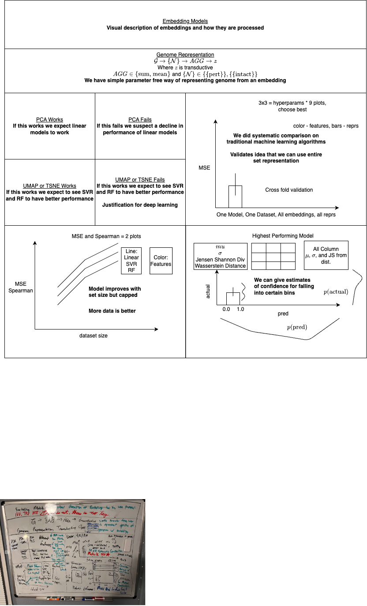
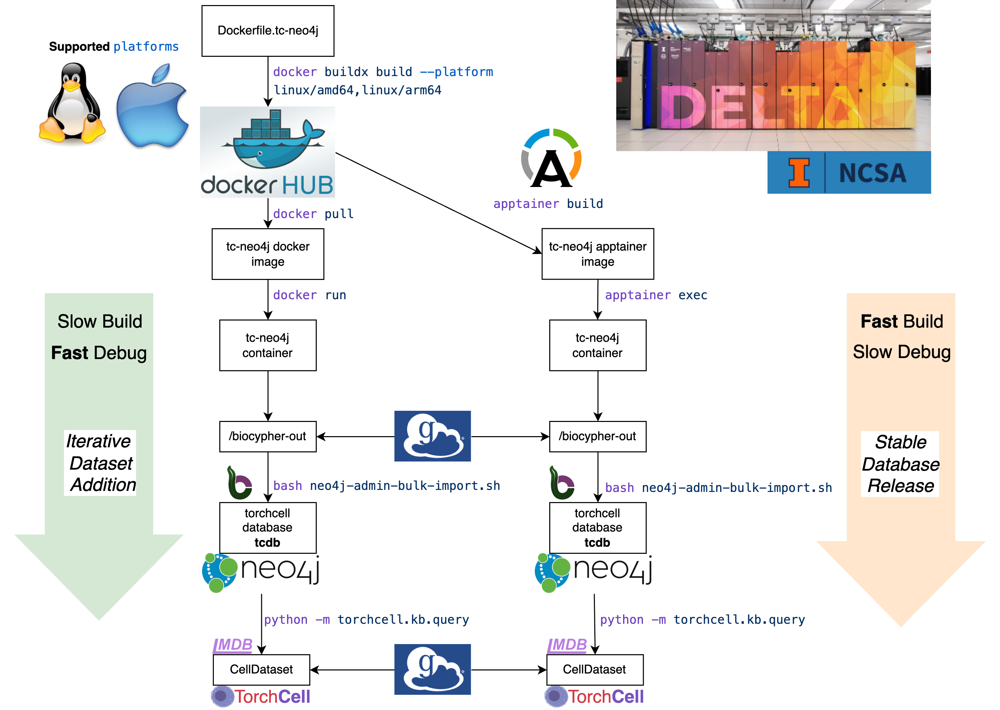
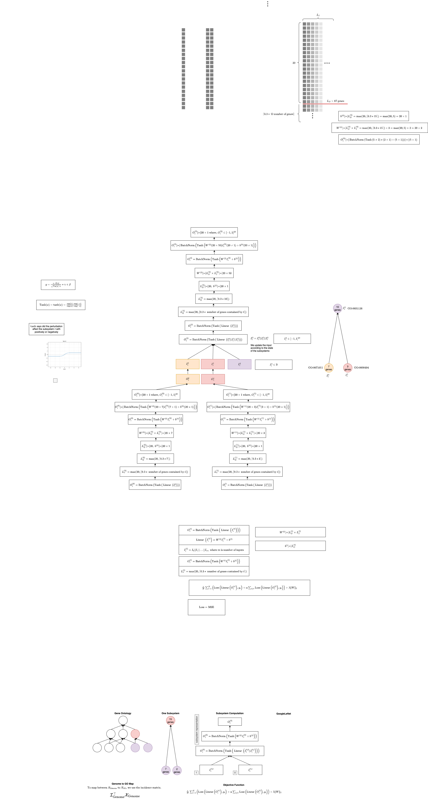
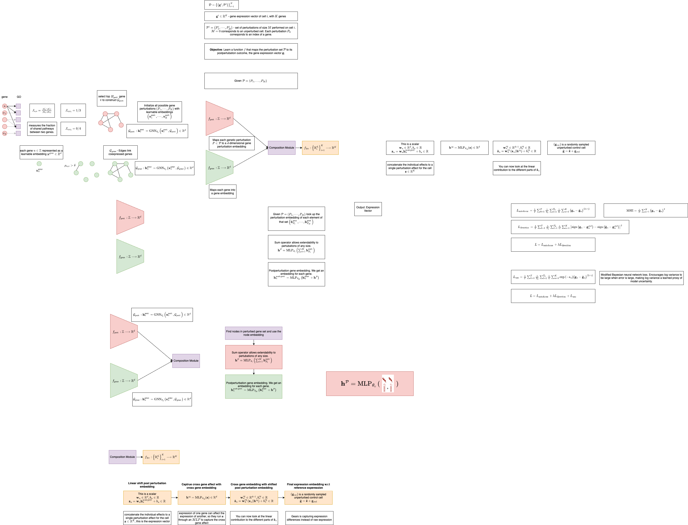

![[user.mjvolk3.torchcell.tasks.future#future]]
[[Outline|dendron://torchcell/paper.outline]]

## 2024.05.27

- [ ] Consider breaking out new tasks notes, timestamp
- [x] Globus transfer of `random_100`, `random_10`, and `random_1` to `delta` and transfer to `gilahyper`
- [x] Finalize `svr` plot style
- [x] Launch `random_100`, `random_10`, and `random_1` on `delta` for `elastic-net` → Looks like it finished successfully.
- [x] After `elastic-net` finishes, launch `random_100`, `random_10`, and `random_1` on `delta` for `svr` → We only launched for `1e3` and `1e4`. Will need to do `1e5_subset` later
- [x] `gilahyper` slurm accounting → spent a good deal of time on this setting up `mariadb`.. We still can't get the accounting to work using slurm. We can still run jobs. Stopping to run jobs and we'll worry about accounting later.
- [x] Submit query about increasing `wandb` rate limit [wandb rate limit increase request](https://weightsandbiases.zendesk.com/hc/en-us/requests/67845)

- [ ] After `svr` finishes, launch `random_100`, `random_10`, and `random_1` on `delta` for `random-forest`
- [ ] Launch `1e5` for `random-forest` with new `random` on `gilahyper`
- [x] Make same plots for `random-forest`
- [x] Make same plots for `elastic-net`, update
- [x] Add run id to results saved for `traditional ml` from

## 2024.05.26

- [x] Launch `SVR_1e03` on `gilahyper` → we are doing this because CV results don't match no CV results bars.
- [x] Add Random_100 and Random_10, and Random_1 → running `experiments/smf-dmf-tmf-001/conf/traditional_ml_dataset_sweep_random.yaml`
- [x] Finalize SVR plotting style. → Close!

## 2024.05.24

- [x] Check runs. → seem fine from agent logs.
- [ ] Fix plots.
- [ ] Adjust sweeps so they follow rate limiting and max number of agents.

## 2024.05.23

- [x] Check jobs → Reported `/scratch` issue was some software. Jobs back up. → GPU very busy only running one job, but queued up 4 total. 2 for `1e03` and 2 for `1e04`.
- [x] Collect lethal and synthetic lethal data into a dataset. For now we don't need adapter. #pivot Retrain and use best model. We don't have a best model trained, so will have to retrain once identified. Won't be able to finish this before 05.24, so we will just focus on other major tasks...
- [ ] #ramble I suspect that the reason error bars on cross validated cv are typically worse performing is that....

- [x] Finalize adding mean and std to `elastic-net` plots → might need a few more runs.
- [x] [[2024.05.23 - Issue with Hyperparameter Sweep|dendron://torchcell/torchcell.data.neo4j_query_raw#20240523---issue-with-hyperparameter-sweep]] → adjusted `readonly`.

- [ ] Launch

- [ ] wandb rate limits at 200 requests per minute... For sweeps 20 parallel agents are supported. This will change how we run sweeps some. [wandb docs](https://docs.wandb.ai/guides/track/limits#rate-limits)

- [ ] `svr` plot. → Issue is currently deduplicate data. → The current issue is that after deduplicate dataframe there isn't any data.. Deuplicate data frame should probably be split into two functions. The first is process_raw_dataframe. and the second should be deduplicate... We can just put these both is process_dataframe function. process_raw_dataframe should take the data and do the following

- [ ] Start `Delta` `1e03` and `1e04` for `svr` `random_1000`
- [ ] Start `Delta` `1e03` and `1e04` for `random-forest` `random_1000`
- [ ] Add `rmse` so we have plots that are in same units as label.

## 2024.05.22

- [x] Cannot connect to globus `gilahyper` any dir. Fix. → Transfers between two personal devices seem to require some sort of subscription. → In vscode folders can just be copy pasted... proably doing some rsync under the hood. → Was able to get `gilahyper` permissions with `globusconnectpersonal -start -restrict-paths 'rw~,/scratch'`giving it access to `/scratch` → `random_1000` transferred to all machines
- [x] Launch cpu jobs for `1e03` and `1e04` `random_1000`. Do `1e05` on `elastic-net`. → Just start with `elastic_net`
- [x] Fix elastic net plotting so we add error bars based on cross validation. mean as dot, std as lines. Bar will still be based on the dataset that is used in deep learning tasks. → made a lot of progress geting mean and std on.
- [x] All `1e03` `DeepSet` crashed... Investigate. → `offline` → moved to `online` → queue is backed up a bit on `Delta` → Run stopped because exceeded disk quota on user... → Lots of temp files stored in user putting them in `/scratch/bbub/mjvolk3` export env vars in `.bashrc`. → Crashed and suspended again due to `/scratch` being down.
- [x]#ramble any update to [[torchcell.datamodels.schema]] will change [[torchcell.data.neo4j_cell]] at least in the method of accessing of data. Data itself will be fixed. From brief review it seems that [[torchcell.neo4j_fitness_query]] will be unaffected but that deduplication within [[torchcell.neo4j_fitness_query]] will be affected as it also requires acessing data.

## 2024.05.21

- [x] Review `wandb` runs → We have some runs `svr` runs failing due to too little memory. We also have runs failing due to what looks like getting timed out. Some `svr` finishes in nearly 2 days indicating that we need longer run times and more memory. A good test job for `gilahyper`.
- [x] Get globus working on `gilahyper` → Looks like we can only transfer to the root disk then we will have to manually transfer to scratch. Tried to configure `/scratch` but we still cannot connect on the globous website.
- [x] Manually transfer data files on `gilahyper` to `/scratch` → This works fine and is reasonably fast.
- [x] Write `.env` on `gilahyper`.
- [x] Launch svr 1e05 sweep on `gilahyper` → Using all resources currently.
- [x] Update plots with 1e05. → Since they are incomplete this looks pretty bad.
- [x] Add a random vector embedding to the list of nodes embeddings
- [x] Run random datasets `1e03`, `1e04`, `1e05`  → ...
- [ ] Globus transfer random datasets to `Delta`
- [ ] Launch all random experiments except `1e05`
- [x] Launch `DeepSet` `1e03`  → ...

- [ ] Figure 2 outline update
- [ ] Paper outline
- [ ] Gantt
- [ ] Plan

## 2024.05.15

- [x] Write 2 page report for more compute on Delta → Needed 3 pages. Did a bit of a word vomit since I wanted to submit asap [[ACCESS Resource Report|dendron://torchcell/access.report.2024.05.15]].

## 2024.05.14

- [x] Fix random forest runs and relaunch
- [x] Log train and log folds
- [x] Clean up tasks

## 2024.05.13

- [x] Save deduplicated dataframe of results.
- [x] Collect average optimal parameters for elastic-net and random-forest.
- [x] Select parameters for partial sweep. → experiments/smf-dmf-tmf-001/conf/svr_1e05_subset.yaml and experiments/smf-dmf-tmf-001/conf/random-forest_1e05_subset.yaml

## 2024.05.12

- [x] No cross validation config for `1e5` on all traditional machine learning scripts
- [x] Launch random forest and SVR no cross validation

## 2024.05.07

- [x] [[tcdb-build-optimization.2024.04.02|dendron://torchcell/tcdb-build-optimization.2024.04.02]]
- [x] Add codon language model to sweeps.

# 2024.04.25

- [x] Globus transfer from Delta
- [x] We will not have plots for `one_hot_gene` `1e5`, as processes seemed to crash for this run but we should have all data. double check.
- [x] Globus transfer from local to Delta. → taking some time →
- [x] Run a script with the same agent on `svr` `1e04`
- [x] Figure out how to sync runs [wandb offline sync hook](https://github.com/klieret/wandb-offline-sync-hook).  → offline synce hook works.
- [x] This works for iteratively syncing wandb runs of the offline sync hook fails. → [[Manual Sync|dendron://torchcell/wandb.manual-sync]]
- [x] Processes are going slow due to cpus not fully utilized → Added n_jobs to random forest. Going to use more tasks on svr.

# 2024.04.24

- [x] [[delta.issue.2024.04.24|dendron://torchcell/delta.issue.2024.04.24]]
- [x] All traditional ml completed except for `traditional_ml_dataset_sweep_1e05-nt_window_5979_3468745.out` unsure why. one_hot_gene finished with #OOM
- [x] Restart `one_hot_gene` with more memory.
- [x] Check agent logs → Logs logs look like they are still running. Won't touch for now.
- 🔲 Add configs for other dataset sizes. 6 more for `1e4, 1e5` for three different models. → `1e4` added for elastic net. →
- [x] `1e3` `elastic-net` completed

## 2024.04.22

- [x] Commit `fudt` and `ProtT5` images
- [x] Outline of Figure 2. → 
- [x] Check on `Delta` Deep Set sweep. There is better fault tolerance now, I think this is taken care of by `wandb.finish()`, but we still get some broken pipes 💦 .  `nt_window_5979` and `nt_window_five_prime_1003` were configs with broken pipe. Check with offline mode.
- [x] Run offline `Delta` sweep. → This seemed to work fine, no pipe errors. → Try large experiment.
- [x] Traditional machine learning `402` and `404` failed, these are `normalized_chrom_pathways` and `one_hot_gene` → These failed again. → changed to run in offline mode... → Having a lot of issue on `Delta`. Running just one run now.
- [x] Launched [[smf-dmf-tmf-001.conf.deep_set-sweep_15.yaml|dendron://torchcell/experiments.smf-dmf-tmf-001.conf.deep_set-sweep_15.yaml]] Deep Set experiment. → Made `max_epoch = 2` mistake and runs seemed to be going well for an hour without any broken pipes. Restarted with 50 epochs.

## 2024.04.21

- [x] Commit traditional ml `1e4` images
- [x] Launch [[smf-dmf-tmf-001.conf.deep_set-sweep_14|dendron://torchcell/experiments.smf-dmf-tmf-001.conf.deep_set-sweep_14.yaml]] on `Delta`. → First time failed... Looks like it is related to data and we know there is a current issue with the `/scratch` file system. Trying to rerun. →
- [x] Commit traditional ml `1e5` images → takes a long time so only processed codon_frequency... probably don't need all this plotting but just exploiting what we have for now.

## 2024.04.20

- [x] Traditional ml `1e3` → Fixed issue with configs that didn't exist, this might be the issue with Deep Set experiments →  Took about 2 hours.
- [x] Traditional ml `1e4`

## 2024.04.19

- [x] `one_hot_gene`, `batch_size: 16`, `aggregation: sum`
- 🔲 Try to fix failed runs by inspecting logs
- 🔲 If the current plan doesn't work, then [wandb sweep controller script](https://docs.wandb.ai/guides/sweeps/local-controller)
- 🔲 I think issue in Deep Set could be related to buggy configs.

## 2024.04.16

- [x] Interactive sessions too slow [[delta.issues.2024.04.16|dendron://torchcell/delta.issues.2024.04.16]]
- [x] Running only deep set and we get broken pipe [[Running Only Deep Set|dendron://torchcell/delta.issues.2024.04.16#running-only-deep-set]]
- [x] Create dataframe with for traditional ml techniques. Support sum and mean aggregation. Support `is_pert`.
- 🔲 Log dataframes to `wandb`, set up PCA, TSNE and UMAP. Log table and pngs.

## 2024.04.10

- 🔲 setup genome for ddp

## 2024.04.06

- 🔲 Run grid to try and isolate batch multi-gpu job issue.

## 2024.04.05

- [x] Check Esm embeddings local run `Delta`. → `Delta` worked. Commit and globus to local.
- [x] local test categoricals → [[torchcell.datasets.sgd_gene_graph]]
- [x] Test `Esm`
- [x] Adding categoricals is way to involved right now, and we need to launch models. We need to most files to make this happen. Datasets, `HeteroData`, models, etc. Putting on hold for now, although it would be good add.
- [x] Make chromosome number a numerical feature. → [[Sgd_gene_graph_hot|dendron://torchcell/torchcell.datasets.sgd_gene_graph_hot]] it is working properly
- 🔲 Launch experiments

## 2024.04.04

- [x] Write notes on #wandb.torchcell_smf-dmf-tmf-001.loader_opt_002 → did not complete overnight. Runs crashed for some unknown reason. Logs are sparse. → Kept 4 completed runs and rerunning.
- [x] Esm embedding status. → Locally we were able to compute all but 3B and 15B. Add Cuda device if available, moved to `Delta` and running 3B and 15B. Drop in performance on Esm2 happens from 150M to 650M, but we still might want to use a smaller model because of reduced dimension. → Trying to run on `Delta` regardless.
- [x] Nucleotide Transformer Embedding status. → Completed on `Delta`
- [x] `SGD` graph node features probably put on Raw. → already had something going for this. Node features put on `G_gene`. Naming probably isn't perfect. → sort of misappropriating the `BaseEmbeddingDataset` [[torchcell/datasets/sgd_gene_graph.py]] for instance `MODEL_TO_WINDOW` no longer makes any sense.
- [x] Need to recompute Esm since we saved as `numpy` `ndarray`. → Did on `Delta` → `Delta` login node is acting up. Did from terminal ssh. → globus to local... → Somehow numpy didn't get removed. Unsure what happened. Commited Again and relaunched on `Delta`.
- [x] Check if Esm embeddings works. → Worked with most recent update on delta. Shape issue
- 🔲 I wanted to used torch.Embedding to encode the categorical variables in [[Sgd_gene_graph|dendron://torchcell/torchcell.datasets.sgd_gene_graph]]... turns out nobody really does this because it creates serialization issues in the data loader when trying to serialized vectors with gradients attached. Guess now we know. The proper thing to do is to pass the data to the model, and to create the embedding within the model. → moving to [[user.mjvolk3.torchcell.tasks.future#future]]
- [x] I think it is worth adding categorical variables. If we perturb a gene involved in an important pathway or many important pathway there should be fitness consequences →  → This also provides a route directly adding gene ontology to nodes without additional layers of abstraction or graph mapping. This only works for categorical annotaion, and in the case of gene ontology it completely loses structure. But this creates a nice comparison of structure based and structure free.
- 🔲 Try to combine embeddings with node data.
- 🔲 Deep Set models parameterize by add and mean for `scatter_add` and `scatter_mean` → Not really sure what this mean, moving to [[user.mjvolk3.torchcell.tasks.future#future]]
- 🔲 Count parameters script, also plot distribution of sizes.
- 🔲 Check no issue with model. [[deep_set-sweep_05|dendron://torchcell/experiments.smf-dmf-tmf-001.conf.deep_set-sweep_05.yaml]]
- 🔲 Check no issue with embeddings. [[Yaml|dendron://torchcell/experiments.smf-dmf-tmf-001.conf.deep_set-sweep_06.yaml]]
- 🔲 Add all possible embeddings and test run under optimal loader.
- 🔲 Add gradient log.
- 🔲 Run loader overnight?, try sweep on `1e2` over configs 2 epochs.
- 🔲 [[Deep_set_transformer|dendron://torchcell/torchcell.models.deep_set_transformer]] add `scatter_add` and `scatter_mean`

## 2024.04.03

- [x] Check on `tcdb` run overnight. → #wandb.tcdb.docker_v_m1_study_003
- [x] Check on Nucleotide Transformer embedding run overnight. → We still get #OOM with max resources on one GPU node, yet this doesn't happen on interactive node.
- [x] Try to compute Nucleotide Transformer Embeddings with a smaller subset of genes. Works, but the size that don't have `undersize` can fail if they are against the chromosome edge. Leaving these out and only consider allow_undersize.
- [x] Write #wandb.tcdb.docker_v_m1_study_002
- [x] Submit help for running scripts on Delta. → [[help.2024.04.03 |dendron://torchcell/ncsa.help.2024.04.03]]
- [x] Fixed issue with specifying memory [[2024.04.03 - Memory Formatting is MB|dendron://torchcell/ncsa.help.2024.04.03#20240403---memory-formatting-is-mb]]
- [x] Check `fudt` works. → works locally
- [x] Write #wandb.tcdb.docker_v_m1_study_003
- [x] Esm embedding dataset. → Might have enough now, trying to compute all regardless. →
- [x] loader with `1e4` #wandb.torchcell_smf-dmf-tmf-001.loader_opt_002 → Running on some narrower parameter ranges on 2 epochs.

## 2024.04.02

- [x] Review worst runs on parallel lines plot. #wandb.torchcell_smf-dmf-tmf-001.loader_opt_001
- [x] Report on loader parameters. Give best parameter and estimate times for runs #wandb.torchcell_smf-dmf-tmf-001.loader_opt_001
- [x] Wandb Bayesian optimization only takes continuous variables. → [[2024.04.02 - Wandb Bayesian Optimization Only Operates on Continuous Variables|dendron://torchcell/wandb.bayesian-optimization#20240402---wandb-bayesian-optimization-only-operates-on-continuous-variables]] → The source expresses doubt in parallelizing runs with Bayesian optimization. → Need continuous model parameterization.
- [x] Compute Nucleotide Transformer embeddings on delta. → There have been issues with this. Outputs are not getting logged properly. → Keep getting #OOM, not it is really taking long.. → submit a help request. With exact match interactive srun we cannot run the script [[194056|dendron://torchcell/scratch.2024.04.02.194056]]
- [x] `1e4` dataset. → globus transferred
- [x] Change [[Deep_set|dendron://torchcell/torchcell.models.deep_set]] to have continuous parameterization. Thinking `in_channels`, `hidden_channels`, `out_channels`, `num_layers`.
- [x] Meet with Neo4j consultant. → Made 3 slides. → There some some concern over whether using Enterprise is allowed but I followed up providing the Neo4j documentation. → [[Enterprise|dendron://torchcell/neo4j.enterprise]]
- [x] Count parameters script → started but didn't make a ton of progress... Not sure if we should just run sweep then make parallel coordinates plot from that... I also want to see distributions of model sizes.
- 🔲 Esm embedding dataset.
- 🔲 Add all possible embeddings and test run under optimal loader.
- 🔲 #wandb.tcdb.docker_v_m1_study_002
- 🔲 #wandb.tcdb.docker_v_m1_study_003

## 2024.04.01

- [x] `1e4` not working for loader test → deleted `1e4` and recompute locally. Launched job for `1e3` can just multiple for order magnitude to get finish estimate.
- [x] `tcdb` more 6hr job builds #wandb.tcdb.docker_v_m1_study_003
- [x] Nucleotide transformer embedding opt → looks to work on local. Added slurm job.
- [x] Launch Nucleotide transformer embedding job on `Delta`

## 2024.03.31

- [x] Check CaLM embeddings → [[2024.03.31 - Overcoming Semaphore Error when Processing CalM Dataset|dendron://torchcell/torchcell.datasets.codon_language_model#20240331---overcoming-semaphore-error-when-processing-calm-dataset]]
- 🔲 Different spiking levels in DmfCostanzo suggest that we should be setting chunk size for different functions to squash memory usage when needed.
- 🔲 Rerun CaLM embeddings with finished script to make they can be reproduced.
- 🔲 Compute all nucleotide transformer embeddings.
- 🔲 Try to do a `1e6` local docker build.
- 🔲 Add dataset to the data model
- 🔲 Write brief report with table on reasonable parameters for `tcdb` build → [[2024.03.28 - Assessing TCDB Build Parameters|dendron://torchcell/torchcell.knowledge_graphs.create_scerevisiae_kg#20240328---assessing-tcdb-build-parameters]]

## 2024.03.30

- [x] Launch sweep for `DeepSet` on `Delta` → wandb is acting up cannot run loader even test. The sweeps take forever to make in interactive mode. → Launched but waiting... → Ran for 2 hours and never started... must be because of the `wandb` issue.
- [x] Using tags to track quick investigations just because `wandb` uses tag language and I haven't found a way to save view other than reports which are a bit clunky. → #wandb.tcdb.docker_v_m1_study_001
- [x] #ramble We have to know where the data comes from... in terms of which dataset. The dataset property would be very nice for limiting queries to data from different sources. We could also keep the query simple and get the dataset index like we get phenotype label index. → This is a difficult problem to solve since it does not currently exist within the data model but I believe it should. We can just add it as another entry in the reference and the experiment. → I think we add to data model... still thinking on it.
- [x] Add prediction stats table.
- [x] Add CaLM embeddings. → [[2024.03.30 - CaLM Model Input Description|dendron://torchcell/torchcell.datasets.codon_language_model#20240330---calm-model-input-description]]
- [x] Dataset registry → [[2024.03.31 - Overcoming Semaphore Error when Processing CalM Dataset|dendron://torchcell/torchcell.datasets.codon_language_model#20240331---overcoming-semaphore-error-when-processing-calm-dataset]]
- 🔲 Compute all nucleotide transformer embeddings. → Did CaLM embeddings instead.
- 🔲 Try to do a `1e6` local docker build. → Did CaLM embeddings instead.

## 2024.03.28

- 🔲 Try to identify reasonable parameters for `tcdb` build → [[2024.03.28 - Assessing TCDB Build Parameters|dendron://torchcell/torchcell.knowledge_graphs.create_scerevisiae_kg#20240328---assessing-tcdb-build-parameters]] → Taking longer than expected to get everything going because I forgot that with Apptainer we need to push latest commit to redo `tcdb` build. →  ...
- 🔲 We have to know where the data comes from... in terms of which dataset. The dataset property would be very nice for limiting queries to data from different sources. We could also keep the query simple and get the dataset index like we get phenotype label index.
- [x] Create datasets, then globus transfer them to `delta`, launch delta sweep on `1e4` data.

## 2024.03.27

- [x] Try 20% decrease on `tcdb` chunk size → [wandb log](https://wandb.ai/zhao-group/tcdb/runs/67iwlmsp?nw=nwusermjvolk3) → looking like it has reduced memory. → #wandb.tcdb.docker_v_m1_study_001
- [x] Taking long on M1 with small chunk size, but we should likely wait it out. → was not going to finish so killed.
- [x] #ramble I don't know if we need the phenotype_label_index yet... and it might take too much time to compute with full dataset. For now try to avoid using it.
- [x] Test `TmfKuzmin2018` adapter no docker. → works
- [x] If we cannot get docker container to work, manually transfer successful M1 run. → finally got it to work, reduced process cpus... Not sure why this makes sense.
- [x] Look into learning rate scheduler. → `lightning` integration
- [x] Look into hyperband for speeding up neural architecture search. → Offered by wandb
- [x] #ramble We wan't to be able to down sample `1e3`, `1e4`, `1e5`, `1e6` then total which is about `2e7`. Last time we learned that evening training on `1e6` can be difficult. To reduce this difficult we hare starting with embeddings of only one type and using smaller datasets. → Instead of changing query, just going to down sample from query.
- [x] Add dataset to experiment and reference for index subsetting by dataset. This probably makes most sense for reducing `dmf` count. We would like the coherence for keeping as much `dmf` data from `Kuzmin` as possible. → move to ![[user.mjvolk3.torchcell.tasks.future#future]]
- [x] `chunk_size: 1e2` is abysmally slow 🐢 and barely uses any memory, a kill and use `1e3`. [wandb log](https://wandb.ai/zhao-group/tcdb/runs/q38d00ck?nw=nwusermjvolk3) → [wandb log](https://wandb.ai/zhao-group/tcdb/runs/yj2qkwpd?nw=nwusermjvolk3) of the last run run on delta that is related. This run memory peaks at 90% and has 2x less cpu. Since 120 cpus means more memory for each process I think `5e2` makes the most sense to try, but will try to fail fast with `1e3` first before nights end.
- [x] Get dataset of about 1,000 samples. → whole dataset is 346,321 large.
- [x] Subset dataset.
- [x] Training loop on local m1 for set net with fungal embeddings.

## 2024.03.26

- [x] Rebuild `DmfCostanzo2016` nodes only, on `Delta` to investigate down cpu workers → Uses multiprocessing during duration of run.
- [x] Rebuild `DmfCostanzo2016` nodes and edges on `Delta` to investigate down cpu workers → Looks like it starts to use multiprocessing during the beginning of the `write_edges`, but the starts using only a single process. → Couldn't easily identify the issue so did some light rewriting of the the adapter for this dataset, commented out, and reverted to using the [[torchcell.adapters.cell_adapter]]. → Started another `Delta` run with this with the belief that the issue is somehow in the modified class.
- [x] [[2024.03.26 - Uncertain if is is Feasible to Keep a Base Class|dendron://torchcell/torchcell.datamodules.cell#20240326---uncertain-if-is-is-feasible-to-keep-a-base-class]]
- [x] `DmfCostanzo2016` adapter with [[torchcell.adapters.cell_adapter]] base class update? → `write_nodes` is looking roughly 3hr instead of 2hr... started with [[torchcell.adapters.kuzmin2018_adapter]] but makes more sense to just run [[torchcell.knowledge_graphs.create_scerevisiae_kg_small]] outside of docker container.
- 🔲 CellDataModule

## 2024.03.25

- [x] Check on database build. → [wandb log](https://wandb.ai/zhao-group/tcdb/runs/558kg0si?nw=nwusermjvolk3) Killed job because we only have one process working. I think this might be due to the memory spike. The expected time is also 11 hrs before seeing processes reengage which is a sign something is wrong. Restarting.
- [x] Check `/var/lib/neo4j/import.report` for "bad" entries, consider rerun. → `There were bad entries which were skipped and logged into /var/lib/neo4j/import.report`, this typically indicates some missing links. In our case we have thousands of these.. `77e955a91470ec68c354e445391d0ea5c96f6fc3059a917a9e72811ae98b4b30 (global id space)-[PerturbationMemberOf]->858133554c1d66a52aca695ec905be65a7e8c6dfc984fb8d2cc5022f6b76a242 (global id space) referring to missing node 77e955a91470ec68c354e445391d0ea5c96f6fc3059a917a9e72811ae98b4b30` → Found the issue [[torchcell.adapters.cell_adapter]] we weren't returning lists of perturbation nodes.
- [x] [[2024.03.25 - Some Cpus Not Utilized Because How We Set Workers|dendron://torchcell/torchcell.knowledge_graphs.create_scerevisiae_kg#20240325---some-cpus-not-utilized-because-how-we-set-workers]]
- [x] Run query to check edges → [[2024.03.21 - Query that Identified ExperimentReferenceOfCount Issue in Database|dendron://torchcell/cypher-queries#20240321---query-that-identified-experimentreferenceofcount-issue-in-database]]
- [x] Run query for fitness data [[torchcell.data.neo4j_cell]] → works now we need to handle duplicates
- [x] The thought on duplicates is to provide a deduplicator class that handles the duplicates. This depends on the details of how the modeler chooses to model the domain so we should just design an interface for doing so. For now I am hardcoding this in. → Writing a deduplicator class. → [[user.mjvolk3.torchcell.tasks.future#future]]
- 🔲 Outline. Consider training on `pert` added to table
- 🔲 Harmonize data.
- 🔲 `One_Hot_Gene -->  Set_Net --> Fitness`
- 🔲 Start training.
- 🔲 `FUDT --> Set_Net --> Fitness`
- 🔲 `FUDT --> Set_Net --> Fitness`
- 🔲 Add CaLM embedding

## 2024.03.24

- [x] Compute entire dataset, then run `gene_set`. → [[2024.03.24 - Optional Multiprocessing on Batch|dendron://torchcell/torchcell.dataset.experiment_dataset#20240324---optional-multiprocessing-on-batch]]
- [x] Compute entire dataset, then run `experiment_reference_index` → Did analogous as `gene_set` using `CpuExperimentLoaderMultiprocessing`
- [x] [[2024.03.24 - SSL Apptainer Bug|dendron://torchcell/torchcell.knowledge_graphs.create_scerevisiae_kg#20240324---ssl-apptainer-bug]]
- [x] We started on some code to use multiprocessing on batches, but I want to hold off on this. For now I am just putting the progress into the note file. Keeping current since it works and the times for `gene_set` and `experiment_reference_index` aren't as bad as I thought. Less than an hour for each. → [[2024.03.24 - Multiprocessing on gene_set and wip on experiment_reference_index|dendron://torchcell/torchcell.dataset.experiment_dataset#20240324---multiprocessing-on-gene_set-and-wip-on-experiment_reference_index]]
- [x] We need to be using a different `bashrc` in the apptainer, this is causing issues with the env. → for now we just run `conda init` then resource. Not perfect but will work consistently. Will cause need for reinit in terminal

## 2024.03.23

- [x] Review database build. → [[2024.03.23 - Killed do to slow gene_set and experiment_reference_index|dendron://torchcell/database.apptainer.builds.2024.03.22#20240323---killed-do-to-slow-gene_set-and-experiment_reference_index]]
- 🔲 Parallelizing is necessary for `Delta`, we knew this before 😕, but the slowness on M1 made me think it wasn't worth it. Performance will be better with many cpu and can run serially on local.
- 🔲 Outline. Consider training on pert.
- 🔲 Harmonize data.
- 🔲 `One_Hot_Gene -->  Set_Net --> Fitness`
- 🔲 `FUDT --> Set_Net --> Fitness`
- 🔲 `FUDT --> Set_Net --> Fitness`
- 🔲 Add CaLM embedding

## 2024.03.22

- [x] Parallelize `gene_set` and experiment_reference_index → for various reasons this just makes things slower. For `gene_set` we don't set ops and for experimental reference index we have to do serializing and deserializing every time. There might be a big brained way to do it but for now moving on.icO
- [x] Rebuild `tcdb` I think that this will now → a lot of import errors after refactoring. Need to find a better way to do this. Maybe just with search replace over work space. → I also think that this will slove teh import error.
- [x] [[2024.03.21 - Query that Identified ExperimentReferenceOfCount Issue in Database|dendron://torchcell/cypher-queries#20240321---query-that-identified-experimentreferenceofcount-issue-in-database]]

## 2024.03.21

- [x] Overnight plot attempt failed because with an #OOM This happened do to specifying the necessary size of the Heap [[2024.03.20 - Trying to Speed up Querying Locally|dendron://torchcell/neo4j.conf#20240320---trying-to-speed-up-querying-locally]], [[experiments.smf-dmf-tmf-001.node_removal_domain_overlap]]
- 🔲 We have this strange issue that whatever is run from the terminal in docker ends up getting prepended to the `neo4j.conf` file... Not sure how this makes any sense. [[2024.03.21 - Terminal Commands Copied into neo4j.conf File|dendron://torchcell/neo4j.conf#20240321---terminal-commands-copied-into-neo4jconf-file]] → Move to [[torchcell.tasks.future|dendron://torchcell/user.mjvolk3.torchcell.tasks.future]]
- [x] #largest-possible-db - See if we can build the largest possible lmdb with a simple `e`, `ref` query [[torchcell.neo4j_fitness_query]] → we could be it is too small... only a million `(e, ref)` → investigate.
- [x] Querying over all experiments and references does not yield the total number of experiments → This is because we have are missing some `ExperimentReferenceOf` edges in `DmfCostanzo20162016`→ edges are missing due to the parallelization of computing `ExperimentReferenceIndex`. I saw this before and in haste decided we didn't need to worry about it. →  Can run test at completion of dataset creation that the sum over the experiment_reference_index.index is the len of dataset. → Delaying parallelization for now.
- [x] [[2024.03.21 - scerevisiae_small_kg duplicates by domain overlap|dendron://torchcell/experiments.smf-dmf-tmf-001.node_removal_domain_overlap#20240321---scerevisiae_small_kg-duplicates-by-domain-overlap]]
- [x] On local M1 the experiment_reference_index will approximately `1 hr 15 min`.

## 2024.03.20

- [x] Rookie mistakes... I send Globus request to wrong email... Resend. → Resent. → There seems to be some misunderstanding in why the login is failing → follow up.
- [x] For now transfer with `rsync` → [[Transfer Database with rsync|dendron://torchcell/computer.delta.rsync#transfer-database-with-rsync]] started run → Globus fixed by signing in incognito mode to go back through authentication. Something likely wrong with caching in chrome browser. Then switched back to normal browser and everything works.
- [x] Directly transferring folder with `.db` files did not work, going to try and transfer the `biocypher-out` dir then do bulk import again. → Import took 40 mins.
- [x] `cypher-shell` doesn't open [[2024.03.20 - Cannot start cypher-shell due to Neo4j lock|dendron://torchcell/cypher-shell#20240320---cannot-start-cypher-shell-due-to-neo4j-lock]]
- [x] Notes on query [[smf-dmf-tmf-001.query|dendron://torchcell/experiments.smf-dmf-tmf-001.query]]
- [x] Meeting with the Neo4j staff plan. → [[neo4j.meeting.future|dendron://torchcell/neo4j.meeting.future]]
- [x] Added logs dir in docker run so we can try to diagnoseif there are query issues. → Also keeping a note on ne4j.conf [[Conf|dendron://torchcell/neo4j.conf]]
- 🔲 We could automate with `rsync` if we wanted since it takes some time for transfer and upload. Likely going to be at least 2 hrs.
- 🔲 Task for `tcdb: docker run`
- 🔲 This will now take forever with large database but we need to get a plot that will help to filter the domain overlap [[experiments.smf-dmf-tmf-001.node_removal_domain_overlap]].
- 🔲 Plot `std` of `fitness_means` to determine how to handle duplicates.
- 🔲 Can take the duplicate idea and just output the fitness value.
- 🔲 outline
- 🔲 gantt
- 🔲 Figure for comparison of `dmf` and resolution of data
- 🔲 Harmonize
- 🔲 Common cypher queries [[Cypher Queries|dendron://torchcell/cypher-queries]] These ultimately need to be put in their respective `.cql` file or notes, for now a plain text description of the query would help.

## 2024.03.19

- [x] Jobs failed → `torchcell` wasn't imported in [[torchcell.knowledge_graphs.create_scerevisiae_kg]] and the database wasn't closed in docker. `STOP DATABASE torchcell`
- [x] #expore "Unlike other databases neo4j graph database doesn't need to compute the relationships between the data at query time. The connections are already there. Because of this queries of deeply connected data are orders of magnitude faster." [neo4j youtube](https://www.youtube.com/watch?v=sZDcK910i34) → [Neo4j Langchain Integration](https://neo4j.com/labs/genai-ecosystem/langchain/?utm_source=Google&utm_medium=PaidSearch&utm_campaign=Evergreenutm_content=AMS-Search-SEMCE-DSA-None-SEM-SEM-NonABM&utm_term=&utm_adgroup=DSA-use-cases&gad_source=1&gclid=CjwKCAjw7-SvBhB6EiwAwYdCAbrKlkVLVcFRWuDAi7Lq-KogpO4Hi6lOYQv91NP8az_KpPk-Eo5eVxoCBg4QAvD_BwE)
- [x] #explore [neo4j youtube - Knolwdge Graph Based Chatbot](https://www.youtube.com/watch?v=XObtoB_g_CA&t=1708s) → neo4j `node properties` and `relationship properties` define schema... I think the biocypher schema might get added... maybe ChatGSE is necessary.
- [x] #explore [neo4j youtube - Neo4j and LangChain](https://www.youtube.com/watch?v=BmQ8VTM3Izg) → can follow this code for tcdb natural language interaction if we wanted. Could this `pdf` be added to existing data model? How would `pdf` change existing data model? Which files would need to be rewritten (This is probably too deep) ?
- [x] #explore This could be an alternative to [ChatGSE](https://www.youtube.com/watch?v=OV2ZIWFBe0s) should read up more on ChatGSE before making a decision. I do want to consider some custom control. For instance mapping `pdf` to the [[torchcell.datamodels.schema]]. Could create another DB for representing project itself, or `pdfs` from `zotero`. Create a new DB of proposed dataset, could even just ask for python script output of Dataset give base class and common pattern. Might want to wait on this a bit.
- [x] Config docker neo4j db → we changed workers to 8. This greatly helps speed up querying.
- [x] Look into transfer of db on `delta` to local →  Waiting on this... I think I can just use Globus, but I haven't heard back about fixing my Globus activation.
- [x] Inspect failed `Delta` build → #OOM but no memory spikes [wandb log](https://wandb.ai/zhao-group/tcdb/runs/pm1386pt?nw=nwusermjvolk3)
- [x] Get up to in new experiment`CellModule` → made it but we can't be sure that we don't have the duplicate with `dmf` fitness over the same phenotype in either `Kuzmin` or `Costanzo`. Might be easier to check the raw data to confirm their different now, but we will need a more robust solution for this.
- 🔲 Deduplication must be done at the proper stage. There is a question of have more and more difficult cypher queries or doing some python filtration after collection all the data. → It makes most sense to do the filtration and check for duplication here [[torchcell.neo4j_fitness_query]]. I did a check that helped me refine the query adding temperature and media specifications for the reference.
- 🔲 Check Nones... on db [[94310|dendron://torchcell/scratch.2024.03.19.094310]]
- 🔲 CaLM model

## 2024.03.18

- [x] Changed my mind set net is on one hot is the fastest we can get going.
- [x] `RuntimeError: "addmm_impl_cpu_" not implemented for 'Half'` some issue with the `ProtT5` model... as much as it pains me... ignore for now.
- [x] We still want to capture the `wt` or what we are now calling `ref` but this is dependent on `ref` resolution, single `ref`, so I am delaying doing this.
- [x] Add label to data.
- [x] Hanging envs to `None` → `self.raw_db.env = None` this was the tricky one.
- [x] Add `gene_set` query to `cql` → First I want to print out the schema. → This has been a long journey many hours spent to discover that the neo4j database has an error. We did not properly build out all perturbations, so querying on them doesn't work. 💣 Not what we wanted... 🥺. Big time suck. OMG...  → [[2024.03.18 - Proper Indentation|dendron://torchcell/database.common-issues#20240318---proper-indentation]]
- 🔲 Get up to in new experiment`CellModule`

## 2024.03.17

- [x] #ramble We keep both lmdb [[torchcell.neo4j_fitness_query]] and the lmdb for [[torchcell.data.neo4j_cell]] although they are mostly identical. Within [[torchcell.data.neo4j_cell]] we need to eventually add a `experimental_reference_index` resolver. This should likely be a custom function. For fitness all fields identical but the standard deviation, take the highest standard deviation. Of course more complicated things could be done, but I'd like to put this off long as possible. What if for instance the liquid cultures have a higher mean growth, or they have a larger support? We could compress > 1 to match the support on solid media. This is so custom and too difficult to generalize that I think the CellDataset abstraction is still hard to concretize.
- [x] `get` method → `len` method wasn't working due my accidental use of two different init methods for `lmdb`. → Works well now with `process_graph`
- [x] #ramble - Now we fulfill only what is needed to complete the table. We can abstract the graph construction later, I will build it into the classes for now.
- [x] Need data to be heterogenous at least in edges [[2023.10.22|dendron://torchcell/user.Mjvolk3.torchcell.tasks#20231022]]. `pyg` `HeteroData` allows for both nodes types and edge types. Should we use by default? → Yes we should it'll be confusing otherwise. This is a nice generic way of doing things since we intend to model the domain as a `DiMultiGraph`.  → This is taking a bit long as I am trying to flesh out all of the use cases necessary in the table for supporting the multigraph. → Things work pretty well now. Not well tested, and not general but working well enough to move on.
- [x] #ramble dataset that take some time to compute like the embeddings datasets should be computed over the superset of nodes that has the largest know subset. This starts to make little sense if are basing everything off of differences from genome. For instance we have the issue that if `genome=None`, the `gene_set` is compute based off the `experiments`, then if you wanted sequence embeddings for these you would need their sequence, meaning you need the genome. So there is a loop. But you would still be able to do simple things like `one_hot`.
- [x] Install CaLM model → Installed with `python -m pip install git+https://github.com/oxpig/CaLM`, ran README example and it works.
- [x] Maybe consider adding `GeneSet` to datasets. This would solve some of the joining issues and would be able to remedy index error. #ramble the embeddings in general would be best to be the union of all datasets.
- [x] The easiest model to start with is SAG and `fungal` and `one_hot` → this is actually a little more difficult in that we need to build out the SAG model still and deal with edge info etc. pause.
- [x] Move `sgd_delta` into `sgd`... → graphs should work now.
- 🔲 Table write based on [[dmf-fitness-table.02|dendron://torchcell/paper.outline.dmf-fitness-table.02]]. → Need systematic way to write data to table. Can move to `TorchCell_Paper` on `wandb`
- 🔲 Cover all the data variants for the set of experiments. [[dmf-fitness-table.02|dendron://torchcell/paper.outline.dmf-fitness-table.02]] Calling it dmf right now but the same table can and will be used for `tmf` first.
- 🔲 Checkpoint models and build out separate scripts for model evaluation. Can add unique identifier to [[dmf-fitness-table.02|dendron://torchcell/paper.outline.dmf-fitness-table.02]] and [[02|dendron://torchcell/paper.outline.dmf-fitness-table.02]]
- 🔲 Check if it works with genome. → works but need to see if the genome size is correct. →
- 🔲 Check if it works with graphs. Will likely need to write some function conversion to torch.
- 🔲 Check if works with embedding datasets. →
- 🔲 Handle multiple experimental references.
- 🔲 Check if graphs work and evaluate their structure.

## 2024.03.16

- [x] [[torchcell.data.neo4j_cell]] only requires on arg to start → To do this the only thing that makes sense is experiments, so the query. You can take the `gene_set` from the query and automatically one hot the genes. I like this idea as it brings more intuition to the building process. Another option is to require the passing of a `gene_set`, I think it makes more sense to have some resolution for getting the relevant `gene_set` based on `GeneSetPriority` `enum`. → Not using `enum`, just some conditional logic in `get_cell_graph` → `get_cell_graph`, later we might want to make the `cell_graph` it's own object. I think we can use an ABC on `SCerevisiaeGraph` [[torchcell.graph.graph]] 💡
- [x] Note on Neo4j db schema print out [[Automated Query to get Schema|dendron://torchcell/neo4j.delta#automated-query-to-get-schema]]
- [x] We need to see the `networkx` graph structure. Globus transfer data for graphs. → Can't login to globus → Rebuild data locally and troubleshoot globus. → Submitted a ticket via email. → transfer with `rsync` [[Rsync Example to Copy Data From Delta To Local|dendron://torchcell/computer.delta.rsync#rsync-example-to-copy-data-from-delta-to-local]] → `rsync` succeeded. → Trying to rebuild the data failed.
- [x] `subset_graph` → "experiments are all you need to get started". → The reason we split up the two datasets is that we wanted one to be concerned mainly with just querying the data, and the next to be concerned with transforming the data into usable form using `torch` and `pyg`. This also separates the process from needing the database running vs having the raw data on disk and being able to move on from any potential `neo4j` issue. This will help more readily isolate bugs → We don't have the data downloaded from `sgd`. → changing to `process_graph` since we can include label adding with the new data model. → Left off with trying to get indexing to work in `get` method
- 🔲 One class to implement dataset
- 🔲 There is some good stuff in [[torchcell.datasets.cell]] that we don't want to forget about like `extract_subgraph`

## 2024.03.15

- [x] Dependency injection into [[torchcell.data.neo4j_cell]] we are building a base class → composition makes more sense here since we can pass fewer variables and make paths same.
- [x] #ramble the `gene_set` and `experimental_reference_index` should be parallelized because we will compute them for every dataset. The other indices do not need to be parallelized. When we have built up a list of common types of indices taken over [[torchcell.datamodels.schema]] we can add a configuration for which of these to compute and pallelize over each of them.
- [x] Fix the `experimental_reference_index` in [[torchcell.neo4j_fitness_query]] so it is one index and not a list of indices → This is actually a list of the `ExperimentalReferenceIndex`, maybe we should rename the attr to `ExperimentalReferenceInidces`. → We are not getting the right index yet since aren't capturing the 26 C reference. → Seems to work correctly now.
- [x] Add `gene_set` to the [[torchcell.neo4j_fitness_query]] → added.
- 🔲 Add multithreading for local neo4j db config
- 🔲 In the `init` we should compute the gene set that we can populate a minimum graph.
- 🔲 Mechanism for constructing `pyg` data objects.

## 2024.03.14

- [x] simple query note →  [[Simple counting of experiment nodes|dendron://torchcell/torchcell.neo4j_fitness_query#simple-counting-of-experiment-nodes]]
- [x] smf, dmf query → [[Smf Dmf Benchmark Query Results on Small Knowledge Graph|dendron://torchcell/torchcell.neo4j_fitness_query#smf-dmf-benchmark-query-results-on-small-knowledge-graph]]
- [x] smf, dmf, tmf query → [[Smf Dmf Tmf Benchmark Query Results on Small Knowledge Graph|dendron://torchcell/torchcell.neo4j_fitness_query#smf-dmf-tmf-benchmark-query-results-on-small-knowledge-graph]]
- [x] Update `database/build/build-image-fresh_linux-arm.sh`
- [x] Use `chmod a-w dir` to protect `biocypher-out` bulk import dirs. → added to `amd` and `arm` builds.
- [x] Add this to [[torchcell.datamodels.schema]] `# we should get rid of BaseExperiment and just use experiment this way we can always decode the data from neo4j`, right now we have to consider experiment type in the query lmdb [[torchcell.neo4j_fitness_query]], which adds annoying complexity. #ramble this will lost the class distinction of which experiment it which but we could always add this back as a `enum` property or something.
- [x] #ramble From datasets I think it would be nice to return the data objects, but then adapters would have to be fixed. We opted not to do this is originally because it made multiprocessing easier, but I think we can use the deserialization in the adapter if we write the model and just make `transform_item` transform into dict, then it would be much more like a dump method. Should be done after pipeline completion. → copying to future.
- [x] Create query database for raw creating raw data. → Created with the intention of instantiating the database within the raw dir of the `CellDataset`
- [x] Add query with media and temperature constraints. This could be done via multiple ways by either using the reference or by subsetting each item. [[Neo4j_fitness_query|dendron://torchcell/torchcell.neo4j_fitness_query]] → Did not explicitly use the reference for this.
- 🔲 Need to change phenotype in `biocypher/config/torchcell_schema_config.yaml` we currently have `fitness` and `fitness_std`. It should something more like `value` and `value_std`, this will make the downstream querying always consistent. #ramble We will also need a spot for p-values in the data model even though a p-value, is really a comparison metric between the null hypothesis meaning it is a relationship between the wild type or in our case reference. So maybe we also add something like `value_p_value`. These should all be designed with the plan of using them as tensors.
- 🔲 Now that we switched to using a file output we can and should log completion of different steps in the adapter.
- 🔲 [[torchcell.knowledge_graphs.create_scerevisiae_kg]] and [[torchcell.knowledge_graphs.create_scerevisiae_kg_small]] are the same and should be made one file that is configured with hydra.
- 🔲 Experimental reference index in the datasets is getting split out into a list of indices due to multiprocessing. fix. [[torchcell.datasets.scerevisiae.costanzo2016]]

## 2024.03.13

- [x] Database build → 🎉 We have some minor cause for celebration, first full database import 🎉 [[2024.05.14 - Build Summary|dendron://torchcell/database.docker.builds.2024.03.13#20240514---build-summary]]
- [x] #ramble considering what to do since troubleshooting querying on the local build will be the most time efficient, yet we are struggling on docker to use all cpus. Maybe we should try a simple test to see if we can utilize all cpus.
- [x] Fix docker build issue. → ![[2024-03-13 11:35 - Troubleshooting|dendron://torchcell/database.docker.builds.2024.03.13#2024-03-13-1135---troubleshooting]] → we added `docker --cpus 10` but this didn't seem to help. → trying to repull image to avoid any kind of caching. → ⌛️ turns out we just had to wait a bit for the completion of the run, were we end up seeing a lot more cpu usage. It is strange that there is much more usage on local but we can move on for now
- [x] Log the `biocypher-dir` with the bash script in wandb, this will indicate which dir to find the bash script for rebuilding the db if necessary. → done in both scripts, see tommorow for combining scripst
- [x] #ramble `wandb` has greatly improved my productivity since using it for the database.
- 🔲 Now that we switched to using a file output we can and should log completion of different steps in the adapter.
- 🔲 `Lmdb` raw for `dmf` data with docker
- 🔲 Need to change phenotype in `biocypher/config/torchcell_schema_config.yaml` we currently have `fitness` and `fitness_std`. It should something more like..

## 2024.03.12

- [x] We were able to build the `DmfKuzmin` nodes, but when we try to get the edges the  program fails. There's a spike in the memory, and so it looks like some sort of out of memory error. Check `Delta` logs to confirm. → logs are unclear, we didn't log the job id, we have have some wandb run link. → Not clear why this run failed.
- [x] Rerun on `Delta` → now times are shockingly low for the datasets → This is likely due to me not restarting with fresh datasets. The extra `preprocess` data is all there for all datasets so I think that everything should be ok.
- [x] #ramble The design choice arises from trying to apply some general constraints to a more open ended data structure. Each experimental instance is denoted by a perturbation, which could be a scalar, vector, matrix, or some high dimensional tensor object. Importantly, we avoid any overlap between the axis of variation and perturbations, to not capture perturbation information in any data axes. This would violate the data model, which we already use to represent perturbations. In fact, perturbation is the first element of the experimental instance object. This is the most natural choice as we want to learn what happens to the cell under different perturbations.
- [x] Change dirs for slurm output and error logging on delta. Belongs to `\scratch`
- [x] Using [[torchcell.knowledge_graphs.create_scerevisiae_kg]] for large graph now and [[torchcell.knowledge_graphs.create_scerevisiae_kg_small]] for docker local builds.
- [x] Last run failed due to oom. [wandb log](https://wandb.ai/zhao-group/tcdb/runs/fj9ty6cm?nw=nwusermjvolk3) → Restart with 96 cpu instead to reduce memory burden... We could also reduce batch size, this would require another commit. → This seems to have failed although we don't have any error message yet. As soon as the process memory available (non-swap) mb spikes, all cpu usages goes to 0. I think it is safe to assume a #OOM . → Killed job `3202829`
- [x] Rerun with smaller batch size, and 64 cpu → Started run → messed up and only did 64 cpu
- [x] Rerun with smaller batch size, and 64 cpu → Started run with smaller `loader_batch_size` and `chunk_size`
- [x] Run db build on docker try to fix multiprocessing issue. run overnight. → Started run. → cpus still don't look like they are working
- [x] #ramble if cpus drop to 0 we either have #OOM or switching to different process.
- 🔲 Need to change phenotype in `biocypher/config/torchcell_schema_config.yaml` we currently have `fitness` and `fitness_std`. It should

## 2024.03.11

- [x] Use previous hacks on the Costanzo Adapter, we've tried without it... Now we need all the help we can get.
- [x] Compute time approximation for `DmfCostanzo2016` → Since the node compute time should increase roughly linearly. For `1e6` we have, `1003 s * 20 size_increase / 60 (s/min) / 60 (min/hr) = 5.57 hr`. This on on M1 with 10 cores, so hopefully it should get better with more cores. All 10 cores are maxed out in running the adapters. Edges are`623 s`. Previously I was thinking the edges would scale more quadratically but this shouldn't be the case as we don't double loop over all experiments. Edges are `623s` and plugging this into the equation above we get `1039 s * 20 size_increase / 60 (s/min) / 60 (min/hr) = 5.78 hr`
- [x] Increase cpu cores for Docker to 10
- [x] Run on `Delta` → works very well and is pretty fast. We had an error on bulk import because all of logged output is polluting the final file path.
- [x] Fix the file path issue. By writing a `txt` file with the path information. Revert `stderr` back to `stdout`. Write text file. → had to move the logging inside of hydra because hydra changes `cwd`. → Reverted to just writing a text file instead log file.
- [x] Run small test `Delta`
- [x] Run whole database build on `Delta`
- 🔲 Run db build on docker try to fix multiprocessing issue.

## 2024.03.10

- [x] Check on delta run. → Some error, it stopped logging, and the [wandb logs](https://wandb.ai/zhao-group/tcdb/runs/hzjaofbq?nw=nwusermjvolk3) indicate that it finished at the point of processing edges. → We are seeing lower cpu utilization than I expect. Extremely low around 10% it seems.
- [x] Profile `DmfCostanzo2016` dataset creation... Unclear the issue locking is called a lot during threading. We really need to multiprocess the `create_experiment` since we can do true parallelization over rows.
- [x] Make sure that rows being multiprocessed. → using `imap` for this then threading. This cuts the time in half on #M1 for processing the data from `20 min` to `8 min` and hopefully it will to greater improvement once we have more resources to

## 2024.03.09

- [x] Profile `1e6` and the full dataset size. → instead of profiling I just tested out multiprocess and multithreading for a delta launch
- [x] Launch delta build.That's the run page huh I want to see that **** What the **** No The core noodles are good, dude. Dude, he's Cosby Blazin Sushi You like

## 2024.03.08

- [x] Run [[torchcell.knowledge_graphs.create_scerevisiae_kg_small]] locally incase of need for globus transfer
- [x] Run [[torchcell.knowledge_graphs.create_scerevisiae_kg_small]] on `delta` now that I think we have solved the issue with the experimental reference index.
- [x] `Wandb` log database build → created config `torchcell/knowledge_graphs/conf/kg_small.yaml`
- [x] Run local test → [local wandb test](https://wandb.ai/zhao-group/tcdb/runs/qhfaujdq?nw=nwusermjvolk3). Things work find
- [x] Build `DmfCostanzo2016` locally
- 🔲 Run large build `delta` → failed, need yamls to be added to package.
- 🔲 Implement `NeoDataset`, use the data schema to generate 2-3 common indices.
- 🔲 Create `Dmf` dataset and freeze
- 🔲 Create `Tmf` dataset and freeze

## 2024.03.07

- [x] `TC_3133452` taking way to long. Something like 100 hr projected finish time on `dmf`. `io_workers = math.ceil(0.5 * num_workers)`. → Adjusting parameters using `io_workers = math.ceil(0.2 * num_workers)` → It appears that the errors were occuring just in the writing of the original dataset. Should probably do this locally as the bottleneck is writing IO on `Delta` and this writing is not optimized batched.
- 🔲 Globus transfer of 3133452 output. This file is like 13 MB. We should likely do less logging.

## 2024.03.06

- [x] Add post_porcess decorator on processed for cached `gene_set` and `experimental_reference_index`
- [x] #pro-tip Dataset usage [[2024.03.06 Why the Dataset methods Come after Super|dendron://torchcell/torchcell.datasets.scerevisiae.kuzmin2018#20240306-why-the-dataset-methods-come-after-super]]
- [x] Refactor [[Kuzmin2018|dendron://torchcell/torchcell.datasets.scerevisiae.kuzmin2018]]
- [x] Refactor Kuzmin adapters [[Kuzmin2018_adapter|dendron://torchcell/torchcell.adapters.kuzmin2018_adapter]]
- [x] bump `torchcell` → not recognizing on pypi... bumping `FEAT`
- [x] Run local test of small build [[2024.03.06 - Start and use Neo4j Torchcell Database|dendron://torchcell/cypher-shell#20240306---start-and-use-neo4j-torchcell-database]]
- [x] Run test on `Delta` of small build. → this is going wicked slow... maybe see if there is a difference using processors. Previously this is what I think worked on Delta. → I changed back to `processor` and recovered some speed . Using this for now... I'm not sure of the logic
- [x] Run full database build. → Launched full build on delta even though still using this file [[torchcell.knowledge_graphs.create_scerevisiae_kg_small]]
- 🔲 Implement `NeoDataset`, use the data schema to generate 2-3 common indices.
- 🔲 Create `Dmf` dataset and freeze
- 🔲 Create `Tmf` dataset and freeze

## 2024.03.05

- [x] Methods across all of the datasets is too difficult to maintain. Write a CellDataset Base class that encapsulates the common behavior. → I think the only change to [[torchcell.dataset.dataset]] is the process_files_exists check. We should be able to readily substitute the `pyg` class. → Let's simplify! → We left off with trying to abstract away some of the necessary calls like `gene_set` and `experiment_reference_index`. → Refactored `SmfCostanzo2016` → Refactored `DmfCostanzo2016` and feeling pretty good about everything... for now ⛈️ See [[torchcell.dataset.experiment_dataset]], and [[torchcell.loader.cpu_experiment_loader]]
- [x] [[2024.03.05 Origin - Skip Process Files Exist Check|dendron://torchcell/torchcell.dataset.dataset#20240305-origin---skip-process-files-exist-check]]
- [x] [[Cpu_experiment_loader|dendron://torchcell/torchcell.loader.cpu_experiment_loader]]
- [x] Run with `pyg` `Dataset` class, see if it breaks 💔 → heart is lubadub dub heat is healthy and well ❤️. The class works with `pyg` `Dataset`
- [x] #ramble Check that database exports are key for key the same in `lmdb`. This will make addition of new datasets testable. It is an alternative to trying to reduce duplication. It pushes more work into getting queries correct, or testing queries for certain properties within a class. Theses will be common as they are tied to the data model, and could therefore probably be abstracted, and this is why we love the data model.
- 🔲 Verify that rewrite works on `Kuzmin2018`

## 2024.03.04

- [x] #ramble → It seems that this part of the process could be almost completely well-defined. There should only be one rule, if you create a dataset that returns the `lmdb` database, made up of data instances defined by the underlying data model, then, your ticket to play 🎫 is making a such a dataset. We should spare the user of having to actually write the adapters. This also would allow me to separate out the `TorchCell` adapter for contribution to biocypher.
- [x] Work on tables for models → [[dmf-fitness-table.02|dendron://torchcell/paper.outline.dmf-fitness-table.02]]
- [x] #ramble I think that bringing the open random note to my workflow will be a very nice way to bring more unity to the workspace. After my first go at opening random notes I recognized that going into this round of experiments I really need to ride the wave 🌊 properly this time. ramping up models for testing, small mostly to make sure things are working and that I can run them all at once. Or right after one another I really want to minimize debugging so I can move onto the next thing which must be adding the gene interaction datasets.
- [x] Get `DmfCostanzo2016Adapter` working
- [x] local test on `dmf_costanzo2016_subset_n_1e4`
- [x] Test `SmfCostanzo2016Adapter` on `Delta`
- [x] Make sure the database is queryable.
- [x] #ramble The path to now build the database is getting well established. I think the next thing to do is construct a `NeoCellDataset`. This will be possible in two steps first is to build at the query [[torchcell.neo4j_fitness_query]] so we can construct a raw lmdb where instances are not represented by pytorch geometric data. This raw data should be passed through the data model at some point and then used to write `pyg` data. For this we will want to repurpose [[torchcell.datasets.cell]] it should be nice that we can avoid this notion of a combined dataset, and some other older parts.

## 2024.03.03

- [x] Get things working again. → Had to stash because something is broken.
- [x] Try threading instead of loading on the Custom Loader. → works but we are keeping the process Custom Loader there for now commented out. We will have to move this to a file where it makes more sense.
- [x] Finish `SmfCostanzo2016Adapter`

## 2024.03.01

- [x] Figure on multiprocesssing optimization → 

## 2024.02.29

- 🔲 Check node write speed on `delta`. → Ran into error when trying to update packages to most recent main commit. [[Apptainer|dendron://torchcell/database.apptainer]]
- 🔲 We have multiple `.bashrc` that are competing with apptainer and the base env on delta... fix this → [[user.mjvolk3.torchcell.tasks.future#future]]

## 2024.02.28

- [x] Rewrite `SmfCostanzo2016Adapter` `_get_experiment_nodes` to use the data loader with chunking from `DmfCostanzo2016Adapter`. → [[2024.02.28 - Database Chunking Method|dendron://torchcell/database.chunking#20240228---database-chunking-method]]
- [x] Rewrite `SmfCostanzo2016Adapter` `_get_experiment_nodes` to use the data loader with chunking from `DmfCostanzo2016Adapter`. → Now we can control the number of workers dedicated to IO and the number dedicated to multiprocessing within the function. This chunking method also reduces memory overhead by controlling chunk size.
- [x] Remove index from experiment nodes because it will likely get jumbled anyway. → can possibly recover this or find index later through lmdb. sha in key value possibly.
- [x] Abstract the chunking, and data loading logic for nodes in `SmfCostanzo2016Adapter`. → This is general enough where it should be reusable for other classes. Ideally this will tie directly in with the data models so we can reuse across all datasets.
- 🔲 Check node write speed on `delta`.
- 🔲 Abstract the chunking, and data loading logic for edges in `SmfCostanzo2016Adapter`.
- 🔲 change `data.reference.reference_environment` to `data.reference.environment`
- 🔲 Rewrite `SmfCostanzo2016Adapter` to use data loader on all `getters`.
- 🔲 Rewrite `DmfCostanzo2016Adapter` to use data loader on all `getters`. This will be the ultimate test to see if the speed is up to snuff.
- 🔲 With chunking I forgot that we can no longer deal with deduplication which voids old tests. Not sure If we can somehow rework this in. 🧠 brainstorm a bit.
- 🔲 Test `SmfCostanzo2016Adapter` times to write data on `Delta`. Do this from no dataset so we can also squash the confused print statement that gives us the bash path.
- 🔲 Yield in `DmfCostanzo2016Adapter` chunking.
- 🔲 Dataset index for lmdb
- 🔲 Clean up tasks.
- 🔲 Docker environment variables.
- 🔲 Logging to the slurm out file.

## 2024.02.27

- [x] Check on small **remote_build** → Going shockingly slow. Hasn't finished in 13 hours. On M1 finishes in like 10 min. → on M1 for `SmfCostanzo2016Adapter` we get `20484it [00:01, 12145.92it/s]` and on Delta we are getting `20484it [01:00, 341.24it/s]`
- [x] Investigate **remote_build** speed issue 🐢 → M1 cpu max clock rate `3.2 GHz`, and Delta AMD EPYC 7763 “Milan” (PCIe Gen4) clock rate `~2.45`. This shouldn't lead to the nearly 2 orders of magnitude difference in speed. This is a bit baffling to me 😧... Maybe there is some networking bottleneck 🍾 although everything should be in memory. → the issue is with slow IO on delta and biocypher writer. → The issue is **NOT** with the Biocypher writer, it is 2 order of magnitude slower just iterating over the `get_` methods, both `get_nodes` and `get_edges`. Must solve this problem before moving on.  → I've at least found the issue, which is IO from the lmdb dataset
- [x] Use pyg data loaders for loading the `lmdb` → This does not work because the pydantic data models can have different schemes, non standard entries, different keys etc, and so they cannot be collated which is a requirement of the `pyg` data loader. I would at least have to write a custom collate to bypass this issue, which would get a bit hacky, when I could just write a queue to load next data on cpu.
- [x] Write a custom data loader for speeding up data writing of adapters on `delta` → we have a working class that seems to create the desired speed up. When running on 128 cpu, we see a speedup from a 1m 30s to 3s. But this was only tested on one function.

## 2024.02.26

- [x] With starting database and maybe not stopping it then the database cannot remain open in future sessions. Not sure what causes this... Rebuilding image to fix. → This isn't so bad the rebuild takes around 5 mins. → Still doesn't work, issues is due to `databases/store_lock` created upon interrupted process [store_lock community neo4j](https://community.neo4j.com/t/var-lib-neo4j-data-databases-graph-db-store-lock-please-ensure-no-other-process-is-using-this-database-and-that-the-directory-is-writable/16863/3) → removing doesn't seem to fix things. → After restarting everything it seems to work so my suspicion is that there was some process that needed to be terminated.
- [x] Try using `.env` for docker file configuration → [[Passing Environment Variables|dendron://torchcell/database.docker#passing-environment-variables]]
- [x] **remote_build** of all fitness data with `1e5` on dmf → After 3 hr run I killed the job. There is insufficient logging. For some reason there is no output from the python script to the slurm out file.
- [x] **remote_build** database overnight with `1e5` on dmf → Add slurm environment variables getter function for number of workers.
- 🔲 Verify that we were able to read data off of the database on `delta`. Reread notes.
- 🔲 Need way to dynamically set `dbms.memory.heap.max_size=10G` and `dbms.threads.worker_count`. It seems that the `heap.max_size` is already set automatically which is recommended. → in debug log heap size is actually recommended to be explicitly set.
- 🔲 Looks like I accidentally deleted the `data/scerevisiae` dir. Should be on delta.

## 2024.02.21

- [x] Try to rebuild image with apptainer, then make sure all bind mounts are exact matches and try to start neo4j. If this does not work, build official Neo4j image and make sure we can start this database. → [[2024.02.21 - Building tc-neo4j latest|dendron://torchcell/database.apptainer#20240221---building-tc-neo4j-latest]] → seems just after rebuild it works fine. → [[Fresh Apptainer Build|dendron://torchcell/database.apptainer#fresh-apptainer-build]]
- [x] Compare tc-neo4j with `neo4j_4.4.30-enterprise` [[2024.02.21 - Comparison between tc-neo4j build and neo4j_4.4.30-enterprise official image|dendron://torchcell/database.apptainer#20240221---comparison-between-tc-neo4j-build-and-neo4j_4430-enterprise-official-image]]
- [x] Remove external `jdk-11` from `delta`. → Don't need now that inside image.
- 🔲 With starting database and maybe not stopping it then the database cannot remain open in future sessions. Not sure what causes this... Rebuilding image to fix. → This isn't so bad the rebuild takes around 5 mins. → Still doesn't work, issues is due to `databases/store_lock` created upon interrupted process [store_lock community neo4j](https://community.neo4j.com/t/var-lib-neo4j-data-databases-graph-db-store-lock-please-ensure-no-other-process-is-using-this-database-and-that-the-directory-is-writable/16863/3) → removing doesn't seem to fix things.
- 🔲 Try using `.env` for docker file configuration, just add
- 🔲 Verify that we were able to read data off of the database on `delta`. Reread notes.
- 🔲 Need way to dynamically set `dbms.memory.heap.max_size=10G` and `dbms.threads.worker_count`. It seems that the `heap.max_size` is already set automatically which is recommended. → in debug log heap size is actually recommended to be explicitly set.
- 🔲 Looks like I accidentally deleted the `data/scerevisiae` dir. Should be on delta.

## 2024.02.20

- [x] Add new scipy semantic versioning formatting.
- [x] Find source of the `Environment` cannot pickle error. → Still cannot find the source of this `Error: Cannot pickle 'Environment'` been about an 1.5 hours now.. → adding `self.experiment_reference_index` at the end of `def process(self):` seems to be causing an issue. → Holy.. 3 hours later I found it. → [[Always Close the lmdb before pickling|dendron://torchcell/torchcell.datasets.scerevisiae.kuzmin2018#always-close-the-lmdb-before-pickling]]
- [x] Inspect all `SmfCostanzo2016`, test that it can be put into database with no errors → [[Useful Commands for Checking Source Code Update|dendron://torchcell/database.docker#useful-commands-for-checking-source-code-update]] Appears to work well. → `cat import.report` is empty.
- [x] Inspect all `DmfCostanzo2016_1e5`, test that it can be put into database with no errors. → `cat import.report` is empty.
- [x] Inspect all `SmfKuzmin2018`, test that it can be put into database with no errors → `cat import.report` is empty → [[Running Docker Interactive Will Merge Stdout and Return Value|dendron://torchcell/torchcell.datasets.scerevisiae.kuzmin2018#running-docker-interactive-will-merge-stdout-and-return-value]]
- [x] Inspect all `DmfKuzmin2018`, test that it can be put into database with no errors → Took an 1 hr 40 min to complete for 400,000 experiments. → `cat import.report` is empty
- [x] Inspect all `TmfKuzmin2018`, test that it can be put into database with no errors → Took 10 mins for around 90,000 experiments. → `cat import.report` is empty.
- [x] **small_build** complete.
- [x] **remote_small_build** getting bash path not consistent in apptainer. → In [[costanzo2016|dendron://torchcell/torchcell.datasets.scerevisiae.costanzo2016]] and [[Kuzmin2018|dendron://torchcell/torchcell.datasets.scerevisiae.kuzmin2018]] switched printing to logging so that we can get bash string. This works well.
- [x] **remote_small_build** try to see if there are the correct number of nodes in the database on delta apptainer. → 😠 No way of knowing.. you cannot use `cypher-shell` in apptainer. [[2024.02.21 - Cannot use cypher-shell in Apptainer|dendron://torchcell/database.apptainer#20240221---cannot-use-cypher-shell-in-apptainer]] → Turns out the database is immediately shutting down so hope remains.

## 2024.02.17

- [x] UIUC containerization workflow → 

## 2024.02.16

- [x] **small build** - fix path matching for neo4j. → Issue was that we need to uninstall biocypher before installing my forked branch.
- [x] Summarize why we have separated certain files from docker. For instance, I have made the `"biocypher/config"` shared between the docker container and the local project for writing source. Then I have `"biocypher-out"` in both `"/database"` and in the local workspace. → It is easier to keep the config as part of the local workspace and it should possibly be put into the source so we can generate config dirs with the user repo. `"biocypher-out"` maintains database versioning for local, docker local, and apptainer remote. In theory if we use relative paths we could globus transfer `"biocypher-out"` for easy database transfer. Can give @Junyu-Chen credit for this as he asked about database transfer last machine learning subgroup.
- [x] Ego net drawio 
- [x] Update containerization drawing drawio 

## 2024.02.15

- [x] **small build** - Does the data disappear if the container is removed? → When we map use volumes to bind the `"database/data"` dir, we do not lose the data upon stopping and removing the container, `docker stop tc-neo4j`, `docker rm tc-neo4j.`
- [x] **small build** - Document using `cypher-shell` from within the tc-neo4j container. → [[Using cypher-shell to Access torchcell Database|dendron://torchcell/database.docker#using-cypher-shell-to-access-torchcell-database]]
- [x] **small build** try small bulk import. → Did with subset of `DmfCostanzo2016` and this works well. We just have a ton of debug duplicates messages since we are importing multiple datasets. The container only runs with 4 cpus. I believe I set this in docker desktop settings, but a bit unsure.
- [x] **small build** document bulk import errors. → [[Docker Common Build Error - Invalid value for option '--nodes'|dendron://torchcell/database.docker#docker-common-build-error---invalid-value-for-option---nodes]]
- [x] **docker volumes** - map local `"data/torchcell"` to docker `"data/torchcell"`→ Adding torchcell environment environment variables to clean things up some. → Added `BIOCYPHER_OUT_PATH` since the bash script is specific to the `.env` → `pip install git+https://github.com/Mjvolk3/torchcell.git@main` → `"docker-entrypoint.sh"` runs every time a docker container spins up, but the docker image needs to rebuild to use this entrypoint... might want to have two separate docker files, one for latest stable that downloads the latest stable build, and the other for latest commit that pip installs from source. This second one will be most useful to me immediately. I will try another build overnight with the pip install. → Added the install to the entrypoint.
- 🔲 Path issue in my biocypher overwrite... maybe try to git pull my version to test.
- 🔲 **query index** - After building lmdb, also create experiment and graph label indices.
- 🔲 **small build** fix issue with neo4j desktop import on `SmfKuzmin2018` issue data.. Forget what the actual error is. Investigated report and found `PhenotypeMemberOf` had couldn't make link due to missing phenotype node. The `reference_phenotype` was missing. Added for loop block for `experiment_reference_index` to add data to other other than `SmfKuzmin2018`.
- 🔲 **small build** We should have three workflows... bash script, VsCode tasks. One is `tcdb_build` always copying script from local since this should be fast, `tcdb_build_image_fresh` which rebuilds the image, pulls the image then runs build., and `tcdb_build_stable` which uses the the latest pypi package for building. This give a nice checkpoint for different datasets.
- 🔲 **local lmdb** query should be used to write an `lmdb` to raw along with some txt description possibly. This separates the query raw `lmdb` key-value store writing nicely with the `CellDataset`. I want to keep index creation on the side of the query. There are some that are dead obvious. Like label in phenotype, and experiment origin. Additional indices can always be created later, but I think these two are essentially for now.
- 🔲 **small build** - Check other fitness adapters.
- 🔲 **remote build** apptainer build image
- 🔲 **remote build** try small db bulk import
- 🔲 **remote build** try db query
- 🔲 **small build** - check nan import case.

## 2024.02.14

- [x] Spin up tc-neo4j container. `chmod +x  database/local-package/docker-entrypoint.sh`. → Forgot this line `COPY --chmod=755 ./local-package/* /startup/` so need to rebuild 😡
- [x] Rebuild tc-neo4j image → started 16:32 and finished 18:17... almost 2 hours for the build! 🐢
- [x] Pull tc-neo4j image.
- [x] Document **python publish** → [[Pypi Publish|dendron://torchcell/pypi-publish]], [[Versioning|dendron://torchcell/versioning]]
- [x] Add  loop block for `experiment_reference_index` to add data `reference_phenotype` data for `get_phenotype_nodes`
- [x] Run [[Test_kuzmin2018_adapter|dendron://torchcell/tests.torchcell.adapters.test_kuzmin2018_adapter]] with all pass.
- [x] **small build** Fix issue with `SmfCostanzo2016`, cannot pickle Environment. → Rewrote `get_nodes` to find error now cannot download file. waiting... → Very strange that issue is not showing up anymore. Keep eyes 👀 out .
- [x] Run [[test_no_duplicate_warnings|dendron://torchcell/tests.torchcell.adapters.test_costanzo2016_adapter#test_no_duplicate_warnings]] with all pass.
- [x] **small build** try local query → `cypher-shell` works
- 🔲 **small build** - currently only the `SmfKuzmin2018` was being used for testing. Check other fitness adapters.
- 🔲 **small build** fix issue with neo4j desktop import on `SmfKuzmin2018` issue data.. Forget what the actual error is. Investigated report and found `PhenotypeMemberOf` had couldn't make link due to missing phenotype node. The `reference_phenotype` was missing. Added for loop block for `experiment_reference_index` to add data to other other than `SmfKuzmin2018`.
- 🔲 **small build** try small bulk import.
- 🔲 **small build** We should have three workflows... bash script, VsCode tasks. One is `tcdb_build` always copying script from local since this should be fast, `tcdb_build_image_fresh` which rebuilds the image, pulls the image then runs build., and `tcdb_build_stable` which uses the the latest pypi package for building. This give a nice checkpoint for different datasets.
- 🔲 **local lmdb** query should be used to write an `lmdb` to raw along with some txt description possibly. This separates the query raw `lmdb` key-value store writing nicely with the `CellDataset`. I want to keep index creation on the side of the query. There are some that are dead obvious. Like label in phenotype, and experiment origin. Additional indices can always be created later, but I think these two are essentialy for now.
- 🔲 **remote build** apptainer build image
- 🔲 **remote build** try small db bulk import
- 🔲 **remote build** try db query
- 🔲 **small build** - check nan import case.

## 2024.02.13

- [x] **Neo4j Enterprise**, switch to enterprise since free for academics according to @Sebastian-Lobentanzer → changed everything over to enterprise. For this you must download `/local-package`, and the `entrypoint.sh`. Can later automate this. → Verified [Neo4j Licensing](https://neo4j.com/open-core-and-neo4j/), "Universities for teaching and learning" then can be transitioned to altruistic projects or something else like it, but we should still be able to use Enterprise. We want to do this for the multiple db problem, start and stop neo4j issues.
- [x] **Neo4j Enterprise** test image build to see if it works → [[2024.02.13 - Docker image Startup vs Apptainer image startup|dendron://torchcell/database.apptainer#20240213---docker-image-startup-vs-apptainer-image-startup]] → Build was exited due to vscode lag. Restarted. 🐢 This image buid seems even slower than the community one. → pulled image.
- [x] **semantic versioning** → updates to files locally now work as expected, similar to `bumpver` [python-semantic-release](https://python-semantic-release.readthedocs.io/en/latest/configuration.html#config-build-command). Dropping bumpver from dependencies.
- [x] **python publish** add publish github action → `"workflows/python-publish.yaml"` → Everything works. We are using `semantic-release` for versioning and using a bash script with vscode tasks to push to pypi. This works pretty well.

## 2024.02.12

- [x] **automate local build**.. Should have called small build, local build, but we will just keep it the same for time tracking.
- [x] Get **local query** to work with some bash and python scripting. → [[Docker Image and Container Life Cycle - Local Source with Env Source|dendron://torchcell/database.docker#docker-image-and-container-life-cycle---local-source-with-env-source]] → This works but I am thinking I should start building up a command line tool to make things more systematized instead of having a bunch of floating scripts.
- [x] **cliff cli** for building db. → Wrote some files for this but could not get the outputs to stream properly. Things kept getting stuck. → Alternative solution is to use a vscode task that can spawn an external process.
- [x] `tcdb: build linux-arm` used to building the local db. → This works well!
- [x] Find way to get lmdb from database → This is now possible but it is a bit ugly. The crux of the matter is that we can build the db, but we cannot get some of the standard tools to interact with it such as `cypher-shell`. You cannot even add the db with `cypher-shell`. I'm actually not sure if this is a good or bad thing because we need the database to be down for us to bulk import to it.

## 2024.02.10

- 🔲 Properly submit pull request related to `import_call_file_prefix` → moved to [[user.mjvolk3.torchcell.tasks.future]]
- 🔲 Check nan import case.

## 2024.02.09

- [x] #pr.biocypher.import_call_file_prefix, path mapping `import_call_file_prefix` → Found a solution! it works reasonably well and I don't think it will change the src too much. Using locally forked `Biocypher`. → Need to follow pr instructions properly first.
- [x] **small build** try small bulk import. → Was able to import `SmfKuzmin2018`. 🎉
- 🔲 **small build** try a standard path without time on `SmfKuzmin2018` → Not necessary with Biocypher overwrite.

## 2024.02.08

- 🔲 **small build** try a standard path without time on `SmfKuzmin2018`
- 🔲 Add  loop block for `experiment_reference_index` to add data `reference_phenotype` data. All but `SmfKuzmin2018` should need this.

## 2024.02.07

- [x] For managing data will wand use [wandb sync](https://docs.wandb.ai/ref/cli/wandb-sync)
- [x] **small build**, added `./notes/assets/scripts/open-external-terminal.sh` which opens an external terminal to run commands which will be good for run database builds to prevent risk of crashing vscode.
- [x] **small build** import `torchcell` in container.
- [x] **small build** `torch-scatter` install issue. We have two options, break dependency chain with careful importing, fix install image to allow install. Second option is more  general. Investigating. → fixed `gcc` and `g++` availability for `torch-scatter` install by commenting out Dockerfile purge.
- [x] **small build** verify that the current build method works for quickly updating src. → `rm -rf dist/*`, `bumpver update -p`, `python -m build`, `twine upload dist/*` → This is fast enough.
- [x] **small build** the issue for docker import is likely related to paths. Inspect paths in config. → The issue lies with config `import_call_file_prefix` which prevents the dynamic versioning of the db. The biocypher source should probably be updated [[user.mjvolk3.torchcell.tasks.future]]
- 🔲 **small build** Fix issue with `SmfCostanzo2016`, cannot pickle Environment. → Rewrote `get_nodes` to find error now cannot download file. waiting...
- 🔲 **small build** fix issue with neo4j desktop import on `SmfKuzmin2018` issue data.. Forget what the actual error is. Investigated report and found `PhenotypeMemberOf` had couldn't make link due to missing phenotype node. The `reference_phenotype` was missing. Added for loop block for `experiment_reference_index` to add data
- 🔲 **small build** For now separating `biocypher-out` from container. Produce `biocypher-out` via local lib. Need to bind `biocypher-out`
- 🔲 **small build** try small bulk import.
- [x] **small build** update query script, `twine`, pip install in container for updating source quickly.build → abandoned this idea, as even it is slower for development than the copying of source method.
- 🔲 **small build** try local query
- 🔲 **small build** pip install inside env for quick src update. We should have three workflows... thinking just bash scripts. One is `tcdb_build` always pip installing `torchcell -U` since this should be fast, `tcdb_build_origin` which rebuilds the image, pulls the image then runs build.  
- 🔲 **local lmdb** query should be used to write an `lmdb` to raw along with some txt description possibly. This separates the query raw key value store writing nicely with the `CellDataset`.
- 🔲 **remote build** apptainer build image
- 🔲 **remote build** try small db bulk import
- 🔲 **remote build** try db query

## 2024.02.06

- [x] Setup **small build** with these 5 datasets on local neo4j-4.4.30. Not sure if there is a distinction between this and community version. → Looks like we need to rebuild the image for both `amd` and `arm` [[2024.02.08 - Troubleshooting Docker Build Local|dendron://torchcell/database.docker#20240208---troubleshooting-docker-build-local]]. We are avoiding using docker compose because this prevents us from transferring this workflow easily to Delta slurm cluster. → Considering github actions as a simpler solution [[GitHub Action Docker Build and Push Template|dendron://torchcell/database.docker#github-action-docker-build-and-push-template]] → We need to save time building images... Right now it takes nearly 45 min to both build and push image 🐢 [[Docker Update TorchCell Source Without Image Rebuild|dendron://torchcell/database.docker#docker-update-torchcell-source-without-image-rebuild]] → Nearly the entire time is dominated by the python environment. → 😲😑🫠[[Docker Image and Container Life Cycle|dendron://torchcell/database.docker#docker-image-and-container-life-cycle]] → things working now with checking correct container and updates to allow executable permission. Running container build overnight.
- 🔲 Setup **remote build**, try to get to full size datasets to get a time estimate of the entire build.
- 🔲 Test **local query** to get `Dmf` data for `DCell` benchmark. Take only deletions for benchmark dataset. Verify with `Dcell` publication.
- 🔲 Run query locally and write **local lmdb**.
- 🔲 Write class for **`get_indices`** on lmdb and write indices to `processed`. lmdb should be a cell dataset and should be written to `/scratch`. Indices for fitness dataset can include: `deletion_number`, `experiment_name`, `p_value_threshold` (check supplementary for this one.)  
- 🔲 **Document DB** steps for neo4j db continue on [[Docker|dendron://torchcell/database.docker]] → [[Docker|dendron://torchcell/database.docker]], [[Delta Build Database from Fresh|dendron://torchcell/database.apptainer#delta-build-database-from-fresh]] →
- 🔲 Double **check adapters** for Fitness data.
- 🔲 Save list of `sha256` duplicates somewhere. Can query db based on these and construct an lmdb to investigate or do additional checks on query.

## 2024.02.05

- [x] Move configs → Used .env for `biocypher_config` and `schema_config` this way we can easily move between local and Delta. → [[TypeError NoneType object is not iterable|dendron://torchcell/torchcell.adapters.costanzo2016_adapter#typeerror-nonetype-object-is-not-iterable]], [[Path Issue Indicated by KeyError 'experiment reference'|dendron://torchcell/torchcell.adapters.costanzo2016_adapter#path-issue-indicated-by-keyerror-experiment-reference]]
- [x] Rewrite adapter for `DmfCostanzo2016` → Since rewriting we have some double logging. This can be silenced with setting the `biocypher._logger` level at the beginning of the script. We have some error that the ontology has multiple inheritance. → Runs but needs to be double checked.
- [x] Ontology with multiple inheritance might cause some issues. Investigate. → [[Warning - The Ontology Contains Multiple Inheritance|dendron://torchcell/torchcell.adapters.costanzo2016_adapter#warning---the-ontology-contains-multiple-inheritance]]
- [x] Fix the use of datamodels on `Kuzmin2018` this will involve rewriting the `extract_systematic_gene_names`, just follow example from `Costanzo2016`. Also make all genotype perturbations list.
- [x] Rewrite adapter for `SmfKuzmin2018`
- [x] Make perturbations list for `DmfKuzmin2018`
- [x] Make perturbations list for `TmfKuzmin2018`
- [x] Overwrite get to disallow torch indexing... → Unnecessary and makes get more complicated can add back later if necessary. In [[torchcell.datamodels.schema]] I would like to try to keep python native types for now. We can cast to tensor in `CellDataset`.
- [x] Rewrite adapter for `DmfKuzmin2018`
- [x] Look into log to see what "no missing label" means → with multiprocessing the "No duplicate nodes" and "No duplicate edges" don't make it to the log. This will break the previous tests of these adapters. → Not sure what to do about this... → I see now we just need to find the right handler... I already dealt with this 😅 moving on.  → "no missing label" is the label of either `BioCypherNode` or `BioCypherEdge`.
- [x] Rewrite adapter for `TmfKuzmin2018` → All now work but I fear there are lurking mistakes with all of the copying.
- [x] Look into running apptainer locally so we can have some consistency between `local` and `Delta`. → This cannot be done because apptainer relies on linux kernel #ChatGPT
- 🔲 Setup small build with these 5 datasets on local neo4j-4.4.30. Not sure if there is a distinction between this and community version.
- 🔲 Test query to get `Dmf` data for `DCell` benchmark. Take only deletions for benchmark dataset. Verify with `Dcell` publication.
- 🔲 Run query locally and write lmdb.
- 🔲 Write class for getting indices on lmdb and write indices to `processed`. lmdb should be a cell dataset and should be written to `/scratch`. Indices for fitness dataset can include: `deletion_number`, `experiment_name`, `p_value_threshold` (check supplementary for this one.)  
- 🔲 Document download steps for neo4j db continue on [[Docker|dendron://torchcell/database.docker]]
- 🔲 Get rid of the `preprocess_config.json → moved to [[user.mjvolk3.torchcell.tasks.future]]
- 🔲 Change `reference_environment` to `environment`→ moved to [[user.mjvolk3.torchcell.tasks.future]]
- 🔲 Double check fitness adapters.

## 2024.02.04

- [x] Check that we can still write to the database.
- [x] Get querying working.

## 2024.02.03

- [x] Dockerfile python.
- 🔲 Document download steps
- 🔲 CI/CD for docker image builds queued on changes in Dockerfile or version of `torchcell` lib. → moved [[user.mjvolk3.torchcell.tasks.future#future]]
- 🔲 Check that we can still write to the database
- 🔲 Test a query from the database.
- 🔲 Write a query to produce an lmdb in some output dir. `/scratch` on delta.

## 2024.02.02

- [x] Paper outline state of things → [[Outline|dendron://torchcell/paper.outline]]
- [x] Correct the data schema → guessed around when this completed.
- 🔲 Rewrite the adapter for `DmfCostanzo`.
- 🔲 Document the process for downloading a dbms.
- 🔲 Test query script on delta

## 2024.02.01

- [x] Test the dbms on Delta with an interactive terminal.
- [x] Build db with sbatch script. →  `apptainer build neo4j_4.4.30_community.sif docker://neo4j:4.4.30-community` → [[Delta Build Database from Fresh|dendron://torchcell/database.apptainer#delta-build-database-from-fresh]]
- 🔲 Document the process for downloading a dbms.

## 2024.01.31

- [x] Replace `Sgd` with the correct `Sga` for synthetic genetic array.
- [x] We can simplify the data model [[Issues with the Current Data Scheme that Uses Different Named Phenotypes|dendron://torchcell/torchcell.datamodels.ontology_pydantic#issues-with-the-current-data-scheme-that-uses-different-named-phenotypes]]. Do this first for `Costanzo`.
- 🔲 Rewrite the adapter for `SmfCostanzo` and `DmfCostanzo`.
- 🔲 Get rid of the `preprocess_config.json
- 🔲 Fix the use of datamodels on `Kuzmin2018` this will involve rewriting the `extract_systematic_gene_names`, just follow example from `Costanzo2016`. Also make all genotype perturbations list.
- [x] Check the run with modified edges. → Crashed due to memory 60GB tied up in memory and another 40 GB in something called Fig and Media. Not sure what that is. → Going to commit first to see if we can run this db build on Delta. → Gave up on rebuild locally.
- 🔲 Revert get_edges to old version.
- [x] Write Cron Job for Db build → instead moving to delta and a locally. Move to [[user.mjvolk3.torchcell.tasks.future#future]]

## 2024.01.30

- [x] Read through the adapter and find where we are making errors with `PhenotypeMemberOf`. Since there are only two the first place to look is probably reference. → This is the case, `f4a674caf85adc0800397536db8ed9d7a941e70d8ecf86a3843c25f28516b4a7` this is the phenotype. → The issue is that the `experiment_reference_index` differs from the indices associate with each experiment. Needs to be fixed within the property. → some dumping issue, likely with serialization. → The issue was that we did not properly type hint the child class `FitnessExperimentReference` and instead were only type hinting `ExperimentReference` in `ExperimentReferenceIndex` [[Data|dendron://torchcell/torchcell.data.data]]. I am a bit worried about this because as the list of supported classes under the `ExperimentReferenceIndex` expand we will have to make sure we maintain the typing it would be better to have and intermediary defined type where we can add a list of these objects. → I have prototyped a `ExperimentReferenceType` and this works well. I think this will be more maintainable in the future making the classes more streamlined centralizing typing to one location.
- [x] Do a local query test on the `DmfCostanzo2016` to get an idea of speed. → Some of the data does not get validated properly, every genotype looks like a `BaseGenotype`. I think this is ok since the genotype definitions as we have them are more functional when they should be imperative. Perturbations serve as the imperative equivalent of the Genotype types. I think we might want to get rid of these genotype types. We could just ignore them for now, but they aren't totally clear. For example the Suppressor genotype takes a possible list of suppressor alleles when there really only needs to be one suppressor allele. This is confusing and would cause the number of possible genotypes to balloon.
- [x] Is it possible to start the Neo4j db from the command line? → yes! `cd /Users/michaelvolk/Library/Application Support/Neo4j Desktop/Application/relate-data/dbmss/dbms-010e9a89-2083-4d8f-8f08-4770f372f858`, `./bin/neo4j start`,  `./bin/neo4j stop`
- [x] Investigate heap error in config → `/Users/michaelvolk/Library/Application Support/Neo4j Desktop/Application/relate-data/dbmss/dbms-010e9a89-2083-4d8f-8f08-4770f372f858/conf/neo4j.conf` dbms.memory.heap.max_size=10G previously 1G
- [x] We are still only getting around `1e3 it/s` try to optimize. → Maxed out thread workers in config. `dbms.threads.worker_count=10` now achieving > `1e4 it/s` which should be sufficient for now.
- [x] Summary of neo4j times. → Bulk import is very fast on order of minutes, this means that the db can be easily scrapped and made new. Querying is fast after optimizing the heap and num workers for threading, on order of mins. The slowest portion is adapters which is on order of hours or days in the worst case. I think around 14 hours right now for `DmfCostanzo2016`.
- [x] Try alternative async parallelization. → After looking into this more it won't provide much benefit unless we use queues for memory management.
- [x] Many of `perturbed_gene_names` and `systematic_gene_names` are `null` in `_get_genotype_nodes`. Correct this. → Fixed in `DmfCostanzo2016` but the others need modifying
- 🔲 Try bulk import of smf data to Neo4j db on Delta.
- 🔲 Try to query deletion data from Delta Neo4j.
- 🔲 Change `reference_environment` to `environment`
- [x] Make a duplicate adapter for `async` → abandoned this idea.

## 2024.01.29

- [x] Send NCSA a message about getting help with port forwarding to be able to interact with the neo4j browser. → Asked about port forwarding for using the Neo4j browser.
- [x] We are getting low iterations `11838875/20705612 [2:09:53<1:22:32, 1790.52it/s` on looping through the entire dataset. I believe this might be because we have no parallelization directly in the `get_edges` method. → There are some async options to help speed this up. → Finished in about 14 hours. That slow iteration shown was the last one before writing all edge csv. → No duplicates.
- [x] Check how we can get the dir for bulk import. → `bc_output_directory:
'/Users/michaelvolk/Documents/projects/torchcell/biocypher-out/20240129211021'` then `"neo4j-admin-import-call.sh"` always sits in this dir. We can just cd to the neo4j terminal and and run this command after returning this information from the writer.
- [x] Try bulk import of `DmfCostanzo2016` into Neo4j database. → Import took 4m 19s but there are reported bad entries
- [x] Investigate bad entries. → I think these just need to be corrected after reading though the adapter again. → [[2024.03.18 - Proper Indentation|dendron://torchcell/database.common-issues#20240318---proper-indentation]] I think this was the related issue.
- [x] Check number of nodes on `DmfCostanso2016` import and number of edges → `Nodes: 27,507,626, Edges: 124,244,54`

## 2024.01.28

- [x] Revise `if genotype.perturbation:`, check WT. There is some bug..
- [x] Chunk what can be chunked in nodes and edges for `DmfCostanzo2016` → Some of these we had to be careful to not chunk so we could remove obvious duplicates. We could revert if this continues to cause memory issues, but it provides more clarity when reviewing the data processing.
- [x] Do I need a `_get_media_environment_ref_edges`? → For `DmfCostanzo2016` we an just get the media from the ref.
- [x] Get neo4j docker image working on delta with apptainer. → It seems that there are some java issues still but I have tried both using `jdk-11` and and `jkd-17` and keep getting back the same errors. Google searches in including some stack overflow suggest some issue with permissions. → Got things to work. [[Starting Neo4j Database with Apptainer on Delta Interactive CPU|dendron://torchcell/neo4j.delta#starting-neo4j-database-with-apptainer-on-delta-interactive-cpu]]. It doesn't seem there is anyway to forward ports for access the database on local host. Can send NCSA help a message about this.
- [x] Run `1e6` and and `1e7` tests
- 🔲 Change `reference_environment` to `environment`

## 2024.01.25

- [x] Check `torchcell env` run of [[torchcell.knowledge_graphs.create_scerevisiae_kg]]. Did not finish in 10 hrs of running. → Used 4 workers and got through 3 total iterations on the `2e7` data instances. → Killed job since need computer for development around neo4j db on `Delta`.
- [x] Look into `ERROR -- Edge generation method generated an exception: 'ExperimentReference'  object has no attribute 'environment'`, which appeared when running [[Create_pypy_scerevisiae_kg|dendron://torchcell/torchcell.knowledge_graphs.create_pypy_scerevisiae_kg]] → Think this is fixed. Had some typos related to dict key vs attr
- [x] [Push docker image](https://hub.docker.com/repository/docker/michaelvolk/torchcell_biocypher/general) → Doing this so we can potentilly pursue the singularity option on delta. This way we could avoid the neo4j install directly to `delta`.
- [x] Transfer `Jdk17` to Delta with Globus `x64 Compressed Archive 174.03 MB
https://download.oracle.com/java/17/latest/jdk-17_linux-x64_bin.tar.gz ( sha256)`

## 2024.01.24

- [x] Result of building db with 6 workers. → Ran out of memory and crashed computer when running `DmfCostanzo2016`
- [x] Update python envs for use with python → Using a virtual env instead of conda env.
- [x] There is no `pypy torch`. This looks like the last necessary lib. Investigate chain of files to make Datasets. → no `torch` in [[torchcell.data.data]], [[torchcell.datamodels.pydantic]], [[Ontology_pydantic|dendron://torchcell/torchcell.datamodels.ontology_pydantic]] → Separated out all `torch`. Used [[Reader|dendron://torchcell/torchcell.dataset_readers.reader]] to be able to do this. Now we can run the env with pypy.
- [x] Rebuild `tc` with pypy 3.9. It seems with conda env I can only use 3.9 but mac m1 allows for 3.10 install. I am unsure how to use this pypy3.10 with my conda env libs. → Have a working version that uses local `pypy3.10` since I couldn't get `pypy3.9` to install in a conda env. I use a virtual env with pypy3.10 called `pypy`. This is now stored in the env dir. It can be activated  and used with the pypy_adapter modules.
- [x] pypy run `Kuzmin2018`
- [x] Update `add_frontmatter` because it was replacing the `.pypy` with `py`. This is because I previously thought no other `.py` would show. → Now we just replace the file extension. → split out file extension for this.
- [x] Test speed difference on `Kuzmin2018`, `mp` vs. `pypy` → `pypy` time: 15m 30s , `mp` time 40s → Yikes. We can see why this is a major issue. Lets test regular python with generators → `regular` time 7m... → Pretty awful news considering my last few hours of effort...😡
- [x] Write `Costanzo2016` `pypy_adapter`
- 🔲 Property `experiment_reference_index` should be run in `process`
- 🔲 Look into alternatives. Chunking the dataset... this will cause issues with the reference index... Would need to consider chunks of 1 million. Then each Chunked dataset would get a new reference index for that chunk.
- 🔲 Hybrid `mp` for nodes and with yield for edges for memory purposes... gees 🌊. I hate the hacks.
- 🔲 pypy run `Costanzo2016`
- 🔲 Run a `create_graph` using pypy
- 🔲 Write a `requirements.txt` to be able to easily recreate the pypy env

## 2024.01.23

- [x] Optimize `DmfCostanzo2016` [[Costanzo2016_adapter|dendron://torchcell/torchcell.adapters.costanzo2016_adapter]] → Changed edge functions that can should rely on reference.
- [x] Update `_get_phenotype_experiment_ref_edges` in adapters to use reference.
- [x] Note on classes using Liskov substitution [[Using Static Methods like in get_perturbation|dendron://torchcell/torchcell.adapters.costanzo2016_adapter#using-static-methods-like-in-get_perturbation]]
- [x] Test `DmfCostanzo2016` [[Costanzo2016_adapter|dendron://torchcell/torchcell.adapters.costanzo2016_adapter]] → Small works
- [x] Correct dataset names in adapters → Fixed names. Could take class name for this.
- [x] Test small [[Create_scerevisiae_kg|dendron://torchcell/torchcell.knowledge_graphs.create_scerevisiae_kg]] works.
- [x] Look into hosting Neo4j → Should be possible. Have slurm script start db, python script to connect to db via local host. Might have to change some of the configs to connect. Run python script to build the db. close db. New slurm script for query and lmdb db construction.
- 🔲 Run db build overnight. I am running with few workers since this could lead to memory overhead.
- 🔲 Look at `_get_perturbation` using some index probably which I don't think is necessary.

## 2024.01.22

- [x] Database Pipeline figure 
- 🔲 Reduce repetitive code for fitness datasets. After query for @Junyu-Chen, first remove comments from `Kuzmin2018` and copy clipboard compare. Maybe need a experiment type parser. Whether or not to do this needs some careful consideration. It'll be regretted either way.

## 2024.01.21

- [x] Parallelize the other adapters. At least `TmfKuzmin2018` and `DmfKuzmin2018`.
- 🔲 Reorganize [[Create_scerevisiae_kg|dendron://torchcell/torchcell.knowledge_graphs.create_scerevisiae_kg]]
- 🔲 Run [[Create_scerevisiae_kg|dendron://torchcell/torchcell.knowledge_graphs.create_scerevisiae_kg]]
- 🔲 Remove `preferred_id` in `_get_perturbation`

## 2024.01.20

- [x] The `db` is taking a long time with the full datasets due to `DmfCostanzo`. Start two runs one small and one normal. Hopefully can trouble shoot with the small
- [x] Message @Sebastian-Lobentanzer about the slow `db` build. → Let's hope I'm not bothering him. After finding solution to `concurrent.futures`, I let him know this solves my issue.
- [x] Investigate parallelism in `get_nodes` → totally possible using `concurrent.futures`.
- [x] Use `concurrent.futures` to write a second version of `DmfCostanzoAdapter` and run this version in [[Create_scerevisiae_kg|dendron://torchcell/torchcell.knowledge_graphs.create_scerevisiae_kg]]
- [x] Launch [[Create_scerevisiae_kg|dendron://torchcell/torchcell.knowledge_graphs.create_scerevisiae_kg]] → Some of the other adapters should be parallelized.

## 2024.01.19

- [x] Markdown all in one issue... → extension still makes things way to slow, only using linter.
- 🔲 Plans for db and class update .... add note
- [x] Review `neo4j` commands to get db in. → I am making a mistake not using docker. Without docker and cannot do the smart querying.
- [x] Create scripts for iteratively adding to database. → Cannot doing this, we need to update every time there is a new db. We rely on remove duplicates from multiple datasets.
- [x] Write src build instructions [[Source Build Instructions|dendron://torchcell/src.build#source-build-instructions]]
- [x] Rebuild `src` so db has the correct functions.
- 🔲 Get ChatGSE working → Trying to build small db again. → [[Create_scerevisiae_kg|dendron://torchcell/torchcell.knowledge_graphs.create_scerevisiae_kg]] created graph. → [[SmfKuzmin2018 Docker Import Issues with None and Special Characters|dendron://torchcell/torchcell.datasets.scerevisiae.kuzmin2018#smfkuzmin2018-docker-import-issues-with-none-and-special-characters]] → There also seems to be something strange with the order in which I run `docker compose`, I reran once after just resetting everything and got a different error. Have to be careful to check that the proper version of `torchcell` is being used. I also think it helps to `--force-recreate` to recreate containers even if configuration and image haven't changed... maybe it is changing somewhere? I'm not sure. Shouldn't really need this flag. To avoid the versioning issue it is best to just set it in `env/requirements-tc-graph.txt`.
- [x] torchcell version add to bumpver in toml for `env/requirements-tc-graph.txt`
- [x] Message @Sebastian-Lobentanzer about `None` getting turned into `nan` when using Docker... For now giving up on Docker.
- 🔲 Try to build db locally.
- 🔲 Read [testmon github actions](https://testmon.org/blog/better-github-actions-caching/)
- 🔲 Try [testmon library](https://testmon.org/)
- 🔲 @Sebastian-Lobentanzer informed me that we could set the config in the class instantiation, not the config. Change the location of config and corresponding paths.
- 🔲 Change `reference_genome` to `reference.genome`
- 🔲 Take the

## 2024.01.18

- [x] Add perturbations to the knowledge graph. → Did this by writing `staticmethod` I think this is more intuitive and will save looping over the dataset multiple times
- [x] Build out testing for individual datasets. The tests should not allow graphs with duplicates to pass. Need to intercept the `Biocypher` logging for this. Consider just copying something like `tc_create_knowledge_graph.py` for this. → Added test but I think it is unclear if this should be handled upon the writing of the class instead of in tests.
- [x] Make sure files generated from tests are being properly removed so we aren't generating superfluous data. → Little on the current design choice. [[test_no_duplicate_warnings|dendron://torchcell/tests.torchcell.adapters.test_costanzo2016_adapter#test_no_duplicate_warnings]]
- [x] Optimize costanzo adapter so we can save on copying. Seems maybe premature but I think it should pay off. First look to `staticmethod` ... → Mocked up a function and realized that the juice 🧃 is not worth the squeeze 🪗.  [[Using Static Methods like in get_perturbation|dendron://torchcell/torchcell.adapters.costanzo2016_adapter#using-static-methods-like-in-get_perturbation]].
- [x] Inspect ontology visualization with biocypher. → [[Useful Functions for Debugging Adapter and Printing Ontology|dendron://torchcell/torchcell.adapters.costanzo2016_adapter#useful-functions-for-debugging-adapter-and-printing-ontology]]
- [x] Sort `list[GenePerturbation]` in `BaseGenotype`, these are now sorted
- [x] Add `BaseGenotype` as a type of node. → Maybe what we want is whether it is an interference or deletion genotype... → `BaseGenotype` deserialized the children class so this doesn't make much sense. I think it is best to hold off for now, but there is a good idea here which is that data can be easily add to the graph for querying, but this starts to get a bit hacky because you move away from the pydantic models.
- [x] Read Biocypher docs on set `_set_types_and_fields_` → not in docs just in the collectri example. Don't think this is necessary to use since we have the pydantic models. → Removed the `node_type` and `edge_type` args.
- [x] Write the `Smf Kuzmin` Adapter. Consider optimizations to not loop over the dataset multiple times. → Tests pass for `SmfKuzmin2018Dataset`
- [x] Write the `Dmf Kuzmin` Adapter → Doing some damage control 🥊 since there is an issue with the `DmfKuzmin2018Dataset` [[Processing Kuzmin Double Mutants in Trigenic Rows|dendron://torchcell/torchcell.datasets.scerevisiae.kuzmin2018#processing-kuzmin-double-mutants-in-trigenic-rows]]. This solved the issues with duplicate node and edge types in the adapter → Works well but takes some time to complete.
- [x] Fix `_get_genome_nodes` to work on reference
- [x] Try to used pytest cache → We don't want to cache the result as the data is big, we really just want to compare last passing test date with date modified on the `src`.
- [x] See if we can modify the tests on the data so they only run when the `src` has been updated or the last test failed, otherwise skip to "success". → This relies on both git history and the pytest history which makes things a bit complicated. I could get the git date but only using full paths and I couldn't get the pytest data. → Seems that [testmon library](https://testmon.org/) can help with this.
- [x] Write the `Tmf Kuzmin` Adapter
- [x] Update `DmfKuzmin` and `TmfKuzmin` tests for [[Test_kuzmin2018_adapter|dendron://torchcell/tests.torchcell.adapters.test_kuzmin2018_adapter]]
- [x] Write the `DmfCostanzo2016Adapter` → This is essentially a copy of the `DmfKuzmin`... also `TmfKuzmin`is a copy of `DmfKuzmin`. These adapters could be united under a common class but I am hesitant to do this yet.
- [x] Test for `DmfCostanzo2016Adapter` → [[Test_costanzo2016_adapter|dendron://torchcell/tests.torchcell.adapters.test_costanzo2016_adapter]]
- [x] Start writing [[Create_scerevisiae_kg|dendron://torchcell/torchcell.knowledge_graphs.create_scerevisiae_kg]] with a small example using `SmfCostanzo` and `SmfKuzmin` to see if it works. → Works well.
- [x] Rerun the `create_kg` with all datasets. Delete current data and run overnight.

## 2024.01.17

- [x] Write the `Smf Costanzo` Adapter → First pass and it looks good, haven't done thorough check but did a lot of renaming.
- [x] Look into integrating the `Biocypher` functionality more directly with `TC`. → Set @Sebastian-Lobentanzer ... for now will keep the config in the config dir as I think the software looks for `yaml` files in root and config.
- [x] Run `DmfCostanzo` to update the dataset
- 🔲 Add perturbations to the knowledge graph.
- 🔲 Build out testing for individual datasets. The tests should not allow graphs with duplicates to pass. Need to intercept the `Biocypher` logging for this. Consider just copying something like `tc_create_knowledge_graph.py` for this.

## 2024.01.15

- [x] Add `ExperimentReferenceIndex` property to `DmfCostanzo`
- [x] Add  `ExperimentReferenceIndex` property to all of Kuzmin. I know this shouts of standardization of the Dataclass, but I want to hold out on this until I complete the data upload cycle for multiple datasets. We can try to keep the consistency in mind for later unification.
- [x] Reorganize datasets for preparation of adapters → [[Costanzo2016 Notes on Design|dendron://torchcell/torchcell.datasets.scerevisiae.costanzo2016#costanzo2016-notes-on-design]]
- 🔲 Write the `Smf Costanzo` Adapter
- 🔲 Write the `Smf Kuzmin` Adapter
- 🔲 Write the `Dmf Kuzmin` Adapter
- 🔲 Write the `Tmf Kuzmin` Adapter
- 🔲 Write the `Dmf Costanzo` Adapter

## 2024.01.14

- [x] Take notes on duplicate array-query alleles → [[We Did Away with the Notion of Duplicate Query-Array Genes|dendron://torchcell/torchcell.datasets.scerevisiae.neo_costanzo2016#we-did-away-with-the-notion-of-duplicate-query-array-genes]]
- [x] Consider adding `ExperimentReferenceIndex` - might help in Biocypher
- [x] Add `ExperimentReferenceIndex` property to `SmfCostanzo`, this helps with the uploading data to the knowledge graph

## 2024.01.13

- [x] `Dmf` Kuzmin
- [x] `Smf` Kuzmin → Processing is a bit tricky since the table is a bit wack. We have no standard deviation for measured mutant fitness so I put nan.
- [x] `Dmf` revise fitness adding double mutant fitness from the `trigenic` rows
- [x] `Tmf` Kuzmin → `Dmf` not done yet, there are double mutants within the trigenic rows too. This brings up the larger issue of recording the fitness values of lower order combinations. I looked to see if the the single mutant fitness was the same as recorded in Costanzo to see if they just used the same values but it appears they remeasured it... Implementing a `Smf`.
- 🔲 `Costanzo ggi` double mutant interaction
- 🔲 `Kuzmin ggi` double mutant interaction
- 🔲 `Kuzmin ggi` triple mutant interaction
- 🔲 Consider adding `ExperimentReferenceIndex` - might help in Biocypher

## 2024.01.12

- [x] `tmf` Kuzmin → Data cannot be easily downloaded from science, moving data to zipped hosted version on my github. This works well, there is always the trick of getting the proper path. Got through download, going to split between `smf` and `dmf` as the other datasets have focused on a single phenotype.
- [x]  Rewrite `TsAllele` to be `Allele` with a `allele_class` attribute. → No this probably a bad idea I think this starts to verge on the idea that everything is an `allele` you just needs its sequence specification. For now we respect the helpful terminology related to different biological classes and types. In this case I am just going to added an additional class. → Added `AllelePerturbation` and `SgdAllelePerturbation`. I think this solves the problem nicely without having to rewrite 📝.
- [x] `tmf` Kuzmin. → We need to see allele as a more general type of perturbation and temperature sensitive should be a type. This should help some in de cluttering classes. We need the right amount of clutter. → We find there are alternative alleles not well documented... 📝 rewrite time. → It will exist on the same level as a sort of undifferentiated type, and be associated with the `BaseGenotype`. → [[Unsure of Origin of Alleles|dendron://torchcell/torchcell.datasets.scerevisiae.kuzmin2018#unsure-of-origin-of-alleles]] → [[All Double Mutants Contain the ho deletion|dendron://torchcell/torchcell.datasets.scerevisiae.kuzmin2018#all-double-mutants-contain-the-ho-deletion]] →

## 2024.01.11

- [x] Add `Strain ID` so we can be sure alignment between `smf` and `dmf` the data. → Not doing this. Instead just adding all available data, had to build out more refined pydantic models to do this. [[Costanzo Smf and Dmf Whiteboard Recap|dendron://torchcell/torchcell.datamodels.ontology_pydantic#costanzo-smf-and-dmf-whiteboard-recap]]. This will allow for the alignment of data in the database.
- [x] `Dmf`add all data

## 2024.01.09

- [x] Fix up the `Dmf` class adding `gene_set`, no `Data()`, fixing `preprocess`
- [x] Compute the means on `Dmf` for different temperatures.
- [x] Add a clean up dir method after the download happens to remove superfluous files
- 🔲 Convert the `Smf` class to look like the `Dmf` class. → `Array allele name` in `Dmf` has a `-supp1` suffix that seems → `-supp1` is for strains that have a suppression mutation. We should drop these because we have no way of tracking them. → I've hit on some troubling issues in harmonizing the data. I had an inkling before, but now it is obvious that sometimes you need the gestalt before you process individual datasets. Now that I see how all of the mutant fitness data must be processed to come together in the db, it is obvious that I wouldn't have been able to arrive at such a solution by atomistically processing each dataset on its own.
- 🔲 Correct the `Smf` adapter
- 🔲 Write `Dmf` adapter
- 🔲 Run query on Yeast9 genes and save json `(list[genes], fitness)`

## 2024.01.08

- [x] Graphic for comparing key value querying vs graph db querying → 

## 2024.01.06

- [x] Add `dmf` data, try to keep datasets separate to reduce memory footprint → I now have a combination of the new method with pydantic data models and the old method using pytorch geometric `Dataset` with lmdb. This is a good solution and should allow for the usage of individual datasets and their addition to the neo4j database for more complicated multiplex datasets.

## 2024.01.04

- [x] Add processed dir of `smf`. → There will definitely be some issues with this process and querying from neo4j since we are using the reference index. I guess we could just pull the index from the previously downloaded data, or we could also add the indices to the neo4j data. This would allow for later just hosting the db remotely.
- [x] Add loading to dataset. → works for now.
- 🔲 Add `dmf` data. → We should really only be saving the `reference_index` and not reference since this creates a lot of redundant information. → We don't explicitly add the single mutant fitness to the data because this should naturally appear in the graph structure when the data is added. → Using multiprocessing to speed things up for creating experiments and now looks time is estimated to be around 20 mins, which is more reasonable → Failed at 37% do to a memory error.

## 2023.12.31

- [x] Add `Gif` example of a query → [[SMF Costanzo 2016 Query Example|dendron://torchcell/ChatGSE.smf-costanzo2016-demo#smf-costanzo-2016-query-example]]

## 2023.12.30

- [x] Docker and test `ChatGSE`. → Had to get rid of apostrophe for `perturbed_gene_name` with pydantic data validation.

## 2023.12.19

- [x] Finish adding data for `Costanzo SMF` → Using sets with MD5 has to avoid forcing Biocypher to take care of deduplication.
- [x] View data in Bloom. → This works fine, nothing special yet.
- [x] Make temperature a property of environment. → Not doing this. Mostly for making the modelling process consistent. If everything at bottom in a pydantic class I think it will be easier conceptually.
- [x] Publish package to PyPi so we can used docker, and `ChatGSE` → build from src steps
- 🔲 Docker and test `ChatGSE`.

## 2023.12.18

- [x] Discuss Biocypher [[Sebastian-Lobentanzer.2023.12.18|dendron://torchcell/meet.Sebastian-Lobentanzer.2023.12.18]]

## 2023.12.17

- [x] Add children as nodes with their data

## 2023.12.16

- [x] Write `FitnessExperimentReference` for `FitnessExperiment` to get around the issue of only recovering the base data upon deserialization. This was dropping the `fitness` and `fitness_std`. I think as a rule of thumb we should probably try to limit typing to single types if possible. → I am puzzled in terms of where the reference state should go. I like it with data instances because at the time of modeling, it is available. In general reference states are typically singular with any given experiment, in some cases there could be a few. For memory they can be kept separate and also in the context of graphs it makes more sense if they are kept together. This way we can link to references and use they compatibility to do selection.
- [x] Separate out the reference from the data itself. → my current solution to this is to have the index as a boolean array, paired with the reference data. I made some pydantic models for this. This will be very useful data for creating nodes within biocypher. The 1st node, publication or study, then 2nd we have reference states (study), and data (study).
- [x] Add publication, reference states, with boolean indices as data. Add studies. → Create an outline of how we can do this in [[notes/assets/notability/notability.pdf]] → Didn't add the boolean indices as data as these should primarily be used for link creation between reference and data. Waiting on publication, which should be linked to dataset.
- [x] Create the necessary relations with biolink predicate, likely in information entity. These include concept links and instance links. → had to change change from the predicates to their relationship types. These are not capable of being visualized. → [[2023.12.16 - Concept links|dendron://torchcell/database.biolink#20231216---concept-links]]
- 🔲 Children of study into nodes and information content predicates to link them.
- 🔲 ChatGSE to get query for extracting only nodes that are temperature 30 and gene deletions.
- 🔲 Check that pydantic model names are being propagated as properties so they can be used as selection. Maybe we call this `TcType`.
- 🔲 Add immediate children of experiment to graph.
- 🔲 Create a ChatGSE demonstration.
- 🔲 Add Costanzo doubles to graph. Start with small subset.

## 2023.12.15

- [x] Add `isort` and `black` tasks, since it takes so damn long with the normal vscode extensions.
- [x] TS alleles inspection. → can find some [nature ts alleles SI Table 1](https://www.nature.com/articles/nbt.1832#MOESM5) around 40 % seem to have enough information to reconstruct the allele sequence. For now will avoid sequence specificaiton.
- [x] Add `costanzo` single deletions to graph → Did it! Yay 🎉 but there are some issus, which ontologies to use, data serialization and deserialization

## 2023.12.14

- [x] Rename `src` to `torchcell`, refactor notes.
- [x] Test if `Dcell` slim works.
- [x] Check python utility functions → fixed move file, now works well.
- [x] [[Pyreverse|dendron://torchcell/python.lib.pyreverse]]
- 🔲 Add costanzo single deletions to graph

- [evotorch](https://evotorch.ai/)

## 2023.12.13

- [x] Clean up miscellaneous files within the workspace in preparation for adding a database to the root. → Moved [metabolic_graph](./assets/images/metabolic_graph.png) to assets, [smf blox plots gene expression](./assets/images/SMF_gene_expression_box_plot_6170_genes_1143_sm.png) to assets
- [x] Test docker build with conda env in [Biocypher collectri](https://github.com/biocypher/collectri) → This works but needed to write a custom `Dockerfile`
- [x] Move collectri example into `tc`. I think one large repo is better for now because there will be some interaction between the adapter, input data etc. Mostly due to my indecision about the right time to do data cleansing, etc. after or before cypher query. → most difficult part is the need to explicitly copy in the `scripts/build.sh`, the default `cp` seemed to be copying everything.

## 2023.12.12

- [x] [Biocypher collectri](https://github.com/biocypher/collectri) real world example tutorial → can use ChatGSE for writing cypher queries which is a great benefit for complex queries over a complicated knowledge graph. It would be nice to know if ChatGSE has access to node properties within the graph.

## 2023.12.08

- [x] Run biocypher tutorial → [[Tutorial Queries|dendron://torchcell/biocypher.tutorial-queries]]

## 2023.12.06

- [x] Update pydantic for schema viz → Looks like custom functions are needed.
- [x] Pydantic schemas → ⛔️ [[Strategy For Writing Pydantic Schema|dendron://torchcell/torchcell.graph.validation.locus_related.locus#strategy-for-writing-pydantic-schema]]
- [x] You cannot inherit both from `owlready2` and pydantic models.
- [x] Investigate serialization and deserialization of data → This works well and give a robust way for reconstructing data in python.
- 🔲 Add media components
- 🔲 Does high level meta data belong to ontology?
- 🔲 Add `Costanzo` singles to neo4j
- 🔲 Add `Costanzo` double to neo4j
- 🔲 Add morphology to neo4j
- 🔲 Check ontology vs SGD ontology GAF.
- 🔲 Make sure on `Delta` that lightning is uninstalled. It had dependencies on an earlier version of pydantic.

## 2023.12.05

- [x] Figure out linking to ontology with toy data → A lot of care will have to go into this. There are a thousand different ways to flay this cat 🐈‍⬛. I think the most important thing is to remember that the fundamental data structure is the data instance, which will be the object of all queries for the foreseeable future. Edges from data instance on to ontology are really to assist in this query.
- [x] Process `Costanzo` singles with data validation that matches ontology. Then output list of experiments → We should not include DAmP alleles or ts alleles are they are not true deletions. DAmP is a KanMX at the 3' UTR, and the ts alleles have mutations that make their protein product unstable at high temperatures. In both of these cases there is still some functional protein around. Not including them for this.
- [x] [[Yeast Proteome Localization|dendron://torchcell/torchcell.datasets.yeast-proteome-localization]]
- 🔲 Add `Costanzo` singles to neo4j
- 🔲 Add `Costanzo` double to neo4j
- 🔲 Add morphology to neo4j
- 🔲 Check ontology vs SGD ontology GAF.

## 2023.12.04

- [x] Revise ontology into only subclasses. → more works still needed
- [x] Investigate why property keys don't delete → [Why don't property keys get deleted](https://neo4j.com/developer/kb/why-do-my-deleted-property-keys-appear/) Have to create a new DB for this. This shouldn't be an issue since we will only need to rebuild the DB once locally when things are stable.
- 🔲 Check ontology vs SGD ontology GAF.

## 2023.12.02

- [x] Look into adding json serialized data. → works well

## 2023.11.30

- [x] Make example `my_ontology.rdf` with `OwlReady2` → Cannot save to owl directly
- [x] Convert `my_ontology.rdf` with `Robot` → Use docker image to run commands, this is easiest to make sure we have all the correct Java versioning. Docker desktop needs to be running for this.
- [x] Try to get the ontology into `Neo4J` → We can get things via the browser. Also nice to use Bloom to view hierarchical representation of the graph.
- [x] Delete all nodes and import ontology via python. This will likely take config then upload.
- 🔲 Make the modification to the ontology so environment is on the same level as phenotype and genotype.

## 2023.11.29

- [x] Play with ontology, still unclear to me how I am going to do this.

## 2023.11.28

- [x] Study using Neo4j and with ontologies. → Got to [Going Meta - episode 7](https://www.youtube.com/watch?v=Y_IygO4MOqc&list=PL9Hl4pk2FsvX-5QPvwChB-ni_mFF97rCE&index=7)
- [x] Study tools for building ontology though OBO training tools → UO, the Units of Measurement Ontology. → I have enough now to write a report for getting help with ontology development.

## 2023.11.25

- [x] Check on `Dcell` training → Looks like fitting is better, but it would be nice to speed up training by at least 2x.
- [x] Look at lightning profilers → Using `PytorchProfiler` is the way to go. Found how to schedule its activation so the trace file is not so big.
- [x] Try to run a lightning profiler on `Delta` → This works but instead I have just started using the slimmed version.

## 2023.11.24

- [x] Parameterized `alpha` and `lambda_reg` to increase `lambda_reg` from `0.01` to `1`.
- [x] Launch on `delta`
- [x] Read The Definitive Guide to Graph Databases for the RDBMS Developer

## 2023.11.22

- [x] `Dcell` keeps failing typically after 2 epochs in, makes me think there is some accumulation of data → [[experiments.costanzo_smd_dmf_dcell.dmf_dcell_slim]] Slimmed to stop recording predictions and true values, this is the solution to keep the prrocess memory constant during training. 

## 2023.11.20

- [x] Investigate launched models → There are to many workers `pid` fail
- [x] Model metrics needs to be fixed → logging root predictions and subsystem predictions

## 2023.11.19

- [x] Fix device issues with `Dcell`
- [x] Launch on `DCell`

## 2023.11.18

- [x] Fix [[torchcell.models.dcell]] the modules are not being passed correctly → I think these are fixed but should go back and annotate and test properly.
- [x] Quick run model locally → works on `cpu`
- 🔲 Launch on `Delta` → device issues

## 2023.11.17

- [x] Correct  → Corrected including subsystem representation.
- [x] Fix [[torchcell.models.dcell]] the modules are not being passed correctly
- 🔲 Check the Yeast OBO for annotations. If it contains annotations check to see if they align with the `DCell` reported annotations counts. Is this the same thing as `GAF`?

## 2023.11.16

- [x] Review GEARS paper 

## 2023.11.14

- [x] Switching plot font to default `DejaVu Sans` since this is platform agnotic.
- [x] Train [experiments.costanzo_smd_dmf_dcell.dmf_dcell] on Delta. → Training both a fitness model an interaction model.
- [x] Recording work with pronto [[torchcell.datasets.pronto_ontology]]
- 🔲 Build an ontology that can be used from `smf` and `dmf` [[Ontology|dendron://torchcell/torchcell.datasets.ontology]].
- 🔲 Combine `smf` and `dmf` into one dataset. Some work has already been done on this. [[Experiment|dendron://torchcell/torchcell.datasets.experiment]]

## 2023.11.13

- [x] Get [experiments.costanzo_smd_dmf_dcell.dmf_dcell] running.
- [x] Globus transfer of all data → Took 4-5 hours.
- 🔲 Train [experiments.costanzo_smd_dmf_dcell.dmf_dcell] on Delta.
- 🔲 Combine `smf` and `dmf` into one dataset.

## 2023.11.04

- [x] Get the [[Cell|dendron://torchcell/torchcell.datasets.cell]] working since [[Graph|dendron://torchcell/torchcell.graph.graph]] was recently updated. It is now obvious that we need a well defined interface between `Graphs` and `CellDataset` need unit tests for these. I think we should probably use pydantic data validation. For instance I think that we need to ensure that any graphs specify a graph dictionary. I think this is a better option compared to the multigraph, because this allows us to process only individual graphs, and the current functions for conversion.
- 🔲 Build out [[dataset.dcell|dendron://torchcell/torchcell.datasets.dcell]]

## 2023.11.03

- [x] Run some example data through [[Dcell|dendron://torchcell/torchcell.models.dcell]]. This turned out to be much more involved than I previoulsy thought since we have to do so much data transformation prior to passing the data to the model. [[Model Implementation|dendron://torchcell/torchcell.models.dcell#model-implementation]]
- 🔲 Build out [[dataset.dcell|dendron://torchcell/torchcell.datasets.dcell]]
- 🔲 Build out [[datamodules.dcell|dendron://torchcell/torchcell.datamodules.DCell]] data module. Test loading and a way to vary sampling frequency from different data.
- 🔲 Trial bringing together DCell data for the `<6` gene in dataset criterion

## 2023.11.02

- [x] Double check GO annotations with GO file `.gaf` file. → It is terribly annoying to find that they don't overlap and they don't overlap in mysterious ways. Some of the terms from the `gaf` file are not on the GO annotations for the genes.
- [x] Allow for taking the Union between the two sets, and adding the GO information prior to joining. → In [[Adding GO Union from GAF|dendron://torchcell/torchcell.graph.graph#adding-go-union-from-gaf]] I deem this is as currently unnecessary as the contributurion from these terms would be small.
- [x] Build [[Dcell|dendron://torchcell/torchcell.models.dcell]] → prototype

## 2023.11.01

- [x] Since we aren't getting matching graphs using GO annotations processed from the SGD graphs. Double check another source. → GO has a `.gaf` file.

## 2023.10.24

- [x] Double check deletion of `IGI` and forwarding of edges. → [[Test_graph|dendron://torchcell/tests.torchcell.graph.test_graph]]
- [x] Plot histogram of GO dates with minimal possible filtering while maintaining DAG and no isolated nodes. → [[Histogram of DCell GO Gene Annotations Binned in Time|dendron://torchcell/torchcell.datasets.dcell#histogram-of-dcell-go-gene-annotations-binned-in-time]]
- [x] Plot of `DCell` DAG without any isolted nodes, and before filtering and with super node → [[DCell DAG No Isolated Nodes No Filtering with Super Node|dendron://torchcell/torchcell.datasets.dcell#dcell-dag-no-isolated-nodes-no-filtering-with-super-node]]
- [x] Allow for gene removal of annotation according to date with a date arg. → [[DCell Dataset GO Gene Annotations Time Cutoff|dendron://torchcell/torchcell.datasets.dcell#dcell-dataset-go-gene-annotations-time-cutoff]], added tests [[Test_graph|dendron://torchcell/tests.torchcell.graph.test_graph]]
- [x] Check total number of ontology terms with no date args, and with date args. Look for date in `Dcell` paper. → Can only get a rough estimate based on commits and paper submission dates. Even with this we cannot get the number of GO terms to match properly.
- 🔲 Build out [[dataset.dcell|dendron://torchcell/torchcell.datasets.dcell]]
- 🔲 Build out [[datamodules.dcell|dendron://torchcell/torchcell.datamodules.DCell]] data module. Test loading and a way to vary sampling frequency from different data.
- 🔲 Trial bringing together DCell data for the `<6` gene in dataset criterion
- 🔲 In any of the graphs Met, GO, Regulatory, Metabolic , PPI, GGI. What is the average degree. For the special graph graphs what is the average number of nodes perturbed. Plot histograms for these.
- 🔲 I previously thought that we removed all redundant edges by removing parents with no annotations. If the number of nodes is not the same, check for nodes whose parent node has the exact same gene annotations. I think we consider these nodes redundant. Double check.
- 🔲 Build DCell network takes `nx.DiGraph` as arg. Simulate some data
- 🔲 Build out DCell Regression task, experiment script, and configuration.
- 🔲 Run DCell locally

## 2023.10.23

- [x] Explore metabolism → `/Users/michaelvolk/Documents/projects/yeast-GEM/torchcell_test.py`. This was done in another `yeast-GEM`. It shows that we can represent metabolism with a heterogenous graph of both metabolites and reactions. I will wait off on adding metabolism right now. Need to look into hetero graph data more.
- [x] Graph object, get other relevant networks including GO
- [x] GO graph add DCell options. → Need to double check `IGI`, and the 6 genes criterion nees to be handled after [[DCell|dendron://torchcell/torchcell.datamodules.DCell]]
- 🔲 Figure out multigraph with `pyg`. We do not need a custom `Data` object yet for batching data, but we will eventually if we have some heterogenous graph structures. Graph matching case, or bipartite case.
- 🔲 Verify graph subsetting. I am thinking there has to be a series of objects that can pass around the standard data. Not sure if this would involve writing a new `Data` type object.
- 🔲 Add in single fitness
- 🔲 Change `self.genome.go` to `self.genome.go_set` and make it an ordered set.
- 🔲 Add method for `available_graphs` that tell you which graph constructor classes have been implemented, and which graphs have already been saved.
- 🔲 Implement option to train on fitness and interaction simultaneously. Both work for now, but individuals need to work.
- 🔲 Solve issue with `genome.gene_set` vs `genome` had to use `gene_set`. Had to use `gene_set`, but we will likely want to use `genome` for data validation.[[Graph|dendron://torchcell/torchcell.graph.graph]]
- 🔲 Embedding overlay plot for `FungalCIS` and `mean expression`
- 🔲 switch to `torch_geometric.utils.scatter`

## 2023.10.22

- [x] Check if PPIs do overlap with GGI. → They do to some extent.
- [x] Read on data batching [PyG data batch](https://pytorch-geometric.readthedocs.io/en/latest/advanced/batching.html)
- [x] Regroup
- [x] Workout saving graphs objects, this will greatly reduce dev time → Saving as `json` for now because this avoids some serialization issues. `nx` has removed their `gpickle` methods.
- [x] Graph object add regulatory graph. → `locus1` regulates `locus2` [SGD YER125W](https://www.yeastgenome.org/locus/S000000927/regulation)
- [x] Add GGI
- 🔲 Graph object, get other relevant networks including GO, Met.
- 🔲 Figure out multigraph with `pyg`. We do not need a custom `Data` object yet for batching data, but we will eventually if we have some heterogenous graph structures. Graph matching case, or bipartite case.
- 🔲 Verify graph subsetting. I am thinking there has to be a series of objects that can pass around the standard data. Not sure if this would involve writing a new `Data` type object.
- 🔲 Add in single fitness
- 🔲 Implement option to train on fitness and interaction simultaneously. Both work for now, but individuals need to work.
- 🔲 Solve issue with `genome.gene_set` vs `genome` had to use `gene_set`. Had to use `gene_set`, but we will likely want to use `genome` for data validation.[[Graph|dendron://torchcell/torchcell.graph.graph]]
- 🔲 Embedding overlay plot for `FungalCIS` and `mean expression`
- 🔲 switch to `torch_geometric.utils.scatter`

## 2023.10.20

- 🔲 Read on data batching [PyG data batch](https://pytorch-geometric.readthedocs.io/en/latest/advanced/batching.html)
- 🔲 Regroup
- 🔲 Graph object, get other relevant networks including PPI, Reg, GGI, GO, Met.
- 🔲 Workout saving graphs objects, this will greatly reduce dev time
- 🔲 Verify graph subsetting. I am thinking there has to be a series of objects that can pass around the standard data. Not sure if this would involve writing a new `Data` type object. The subset graph procedure that interacts with all data is probably
- 🔲 Implement option to train on fitness and interaction simultaneously. Find more general dataset structures for box plots etc... This might be an issue with num_workers instead.

## 2023.10.19

- [x] Models didn't work with one hop neighborhood. Try to zero out the embeddings. → `zero_pert` bool, this doesn't seem to work either. I suspect that the issue is that we are using the embedding of 1 hop neighborhood which can be quite large. We could possibly pull out the embedding of the perturbed nodes themselves, but this would require keeping indices in the data object. After now going through 3-4 modelling designs, I think I the subset of data is the key part. It would be nice to specify a very specific transformations like the `pert_graph`, while building out a key to track `edge_index` and ed,
- [x] Prepare presentation

## 2023.10.18

`funal_up` and `fungal_down` work. `one_hot_gene` and the `prot_T5` datasets don't work

- [x] Something looks strange with the interaction distribution. → 0.04 is about one std away so the genetic interaction score plots show the range of one std.
- [x] In `nx.compose` the second graph will overwrite data if there are duplicate keys. →
- [x] Hack to using graphs on perturbation graph → one hop for removed nodes, not yet zeroing out node features. Not sure if it'll be necessary. [[Cell|dendron://torchcell/torchcell.datasets.cell]]
- [x] Hack for e issue with `genome.gene_set` vs `genome` → using `gene_set` as arg [[Graph|dendron://torchcell/torchcell.graph.graph]], when using `genome` things get hung up on `Sanity Checking:`.
- [x] Implement a trainer for graph convolution network → [[Graph_convolution_regression|dendron://torchcell/torchcell.trainers.graph_convolution_regression]]
- [x] Implement option to train on fitness and interaction simultaneously → set up the beginnings of this, but it is going to be a lot of work.
- [x] Issue with `genome.gene_set` vs `genome` might instead be an issue with `num_workers`. When I set `num_workers=0` things run. `num_workers=4` things don't run. Gets hung up at `Sanity Checking:` → `num_workers=2` works but it takes a very long time to get going. `num_workers=4` probably also works
- [x] Launch on `Delta`.
- 🔲 Add in single fitness
- 🔲 Solve issue with `genome.gene_set` vs `genome` had to use `gene_set`. Had to use `gene_set`, but we will likely want to use `genome` for data validation.[[Graph|dendron://torchcell/torchcell.graph.graph]]
- 🔲 Plan graph merge
- 🔲 Add single fitness data
- 🔲 Embedding overlay plot for `FungalCis` and `mean expression`
- 🔲 switch to `torch_geometric.utils.scatter`

## 2023.10.17

- [x] [[455 Proteins in s288c that are geq 1022 Amino Acids|dendron://torchcell/torchcell.models.esm2#455-proteins-in-s288c-that-are-geq-1022-amino-acids]]
- [x] See if T5 Model can handle max protein size. "Here, we trained models that were affected by this limitations (ProtBERT, ProtAlbert, ProtElectra) first on proteins of length 512, then on proteins 1024. Only setting the length of the positional encoding to 40k after pre-training allowed the models to process protein sequences up to a length of 40k. ([Elnaggar et al., 2022, p. 7114](zotero://select/library/items/6FEQEKR6)) ([pdf](zotero://open-pdf/library/items/HMD9SDQ2?page=3&annotation=PTEJIYQC))" → We can embed all proteins with this.
- [x] Figure out how to handle pseudogenes [[6 Pseudogenes From cmd F orf_trans_all_R64-4-1_20230830.fasta|dendron://torchcell/torchcell.sequence.genome.scerevisiae.s288c#6-pseudogenes-from-cmd-f-orf_trans_all_r64-4-1_20230830fasta]]
- [x] Figure out how to identify noncoding → [[Dubious ORFs are Unlikley to Encode an Expressed Protein|dendron://torchcell/torchcell.sequence.genome.scerevisiae.s288c#dubious-orfs-are-unlikley-to-encode-an-expressed-protein]]
- [x] Compute protT5 embeddings → This had to be done on `Delta` because the model is not working for me on cpu currently. [Github Issue](https://github.com/agemagician/ProtTrans/issues/130). More on embeddings - [[Embed all Proteins Can Like 0 Non Expressed Protein|dendron://torchcell/torchcell.datasets.protT5#embed-all-proteins-can-like-0-non-expressed-protein]]
- [x] Check if we can add in protein embeddings. → We used `protein_data` as an attribute, which prevents us from adding embeddings datasets.
- [x] Close `genetic_interaction_score`,`dmf_costanzo_linear` [Wandb_Log](https://wandb.ai/zhao-group/torchcell/groups/2514760_3e78b6beb5b847285ef128c72f402d96b88fbb592e9ecb98a745b43db0a857c1/workspace?workspace=user-mjvolk3). You cannot learn the `genetic_interaction_score` by simply `one_hot` encoding the genes.
- [x] Recompute `ProtT5Dataset` → Had to debug `self.initialize`. There are not some inconsistencies with the embeddings models. I can sort this out later. Added to [[user.mjvolk3.torchcell.tasks.future]]
- [x] Check we can add the `ProtT5Dataset` to the other datasets. → This is works since we are using the `dna_windows` hack. [[ProtT5 Embedding Input and Output|dendron://torchcell/torchcell.models.protT5#prott5-embedding-input-and-output]]
- [x] Fix indexing [[Embedding|dendron://torchcell/torchcell.datasets.embedding]] → now `dataset[0]` and `dataset["Q0010"]` match as they should.
- [x] Compute `"prot_t5_xl_uniref50_all"` and `"prot_t5_xl_uniref50_no_dubious"` and globus transfer. → Changed my mind on making these separate datasets [[Embed all Proteins Can Like 0 Non Expressed Protein|dendron://torchcell/torchcell.datasets.protT5#embed-all-proteins-can-like-0-non-expressed-protein]]
- [x] Add option to combine zero-like out non-expressing proteins denoted as `'dubious'`. → Separate datasets [[Embed all Proteins Can Like 0 Non Expressed Protein|dendron://torchcell/torchcell.datasets.protT5#embed-all-proteins-can-like-0-non-expressed-protein]]
- [x] Fix bug "dubious" to "Dubious" and "uncharacterized" to "Uncharacterized" and recompute and transfer embeddings.
- [x] Test `dmf_costanzo_deepset` with different protein embeddings.
- [x] Launch `dmf_costanzo_deepset` with `no_dubious` protein embeddings.
- [x] Check [[dmf Genetic Interaction Score Mean|dendron://torchcell/torchcell.datasets.scerevisiae.costanzo2016#dmf-genetic-interaction-score-mean]]
- [x] Check `PyG` → [[Graph|dendron://torchcell/torchcell.graph.graph]]
- [x] Create graph object starting with `PPI` and `mean_expression`. Note that since we aren't using the data validation right now, that the structure of each gene is not consistent. No `None` for empty data. We are doing this for two reasons. One we want it for visualization overlay, and the other is for PPI message passing.
- [x] Launch `prot_T5_no_dubious`, `costanzo_1e6
- 🔲 Add multigraph to prediction
- 🔲 Add double prediction of `fitness` and `gene_interaction_score`
- 🔲 Embedding overlay plot for `FungalCis` and `mean expression`
- 🔲 Set default font to `Helvetica`

## 2023.10.16

- [x] Make a simple SGD linear model. We use a linear model because the dataset won't fit into memory otherwise.
- [x] Launch linear `fitness` model on Delta. → Probably could use cpu for this.
- [x] Launch linear `genetic_interaction_score` model on Delta.
- [x] Bring in ESM embeddings → Brought in models but not sure if we should bring in embeddings yet since they can't handle 455 protines in that are > 1022 amino acids [[Esm2|dendron://torchcell/torchcell.models.esm2]]

## 2023.10.15

- [x] Launch linear on delta. → Failed due to memory error.
- [x] Make a simple SGD linear model. → started... the issue is with the dataloader, so we could probably append to some file instead of keeping every in memory. Try SGD first.

## 2023.10.14

- [x] Set up linear models → [[Dmf_costanzo_linear|dendron://torchcell/experiments.costanzo_smf_dmf_supervised.dmf_costanzo_linear]]
- 🔲 Big results to report. one hot is best on fitness, can't learn epistatic interactions. Linear  models for fitness on one hot. Add to report
- 🔲 DCell model
- 🔲 Run full linear model.
- 🔲 Add full dataset with `smf` and `dmf`.
- 🔲 Joint prediction of fitness and genetic interaction

## 2023.10.13

- [x] Add codon frequency dataset.
- [x] Add one-hot positional encoding dataset, this will make task transductive (check).
- 🔲 Train one hot on `1e6` → wandb log we get much better correlation compared to any of the previous models
- 🔲 Add cell morphology dataset
- 🔲 Add ESM2 dataset

## 2023.10.12

- [x] Rewrite `SmfCostanzoDataset` [[Costanzo2016|dendron://torchcell/torchcell.datasets.scerevisiae.costanzo2016]] to use `Dataset`instead of in memory dataset. This might be unnecessary overkill, but it should allow for inheritance from a generalized `Dataset` class and will make `+` and merges easier. [[Summing vs. Merging Experiment Datasets|dendron://torchcell/torchcell#summing-vs-merging-experiment-datasets]] → converted over, but haven't done any testing.
- [x] Check for duplicates in `SmfCostanzoDataset` → Add many duplicate methods. I thing the `both_` methods might abuse the `duplicate` notation.
- [x] `dmf + smf` dataset. → This creates some issues. I've pursued it some, but the main issue is that another database should be constructed. I think this is the most straightforward way, although it will create duplicate data. This is the easiest solution for now.
- [x] Implement `MergeExperiments` → We had to move away from Dunder add. [[Dunder Adding of Experiments is a Bad Idea|dendron://torchcell/torchcell.datasets.experiment#dunder-adding-of-experiments-is-a-bad-idea]] I took from the individual experiment design and modified it to do simple merges, where are really concatentations. [[Use Dataset Logic but Use Process for Merger Operations|dendron://torchcell/torchcell.datasets.experiment#use-dataset-logic-but-use-process-for-merger-operations]]
- [x] Fix dmf data_list iteration.
- [x] Make box plot for [[Genetic_interaction_score|dendron://torchcell/torchcell.viz.genetic_interaction_score]] → If we want a closer match we could make a few more adjustments.
- [x] Train `1e6` on interaction. → queued priority.
- 🔲 Add codon frequency dataset.
- 🔲 Add assertion in the addition to make sure that at least the sizes are the same.
- 🔲 Read about `pyg` collate to see if all data objects must be same
- 🔲 Create new ModelStrict for CodonSelection Result, or use multiple `DnaSelectionResults`. Try multiple `DnaSelectionResults`first
- 🔲 Add additional only CDS dataset [[Nucleotide_transformer|dendron://torchcell/torchcell.datasets.nucleotide_transformer]]
- 🔲 Add additional `five_prime + partial_CDS + three_prime` dataset [[Nucleotide_transformer|dendron://torchcell/torchcell.datasets.nucleotide_transformer]]
- 🔲 Plot Umap overlays with new datasets
- 🔲 Optional dimensionality reduction of embeddings
- 🔲 Bring the the `Culley` data in properly and correct [[experiments/fitness_expr_data_exploration/smf_ge_box_plot.py]]
- 🔲 Need to bring in `SGD` data in properly and correct [[experiments/protein_concentration_nt_projection.py]]
- 🔲 Give str `__repr__` to `DnaSelectionResult` like `DnaWindowResult`
- 🔲 Change the `FungalUpDown` to `FungalCRE` for fungal cis regulatory element
- 🔲 Try dbfn=`“:memory:"` in genome to solve the sqlite remove deprectaed GO issue.
- 🔲 Need tex for plotting settings on delta → [conda install texlive-core](https://anaconda.org/conda-forge/texlive-core)

## 2023.10.11

- [x] Cancel run on `upstream + downstream` → [wandb upstream and downstream](https://wandb.ai/zhao-group/torchcell/groups/2498195_6e7d3de812c0282976a4afcf00b099283e3b054397d8d3b967a99dc89cba9fea/workspace?workspace=user-mjvolk3)
- [x] Start run on all `costanzo`
- [x] Fix plotting of box plots to match `Dcell` →  used template to adjust figures [[dendron://torchcell/torchcell.viz.fitness]] should be publication qualtiy now.
- [x] log wandb artifacts in training.
- [x] Check if 'Arial' is on `Delta`. → `conda install -c conda-forge mscorefonts`
- [x] Start run on all `costanzo`, with artifact logging and new box plots.
- 🔲 Add assertion in the addition to make sure that at least the sizes are the same.

## 2023.10.10

- [x] Launch experiment with all `FungalCRE` features.
- [x] Check if pytorch collate works if the Data Objects are different. This is important for eventually combining datasets. → It looks like add only works if all objects have the same data types and sizes, but need to look into more
- 🔲 Add assertion in the addition to make sure that at least the sizes are the same.
- 🔲 Create new ModelStrict for CodonSelection Result, or use multiple `DnaSelectionResults`. Try multiple `DnaSelectionResults`first
- 🔲 Add codon frequency dataset.
- 🔲 Add additional only CDS dataset [[Nucleotide_transformer|dendron://torchcell/torchcell.datasets.nucleotide_transformer]]
- 🔲 Add additional `five_prime + partial_CDS + three_prime` dataset [[Nucleotide_transformer|dendron://torchcell/torchcell.datasets.nucleotide_transformer]]
- 🔲 Summarize the setting under which models can be successfully trained, or rather where training can at least be started. Create table.
- 🔲 Plot Umap overlays with new datasets
- 🔲 Optional dimensionality reduction of embeddings
- 🔲 Bring the the `Culley` data in properly and correct [[experiments/fitness_expr_data_exploration/smf_ge_box_plot.py]]
- 🔲 Need to bring in `SGD` data in properly and correct [[experiments/protein_concentration_nt_projection.py]]
- 🔲 Give str `__repr__` to `DnaSelectionResult` like `DnaWindowResult`
- 🔲 Test speed of nucleotide transformer speed up.
- 🔲 Change the `FungalUpDown` to `FungalCRE` for fungal cis regulatory element
- 🔲 Try dbfn=`“:memory:"` in genome to solve the sqlite remove deprectaed GO issue.
- 🔲 Need tex for plotting settings on delta → [conda install texlive-core](https://anaconda.org/conda-forge/texlive-core)

## 2023.10.09

- [x] Launch experiment with just upstream features and add to [[dmf_costanzo_deepset.results.01|dendron://torchcell/experiments.dmf_costanzo_deepset.results.01]] → Delta login is currently down.
- [x] Write report for @Yunan-Luo → [[results.01.report|dendron://torchcell/experiments.dmf_costanzo_deepset.results.01.report]]
- [x] Send report to @Yunan-Luo
- [x] Rerun embeddings on full `s288c`genome. This allows for the proper collation when combining datasets with add. → This can lead to some pernicious bugs, where you don't recognize that the dataset is smaller and if the designed net always adapts to feature size you never catch this bug. [[Perturbation Nodes Benchmark Model - Adding Bug|dendron://torchcell/experiments.dmf_costanzo_deepset.results.01.report#perturbation-nodes-benchmark-model---adding-bug]]. Might want to consider adding some sort of assertion in the addition to make sure that at least the sizes are the same.
- [x] Configure type of dataset to train on. → got paritally there but it is difficult to add datasets with `sum` → [[Difficult to Add Datasets with Sum operator|dendron://torchcell/torchcell.datasets.embedding#difficult-to-add-datasets-with-sum-operator]]

## 2023.10.08

- [x] On train wt try to overfit the wt before moving to train batch. → Tried this but doesn't seem to work very well. There are a lot of instabilities.
- 🔲 Create new ModelStrict for CodonSelection Result, or use multiple `DnaSelectionResults`. Try multiple `DnaSelectionResults`first
- 🔲 Add codon frequency dataset.
- 🔲 Add additional only CDS dataset [[Nucleotide_transformer|dendron://torchcell/torchcell.datasets.nucleotide_transformer]]
- 🔲 Add additional `five_prime + partial_CDS + three_prime` dataset [[Nucleotide_transformer|dendron://torchcell/torchcell.datasets.nucleotide_transformer]]
- 🔲 Summarize the setting under which models can be successfully trained, or rather where training can at least be started. Create table.
- 🔲 Plot Umap overlays with new datasets
- 🔲 Optional dimensionality reduction of embeddings
- 🔲 Bring the the `Culley` data in properly and correct [[experiments/fitness_expr_data_exploration/smf_ge_box_plot.py]]
- 🔲 Need to bring in `SGD` data in properly and correct [[experiments/protein_concentration_nt_projection.py]]
- 🔲 Give str `__repr__` to `DnaSelectionResult` like `DnaWindowResult`
- 🔲 Test speed of nucleotide transformer speed up.
- 🔲 Change the `FungalUpDown` to `FungalCRE` for fungal cis regulatory element
- 🔲 Try dbfn=`“:memory:"` in genome to solve the sqlite remove deprectaed GO issue.
- 🔲 Need tex for plotting settings on delta → [conda install texlive-core](https://anaconda.org/conda-forge/texlive-core)

## 2023.10.07

- [x] Summarize some of the successful run. [[dmf_costanzo_deepset.results.01|dendron://torchcell/experiments.dmf_costanzo_deepset.results.01]]
- [x] Add codon frequency dataset → This is a bit more difficult than I anticipated since we have codon frequency of gene with intron and codon frequency of mRNA. → paritally finished.
- 🔲 Add additional only CDS dataset [[Nucleotide_transformer|dendron://torchcell/torchcell.datasets.nucleotide_transformer]]
- 🔲 Add additional `five_prime + partial_CDS + three_prime` dataset [[Nucleotide_transformer|dendron://torchcell/torchcell.datasets.nucleotide_transformer]]
- 🔲 Summarize the setting under which models can be successfully trained, or rather where training can at least be started. Create table.
- 🔲 Plot Umap overlays with new datasets
- 🔲 Optional dimensionality reduction of embeddings
- 🔲 Bring the the `Culley` data in properly and correct [[experiments/fitness_expr_data_exploration/smf_ge_box_plot.py]]
- 🔲 Need to bring in `SGD` data in properly and correct [[experiments/protein_concentration_nt_projection.py]]
- 🔲 Give str `__repr__` to `DnaSelectionResult` like `DnaWindowResult`
- 🔲 Test speed of nucleotide transformer speed up.
- 🔲 Change the `FungalUpDown` to `FungalCRE` for fungal cis regulatory element
- 🔲 Try dbfn=`“:memory:"` in genome to solve the sqlite remove deprectaed GO issue.
- 🔲 Need tex for plotting settings on delta → [conda install texlive-core](https://anaconda.org/conda-forge/texlive-core)

## 2023.10.06

- [x] Try training on `x_pert`. Allow for easy switching between `x` and `x_pert`.
- [x] Launch experiment on Delta for `x_pert`

## 2023.10.02

- [x] Implement `LayerNorm` normalization and activation parameterization
- [x] Implement gradient clipping. → No implementation needed. This is easy on pytorch lightning as it can be done by simply passing args to the `Trainer`
- [x] Add option to include skip connections in instance layers and set layers of [[torchcell.models.deep_set]]. Of course skip connections can only be applied to layers of the same dimension so the boolean corresponds to layers with repeat of the same dimension.
- [x] Automatic clipping only works if we don't use manual backward... [[Manual Backward with Forcing Node Wt to Ones|dendron://torchcell/torchcell.trainers.regression#manual-backward-with-forcing-node-wt-to-ones]] → This along with layer norm has appeared to smooth out the loss.
- [x] Implement set transformer → [[Deep_set_transformer|dendron://torchcell/torchcell.models.deep_set_transformer]]
- [x] Add weighted MSE in case the models don't learn distribution but instead just predict the mean. → [[Weighted_mse|dendron://torchcell/torchcell.losses.weighted_mse]]
- 🔲 Create a sweep locally for `1e4` data.

## 2023.09.29

- [x] Send query to @Yunan-Luo about [[Training Instability with Wildtype Embedding Difference|dendron://torchcell/torchcell.trainers.regression#training-instability-with-wildtype-embedding-difference]]
- [x] Kill run → [Wandb Run](https://wandb.ai/zhao-group/torchcell/groups/2459252_ad9b6cf8e9b4acd6438053d0ff7a6d814888f8e2931913741695b28cdffa1030/workspace?workspace=user-mjvolk3), some sides notes on this run [[Training Instability with Wildtype Embedding Difference|dendron://torchcell/torchcell.trainers.regression#training-instability-with-wildtype-embedding-difference]]
- [x] [[Fixing Padding on Upstream Model to Match GitHub Issue Recommendation|dendron://torchcell/torchcell.models.fungal_up_down_transformer#fixing-padding-on-upstream-model-to-match-github-issue-recommendation]]
- [x] Delete old upstream embeddings and rerun [[Fungal_up_down_transformer|dendron://torchcell/torchcell.datasets.fungal_up_down_transformer]]. → Tried running but there is an issue [[Parse Genome and Return None For Dunder Add - Need Genome in Process|dendron://torchcell/torchcell.datasets.fungal_up_down_transformer#parse-genome-and-return-none-for-dunder-add---need-genome-in-process]]
- [x] Try to regularize by forcing `wt` embedding to 1, can also try 0 which should be fine because you can get to 1 with bias from linear.

## 2023.09.28

- [x] Unify `wandb` when training on multiple gpus previous is slurm job id and date. Don't think this will work across sweeps. Add agent id. → Agent id is not accessible. Instead I chose to use a hashing of the config. I also got rid of date because if the launch on different gpus happens right around midnight this could create some error. The Hashing method should be unique to the model config.
- [x] Track value of `WT` embedding.
- [x] Launch experiments on [[Delta|dendron://Kbase/computer.delta]]
- [x] `DDP` is with genome `sqlite` → First tracked this error [[2023.09.09|dendron://torchcell/user.Mjvolk3.torchcell.tasks#20230909]], made some proper documentation [[DDP sqlite gff error|dendron://torchcell/torchcell.sequence.genome.scerevisiae.s288c#ddp-sqlite-gff-error]] → I still have not confirmed if this is the issue because there was another issue related to combining data
- [x] Fix issue related to combining data. → There is some dark magic 🪄 that I am unfamiliar with here, but I found a workable solution for now. [[Parse Genome and Return None For Dunder Add|dendron://torchcell/torchcell.datasets.fungal_up_down_transformer#parse-genome-and-return-none-for-dunder-add]]
- [x] Configure `weight_decay` and `learning_rate`
- [x] Launch [Wandb - 1e5 Deep Set DDP Find Unused](https://wandb.ai/zhao-group/torchcell/groups/2459252_ad9b6cf8e9b4acd6438053d0ff7a6d814888f8e2931913741695b28cdffa1030/workspace?workspace=user-mjvolk3)
- [x] Try to fix forced ddp find unused by passing two `wt` instances and only computing the loss for one. We lose significant speedups according to [GitHub Issue](https://github.com/Lightning-AI/lightning/issues/17212) [[Deep Set Model Only Works with DDP Find Unused|dendron://torchcell/experiments.costanzo_smf_dmf_supervised.dmf_costanzo_deepset_1e5#deep-set-model-only-works-with-ddp-find-unused]] → This works, using a batch of `wt` [[Deep Set Model Only Works with DDP Find Unused - Solution|dendron://torchcell/experiments.costanzo_smf_dmf_supervised.dmf_costanzo_deepset_1e5#deep-set-model-only-works-with-ddp-find-unused---solution]]
- [x] Write set transformer model → Threw something quick together [[Regression_deep_set_transformer|dendron://torchcell/torchcell.trainers.regression_deep_set_transformer]]
- 🔲 Add codon frequency dataset → This is a bit more difficult than I anticipated since we have codon frequency of gene with intron and codon frequency of mRNA.
- 🔲 Need tex for plotting settings on delta → [conda install texlive-core](https://anaconda.org/conda-forge/texlive-core)
- 🔲 Add additional only CDS dataset [[Nucleotide_transformer|dendron://torchcell/torchcell.datasets.nucleotide_transformer]]
- 🔲 Add additional `five_prime + partial_CDS + three_prime` dataset [[Nucleotide_transformer|dendron://torchcell/torchcell.datasets.nucleotide_transformer]]
- 🔲 Summarize the setting under which models can be successfully trained, or rather where training can at least be started. Create table.
- 🔲 Plot Umap overlays with new datasets
- 🔲 Optional dimensionality reduction of embeddings
- 🔲 Bring the the `Culley` data in properly and correct [[experiments/fitness_expr_data_exploration/smf_ge_box_plot.py]]
- 🔲 Need to bring in `SGD` data in properly and correct [[experiments/protein_concentration_nt_projection.py]]
- 🔲 Give str `__repr__` to `DnaSelectionResult` like `DnaWindowResult`
- 🔲 Test speed of nucleotide transformer speed up.

## 2023.09.27

- [x] Respose to [Github Issue Selecting Upstream Sequence](https://github.com/gagneurlab/SpeciesLM/issues/2) → [[How input_ids_len Changes with Different Sequences|dendron://torchcell/torchcell.models.fungal_up_down_transformer#how-input_ids_len-changes-with-different-sequences]], [[Window Five Prime S288c Genes Less Than 1003 bp|dendron://torchcell/torchcell.sequence.genome.scerevisiae.s288c#window-five-prime-s288c-genes-less-than-1003-bp]], [[Window Three Prime S288c Genes Less Than 300 bp|dendron://torchcell/torchcell.sequence.genome.scerevisiae.s288c#window-three-prime-s288c-genes-less-than-300-bp]]
- [x] [[Test_fungal_up_down_transformer|dendron://torchcell/tests.torchcell.models.test_fungal_up_down_transformer]]
- [x] Document [[Fungal_up_down_transformer|dendron://torchcell/torchcell.models.fungal_up_down_transformer]] → Added some documentation and made docs. Still difficult for me to tell how the raw strings will render using sphinx.
- [x] Generate new embeddings using upstream model change.
- [x] Think more on label adding → [[Adding Fitness Labels|dendron://torchcell/torchcell.datasets.scerevisiae.costanzo2016#adding-fitness-labels]] using a temporary solution for now to handle multiple different cases `dmf`, 'fitness', and mapping them all to `fitness`.
- [x] Implement wt difference embedding → This has gotten a bit complicated, I am often running into this error `Trying to backward through the graph a second time (or directly access saved tensors after they have already been freed)` when trying to embed the wild type and instances from the batch. I overcame this with explicityly handling the optimization. → [[Explicitly Optimising the training_step and train_wt|dendron://torchcell/torchcell.trainers.regression#explicitly-optimising-the-training_step-and-train_wt]]
- [x] Change [[torchcell.models.deep_set]] to have only dropout on last layer - [[Dropout on Last Layer Only|dendron://torchcell/torchcell.models.deep_set#dropout-on-last-layer-only]]
- [x] Glbous transfer `cell_1e4`, `cell_1e5`, `costanzo2016_1e4`, `costanzo2016_1e5`. →  running `cell` and `costanzo` for later transfer.
- [x] Review [Github issue](https://github.com/gagneurlab/SpeciesLM/issues/2#issuecomment-1737756856) → It appears there is nothing to do about sequences like this. 🚂 Moving on .
- [x] Prepare trainer and run models locally for `FungalUpDownTransformer`
- [x] Run experiments locally
- 🔲 Unify `wandb` when training on multiple gpus previous is slurm job id and date. Don't this will work across sweeps. Add period delimited time or something else.
- 🔲 Launch experiments on [[Delta|dendron://Kbase/computer.delta]]
- 🔲 Add additional only CDS dataset [[Nucleotide_transformer|dendron://torchcell/torchcell.datasets.nucleotide_transformer]]
- 🔲 Add additional `five_prime + partial_CDS + three_prime` dataset [[Nucleotide_transformer|dendron://torchcell/torchcell.datasets.nucleotide_transformer]]
- 🔲 Summarize the setting under which models can be successfully trained, or rather where training can at least be started. Create table.
- 🔲 Write set transformer model
- 🔲 Plot Umap overlays with new datasets
- 🔲 Optional dimensionality reduction of embeddings
- 🔲 Bring the the `Culley` data in properly and correct [[experiments/fitness_expr_data_exploration/smf_ge_box_plot.py]]
- 🔲 Need to bring in `SGD` data in properly and correct [[experiments/protein_concentration_nt_projection.py]]
- 🔲 Give str `__repr__` to `DnaSelectionResult` like `DnaWindowResult`
- 🔲 Test speed of nucleotide transformer speed up.

## 2023.09.26

- [x] Downselect by `costanzo` gene interaction scores or `1e5` → Tabling this for now. This would bias training. Unseen data would then be expected to have interactions, when they were specificially selected to not have an interaction. Also this doesn't make much sense. It would make more sense to takes the `abs` then select upper quantiles of high interaction scores, dropping low interaction. → [[DmfCostanzo2016Dataset Genetic Interaction Score Histogram|dendron://torchcell/torchcell.datasets.scerevisiae.costanzo2016#dmfcostanzo2016dataset-genetic-interaction-score-histogram]]
- [x] Check how many genes now are outside of the [[nucleotide_transformer|torchcell.datasets.nucleotide_transformer]] window. → [[Genes Larger than Nucleotide Transformer Window|dendron://torchcell/torchcell.datasets.nucleotide_transformer#genes-larger-than-nucleotide-transformer-window]]
- [x] Plot `Dmf` fitness → [[DmfCostanzo2016Dataset Double Mutant Fitness Score Histogram|dendron://torchcell/torchcell.datasets.scerevisiae.costanzo2016#dmfcostanzo2016dataset-double-mutant-fitness-score-histogram]]
- [x] Check dna transformers are using `SortedSet`
- [x] Check we can index on gene name in torch datasets. `dataset[0]`, `dataset["YDR210W"]` →  This only makes sense for more generic types of datasets like embeddings datasets, [[Nucleotide_transformer|dendron://torchcell/torchcell.datasets.nucleotide_transformer]]. We cannot do this for things like `DmfCostanzo2016Dataset` becuase there are two genes being removed and we cannot index on both.
- [x] Implement wildtype property → [[Wildtype Property|dendron://torchcell/torchcell.datasets.scerevisiae.costanzo2016#wildtype-property]]
- [x] Implement wt difference embedding → Got decently far writing a [[torchcell.models.mlp]] so this can be used on top of aggegated embeddings from `wt` and instance.
- 🔲 Prepare trainer and run models locally for `FungalUpDownTransformer`
- 🔲 Change [[Dcell|dendron://torchcell/torchcell.models.dcell]] to have only dropout on last layer - `zendron_citation`
- 🔲 Run experiments locally
- 🔲 Unify `wandb` when training on multiple gpus previous is slurm job id and date. Don't this will work across sweeps. Add period delimited time or something else.
- 🔲 Add additional only CDS dataset [[Nucleotide_transformer|dendron://torchcell/torchcell.datasets.nucleotide_transformer]]
- 🔲 Add additional `five_prime + partial_CDS + three_prime` dataset [[Nucleotide_transformer|dendron://torchcell/torchcell.datasets.nucleotide_transformer]]
- 🔲 Summarize the setting under which models can be successfully trained, or rather where training can at least be started. Create table.
- 🔲 Launch experiments on [[Delta|dendron://Kbase/computer.delta]]
- 🔲 Write set transformer model
- 🔲 Plot Umap overlays with new datasets
- 🔲 Optional dimensionality reduction of embeddings
- 🔲 Bring the the `Culley` data in properly and correct [[experiments/fitness_expr_data_exploration/smf_ge_box_plot.py]]
- 🔲 Need to bring in `SGD` data in properly and correct [[experiments/protein_concentration_nt_projection.py]]
- 🔲 Give str `__repr__` to `DnaSelectionResult` like `DnaWindowResult`
- 🔲 Test speed of nucleotide transformer speed up.

## 2023.09.25

- [x] GitHub issue response since used incorrect query `dataset_five_prime.loc[dataset[dataset['gene_id'] == "YDL061C"].index.tolist()]` → [Github Issue Selecting Upstream Sequence](https://github.com/gagneurlab/SpeciesLM/issues/2)
- [x] GitHub issue response. There are genes that don't have 1003 `bp` upstream because they are against a chromosome. → [Github Issue Upstream less than 1003 bp](https://github.com/gagneurlab/SpeciesLM/issues/1)
- [x] In plotting we have some `dmf` data that has only one perturbation on the gene set. fix. → changed `any()` to `all()`
- 🔲 Check dna transformers are using `SortedSet`
- 🔲 Check we can index on gene name in torch datasets. `dataset[0]`, `dataset["YDR210W"]`
- 🔲 Summarize the setting under which models can be successfully trained, or rather where training can at least be started. Create table.
- 🔲 Downselect by `costanzo` gene interaction scores or `1e5`
- 🔲 Prepare trainer and run models locally for `FungalUtrTransformer`
- 🔲 Change [[Dcell|dendron://torchcell/torchcell.models.dcell]] to have only dropout on last layer - `zendron_citation`
- 🔲 Implement wt difference embedding
- 🔲 Run experiments locally
- 🔲 Unify `wandb` when training on multiple gpus previous is slurm job id and date. Don't this will work across sweeps. Add period delimited time or something else.
- 🔲 Launch experiments on [[Delta|dendron://Kbase/computer.delta]]
- 🔲 Write set transformer model
- 🔲 Plot Umap overlays with new datasets
- 🔲 Optional dimensionality reduction of embeddings
- 🔲 Bring the the `Culley` data in properly and correct [[experiments/fitness_expr_data_exploration/smf_ge_box_plot.py]]
- 🔲 Need to bring in `SGD` data in properly and correct [[experiments/protein_concentration_nt_projection.py]]
- 🔲 Give str `__repr__` to `DnaSelectionResult` like `DnaWindowResult`
- 🔲 Test speed of nucleotide transformer speed up.

## 2023.09.23

- [x] Test genome [[torchcell.sequence.genome.scerevisiae.s288c]] → [[Gene class looks more like ORF|dendron://torchcell/torchcell.sequence.genome.scerevisiae.s288c#gene-class-looks-more-like-orf]], forgot about 1 bp shift, this was messing up all windows [[Selecting Gene Sequence - Adjust -1 on Start for Negative Sequence|dendron://torchcell/torchcell.sequence.genome.scerevisiae.s288c#selecting-gene-sequence---adjust--1-on-start-for-negative-sequence]]. We still report the start and end as they are reported in `gff` so the length of seq is `1bp` longer than `end-start`.
- [x] Write fungal utr model → done but there are still some issues with deciding how to pad the upstream sequence. [[ModelUsage.py Padding for Upstream Models|dendron://torchcell/torchcell.models.fungal_up_down_transformer#modelusagepy-padding-for-upstream-models]]
- [x] Email `SpeciesLM` Model authors about this [[ModelUsage.py Padding for Upstream Models|dendron://torchcell/torchcell.models.fungal_up_down_transformer#modelusagepy-padding-for-upstream-models]]
- [x] Write fungal utr dataset → [[Model Variants Support|dendron://torchcell/torchcell.datasets.fungal_up_down_transformer#model-variants-support]]
- [x] Recompute `nt dataset` with SortedSet and fixed windows
- [x] Compute `FungalUtrTransformerDataset`
- 🔲 In plotting we have some `dmf` data that has only one perturbation on the gene set. fix.
- 🔲 Make sure dna transformers are using `SortedSet`
- 🔲 Check we can index on gene name in torch datasets. `dataset[0]`, `dataset["YDR210W"]`
- 🔲 Summarize the setting under which models can be successfully trained, or rather where training can at least be started. Create table.
- 🔲 Downselect by `costanzo` gene interaction scores or `1e5`
- 🔲 Prepare trainer and run models locally for `FungalUtrTransformer`
- 🔲 Change [[Dcell|dendron://torchcell/torchcell.models.dcell]] to have only dropout on last layer - `zendron_citation`
- 🔲 Implement wt difference embedding
- 🔲 Run experiments locally
- 🔲 Unify `wandb` when training on multiple gpus previous is slurm job id and date. Don't this will work across sweeps. Add period delimited time or something else.
- 🔲 Launch experiments on [[Delta|dendron://Kbase/computer.delta]]
- 🔲 Write set transformer model
- 🔲 Plot Umap overlays with new datasets
- 🔲 Optional dimensionality reduction of embeddings
- 🔲 Bring the the `Culley` data in properly and correct [[experiments/fitness_expr_data_exploration/smf_ge_box_plot.py]]
- 🔲 Need to bring in `SGD` data in properly and correct [[experiments/protein_concentration_nt_projection.py]]

## 2023.09.22

- [x] Make docs → Changed to `pyg` template as it is simpler
- [x] Make  `pytest --cov=torchcell --cov-report html tests/` task → have to use full paths to executables.
- [x] Check non-coding exons `noncoding_exon` features to see if they can imply `3'utr`. There are no `exons` in the sgd `.gff` → [[Using the NCBI s288c we cannot compute UTR lengths|dendron://torchcell/torchcell.sequence.genome.scerevisiae.s288c_ncbi#using-the-ncbi-s288c-we-cannot-compute-utr-lengths]]
- 🔲 Test genome [[torchcell.sequence.genome.scerevisiae.s288c]]

## 2023.09.21

- [x] Complete coverage on [[Data|dendron://torchcell/torchcell.sequence.data]]
- 🔲 Check non-coding exons `noncoding_exon` features to see if they can imply `3'utr`

## 2023.09.20

- [x] Email Fungal UTR authors to clarify some of the 5 utr selections
- [x] The genbank files `.gbff` contain all information in one file, which could be streamline for creating the genome class. See if it is worth converting to genbank files. → I explored [[GeneBank for Constructing Genome|dendron://torchcell/torchcell.sequence.genome.scerevisiae.s288c_gb#genebank-for-constructing-genome]] and decided against it for now. We show that any missing information can be recovered from various APIs [[GFF File Does not Contain EC Number|dendron://torchcell/torchcell.multidigraph.uniprot_api_ec#gff-file-does-not-contain-ec-number]]
- [x] Complete coverage on data → [[Data|dendron://torchcell/torchcell.sequence.data]] made some progress
- [x] Previous task was to organize Umap visualization overlays. Now delete since these are now invalid.
- 🔲 Make  `pytest --cov=torchcell --cov-report html tests/` task
- 🔲 Test genome
- 🔲 Write fungal utr model
- 🔲 Write fungal utr dataset
- 🔲 In plotting we have some `dmf` data that has only one perturbation on the gene set. fix.
- 🔲 Make sure dna transformers are using `SortedSet`
- 🔲 Recompute `nt dataset` with SortedSet and fixed windows
- 🔲 Compute `f-utr-t dataset`
- 🔲 Check we can index on gene name in torch datasets. `dataset[0]`, `dataset["YDR210W"]`
- 🔲 Summarize the setting under which models can be successfully trained, or rather where training can at least be started. Create table.
- 🔲 Plot Umap overlays with new datasets
- 🔲 Implement wt difference embedding
- 🔲 Optional dimensionality reduction of embeddings
- 🔲 Downselect by `costanzo` gene interaction scores or `1e5`
- 🔲 Unify `wandb` when training on multiple gpus previous is slurm job id and date. Don't this will work across sweeps. Add period delimited time or something else.
- 🔲 Bring the the `Culley` data in properly and correct [[experiments/fitness_expr_data_exploration/smf_ge_box_plot.py]]
- 🔲 Need to bring in `SGD` data in properly and correct [[experiments/protein_concentration_nt_projection.py]]
- 🔲 Change [[Dcell|dendron://torchcell/torchcell.models.dcell]] to have only dropout on last layer - `zendron_citation`

## 2023.09.19

- [x] Clarify notes on [[Selecting Gene Sequence|dendron://torchcell/torchcell.sequence.genome.scerevisiae.s288c#selecting-gene-sequence]]
- [x] Add protein to `Genome` → [[Adding Protein to Genome|dendron://torchcell/torchcell.sequence.genome.scerevisiae.s288c#adding-protein-to-genome]]
- [x] Resolve start and stop codon issues → [[Selecting Gene Sequence|dendron://torchcell/torchcell.sequence.genome.scerevisiae.s288c#selecting-gene-sequence]]
- [x] There is a very annoying issue where the gff annoation  `self.seq = str(self.fasta_dna[chr].seq[self.start - 1 : self.end])`. The issue is that gff files are genearlly 1-indexed. → I think we are able to mostly bypass having to rewrite the `calculate_window` functions in [[Data|dendron://torchcell/torchcell.sequence.data]] since we can just pass in `self.start-1`

## 2023.09.18

- [x] Looks like we are a base pair short when selecting DNA sequences. This is why we don't have stop codons in the last `3bp`. Fix. → fixed with `1bp` shift when selecting from fasta sequences but will need to change this for window selection.
- [x] Change `window_5utr`, and `window_3utr` to `window_upstream` and `window_downstream` since the sequences in question are not isomorophic to `utr`, `upstream` and `downstream` are more accurate. → changed instead to `window_five_prime`, and `window_three_prime`, since downstream sounds like it the absolute coordinates of genome ignoring `+` or `-` strand. This naming scheme tells us relevant information relative to `CDS`.
- [x] Adjust `1bp` for window selection, and 5utr and 3utr selection. → `1bp` shift
- [x] I've found a bug in the previous window selection where we were not taking the reverse complement of the strand for the `window()` method. This invalidates the visualizations and models that have been used `nt_embeddings`. → I think it's fixed
- [x] Write fungal utr model → There is a discrepancy between fungal utr model instructions and the model itself. They say to select the stop codon and the `297bp` after but they never actually check for any stop codon. [ModelUsage.py GitHub](https://github.com/gagneurlab/SpeciesLM/blob/main/ModelUsage.ipynb) → I think I have a decent grasp now on using the model after playing with the notebook.
- 🔲 Write fungal utr dataset
- 🔲 Fungal UTR authors to clarify some of the 5 utr

## 2023.09.17

- [x] Download updated fungal UTR transformer. → Got things to work in their jupyter notebooks, but it is not as straight forward as the `nt_transformer`. [[Tokenizing Data Procedure Taken from ModelUsage.py|dendron://torchcell/torchcell.models.fungal_up_down_transformer#tokenizing-data-procedure-taken-from-modelusagepy]]
- 🔲 In plotting we have some `dmf` data that has only one perturbation on the gene set. fix.
- 🔲 Recompute `nt dataset` with SortedSet

## 2023.09.15

- [x] We have an issue where where if `drop_mt` isn't changing data. fix this. I found that `drop_mt` and `drop_empty_go` aren't reducing `gene_set` size. This might have to do with the reading and writing of the `db`. This is indeed the case. I am not sure if this is the behavior we want. We should try to go back to always writing the `db`, since I think the `sqlite` errors were due to not removing the `db` then double check `ddp`. I think better behavior is to start with the fresh genome each time. → changed back but haven't tested.
- [x] Make sqlite db removal less hacky and change the `CellDataset` arg to take `genome` again. →  [[Genome Sqlite DB Removal For Dataset Pickling|dendron://torchcell/torchcell.datasets.cell#genome-sqlite-db-removal-for-dataset-pickling]]. I've also added a `GeneSet` object to enfoce `SortedSet[str]` for gene sets.
- 🔲 In plotting we have some `dmf` data that has only one perturbation on the gene set. fix.
- 🔲 Recompute `nt dataset` with SortedSet
- 🔲 Organize Umap visualization overlays
- 🔲 Summarize the setting under which models can be successfully trained, or rather where training can at least be started. Create table.
- 🔲 Make sure dna transformers are using `SortedSet`
- 🔲 Change [[torchcell/models/dcell.py]] to have only dropout on last layer - `zendron_citation`
- 🔲 Rerun [[torchcell/datasets/nucleotide_transformer.py]] to comply with `SortedSet`
- 🔲 wt difference embedding
- 🔲 optional dimensionality reduction
- 🔲 Downselect by gene interaction scores or `1e5`...
- 🔲 Unify `wandb` when training on multiple gpus previous is slurm job id and date. Don't this will work across sweeps. Add period delimited time or something else.
- 🔲 Scale up model training
- 🔲 Bring the the `Culley` data in properly and correct [[ experiments/fitness_expr_data_exploration/smf_ge_box_plot.py]]
- 🔲 Need to bring in `SGD` data in properly and correct [[experiments/protein_concentration_nt_projection.py]]

## 2023.09.14

- 🔲 Change [[torchcell/models/dcell.py]] to have only dropout on last layer - `zendron_citation`
- 🔲 Unify `wandb` when training on multiple gpus previous is slurm job id and date. Don't this will work across sweeps. Add period delimited time or something else.
- 🔲 Scale up model training
- 🔲 Launch job.

## 2023.09.13

- 🔲 In plotting we have some `dmf` data that has only one perturbation on the gene set. fix.

## 2023.09.12

- [x] Figure out why `Delta` batch job fails → [Jira - Delta Batch Job Failing](https://jira.ncsa.illinois.edu/browse/DELTA-2412) → `Delta` should be Thursday 10 pm.
- [x] git clean up across computers
- [x] See if `Dcell` number of layers idea checks out (50 min) →
- [x] Add removed vectors to data object
- [x] Add dataframe cached property to datasets → [[DMF stats dmf and dmf_std with low_dmf_std preprocess|dendron://torchcell/experiments.dmf_costanzo_deepset#dmf-stats-dmf-and-dmf_std-with-low_dmf_std-preprocess]]
- 🔲 visualize the dependency of the library (10 min) → moved to [[user.mjvolk3.torchcell.tasks.future]]
- [x] reorganize task list around
- [x] UMAP visualization with `dmf` overlay → Organize results.
- 🔲 Summarize the setting under which models can be successfully trained, or rather where training can at least be started.
- 🔲 Make sqlite db removal less hacky
- 🔲 wt difference embedding
- 🔲 optional dimensionality reduction
- 🔲 Downselect by gene interaction scores or `1e5`...

## 2023.09.11

- [x] Investigate why the previous `dmf` `1e6` failed. → Ran out of gpu memory. Memory increased gpu process memory increased epochs... my suspicion is that tracking model gradients leads to this, but I am unsure. Trying again without gradient tracking. → Now that I think this doesn't make much sense since I was able to track weights for large models. Maybe it has something to do with size of data?
- [x] Review system metrics → Still unsure why some models fail with large gpu memory allocation still available. We get a gpu shut down message, but I think it has to do with running out of cpu memory on the node. Also it looks like the amount of cpu memory used for `num_workers` is much higher than the amount of allocated memory on gpu. Clearly there are gaps in understanding the allocation. Some anecdotal evidence [[2 gpus A40x4-sbatch - Training Speedup with 1e5 CellDataset cont. 1|dendron://torchcell/experiments.dmf_costanzo_deepset#2-gpus-a40x4-sbatch---training-speedup-with-1e5-celldataset-cont-1]]
- 🔲 git clean up across computers
- 🔲 wt difference embedding
- 🔲 optional dimensionality reduction
- 🔲 Downselect by gene interaction scores or `1e5`...
- 🔲 Unify `wandb` when training on multiple gpus previous is slurm job id and date. Don't this will work across sweeps.
- 🔲 add period delimited time

## 2023.09.10

- [x] Add job id and date stamp to the grouped runs → cannot easily add date.
- [x] Find smaller model that can avoid overfitting → Training smaller model, but haven't found one that can avoid overfitting.
- [x] Unify `wandb` when training on multiple gpus. → slurm job id and date
- 🔲 Try dimensionality reduction
- 🔲 Downselect by gene interaction score for `1e5`

## 2023.09.09

- [x] Fix genome sqlite database issue → checking if database already exists and reading in fixes issue with `ddp` over multiple gpus
- [x] Find max slurm `--mem` for A40x4 → `SBATCH --mem=243g`... this must be because there is some overhead somewhere. [ncsa delta A40x4](https://wiki.ncsa.illinois.edu/display/DSC/Delta+User+Guide#DeltaUserGuide-Table.4-wayNVIDIAA40GPUComputeNodeSpecifications)
- [x] Adjust number of GPUS on tasks. This is good for interactive, and also serves as documentation.
- 🔲 Unify `wandb` when training on multiple gpus.
- 🔲 Launch 100 epochs on `1e4`.

## 2023.09.08

- [x] Recreate the `1e5` dataset, only was able to complete 2e4 data in 10 hrs on 1 A40.
- [x] Globus transfer data
- [x] Run `1e5` training loop speed tests. → [[Training Speedup with 1e5 CellDataset|dendron://torchcell/experiments.dmf_costanzo_deepset#training-speedup-with-1e5-celldataset]]
- [x] Since `1e5` dataset is taking some time to run through in interactive node, make `1e4` dataset.
- [x] Globus `1e4` datset to `Delta`.
- [x] Move notes in tasks to proper note
- [x] Try MI100 interactive → created new task for launch, MI100 is discounted on Delta. → `>>> torch.cuda.is_available(); False`
- 🔲 Profile `1e5`
- 🔲 We need reason to believe that using llm should work. Collect `1e5` dataset, `add`, `mean`, vectors of missing data, umap visualize, with dmf overlay → Moved to [[user.mjvolk3.torchcell.tasks.future#future]]
- 🔲 Do same `umap` for `smf` alone. → Moved to [[user.mjvolk3.torchcell.tasks.future#future]]
- 🔲 If both of `smf` and `dmf` umap look to work, do a combined umap, with `smf` as a different shape. → Moved to [[user.mjvolk3.torchcell.tasks.future#future]]
- 🔲 Gene ontology for `DCell` → Moved to [[user.mjvolk3.torchcell.tasks.future#future]]
- 🔲 `DCell` model → Moved to [[user.mjvolk3.torchcell.tasks.future#future]]
- 🔲 Write `DCell` network as perturbation to GO graph → Moved to [[user.mjvolk3.torchcell.tasks.future#future]]
- 🔲 WT difference for loss function... thinking dataset should have a reference object at highest level. → Moved to [[user.mjvolk3.torchcell.tasks.future#future]]
- 🔲 WL-Lehman for fitness prediction → Moved to [[user.mjvolk3.torchcell.tasks.future#future]]
- 🔲 Add in gene essentiality dataset `smf` → Moved to [[user.mjvolk3.torchcell.tasks.future#future]]
- 🔲 Add in synthetic lethality dataset `dmf` [synthetic lethality db](https://synlethdb.sist.shanghaitech.edu.cn/v2/#/) this doesn't look like it has media conditions. → Moved to [[user.mjvolk3.torchcell.tasks.future#future]]
- 🔲 Rewrite single cell fitness for `lmdb` → Moved to [[user.mjvolk3.torchcell.tasks.future#future]]
- 🔲 Work on merge single cell fitness data → Moved to [[user.mjvolk3.torchcell.tasks.future#future]]
- 🔲 Add triple mutant fitness dataset `tmf` → Moved to [[user.mjvolk3.torchcell.tasks.future#future]]
- 🔲 Add gene expression for `smf` data → Moved to [[user.mjvolk3.torchcell.tasks.future#future]]
- 🔲 Add gene expression data for `dmf` data → Moved to [[user.mjvolk3.torchcell.tasks.future#future]]
- 🔲 Add morphology dataset → Moved to [[user.mjvolk3.torchcell.tasks.future#future]]
- 🔲 Add plotting functionality on genomes → Moved to [[user.mjvolk3.torchcell.tasks.future#future]]

## 2023.09.07

- [x] Run test run on `cell.py` on interactive cpu. → `20it/s` very slow, M1 is nearly `2000 it/s`
- [x] Filter in cell dataset talking a terribly long time. Can Globus transfer for now but should figure out how we can speed up filtering. → Started transfer
- [x] Write on dataset merge issues → [[Merging Dataset Issues|dendron://torchcell/torchcell.datasets.cell#merging-dataset-issues]]
- [x] The limitation again looks like IO from reading data from `lmdb`. We should be able to take advantage of multithreading for this. Try multithreading filtering delta interactive cpu. → There does look to be a speed up to `120it/s` on 16 cpu. With this the job with finish in 30 hrs... For now just going to run things locally and tranfer with Globus, since it takes around 2 hours to transfer the data... This isn't a great solution for the library.
- [x] Try a cpu slurm job with 32 cpu. → This fails due to some `sqlite3` error. To use `num_workers > 0` we need to be to pickle the dataset for multiprocessing, this cannot be done if there is a database open. `self.genome` is using a `sqlite3` database.
- [x] Fix `dmf` dataset so it can work with `lmdb` and `num_workers > 0`  → [[Using LMDB with Dataloader num_workers ge 0|dendron://torchcell/torchcell.datasets.scerevisiae.costanzo2016#using-lmdb-with-dataloader-num_workers-ge-0]]
- [x] Fix `cell` dataset so it can work with `lmdb` and `num_workers > 0`, we will also need to handle removing the genome sql db from the init. → This is a bit Hacky for now. Also had to make sure we removed `seq_embedding` datasets. [[Data Loader Speed with Number of Workers for CellDataset|dendron://torchcell/experiments.dmf_costanzo_deepset#data-loader-speed-with-number-of-workers-for-celldataset]]
- [x] Launch experiment on whole dataset `dmf` → We have speed issues[[Training Speed with Number of Workers for CellDataset|dendron://torchcell/experiments.dmf_costanzo_deepset#training-speed-with-number-of-workers-for-celldataset]]
- 🔲 WT difference for loss function... thinking dataset should have a reference object at highest level.
- 🔲 Gene ontology for `DCell`
- 🔲 Consider making an `smf` dataset that comes from the `dmf` data. → moving to [[user.mjvolk3.torchcell.tasks.future]]
- 🔲 Write `DCell` network as perturbation to GO graph
- 🔲 Add in gene essentiality dataset `smf`
- 🔲 Add in synthetic lethality dataset `dmf` [synthetic lethality db](https://synlethdb.sist.shanghaitech.edu.cn/v2/#/) this doesn't look like it has media conditions.
- 🔲 Rewrite single cell fitness for `lmdb`
- 🔲 Work on merge single cell fitness data
- 🔲 Add triple mutant fitness dataset `tmf`
- 🔲 Add gene expression for `smf` data
- 🔲 Add gene expression data for `dmf` data
- 🔲 Add morphology dataset
- 🔲 Add plotting functionality on genomes

## 2023.09.06

- [x] Try to archive files in `5e5` at a time. → I was able to write the entire `lmdb` before this finished.
- [x] Follow up on Jira issue → met with @Craig-Steffen → Suggestion was to write files on Delta to `/tmp` which is essentially an `ssd`, tar on node, then copy to parallel file system `/scrath`. First trying to write database on `delta`.
- [x] Write database on `delta` → This took 24 mins. Very fast!
- [x] Remove mitochondria genes. → added methods to [[torchcell/sequence/genome/scerevisiae/s288c.py]] `drop_chrmt()` and `drop_empty_go`
- [x] Move sequence download into scerevisiae genome
- [x] Correct `go` methods [[torchcell/sequence/genome/scerevisiae/s288c.py]]
- [x] Create cell dataset locally. → Added `lmdb`
- [x] Review run and launch another exp. → Reviewed but didn't launch
- 🔲 WT difference for loss function... thinking dataset should have a reference object at highest level.
- 🔲 Gene ontology for `DCell`
- 🔲 Add in gene essentiality dataset.
- 🔲 Add plotting functionality on genomes [[Rough Plots of Gene Ontology Terms per Gene|dendron://torchcell/torchcell.datasets.scerevisiae.costanzo2016#rough-plots-of-gene-ontology-terms-per-gene]]
- 🔲 Filtering cell takes a long time on `Delta` filter is `123.78it/s` on `M1` filter is `2000it/s`. Try to speed up. → [[Cell|dendron://torchcell/torchcell.datasets.cell]]

## 2023.09.05

- [x] Summarize major takeaways from meeting → [[Adam Stewart Meeting|meet.Adam-Stewart.2023.09.01]]
- 🔲 Try to archive files in one million at a time.
- [x] 10 min reserach on HDF and LMDB → LMDB looks like a good option for quick reads and HDF look like a good option for hierarchy, but will be slower reading. If I am already using hierearcy within the Torch Data object it might be best to try LMDB first.
- 🔲 Jira issue followup, include HDF, and LMDB as mentioned by @Yunan-Luo .
- 🔲 Review run and launch another exp.
- 🔲 WT difference for loss function... thinking dataset should have a reference object at highest level.
- 🔲 Gene ontology for `DCell`
- 🔲 Add in gene essentiality dataset.

## 2023.09.01

- [x] Respond to Jira request. → Gave enough info to get the conversation started but need to add a lot more details.
- u Prepare markdown for Adam
- 🔲 Cluster nt embeddings of genes and look at smf
- 🔲 Add in gene essentiality dataset.

## 2023.08.31

- [x] Work on deleting files → [[torchcell/delete_subset.py]] tried to see if array and mutlithreading could help. Doesn't seem to help that much.
- [x] Submit a Jira Ticket for data transfer issues → [jira-ticket-2023.09.01](https://jira.ncsa.illinois.edu/browse/DELTA-2385)
- [x] Removing the Costanzo folder with  `~2e6` million files. → Done with Globus. I think this is the most robust method moving forward for deleting large set of files.
- [x] Try to send files with Globus again. → This is still very slow, and warning give no progress message. 
- [x] Cancel Globus Job, no zip. → After cancelling get  this has happened almost every time I've cancelled even after only cancelling an hour or so after starting the transfer, so it must not be representative of the number of files transferred. We see that no process files were even transferred.
- [x] Try to Zip dir. → This ran for 20 minutes...
- [x] Globus subset dataset of `1e5` `.pt` →  Globus transfer completed. We see here that the number of files was clear. For large transfer attempts we only see 1 or two files. I think these are the `.json` files from other dirs. We also see a `MB/s` rate, whereas the other large runs get stuck and just have a `B/s` rate.

- [x] Launch Experiment on A40. → [wandb experiment](https://wandb.ai/zhao-group/torchcell/table?workspace=user-mjvolk3) #wandb.tags.poc, #wandb.tags.subset, poc for proof of concept and subset, since for subset of all data.
- 🔲 Respond to Jira request.

## 2023.08.30

- [x] Run test run with dmf → [[M1 Test Run Batch 16 Very Slow|experiments.dmf_costanzo_deepset#m1-test-run-batch-16-very-slow]]
- [x] hydra config experiments → [[experiments/conf/dmf_costanzo_deepset.yaml]]
- [x] Start transfer data to Delta with Globus → This is a bit slow
- [x] Install lua. → Not compatible with Delta Redhat [[Lua Not Compatible with Delta Redhat|dendron://torchcell/torchcell.models.dcell#lua-not-compatible-with-delta-redhat]]
- [x] Build ontology... We will build DCell in `torchcell` since DCell requires, both the curation of data and the building of the ontology which couuld be error prone. There model is clear enough to build. → Building ontology requires getting multigraph data.
- [x] Get all multigraph data from SGD API → Delaying this for `gff`solution
- [x] Build base multidigraph with no edges and data classes stored in network graph. In future transformations on top of multidigraph, will be used to move node data to edges. Then transformations on edged filled graph are used to get pytorch graphs. All along we only need to be check for not compatibility. → Delaying this for `gff`solution
- [x] GO and other useful information also exists in the `gff` file annotating the genome. It will be easier for now to GO out of this. This is probably also more extensible to other organisms too since it is more likely they will have a `gff` than some sort of manually constructed multidigraph. Pull out useful db in an aesthetically appleasing way 🦋. → Easier than I thought, all needed info stored in `db.attributes`, added attrs for these.
- [x] Download GO [GO website](http://geneontology.org/docs/download-ontology/) → We could just download the slim set for yeast, but for now this seems like a more general solution. We can do this this if things are slow.
- [x] Look into how we can subset GO by date. → From the looks of this is not possible with the `gff`, but this data does exists in SGD. Just showing one term... We would have to cross reference with this data to get the GO subset. → [[Subsetting GO by Date|dendron://torchcell/torchcell.models.dcell#subsetting-go-by-date]]

## 2023.08.29

- [x] Launch experiment on [delta](https://wiki.ncsa.illinois.edu/display/DSC/Delta+User+Guide). → Just to load data takes over 1 hr [[File Existence Check on Dataset|torchcell.datasets.scerevisiae.costanzo2016#file-existence-check-on-dataset]]
- [x] Rename [[profiles/DMFCostanzo2016LargeDataset_threads_write_data-2023.08.25-22.29.48.prof]] to write since it looks like we will need to use threads in the file check.
- [x] Remedy long file checks with multithreading. → Looks like it works well. Now we have diverged from `PyG`... Will need to add our own datasets module
- [x] AB pointed out some major issues with [[torchcell/models/fungal_utr_transformer.py]]. First embeddings need to be generated, double check. → I've confirmed issues and am diving in deeper.
- [x] Look into fungal transformer weight initialization → Looks like all [upstream models wights not initialized](https://github.com/DennisGankin/species-aware-DNA-LM/issues/4). We should not be using these models in our current experiments.
- [x] Try to recreate experiments to determine how `S. cerevisiae` embeddings are created. We need to know which tokens are used for biasing the species aware model. → There are issues with the env, and the code looks like it is out of data. I've submitted an [env issue](https://github.com/DennisGankin/species-aware-DNA-LM/issues/5).
- [x] Create `dataset.py` for quick reading of data. → [[Skip File Exist Check on Process|torchcell.datasets.scerevisiae.costanzo2016#skip-file-exist-check-on-process]]
- [x] printing an instance is extremely slow. Speed up. → [[Speeding up Data Getting with Len Cache|torchcell.datasets.scerevisiae.costanzo2016#speeding-up-data-getting-with-len-cache]]
- [x] Since moving to `Dataset` `gene_set` is no longer being computed properly. fix. → Fixed by writing to file, during process. Essentially caching the `gene_set`. This saves us from having to compute it many times, and should save us 🛟 on merges.
- [x] Refactor `CellDataset` so it can handle experiments of type `CellDatset`. → copied over the gene set property. I think writing to file is a decent solution, and will save compute. To do this had to make a small dataset `DMFCostanzo2016SmallDataset`
- [x] Transfer `DMFCostanzo2016SmallDataset` to `DMFCostanzo2016LargeDataset`
- [x] Rerun `DMFCostanzo2016LargeDataset` to get with new `gene_set`
- [x] Rerun [[torchcell/datasets/cell.py]] to get a new cell dataset → [[torchcell.datasets.cell]]

## 2023.08.28

- [x] Figure how to preprocess data. → This was a bit of a long exploration. I looked into using HD5 but it is relatively difficult to due vectorized operations with HD5. I started to used `polars` thinking it could solve some of my speed issues, but I still don't fully understand the API how to deal with lazy dataframes. My final solution was to add preprocess methods to the dataset. These differ from transforms in that they can operate over the entire dataset, removing duplicates, filtering etc.
- [x] Add a dataframe property to the dataset that converts the Data object to a dataframe. This could allow for the joining of experimental datasets. → I looked into this and it seems like a bad idea since we will need to populate arbitrary columns, I need to be joining data objects instead
- 🔲 Run dataset locally
- 🔲 Transfer datset with Globus

## 2023.08.22

- [x] Rerun scripts for dmf fitness → 2023.08.23 3 billion done in a day, when we have 20 billion data points. This won't scale.
- [x] Sync notability notes.
- 🔲 Restructure data with metadata. → Holding out on these. While they look like good directions they are a bit difficult ot implement.
- 🔲 Restructure data with ontology. → Holding out on these. While they look like good directions they are a bit difficult ot implement.

## 2023.08.19

- [x] Check dmf data on `Delta`. → Exceeded storage limit, ordered 10 Tb.

## 2023.08.17

- [x] Save `DmfCosanzoDataset` small. → 1000 samples
- [x] Fix pre-commit [[.pre-commit-config.yaml]] → Needed to add configuration to [[pyproject.toml]] and deleted `mypy.ini`, since the mypy config can be directly recognized from the `toml`. Needed to make sure that `isort` and `black` were compatible. For now ignoring `flake8` and `mypy` settings.
- [x] Look at `torchgeo` pre-commit → taking a lot of tips from this.o
- [x] In `cell.py` [[Cell|torchcell.datasets.cell]] construct base sequence graph. → It is a set but we add a dummy edge index to make it look more like the standard `pyg` graph. We know there are no edges since it is size `(2,0)`.
- [x] In `cell.py` [[Cell|torchcell.datasets.cell]] allow for getting diff items. → We implement this with a series of methods. We have to overwrite the `get` method of `InMemoryDatset`, then we add a few methods `_subset_graph` and `_add_label` to construct set to be trained on. This is the key part of the library will need careful consideration.
- [x] Create a lightning data module for `DmfCosanzoDataset`, using small. → [[Cell|torchcell.datamodules.cell]]
- [x] Build trainer for fitness prediction. → [[Regression|torchcell.trainers.regression]]
- [x] Add wandb log. → [[Dmf_costanzo_deepset|experiments.dmf_costanzo_deepset]]
- [x] Add fitness prediction plot to wandb log. Just plot on validation.
- [x] Setup `.env` for local for data dir
- [x] Globus transfer data
- [x] Setup `.env` for remote for data dir
- [x] Setup remote workspace
- [x] Transfer compute to `Delta`.

## 2023.08.16

- [x] Update CI → Separated out formatting, tests, and mypy. Could separate out more.
- [x] `DmfCostanzoDataset` takes too long to load, consider making it regular dataset, not `InMemory`. → Tried making a [[DmfCostanzoDataset Out Memory Dataset|torchcell.datasets.scerevisiae.costanzo2016#dmfcostanzodataset-out-memory-dataset]] and this takes forever to save all files.
- [x] Recover repo after accidentally deleting instead of deleting cache → missed most recent notes.

## 2023.08.15

- [x] Create an analogous sequence embedding dataset for the nucleotide transformer.
- [x] Unify the embedding datasets with a nucleotide embedding datasets → [[torchcell.datasets.embedding]]
- [x] Test goings on the nucleotide transformer and the utr transformer. → not yet tested properly.
- [x] Run the nucleotide transformer overnight. → Still took half of the next day on local. should consider batching on GPU.
- 🔲 DMFCostanzo takes too long to load, consider making it regular dataset, not `InMemory`.
- 🔲 Build a training loop for dmf
- 🔲 Add tiling window functions for nucleotide transformer → [[user.mjvolk3.torchcell.tasks.future#future]]

## 2023.08.14

- [x] Create datasets for embeddings → `GeneEmbeddingDataset` [[torchcell.datasets.fungal_up_down_transformer]]
- [x] Aggregate embedding datasets → `join_datasets`[[torchcell.datasets.fungal_up_down_transformer]]

## 2023.08.13

- [x] Might have an issue with pydantic → [[Pytorch Lightning Compatibility with Pydantic|dendron://torchcell/torchcell.datamodels.pydantic#pytorch-lightning-compatibility-with-pydantic]]

## 2023.08.10

- [x] Clean up git
- [x] Dataset
- [x] One big issue is that the embeddings take time to compute. It would be better if we made a `GenomeDataset` that takes the convenience functions from the `Genome` class that is more of a raw sequence manipulation and sequence feature selection class, and we use thsese in conjunction with

## 2023.08.09

- [x] Yeastmine can query all of the availbe locusID's with [YeastMine Lists](https://yeastmine.yeastgenome.org/yeastmine/bag.do?subtab=view)
- [x] We can also retrieve all phenotypes for all genes [YeastMine Phenotypes](https://yeastmine.yeastgenome.org/yeastmine/results.do?trail=%257Cquery)

## 2023.08.08

- [x] Review `TorchGeo` data joins. → Looked over enough to get the gist. Ran debugger on this [[../torchgeo/torchgeo_tutorial.py]]. The thing I am most concerned about is joins. Joins really need to be done based on some hybrid `genotype-phenotype-environment` ontology. → [[Genotype-Phenotype-Environment Ontology For Data Merge|dendron://torchcell/torchcell.datasets.cell#genotype-phenotype-environment-ontology-for-data-merge]]
- 🔲 Clean up the `pretrain_LLM` interface. We should just be able to import models, not have to run a series of commands on them.
- 🔲 Do a join between a cell dataset and costanzo dataset.
- 🔲 I am thinking that `CellDataset` is going to be so complex that we will need some sort of configuration. → moved to [[user.mjvolk3.torchcell.tasks.future]]
- 🔲 Check the genotype intersection on the `DMF` data
- [x] Look into the environmental ontology, and the systems biology or sequence ontology for genotype. → I did some of this and the ontologies seem incomplete for my purposes.
- 🔲 When I do joins of data I want to know what types of data were excluded and which were included. I think that there operations need to be part of something like `Cell.join` → moved to [[user.mjvolk3.torchcell.tasks.future]]
- 🔲 Implement Lightning Trainers
- 🔲 Add deep set model
- 🔲 Minimal Wandb Log
- 🔲 Log fitness plot same as `Dcell`
- 🔲 Train model

## 2023.08.07

- [x] Updated [[src Drawio|torchcell#src-drawio]]. I think this view is simpler in light over the considerations over the library.
- [x] `window_5utr` and `window_3utr` selection. → Looks like they work, need to add test functions to these.
- [x] costanzo2016 data.
- [x] Yeast LLM
- 🔲 Look into the environmental ontology, and the systems biology or sequence ontology for genotype.
- 🔲 Review `TorchGeo` data joins.
- 🔲 When I do joins of data I want to know what types of data were excluded and which were included. I think that there operations need to be part of something like `Cell.join`
- 🔲 Implement Lightning Trainers
- 🔲 Add deep set model
- 🔲 Minimal Wandb Log
- 🔲 Log fitness plot same as `Dcell`
- 🔲 Train model

## 2023.08.05

- [x] Make it so genome can call on methods with `__getitem__` like so `genome["YDR210W].seq`, `genome["YDR210W].window(6e4)`, `genome["YDR210W].window(6e4, is_max_size=False)`, `genome["YDR210W].window_5utr(1000)`, `genome["YDR210W].window_3utr(300)`, etc. Think we can do this by having a wrapper object around the db. → Still need to do `window_5utr` and `window_3utr`.

## 2023.08.04

- 🔲 Build out a media note. This would really be best if it is linked to the the specific publication notes that contain the necessary information on any given publication. Note that YPD a YEPD are the same. Yeast Extract Peptone Dextrose with their corresponding concentrations. YEPD + G418 for DMA (Deletion Mutant Array) Growth. Need to pay careful attention to this, may not matter if it has already been proven within reason that the addition of G418 creates a small enough deviation. → Moved to [[Tracking Media in the Ontology|dendron://torchcell/torchcell.ontology.tc_ontology#tracking-media-in-the-ontology]]
- 🔲 Does the yeastmined data have the pvalues and the sga interaction scores? Looks like for trigenic they are contained in a "note" field... you've got to be kidding me... populated in a "note" field... and for they don't look populated for digenic.... they are populated for Costanzo 2016 in an "alleles" field, but they are not populated for 2010... This data for networks is probably better pulled from the original data, but then there is potential confliction  `MultiDiGraph` and experiments. → moved note [[Yeastmine Data Comparison to SGD Backend API|dendron://torchcell/torchcell.graph.sgd#yeastmine-data-comparison-to-sgd-backend-api]]
- [x] Look into why `src/package` not typically used. Looks like `.egg` is generally not comitted to project. → it is fine to keep src.
- 🔲 Make it so genome can call on methods with `__getitem__` like so `genome["YDR210W].seq`, `genome["YDR210W].window(6e4)`, `genome["YDR210W].window(6e4, is_max_size=False)`, `genome["YDR210W].window_5utr(1000)`, `genome["YDR210W].window_3utr(300)`, etc. Think we can do this by having a wrapper object around the db.
- 🔲 Allow for indexing on gene name in torch datasets. `dataset[0]`, `dataset["YDR210W"]`
- 🔲 Around 32 genes are under 6kb... need to find a way around this. Also made mistake thinking the nucleotide transformer could handle 60kb... whoops. We can still use the Enformer for these large windows. Could also use 3 embeddings to capture the gene with nt transformer. Looks like this is the largest gene in yeast `YKR054C, length: 12278` → [[S288C DNA length for DNA LLMs|dendron://torchcell/torchcell.sequence.genome.scerevisiae.s288c#s288c-dna-length-for-dna-llms]]

## 2023.08.03

- [x] Test [[torchcell/sequence/sequence.py]] window functions → [[tests/torchcell/sequence/test_sequence.py]] #ChatGPT is very useful to get quick tests off the ground that can be tweaked for proper behavior.
- [x] Switch to the [Mypy - Matan Grover](https://marketplace.visualstudio.com/items?itemName=matangover.mypy#review-details) since this uses `.ini` has cross file integration. → Switched but I think we are better off using cmd line. I added some bash scripts so I can common `tasks`.
- 🔲 Implement `cell.py` [[Src|torchcell]]
- 🔲 Implement `datasets`. → [[Scerevisiae|torchcell.datasets.scerevisiae]] Need to split up by organism...
- 🔲 Discuss different data
- 🔲 Implement `datasets.py` [[Src|torchcell]]
- 🔲 Change to something like from tochcell.genome import SCerevisiaeGenome.
- 🔲 Undo the import magic and drop some of the `if __name__`s
