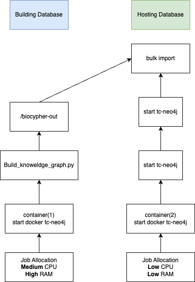

## 2024.07.12

- 🔲 Roll back entrypoint permissions as they didn't fix issue of making volumes accessible outside of container.

## 2024.07.11

- [x] Roll back `numpy` to `1.26.0`, push version, update pypi, rebuild image.
- [ ] Host dataset in read only → To adjust permissions we could changed the `chmod` in the entrypoint, but then would have to rebuild the image.
- [ ] Handle database creation in slurm build script.
- [ ] Write notes on current build.
- [ ] Make sure that dirs are visible with `chown` and `chmod`. Get permissions correct so view all necessary dirs in vscode.
- [ ] Run a test to see if we can isolate slurm and docker using `cgroup`?
- [ ] Fix the import issues - `ExperimentReferenceOf` looks broken.
- [ ] Adjust schema adding in `dataset_name` nodes.
- [ ] Adjust datasets accounting for `dataset_name` nodes.
- [ ] Experiment can be linked to a study - We want to query the exact dataset used in this study.
- [ ] Add `Kuzmin2018` dataset for interactions, it is smaller and covers all interactions.
- [ ] Adjust schema for interaction data.
- [ ] Add interactions to adapter.
- [ ] Add genes essentiality dataset.
- [ ] Document about gene essentiality source.
- [ ] Add gene essentiality to schema and clearly differentiated from current fitness. Add in transformation to essentiality to growth type phenotype. This should probably be enforced after querying during data selection and deduplication. The rule is something like if we can find some reasonable fixed function for transforming labels we add them. Don't know of a great way of doing this but. Possible we can even add these relations to the Biolink ontology. In theory this could go on indefinitely but I think one layer of abstraction will serve a lot of good at little cost.
- [ ] Add synthetic lethality. Do same as for essentiality.
- [ ] Add expression dataset for mechanistic aware single fitness
- [ ] Add expression from double fitness
- [ ] Add fitness from singles
- [ ] Add fitness from doubles
- [ ] We need a new project documents reproducible procedure on `gh` for restarting slurm, docker, etc.
- [ ] Run container locally with [[torchcell.knowledge_graphs.minimal_kg]] → Had to restart to make sure previous torchcell db was deleted. → struggling with `database/build/build_linux-arm.sh` retrying from build image. → Cannot install CaLM... →
- [ ] Change logo on docs → to do this we need a `torchcell_sphinx_theme`. → cloned, changed all `pyg_spinx_theme` to `torchcell_sphinx_theme`, pushed, trying rebuild.
- [ ] Expand [[paper-outline-02|dendron://torchcell/paper.outline.02]]
- [ ] `ExperimentReferenceOf` looks broken.
- [ ] Make sure ports are getting forwarded correctly and that we can connect to the database over the network. We need to verify that we can connect with the neo4j browser.
- [ ] Try to link docker and slurm with `cgroup`
- [ ] Run build bash script for testing.
- [ ] `gh` Test build under resource constraints.
- [ ] Change logo on docs → to do this we need a `torchcell_sphinx_theme`. → cloned, changed all `pyg_spinx_theme` to `torchcell_sphinx_theme`, pushed, trying rebuild.
- [ ] Remove software update on image entry point

## 2024.07.10

- [x] Submit `biocypher` PR
- [x] Rough schematic of database process 
