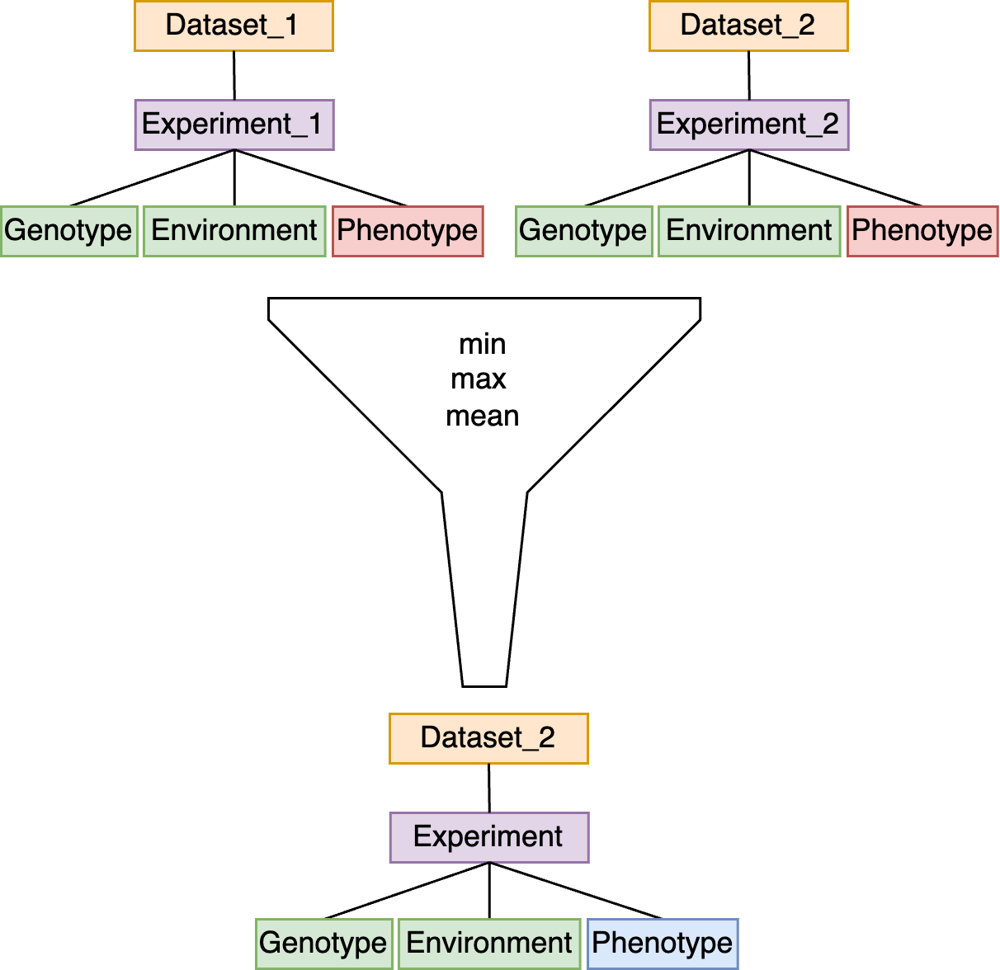

## 2024.08.26

- [x] Run fitness on random embedding. → As expected we have improved performance with dimension should try max dim which is size of `one_hot`, `>>> x.shape (1000, 6579)`
- [x] Construct `002-dmi-tmi` `1e06` dataset.
- [x] Run `all_dataloader` for `002-dmi-tmi` `1e03` and `1e04` on m1.
- [x] Brainstorming updates to [[torchcell.datamodels.schema]] → [[2024.08.26 - Generic Subclasses Need to Consider Phenotype Label Index|dendron://torchcell/torchcell.datamodels.schema#20240826---generic-subclasses-need-to-consider-phenotype-label-index]]
- [x] Rerun plotting, trying to fill in all fitness data → almost there.
- [x] Create random `6579` `random` for `002-dmi-tmi` `1e3`, `1e4`
- [x] Create random `6579` `random` for `002-dmi-tmi` `1e5` → will finish overnight
- [x] Fix type case to numeric iss ue is [[Svr|dendron://torchcell/experiments.smf-dmf-tmf-001.svr]]
- [x] Fix no cross validation in [[Svr|dendron://torchcell/experiments.smf-dmf-tmf-001.svr]]

- [ ] Create scripts for traditional ml `002-dmi-tmi`.

- [ ] Revert to `39f8c79e5a93953c240965becba6e0c59bb54026` to create random `6579` `random`.

- [ ] Bring in kuzmin2020 dataset.
- [ ] Plots on data distributions.
- [ ] Run KG build for kuzmin2020 interactions
- [ ] Update combine to add a `README.md` which can serve as a trace to combined data.
- [ ] Combined datasets and update readonly db.

- [ ] Create `1e03`, `1e04`, and `1e05` datasets with positive `tmi`. → This will be difficult because it'll be hard to balance mutant types. We could just use triple mutants with the plan to down select by enriched double mutants.

## 2024.08.27

- [x] Try to compute `random_6579` for traditional. → Couldn't complete. `1e5` `no_pert` had some memory issues.
- [ ] Traditional ml on interactions.

## 2024.08.28

- [x] Write plotting scripts for `svr` and `rf` interactions → [[Traditional_ml Plot_svr|dendron://torchcell/experiments.002-dmi-tmi.scripts.traditional_ml-plot_svr]], [[Traditional_ml Plot_random_forest|dendron://torchcell/experiments.002-dmi-tmi.scripts.traditional_ml-plot_random_forest]], [[Traditional_ml Plot_elastic_net|dendron://torchcell/experiments.002-dmi-tmi.scripts.traditional_ml-plot_elastic_net]]
- [x] sync `EN_1e03` → summaries have not been saving. → investigated and submitted issue to wandb. [wandb github issue](https://github.com/wandb/wandb/issues/7227)
- [x] Ran and completed `EN_1e04`
- [x] Running `RF_1e03`, and `RF_1e04` on m1.... → cancelled so we can work on plotting. sweeps to continue. `zhao-group/torchcell_002-dmi-tmi_trad-ml_random-forest_1e03/sweeps/olyxjcv6`, `zhao-group/torchcell_002-dmi-tmi_trad-ml_random-forest_1e04/sweeps/1tus1dbh`
- [x] Continue `RF_1e03` and `RF_1e04`

## 2024.08.29

- [ ] Create slides for group presentation
- [ ] 
- [ ] Check on db url update.

***

- [ ] Zendron on `zotero_out`
- [ ] Add in transformation to essentiality to growth type phenotype. This should probably be enforced after querying during data selection and deduplication. The rule is something like if we can find some reasonable fixed function for transforming labels we add them. Don't know of a great way of doing this but. Possible we can even add these relations to the Biolink ontology. In theory this could go on indefinitely but I think one layer of abstraction will serve a lot of good at little cost.
- [ ] Add expression dataset for mechanistic aware single fitness
- [ ] Add expression from double fitness
- [ ] Add fitness from singles
- [ ] Add fitness from doubles
- [ ] We need a new project documents reproducible procedure on `gh` for restarting slurm, docker, etc.
- [ ] Run container locally with [[torchcell.knowledge_graphs.minimal_kg]] → Had to restart to make sure previous torchcell db was deleted. → struggling with `database/build/build_linux-arm.sh` retrying from build image. → Cannot install CaLM... →
- [ ] Change logo on docs → to do this we need a `torchcell_sphinx_theme`. → cloned, changed all `pyg_spinx_theme` to `torchcell_sphinx_theme`, pushed, trying rebuild.
- [ ] Expand [[paper-outline-02|dendron://torchcell/paper.outline.02]]
- [ ] `ExperimentReferenceOf` looks broken.
- [ ] Make sure ports are getting forwarded correctly and that we can connect to the database over the network. We need to verify that we can connect with the neo4j browser.
- [ ] Try to link docker and slurm with `cgroup`
- [ ] Run build bash script for testing.
- [ ] `gh` Test build under resource constraints.
- [ ] Change logo on docs → to do this we need a `torchcell_sphinx_theme`. → cloned, changed all `pyg_spinx_theme` to `torchcell_sphinx_theme`, pushed, trying rebuild.
- [ ] Remove software update on image entry point
- [ ] dataset registry not working again because circular import
