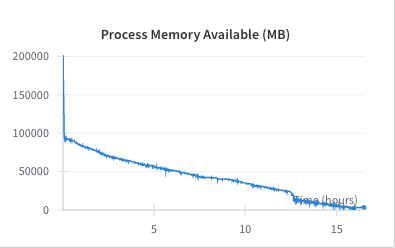

⏰ One thing: Metabolism Label Split Regression Run

## 2025.01.05

- [x] [[Met_hypergraph_conv|dendron://torchcell/torchcell.nn.met_hypergraph_conv]]

## 2025.01.06

- [x] Launch `1e6` DDP on on multiple nodes entropy regularization → Some inter node communication issue.
- [x] Launch `1e6` DDP on on node entropy regularization → Fails due to some memory build up.  [one of 4 ddp runs](https://wandb.ai/zhao-group/torchcell_003-fit-int_hetero_gnn_pool_1e6/runs/2ridstrq?nw=nwusermjvolk3)

Run crashes after 15 hours. From a quick look there aren't any obvious memory hogs 🐗 in the training loop.

- [x] Launch some DDP `5e5` on one node for entropy regularization

## 2025.01.07

- [x] Issue on multi-node DDP → [NCSA Jira Issue](https://jira.ncsa.illinois.edu/servicedesk/customer/user/requests?status=open)
- [x] Memory build up clarification with image and links previous day
- [x] Submitted for more `Delta` allocation. Running low.
- [x] Pass incidence metabolism hypergraph through dataset
- [x] Adjust `to_cell_data` to handle incidence graphs → have a prototype but needs fixing

## 2025.01.08

- [x] Prepare slides → 

## 2025.01.10

- [ ] Fix current failure in trying to overcome memory hog.
- [x] Adjust `to_cell_data` to handle incidence graphs
- [ ] Write new phenotype processor to handle message passing on multigraph

- [ ]

***

- [ ] Implement intact and pert phenotype processor.
- [ ] Synthesize Results in report. Discussion on consideration of use alternative methods like mse plus a divergence measure.
- [ ] Run metabolism label split regression run
- [ ] Information Diff., WL Kernel

## Notes on Metabolism

- Can get Gibbs Free Energy of reaction from [MetaCyc](https://biocyc.org/reaction?orgid=META&id=D-LACTATE-DEHYDROGENASE-CYTOCHROME-RXN)
- To preserve sign information in [[Met_hypergraph_conv|dendron://torchcell/torchcell.nn.met_hypergraph_conv]] we should use activations that can handle negative input like leaky relu, elu, or tanh.

## Notes Related to Dango

Breakout into specific notes on Dango.

- [ ] Verify

> Pearson correlation between the trigenic interaction scores of two individual replicates is around 0.59, which is much lower than the Pearson correlation between the digenic interaction score of two replicates from the same data source (0.88). ([Zhang et al., 2020, p. 3](zotero://select/library/items/PJFDVT8Y)) ([pdf](zotero://open-pdf/library/items/AFBC5E89?page=3&annotation=D8D949VF))

- [ ] Plot P-Values of current dataset to compare to predicted interactions. Can do for both digenic and trigenic interactions. Do this over queried datasets.

- [ ] What is purpose of the pretraining portion? Why not just take embeddings and put into this hypergraph embedding portion?
