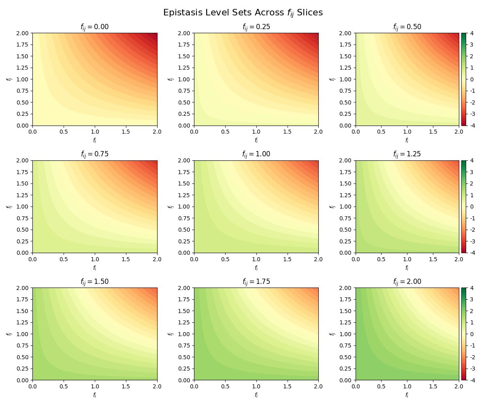

## 2025.01.27

- [x] Implement isomorphic cell. Fix Metabolism Processor. → wip
- [x] [[2025.01.27 - Metabolism Processor|dendron://torchcell/torchcell.models.isomorphic_cell#20250127---metabolism-processor]]
- [x] [[2025.01.27 - Metabolism Processor Algorithm|dendron://torchcell/torchcell.models.isomorphic_cell#20250127---metabolism-processor-algorithm]]
- 
- 

## 2025.01.28

- [x] Implement isomorphic cell. Fix Metabolism Processor. → had to change data formatting in [[torchcell.data.neo4j_cell]] converted dicts to hyperedge indices for easier batching processing in algorithm. → got to point where we discovered improper data handling that was showing CUDA error. Likely issue is always on data side when there is CUDA error when using `pyg`. Had to switch to simpler attention mechanism to troubleshoot this.

## 2025.01.29

- [x] [[Isomorphic_cell_attentional|dendron://torchcell/torchcell.models.isomorphic_cell_attentional]] → [AttentionalAggr](https://pytorch-geometric.readthedocs.io/en/latest/generated/torch_geometric.nn.aggr.AttentionalAggregation.html)
- [x] StoichiometricGraphConv Gating Ideas - [[175438|dendron://torchcell/scratch.2025.01.29.175438]] → [[Stoichiometric_hypergraph_conv|dendron://torchcell/torchcell.nn.stoichiometric_hypergraph_conv]]
- [x] Implement `SupCR` loss. → [[SupCR|dendron://torchcell/torchcell.losses.SupCR]]

## 2025.01.30

- [x] I am uncertain of dist loss we should cook up simple unrelated benchmark to see if it is working. Let's also add in `SupCR`. → build script to test this.
- [x] Create is_any index for gene contained in sets of genes in an instance.

## 2025.01.31

- [x] Define sweep that can finish in < 40 hours.
- [x] Make sure `Qm9` we have all correct plotting.
- [x] Run `Qm9` small test. → running GH → works move to Delta.

- [x] Create metabolism subset dataset. Add to index? → I thought maybe we could push it into query but we can't because the `gene_set` needs to be a superset of all possible genes queried . We need to push it into CellDatasetModule, then run Perturbation subset on that. → Turns out just needs to be in `PerturbationSubset`. → haven't run yet. takes time.
- [x] Plots of dataset breakdown. → [[experiments.003-fit-int.scripts.metabolism_enriched_perturbation_subset]]

- [ ] Run [[Metabolism_enriched_perturbation_subset|dendron://torchcell/experiments.003-fit-int.scripts.metabolism_enriched_perturbation_subset]] overnight.

500,000 (5e5) - cannot do with current db we have 429042
500,000 (5e5)

- [ ] Wait on this... plots for enrichment of all genes. Contains any of all graphs.
- [ ] Make sure y distributions look like they y from other datasets.
- [ ] Histogram of genes usage in subset... we have these plots somewhere.

***

- [ ] Test edge attention on hypergraph conv
- [ ] Update `cell_latent_perturbation`
- [ ] `cell_latent_perturbation` remove stoichiometry for reaction aggregation
- [ ] `cell_latent_perturbation` unify embeddings across graphs
- [ ] `cell_latent_perturbation` use `ISAB` set transformer for `intact_whole`
- [ ] unified model

- [ ] Memory issue with regression to classification scripts. We still have issue of processing memory accumulation. Unsure where it is coming from. Will only need to be solved if we use these losses.
- [ ] Implement intact and pert phenotype processor.
- [ ] Synthesize Results in report. Discussion on consideration of use alternative methods like mse plus a divergence measure.
- [ ] Run metabolism label split regression run
- [ ] Information Diff., WL Kernel

## Notes on Metabolism

- Can get Gibbs Free Energy of reaction from [MetaCyc](https://biocyc.org/reaction?orgid=META&id=D-LACTATE-DEHYDROGENASE-CYTOCHROME-RXN)
- To preserve sign information in [[Met_hypergraph_conv|dendron://torchcell/torchcell.nn.stoichiometric_hypergraph_conv]] we should use activations that can handle negative input like leaky relu, elu, or tanh.

## Notes Related to Dango

Breakout into specific notes on Dango.

- [ ] Verify

> Pearson correlation between the trigenic interaction scores of two individual replicates is around 0.59, which is much lower than the Pearson correlation between the digenic interaction score of two replicates from the same data source (0.88). ([Zhang et al., 2020, p. 3](zotero://select/library/items/PJFDVT8Y)) ([pdf](zotero://open-pdf/library/items/AFBC5E89?page=3&annotation=D8D949VF))

- [ ] Plot P-Values of current dataset to compare to predicted interactions. Can do for both digenic and trigenic interactions. Do this over queried datasets.
- [ ] What is purpose of the pretraining portion? Why not just take embeddings and put into this hypergraph embedding portion?

***

[[04|dendron://torchcell/user.Mjvolk3.torchcell.tasks.weekly.2025.04]]
