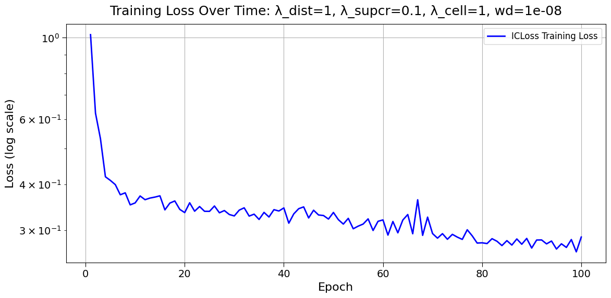
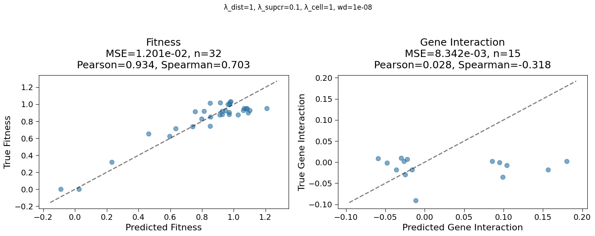
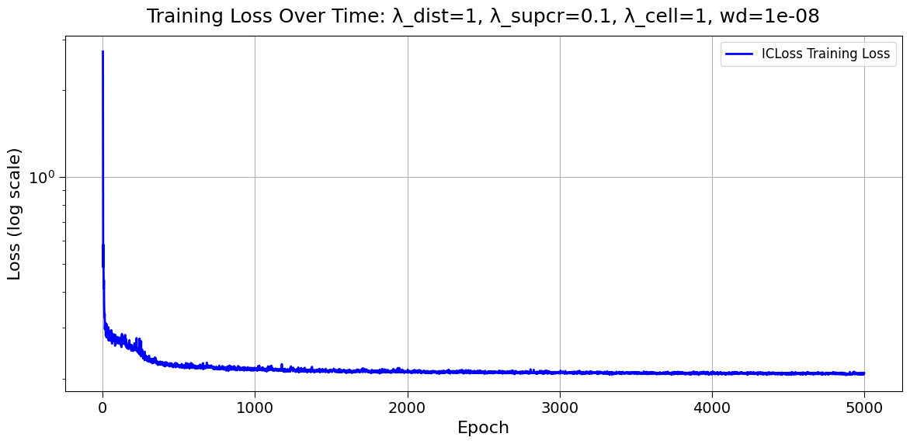
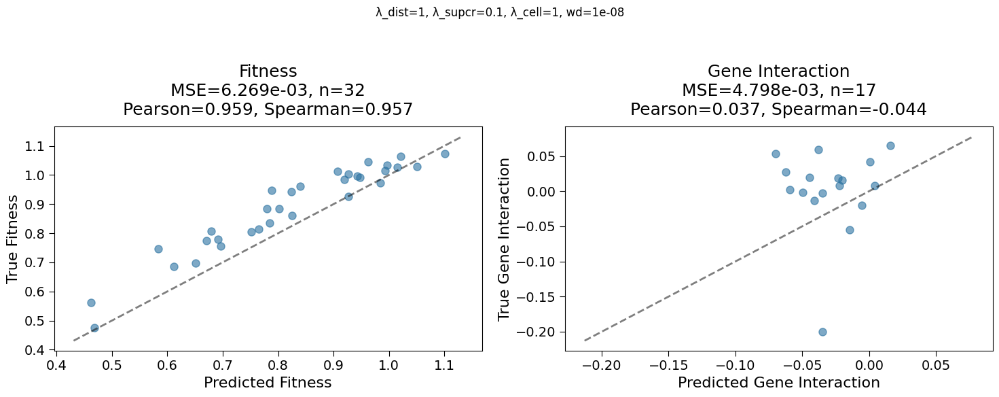

## 2025.02.11

- [x] Add images [[Analyze_feature_distributions|dendron://torchcell/experiments.003-fit-int.scripts.analyze_feature_distributions]]
- [x] [[Problem Formulation|dendron://torchcell/003-fit-int.problem-formulation]]

## 2025.02.12

🏆 of the day - 4 hour sweeps - learning rate

- [x] Collected key papers for sparse graph transformer
- [x] Reviewed data of IGB run. Model didn't fit... Bit troubling. We plan to changed the model a bit to get matching parameters in both sides of model. Maybe use `GAT` instead. Then run sweep over fitness and gene interactions. First sweep should be short fast, attempt to get quick smooth learning. I also want to use that as an opportunity to add plot logging and adjust the logged metrics.
- [x] Did new description of data [[2025.02.12 - Data Masking|dendron://torchcell/torchcell.models.isomorphic_cell_attentional#20250212---data-masking]]
- [x] Did residual connection on preprocessor
- [x] Did read in model initialization from config.

## 2025.02.13

- [x] Did add learnable embedding.
- [x] Found out cannot run sweeps on `igb biocluster (IGBB)` easily as compute nodes don't connect to wandb server for controller. Will need alternate sweeping strategy.

## 2025.02.14

🏆 - Random grid 20 epochs each, small model, `lambda` loss search, `weight_decay`, norms, `num_layers`, 2 layer mlp

- [x] Optuna working with multirun, now it is a question of wether or not it will work on slurm.

## 2025.02.15

- [x] `HeteroCell` - working model
- [x] Quick over fit run

- [x] Long over fit run

- [x] #ramble We can easily overfit batch on fitness but we still aren't overfitting on interactions. Thinking we should consider a different decoder on `gene_interactions`
