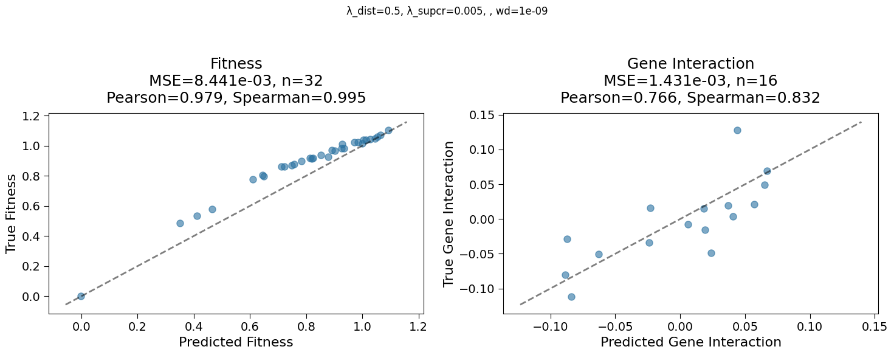
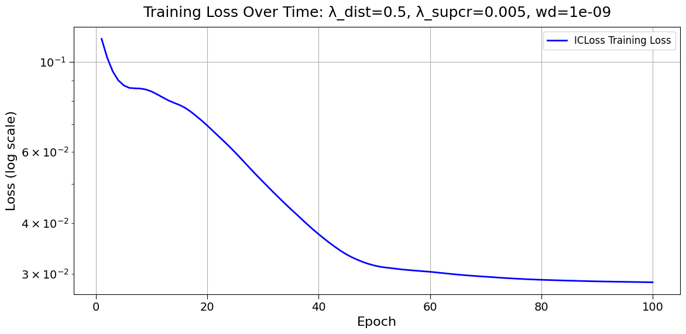

## 2025.02.16

🏆 - `HeteroCell` Random grid 20 epochs each, small model, `lambda` loss search, `weight_decay`, norms, `num_layers`, 2 layer mlp

- [x] `HeteroCell` make trainable
- [x] `HeteroCell` validate plotting and logging
- [x] `HeteroCell` log metric to determine degeneracy in node embeddings. e.g. #oversmoothing  →  #oversquashing more difficult as you need adjacency information and it is less likely that this is a huge issue during training. We should be able to compute it over the graph prior to training. This will be a nice characterization of potential issues with graphs and could give good justification for expander edges.
- [x] Fixed bug inability to setup `optuna.db` by downgrading sqalalchemy → "To prevent incompatible upgrades prior to updating applications, ensure requirements files are pinned to "sqlalchemy<2.0"

## 2025.02.19

- [x] Followed up on radiant resources
- [x] Followed up on `GH` testing
- [x] Fixed Overfit on batch. bone head error ☠. [[2025.02.19 - Equations How Interacting Wildtype and Integrated|dendron://torchcell/torchcell.models.hetero_cell#20250219---equations-how-interacting-wildtype-and-integrated] ]
- [x] Note [[Sync Agent Dirs|dendron://torchcell/wandb.igb.sync-agent-dirs]]
- [x] Try to relaunch sweep with new name to see if we can add study to db. → This works! Wonderful🌈!
- [x] Fix logging with optuna so that scripts don't write over each other in sbatch launcher. I couldn't tell why the last run failed because of this we wanted. → we have separte dirs according to job num.
- [x] Fix `wandb-experiment` logging we sometimes log what it seems like is multiple runs in the same dir. We  
- [x] Retry optuna sweep with narrower set of hyper parameters. Use `choice` to match `qm9` study.

## 2025.02.20

- [x] overfit batch and trying to simplify the sweep [[torchcell.models.hetero_cell]]
Parameter count: 255,462

- [x] Delta random sweep launch
- [x] Add act and norm ☠ mistake.

## 2025.02.21

- [x] Did loopy self forward → getting somewhere ⛓️‍💥🚪
