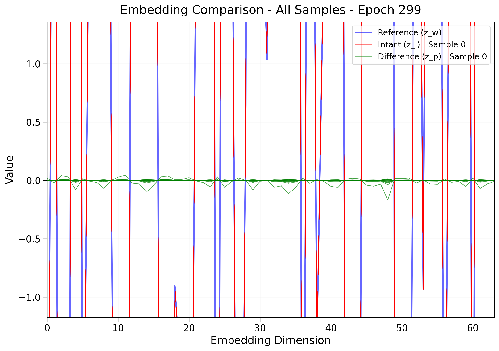

## 2025.03.03

- [x] Reviewed `ESA` and `NSA`→ `NSA` might be worth trying
- [x] Reviewed data. Found that Pearson on train keeps getting better for gene interactions as training ends, but this MSE for gene interactions doesn't seem to be doing much. Slow decrease.
- [x] Sync `2e5`
- [x] Gifs on overfit → legends are jumping around...
- [x] start [[003-fit-int.2025.03.03|dendron://torchcell/experiments.003-fit-int.2025.03.03]]

## 2025.03.04

- [x] Added ISAB.
- [x] Try to get function over perturbed genes for gene interaction working → Second time I've tried something like this and it doesn't work. → 
- [x] [[2025.03.04|dendron://torchcell/torchcell.models.hetero_cell_isab_split#20250304]] → Couldn't get it to work. The splitting make the network degenerate.

## 2025.03.05

- [x] [[003-fit-int.2025.03.03|dendron://torchcell/experiments.003-fit-int.2025.03.03]] probably 3/4 done.

## 2025.03.06

- [x] Training ISAB leads to instabilities. → I believe this is due to latent vectors growing unbounded.  → We should switch to `PMA`.
- [x] `PMA` → running on `igb`
- [x] Long run grokk check on `Delta`
- [x] `NSA` research. Can be done but think it is probably easier in bipartite formulation of metabolism.
- [x] Some rudimentary bipartite graph... wip

## 2025.03.07

- [x] Reaction map is missing reactions with no gene ids. Fix. Check `gpr` → messed around with this a bit
- [x] Bipartite graph → have something but need work

## 2025.03.09

- [x] `plot_every_n_epochs`
- [x] Launch `4e5` run `Delta`. → Ran 2 gpu script with optimal params with hetero conv. 
