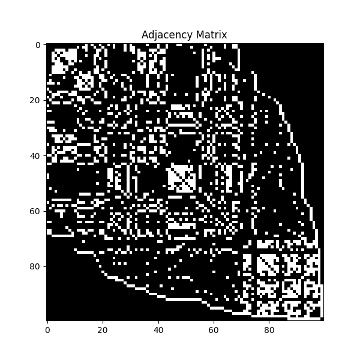
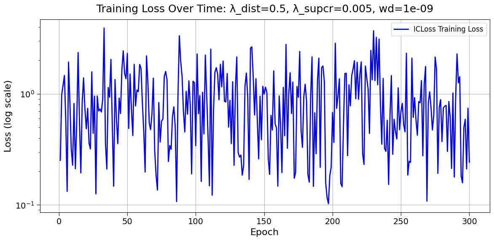
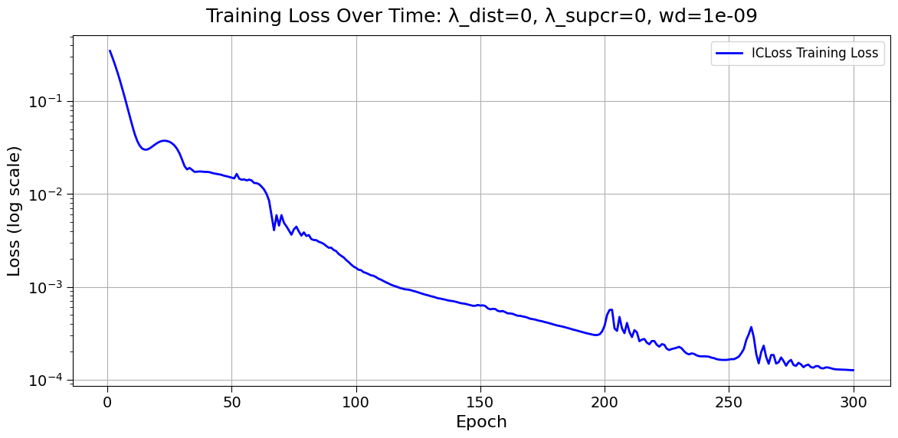
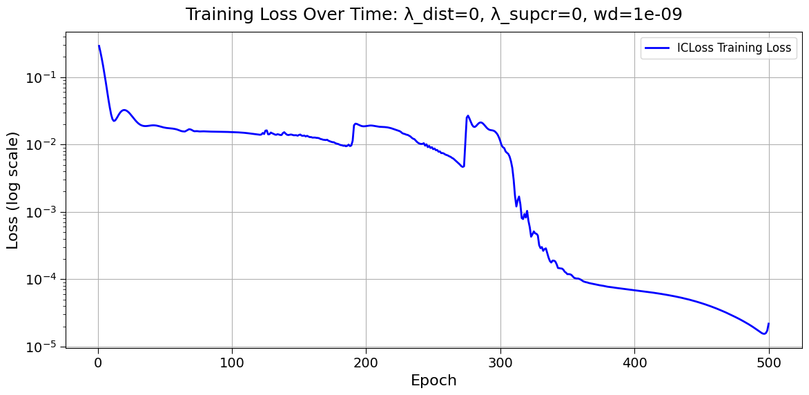
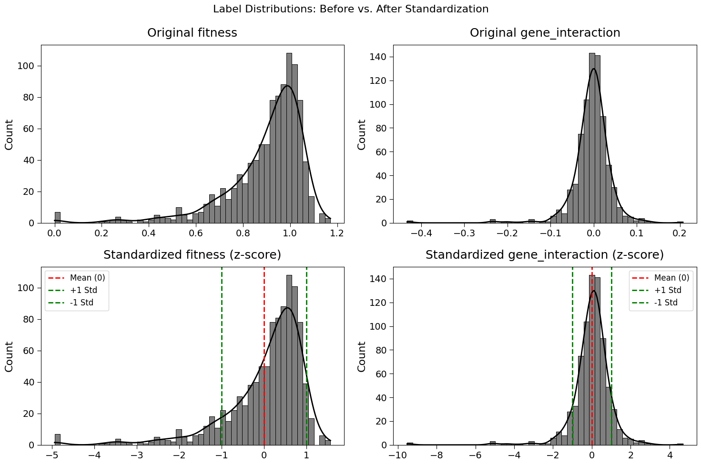

## 2025.03.10

- [x] image dump

- when you try to back prop on set operator over genes in wildtype graph that are removed from integrated graph.

- Not sure why the `PMA` seems to converge much slower. I believed these implementations to be equivalent. They differ in that I started directly using the `PMA` implemented in `pyg` instead of using an `ISAB` down to size 1 to get pooling.

- Standardizing labels since it is likely fitness was dominating.

- [x] [[Plot_ppi_reg_rcm|dendron://torchcell/torchcell.experiments.003-fit-int.scripts.plot_ppi_reg_rcm]]
- [x] [[2025.03.04 - Data with All Reactions|dendron://torchcell/torchcell.models.hetero_cell_isab_split#20250304---data-with-all-reactions]]

- [x] Fix reaction map with no rxn if $\emptyset$. Fix the compound map so that we have all reactions. They can be named according to `Yeast9` reaction scheme. We just need to have associated genes as properties. Direction of reaction can be captured with directionality of the graph. → skipped this and just went to running updated code and works. Will need more inspection, but likelihood of entire pipeline just working are pretty low without it already being correct.
- [x] Make sure `SubgraphRepresentation` works → Working in practice..

## 2025.03.11

- [x] Make `bipartite_graph` directed.
- [x] Added incidence conditionals for both `hypergraph` and `bipartite`
- [x] Ran quick test to make sure node perturbations are propagating.
- [ ] Check backwards compatibility with `metabolism_hypergraph`. → Works [[2025.03.11 - Metabolism Hypergraph and Metabolism Bipartite|dendron://torchcell/torchcell.data.neo4j_cell#20250311---metabolism-hypergraph-and-metabolism-bipartite]]

- [ ] Refactor [[Neo4j_cell|dendron://torchcell/torchcell.data.neo4j_cell]] and split out `GraphProcessor.` Set up tests.

- [ ] See if we can improve the convergence on `pma`. → On training we have the issue that it likes to predict just a few values, in other words the distribution is spiky.
- [ ] Is it possible to scale the database over `num_nodes` on slurm cluster. If we can pool memory across `cpu` nodes and use more `cpu` we will be able to not only build db faster but completer build on `Delta`. This allows for horizontal scaling of db builds.

- [ ] Add concern about graph connectivity to [[Report 003-fit-int.2025.03.03|dendron://torchcell/experiments.003-fit-int.2025.03.03]]
- [ ] Last experiments should be relatively simple.

## 2025.03.12

- [x] [[2025.03.12 - Graph Types|dendron://torchcell/torchcell.data.data#20250312---graph-types]]
- [x] Use dense transformations. For this we need to choose a common naming scheme on edge_index.
- [x] What should we call edge index on `bipartite` and `hypergraph`? We have been inconsistent using `hyperedge_index` for `gpr` and `edge_index` for `rmr`. → Any bipartite/hypergraph gets `hyperedge_index`
- [x] Minimal model now run but it is extemely slow. It could overfit on batch size 2 in approximately 80 epochs
- [ ] graph, bipartite, hypergraph is detectable by definition of node. We could just automatically detect this.

## 2025.03.13

- [x] We only can use `batch_size=2'. We could further optimize memory issue by making masks boolean and by making edge attrs not dense... → We need to make sure we are using flex attention.

## 2025.03.15

- [ ]

## 2025.03.16

- [ ] Prepare report. Topics: ISAB failure, long runs, Node-Self Attention Integration, Hetero Node Set Attention math, Hetero Node Set Attention math integration.
- @Andrew-Dudzik - "GNN's are state of the art in algorithmic alignment. LLM's are not." [The Problems in Mathematics of Deep Learning](https://www.youtube.com/watch?v=btF19HOrWC4)

***

- [ ] Should rename normalization to scaling
