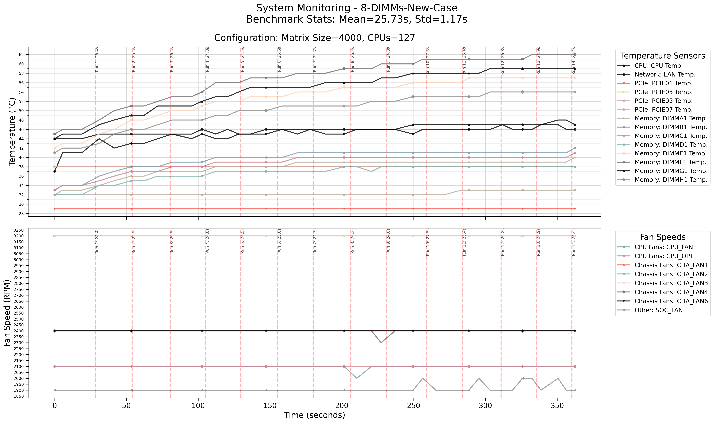
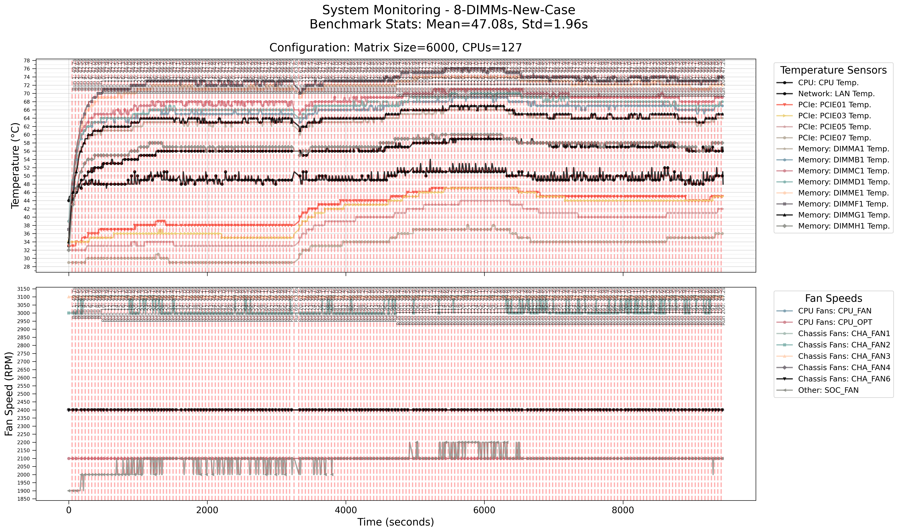

## 2025.04.02

- [x] `GH` small test -  
- [x] `GH` large test → both pass but we did some restarting behavior when running this test. I had to try 4-5 times before it worked without shutting down.

- 🔲 Add concern about graph connectivity to [[Report 003-fit-int.2025.03.03|dendron://torchcell/experiments.003-fit-int.2025.03.03]]

***

- 🔲 Should rename normalization to scaling
