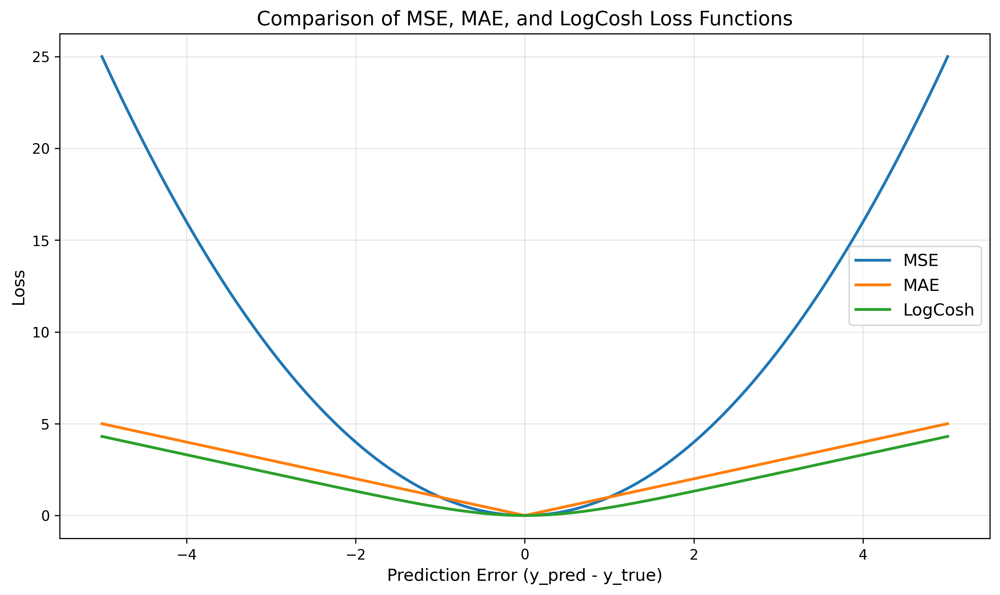
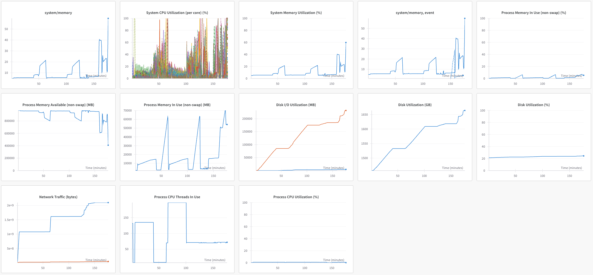

## 2025.04.07

- [x] Build DB → Running → Crashed...
- [x] Build Small DB → Running...
- [x] Research potential memory issue → Suggestion is that there could be problem with dimms. → If fails again can boot to GRUB and run `memtest`.
- [x] [[Mse_logcosh_mae_plot|dendron://torchcell/experiments.003-fit-int.scripts.mse_logcosh_mae_plot]] Reading Dango, they choose `logcosh`

- [x] `GH` failure due corresponding with memory spike.

- [x] Add Dango head for gene interactions. → ran and works, fits gene interaction first now. Also tied fitness into gene interaction prediction since we are already predicting it.

## 2025.04.08

**Database**

- [x] Run local test of `smf_costanzo2016_kg`  conf. → We don't see same errors with this and with docker on `GH`... suspicion is that dataset is out of data... `grep "ERROR" /Users/michaelvolk/Documents/projects/torchcell/smf_costanzo2016_kg.txt`
- [x] Rerun build from scratch with no data. Forced download. → issue
- [x] Run create db solving problem with `label_statistic` and `label` as offenders instead of correct `label_statistic_name`, `label_name`. → Issue was that `biocypher/config/torchcell_schema_config.yaml` is in protected dir `database/biocypher`. This is actually a nice mechanism for protecting changes to `db` but a bit confusing. Needs to be manually overwritten on each database update.
- [x] Build small smf database with no issue.
- [x] Could not start instance due to some quota notification → inquiry to [ncsa-help](https://jira.ncsa.illinois.edu/servicedesk/customer/portal/2/SUP-12589) . → Closed. I needed to delete volume before recreating instance.

**Dango**

- [x] Launch Dango head. Keep all same configs for now. launch over 2 gpus... Check `-p cabbi` `1e5` training.

**Other**

- [x] Run `GH` scripts for memory checks. → Ran only part. Need to run second part when job completes.
- [x] More info on growth equations in yeast 9. Extracting for wT. Make an assessment on how this this should take to implement. → [[Mechanisitc Aware Fba Inspired|dendron://torchcell/torchcell.losses.mechanisitc-aware-fba-inspired]]

## 2025.04.09

**database**

- [x] Can mount projects dir → Need to be able to mount scratch [ncsa-help](https://jira.ncsa.illinois.edu/servicedesk/customer/portal/2/SUP-10198)

**Stoich Loss**

- 🔲 Add in stoichiometric loss → [[2025.04.08 - Possible Inclusions|dendron://torchcell/torchcell.losses.mechanisitc-aware-fba-inspired#20250408---possible-inclusions]] → launch over 2 gpus.

**Other**

- [x] Run second test on `GH` → Exxact says their is something wrong with cpu 😠.

## 2025.04.10

- [x] Dango head eval with `1e5` training → Doesn't look like it is working
- [x] Complete fitness reconstruction comparison [[experiments.003-fit-int.scripts.hetero_cell_bipartite_bad_gi_analytic_v_direct]]

- [x] Table before meeting.. → might want to hold off on this.

| $\epsilon$ true | $\epsilon$ pred | $\epsilon$ from fitness pred | num gene deletions |
|:----------------|:----------------|:-----------------------------|:-------------------|
| -               | -               | -                            | -                  |

- 🔲 Morphology animation ?

## 2025.04.11

- 🔲 Export and `rsync` this to linked delta drive
- 🔲 Mount drive and spin up database. Check if database is available on ports and over http.
- 🔲 Inquiry about web address for database.
