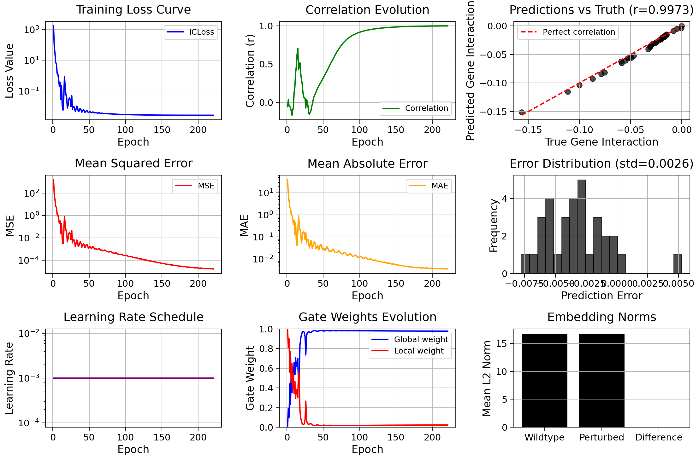

## 2025.06.02

- [x] Clean up [[tasks.weekly.2025.21|dendron://torchcell/user.Mjvolk3.torchcell.tasks.weekly.2025.21]]
- [x] Simplify embedding config embedding
- [x] `hetero_cell` all graphs with String 12, naive pred head → Had to update batch loading → [[2025.06.02 - Data Updated|dendron://torchcell/torchcell.models.hetero_cell_bipartite_dango#20250602---data-updated]]

## 2025.06.03

- [x] `hetero_cell_bipartite_dango_gi`  → [[2025.06.03 - Data Updated|dendron://torchcell/torchcell.models.hetero_cell_bipartite_dango_gi#20250603---data-updated]] → model working
- [x] [[2025.06.03 - Detailed View of Data For Indexing Based on Phenotype Type|dendron://torchcell/torchcell.models.hetero_cell_bipartite_dango_gi#20250603---detailed-view-of-data-for-indexing-based-on-phenotype-type]]
- [x] Launch model with all graphs on igb biocluster. [[2025.06.03 - Launched Experiments|dendron://torchcell/experiments.005-kuzmin2018-tmi.results.hetero_cell_bipartite_dango_gi#20250603---launched-experiments]]

## 2025.06.04

- [x] `ICloss` support in [[torchcell.models.hetero_cell_bipartite_dango_gi]]
- [x] Made local prediction more dango like. →  We are seeing global dominate.  overfitting looking good.
- [x] Launched `ICloss` experiment
- [x] Query 006 - All trigenic interaction data. → 006-kuzmin-tmi
