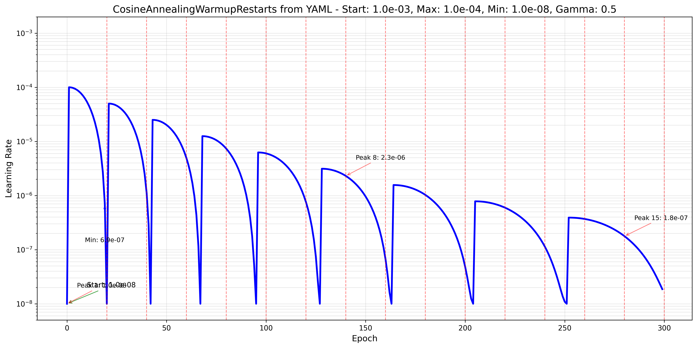

- [ ] For @Junyu-Chen consider reconstructing $S$? Separate the metabolic graph construction process into building both $S$ then casting to a graph... Does this change properties of S? You are changing the constrains but also changing the dimensionality of the matrix... → don't know about this... I think the the constrained based optimization won't be affected from the topological change much. It is mostly a useful abstraction for propagating genes deletions.
- [ ] #ramble Need to start dumping important experimental results into the experiments folder under `/experiments` - Do this for `004-dmi-tmi` that does not work
- [ ] Add concern about graph connectivity to [[Report 003-fit-int.2025.03.03|dendron://torchcell/experiments.003-fit-int.2025.03.03]]
- [ ] Export and `rsync` this to linked delta drive
- [ ] Mount drive and spin up database. Check if database is available on ports and over http.
- [ ] Inquiry about web address for database.
- [ ] Export and `rsync` this to linked delta drive
- [ ] Mount drive and spin up database. Check if database is available on ports and over http.
- [ ] HeteroCell on String 12.0
- [ ] Contrastive DCell head on HeteroCell.
- [ ] Morphology Random Forest Baseline
- [ ] Morphology animation ? for fun...

***

## 2025.07.03

- [ ] Move this into box /Users/michaelvolk/Documents/projects/torchcell/data/host/kuzmin2018/aao1729_data_s1.zip

- [ ] Add morphology. Only Safari browser works. Respond to maintainers about solved problem of downloading database. Might want to store a backup.
- [ ] Add Gene Expression datasets

- [ ] Aggregate results from Dango 005 and put into table.

- [ ] Run Dango on `006` using best settings from `005`

