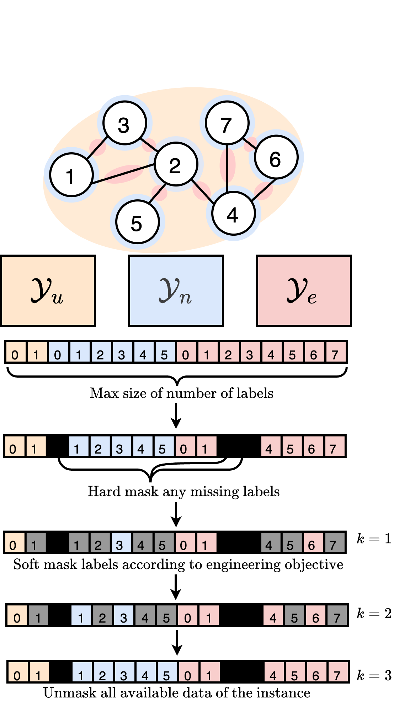

## 2025.07.07

- [x] Make it such that `DistLoss` can better handle batch.  → Done with `global_min` and `global_max` accumulation or with the specification of the globals. If you don't specify the globals it will take 1 epoch over train to get the kernel right.
- [x] Rerun of inference. Previous failed due to some memory accumulation issue.
- [x] Launched experiments of small model with new loss. Looking to see if this helps smooth out the loss function. Also looking to see if cos annealing with warm restarts matches loss curve.
- [x]  Cabbi Poster

- [x] Start another run on Cabbi partition of same model to get repeat run.
