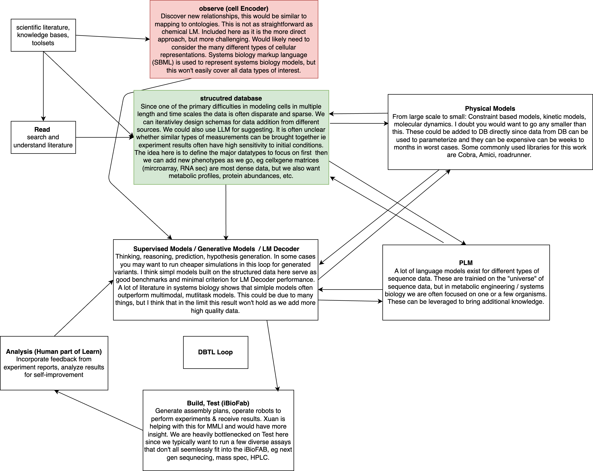

## 2025.08.11

- [x] 
- [x] We need to save best val pearson correlation model along with best mse [[Hetero_cell_bipartite_dango_gi|dendron://torchcell/experiments.006-kuzmin-tmi.scripts.hetero_cell_bipartite_dango_gi]]
- [ ] WIP diffusion decoder → Cannot overfit batch which is concerning, but this might be expected with such small batch size for diffusion decoder. [[Hetero_cell_bipartite_dango_diff_gi|dendron://torchcell/torchcell.models.hetero_cell_bipartite_dango_diff_gi]]

## 2025.08.12

- 🔲 Launch minimal diffusion decoder for proof of concept, we are following the ideas from [CausCell](https://github.com/bm2-lab/CausCell) → Got blocked because could not overfit a single batch. It is unclear why this is happening to me due to my lack of familiarity with diffusion models. We mainly took from CausCell. I even tried a linear probe on `z_c` but only on `physical` and `regulatory` and this did not work. → Running small run on 5000 data overnight to see what happens. → [[2025.08.12 - GeneInteractionDiff Model - Diffusion-based Gene Interaction Prediction|dendron://torchcell/torchcell.models.hetero_cell_bipartite_dango_diff_gi#20250812---geneinteractiondiff-model---diffusion-based-gene-interaction-prediction]]
- Plots from training showing little correlation.

## 2025.08.13

1. Triple mutant correlation and query new dataset
2. Morphology dataset
3. Expression dataset
4. Database build

- [x] Check diffusion experiment. → Small diffusion experiment is showing distribution matching in validation, but no correlation. There is degenerate output in train, but this might be do to dummy output on diffusion decoder. Looks promising for distribution matching problem.
- [x] Dataset with fitness and gene interaction on triples. Plot correlation. Slide on how this justifies the inclusion of fitness data for improved prediction performance. → plots [[2025.08.13 - Low Correlation Between Tmi and Tmf|dendron://torchcell/experiments.007-kuzmin-tm.scripts.tmi_tmf_correlation#20250813---low-correlation-between-tmi-and-tmf]]
- [ ]

- [ ] Add morphology. Only Safari browser works. Respond to maintainers about solved problem of downloading database. Might want to store a backup.
- [ ] Add gene expression.
- [ ] Build database locally.

***

- [ ] Move this into box /Users/michaelvolk/Documents/projects/torchcell/data/host/kuzmin2018/aao1729_data_s1.zip

- [ ] Add Gene Expression datasets

- [ ] Aggregate results from Dango 005 and put into table.
- [ ] Run Dango on `006` using best settings from `005`

***

- [ ] For @Junyu-Chen consider reconstructing $S$? Separate the metabolic graph construction process into building both $S$ then casting to a graph... Does this change properties of S? You are changing the constrains but also changing the dimensionality of the matrix... → don't know about this... I think the the constrained based optimization won't be affected from the topological change much. It is mostly a useful abstraction for propagating genes deletions.
- [ ] #ramble Need to start dumping important experimental results into the experiments folder under `/experiments` - Do this for `004-dmi-tmi` that does not work
- [ ] Add concern about graph connectivity to [[Report 003-fit-int.2025.03.03|dendron://torchcell/experiments.003-fit-int.2025.03.03]]
- [ ] Export and `rsync` this to linked delta drive
- [ ] Mount drive and spin up database. Check if database is available on ports and over http.
- [ ] Inquiry about web address for database.
- [ ] Export and `rsync` this to linked delta drive
- [ ] Mount drive and spin up database. Check if database is available on ports and over http.
- [ ] HeteroCell on String 12.0
- [ ] Contrastive DCell head on HeteroCell.
- [ ] Morphology Random Forest Baseline
- [ ] Morphology animation ? for fun...
