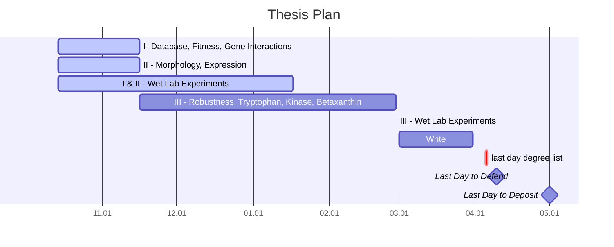
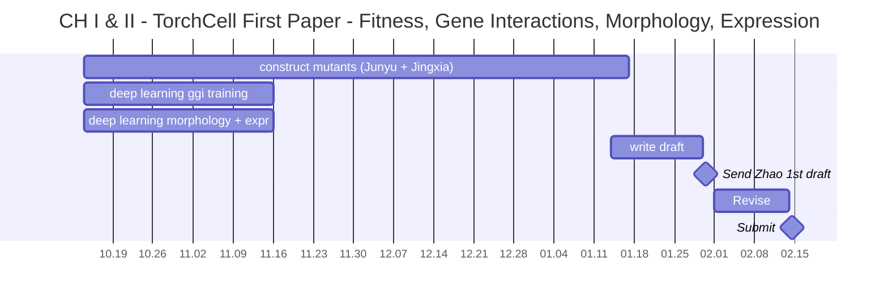
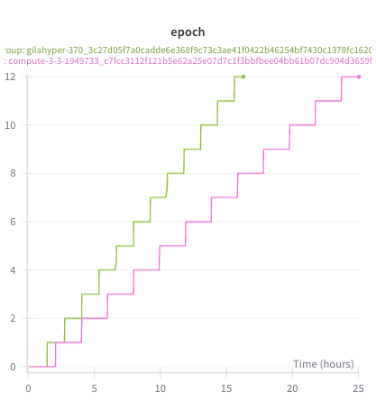
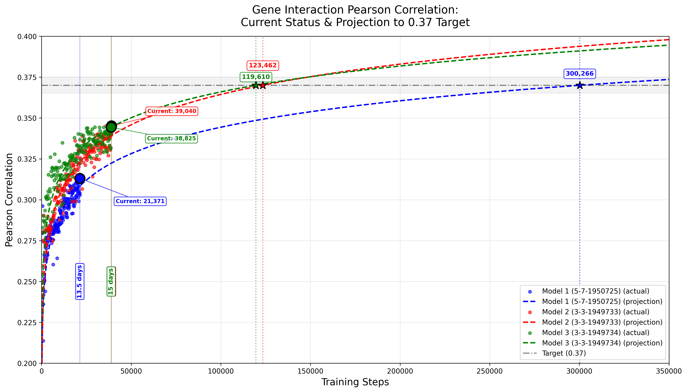

## Chapters

Notation: Chapter number - Project

1. Introduction
2. Gene Ontology Work
3. I - Database, Fitness, Gene Interactions - 1st publication
4. II - Morphology, Expression - 1st publication
5. III - Robustness, Tryptophan, Kinase, Betaxanthin (metabolism) - 2nd publication
6. IV - Swanki open source education software

## Gantt Thesis

## Gantt - CH I & II

## Weekly Summary

- At the end of last week I came up with an idea to speed up model training. At the end of last week it was just a thought but I have now proven it works in practice. This occupied Mon - Wed to develop and I've spend Thr - Fri deploying it. The key issues are as follows:

1. We have many large graphs that have only small differences. We cannot save them to disk as this would consume petabytes of data. Instead we save perturbations and apply then in memory with worker processes during training.

2. Subgraph ops are slow especially over the large multigraph, for each graph we have added sampling slows down because we must propagate perturbations across all graph structures. Since we are always perturbing the same graph for this task we can cache an incidence map from nodes to edge_index. Then when we remove $r$ nodes for a given subgraph or savings for the query to find edges to is $\mathcal{O}\text{deg}(r)$. We see efficiency gains when $\sum_{r\in R} \text{deg}(r) \ll |E|$, which is always satisfied for our perturbation graphs.

- At first we thought implementing this would just amount to implementing a perturbation operator that we have previously defined in the torchcell lib. The solve is not this simple because if you immediately apply you have to copy tensors and you lose efficiency gains from the initial query gains. Instead we propagate the masks all the way to the model, where we then use efficient matmuls to zero messages of dead edges. This simulates subgraphing data but pushes it into efficient compute ops.

**Fig 1. - Faster "subgraphing" Method** - The new method shows 25/16 ≈ 1.6 x speed up. We are continuing to try to improve the training speed.

- When we project training runs we see that they will take far to long to converge. Due to this we are requesting additional resources through ACCESS. We are also in discussion with NCSA about running longer jobs. I am currently training models with new updates on cabbi, mmli partitions on IGB Biocluster and on my personal 4-way RTX 6000 ADA 48GB workstation for gene-gene interaction models.

**Fig 2. - Projection of Training Runs Without New Speed Up** - Without faster subgraphing, runs would likely converge in 60 days. With speed up 60/1.6 ≈ 38 days which is still not sufficient. Because of this we are trying to get speed ups in other places including optimization. We have changed some parts of the architecture in hopes of getting faster optimization. Some of these include normalization after node gathers from different graphs, etc.

- Additionally our preliminary tests for knockout with HI-CRISPR showed low efficiency according to Junyu. I have not yet seen this data, but he has told me that we will have to revise the method and try again. We will try to order new designs by monday. I think the best thing to test will likely be a single guide method with dual guide targeting on the gene.
