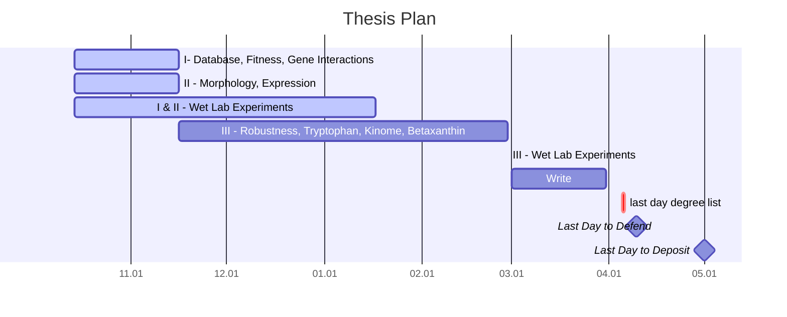
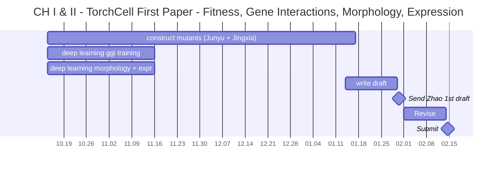
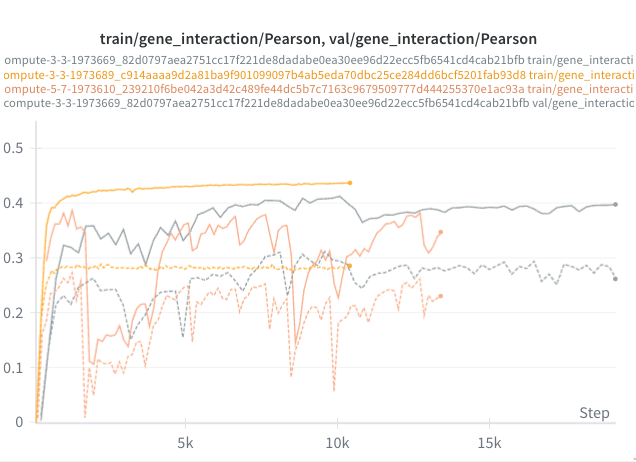
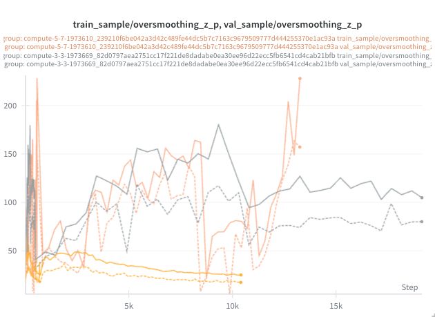

## Chapters

Notation: Chapter number - Project

1. Introduction
2. Gene Ontology Work
3. I   - Database, Fitness, Gene Interactions - 1st publication
4. II  - Morphology, Expression - 1st publication
5. III - Robustness, Tryptophan, Kinase, Betaxanthin (metabolism) - 2nd publication
6. IV  - Swanki open source education software

## Gantt Thesis

### Gantt - CH I & II

## Weekly Summary

All week was spent on optimization.

Configuration:

- GPU: Single GPU (no DDP)
- Dataset: 10,000 sample subset
- Batch size: 64 for DANGO, 28 for others (We are limited to $\approx$ 28 due to large data size on others)
- Steps profiled: 100 (per run)

Purpose:
Compare all 5 graph processing methods under identical conditions:

1. DANGO (Perturbation) - Minimal graph data, fastest baseline
2. Lazy Hetero (LazySubgraphRepresentation) - Full graph + masks
3. NeighborSubgraph (1/2/3-hop) - Variable-sized k-hop neighborhoods

### Pairwise Interaction Experiments

**Figure 1 - Pairwise Interaction Experiments.** Orange and Grey are duplicate models on different GPUs. Grey on 4x A100 80GB and orange on 4x RTX 6000 Ada 48GB. Both models have 1.8 M parameters. Yellow is a much smaller model variant, with downscaled channels, totalling 0.2 M parameters. Yellow plateaus relatively quickly but grey and orange both have concerning erratic spiking behavior. Previous results indicated that pairwise interactions were a strong idea reaching pearson correlations of 0.35 on validation. We then optimized training speed for these runs, but the results are worse, likely due to chance related to optimization difficulty of this particular model.

**Figure 2 - Pairwise Interaction Experiments Oversmoothing.** - Low values mean more oversmoothing, linked to feature feature collapse. We again observe that in larger models we see correlated performance with less oversmoothing, meaning more feature spreading, and we see performance collapse when features oversmooth. Oversmoothing metric is monitoring tool, we don't directly intervene on latent space. Optimization is difficult for these models because they have a tendency to spontaneously collapse the features space, then they basically have to rebuild the model from that starting point. Likely causes are high learning rates and low weight regularization. These are difficult to tune given slow training speeds making us currently reliant on few of the configurations we believe to have high likelihood of success. Ultimately, this is not a sustainable way to build reliable models and we are now forced to rethink design.

### Results Summary Table

| Method       | it/s    | Speedup vs DANGO | Est. Max  GPU Mem (MB/batch) | Batch   | Nodes/sample | Edges/sample |
|--------------|---------|------------------|------------------------------|---------|--------------|--------------|
| DANGO        | 545.120 | 1.00×            | 4.0                          | 60      | 103.2        | 0.a0          |
| LazySubgraph | 1.433   | 0×               | 1,155.4                      | 973,650 | 6,607.0      | 2,527,683.0  |
| 1-hop        | 6.798   | .01×             | 88.7                         | 60      | 697.0        | 196,445.6    |
| 2-hop        | 2.499   | 0×               | 808.7                        | 1488    | 3,758.9      | 1,878,158.4  |
| 3-hop        | 2.136   | 0×               | 932.2                        | 60      | 4,508.1      | 2,166,602.5  |

Analysis:

**Speed Rankings (iterations/sec):**

1. DANGO:     545.120 it/s (baseline - minimal graph data)
2. Lazy:      1.433 it/s (0× vs DANGO)
3. 1-hop:     6.798 it/s (.01× vs DANGO, 4.74× vs Lazy)
4. 2-hop:     2.499 it/s (0× vs DANGO, 1.74× vs Lazy)
5. 3-hop:     2.136 it/s (0× vs DANGO, 1.49× vs Lazy)

**Memory Efficiency (GPU memory per batch):**

- DANGO:     4.0 MB (minimal - no graph edges)
- Lazy:      1155.4 MB (full graph for all samples)
- 1-hop:     88.7 MB (smallest subgraphs)
- 2-hop:     808.7 MB (medium subgraphs)
- 3-hop:     932.2 MB (largest subgraphs)

**Graph Size per Sample:**

- DANGO:     103.2 nodes, 0.0 edges (no graph in batch)
- Lazy:      6607.0 nodes, 2527683.0 edges (full 6607-node graph + masks)
- 1-hop:     697.0 nodes, 196445.6 edges
- 2-hop:     3758.9 nodes, 1878158.4 edges
- 3-hop:     4508.1 nodes, 2166602.5 edges

**Effective Throughput (samples/sec):**

- DANGO:     34887.680 samples/sec (batch=64)
- Lazy:      40.124 samples/sec (batch=28)
- 1-hop:     190.344 samples/sec (batch=28)
- 2-hop:     69.972 samples/sec (batch=28)
- 3-hop:     59.808 samples/sec (batch=28)

Key findings:

1. **DANGO Performance:**
   - Fastest method (545.120 it/s) due to minimal graph data
   - Only stores perturbation indices, no graph structure in batches
   - Fastest for pure interaction prediction without graph context, but not for global representations need for fitness, morphology, etc.

2. **LazySubgraph vs NeighborSubgraph:**
   - Lazy uses full graph (6607.0 nodes) with boolean masks
   - 1-hop extracts ~697.0 nodes/sample (4.74× faster)
   - 2-hop extracts ~3758.9 nodes/sample (1.74× faster)
   - 3-hop extracts ~4508.1 nodes/sample (1.49× faster)

3. **Memory Tradeoffs:**
   - Smaller hop counts allow larger batch sizes
   - 1-hop: max batch ~60
   - 2-hop: max batch ~1488
   - 3-hop: max batch ~60
   - Lazy: max batch ~973650

Discussion:

1. **If model needs full graph context:**

- Consider LazySubgraph despite slower speed
- All samples see complete 6607-node graph

2. **If local neighborhoods sufficient:**

- Could use 1-hop or 2-hop NeighborSubgraph
- Significantly faster with reasonable context

3. **If speed is critical:**

- Use DANGO for pure interaction prediction
- Trade graph features for maximum throughput

4. **For production training:**

- Balance between speed and model performance
- Test model accuracy vs throughput for each method

## Plan for Next Week

### 1. Objective and Original Architecture

We model cell-level phenotypes as

$$
y = f(G, S),
$$
where

- $(G)$ is the wildtype multi-graph of the organism,
- $(S \subseteq V(G))$ is the set of perturbed genes.

Our original architecture implicitly enforced

$$
f(G,S) \approx h_\phi\big(F_\theta(G) - F_\theta(G \setminus S)\big),
$$
with $(F_\theta)$ a graph encoder and $(G \setminus S)$ the graph with $(S)$ deleted.

**Pros of our formulation**

- Strong inductive bias: the phenotype depends on the *difference* between wildtype and perturbed organism. We showed that this strong inductive bias makes learning more efficient as it amplifies small effects when compared to the wildtype. Otherwise it can be difficult to detect small changes over the entire graph using strictly graph representations.
- Interpretability: $(F_\theta(G))$ and $(F_\theta(G\setminus S))$ are meaningful “whole-cell” latents. With these latents we can easily interpret similar types of deviations from latent wildtype. For instance, we would be able to tell which common clusters gives rise to positive trigenic interactions, high fitness, or favorable morphology. Then interventions that reproduce these latents are likely to give rise to similar phenotypes.

**Cost issue**

Running $(F_\theta)$ on full $(G)$ and full $(G\setminus S)$ for every sample makes per-step cost scale as

$$
\text{cost} \sim \mathcal{O}(B L |E|),
$$

with (B) batch size, (L) layers, and (|E|) the total number of edges in the multi-graph. This is the bottleneck, specifically $|E|$.

However, for expressiveness, any dependence on $(G\setminus S)$ can be reparametrized via $((F_\theta(G), S))$, since $(G, S)$ uniquely determine $(G\setminus S)$. We can write $(g^\star)$ s.t.

$$
f(G,S) = g^\star(F_\theta(G), S).
$$
Instead of the difference form, we can directly learn
$$
f(G,S) \approx g_\psi\big(F_\theta(G), S\big)
$$

without explicitly encoding $(G\setminus S)$. We keep most of the inductive bias (wildtype + perturbation) but avoid the $(\mathcal{O}(B L |E|))$ per-sample cost and just face a $(\mathcal{O}(B L))$ cost.

We lose an intuitive encoding of genomes, but we gain speed with this representation. Another objective of ours is to be able to handle heterologous genes addition. Our previous encoding handles this very easily, but we face the difficulty of not knowing the necessary edges to add to to a new edge other than metabolic connections, which are already usually known prior to heterologous addition. Mostly the $\mathcal{O}(|E|)$ dependence but also our lack of ability to fully account for a compatible representation for new genes motivates our new transformer-based plan.

### 2. Transformer Cell Encoder with $(\langle\mathrm{CLS}\rangle)$

Let $(V = {1,\dots,N})$ be genes, each with features $(x_i)$.
We form a sequence including a CLS token for whole cell representation:

$$
X = \big(x_{\mathrm{CLS}}, x_1,\dots,x_N\big)
\in \mathbb{R}^{(N+1)\times d_{\text{in}}}.
$$

We define a transformer encoder $(F_\theta)$ (self-attention over the gene tokens):

$$
H = F_\theta(X)
= \big(h_{\mathrm{CLS}}, h_1,\dots,h_N\big)
\in \mathbb{R}^{(N+1)\times d}.
$$

Interpretation:

- $(h_{\mathrm{CLS}})$ is the **whole-cell representation** (we eliminate previous need for pooling),
- $(h_i)$ are **gene embeddings**.

We identify our previous representation with $H$ as follows.

$$
F_\theta(G) := H,
$$

with training and graph regularization $(H)$ reflects the structure of $(G)$.

### 3. Graph-Regularized Attention Heads

We have $(K)$ graphs $(G^{(k)} = (V, E^{(k)}))$ (regulatory, physical, STRING layers, etc.) with adjacencies. For the first part of the plan we are just focused on gene graphs but the method is extensible to bipartite graphs albeit at higher cost.

$$
A^{(k)} \in {0,1}^{N\times N}, \quad k=1,\dots,K.
$$

The transformer has layers $(\ell = 1,\dots,L)$ and heads $(h = 1,\dots,H)$.
For a given layer/head, the self-attention over genes produces

$$
\alpha^{(\ell,h)} \in [0,1]^{N\times N},
$$

(the gene–gene block of the attention map; ignore the CLS row/col for regularization).

We choose a set of graph-aligned heads:

$$
\mathcal{R} = { (\ell_k, h_k, k) : k = 1,\dots,K},
$$

we plan on using early or mid layers, with at least one head per graph, while leaving other heads free learn most useful attention maps for given the different phenotypic objectives.

We can normalize adjacency rows with uniform weighting

$$
\tilde{A}_{i,:}^{(k)}=\frac{A_{i,:}^{(k)}}{\sum_j A_{i j}^{(k)}+\varepsilon}=\frac{A_{i,:}^{(k)}}{d_i^{(k)}+\varepsilon}
$$

where $d_i^{(k)}$ is degree for that row. We then define a graph regularization term for each $(k)$ via row-wise KL on a sampled row set $(\mathcal{I}*k)$. We want to parameterize for sampling because the $\mathcal{O}({N^2})$ could be too costly. We would sample all positive and some negative according to cost:

$$
\mathcal{L}_{\text {graph }}^{(k)}=\sum_{i \in \mathcal{I}_k} \operatorname{KL}\left(\tilde{A}_{i,:}^{(k)} \| \alpha_{i,:}^{\left(\ell_k, h_k\right)}\right)
$$

**Total loss** becomes:

$$
\mathcal{L}=\mathcal{L}_{\text {phenotype }}+\sum_{k=1}^K \lambda_k \mathcal{L}_{\text {graph }}^{(k)}
$$

where $(\lambda_k)$ helps use graphs as priors, not hardcoded architectural constraints.

Only a subset of early heads weill be regularized; deeper layers and other heads will free to discover whatever patterns that help phenotype prediction.

### 4. Perturbation Head $(g_\psi(F_\theta(G), S))$

Given a perturbation set $(S \subseteq V)$ (deletions, additions, overexpression, etc.), we encode per-gene perturbation types as:

$$
m_i(S) \in \{0,1\}^p,
$$

(e.g. one-hot over ${\text{absent, present, added, overexpressed}})$, and stack them into

$$
M(S) = (m_1(S),\dots,m_N(S))^\top \in \mathbb{R}^{N\times p}.
$$

Let $(H_{\text{genes}} = (h_1,\dots,h_N)^\top)$.

We define a perturbation head $(g_\psi)$ that operates on $((H, M(S)))$:

$$
\hat{y}
= g_\psi\big(h_{\mathrm{CLS}}, H_{\text{genes}}, M(S)\big).
$$

To start we have a simple structured choice:

1. **Perturbation summary**:

    $$
    q_S = \mathrm{pool}\{ h_i : i \in S \} \in \mathbb{R}^d,
    $$

    Note we can pool with simple order invariant aggregation like mean, sum or use more complicated methods like HyperSAGNN from Dango.

2. **Cross-attention** from $(q_S)$ to all genes:

    Define scores:

    $$
    s_i(S):=q_S^{\top} W h_i, \quad i=1, \ldots, N
    $$

    Then the attention weights are:

    $$
    \beta_i(S)=\frac{\exp \left(s_i(S)\right)}{\sum_{j=1}^N \exp \left(s_j(S)\right)}, \quad i=1, \ldots, N
    $$

    And the perturbation summary is:

    $$
    z_S=\sum_{i=1}^N \beta_i(S) \phi\left(h_i, m_i(S)\right)
    $$

    In vector form:

    $$
    \boldsymbol{s}(S)=\left(s_1(S), \ldots, s_N(S)\right)^{\top}, \quad \boldsymbol{\beta}(S)=\operatorname{softmax}(\boldsymbol{s}(S))
    $$

    and then

    $$
    z_S=\sum_{i=1}^N \beta_i(S) \phi\left(h_i, m_i(S)\right)
    $$

    Note we are taking softmax over rows $i$, meaning for each node we are computing probability of out edge connection.

3. **Final prediction**:

   $$
   \hat{y}
   = \mathrm{MLP}\big([h_{\mathrm{CLS}} ,\Vert, z_S]\big).
   $$

  This helps us **achieve reparameterization** without encoding $(G\setminus S)$.

  $$
  \hat{y}
  \approx f(G,S)
  \approx g_\psi\big(F_\theta(G), S\big)
  $$

  We retain a global whole-cell latent $(h_{\mathrm{CLS}})$ and an explicit perturbation-driven summary $(z_S)$, but the costly $(\mathcal{O}(|E|))$ encoder is run only on $(G)$, not on $(G\setminus S)$ per sample.

### 5. Adding New Genes for Metabolic Engineering and Compatibility with Edge-Regularization

Suppose we add a new gene $(u)$ (e.g. via metabolic engineering engineering, breeding etc.) with features $(x_u)$. We extend the sequence by just appending

$$
X' = \big(x_{\mathrm{CLS}}, x_1,\dots,x_N, x_u\big),
$$

and run the same encoder:

$$
H' = F_\theta(X')
= \big(h'_{\mathrm{CLS}}, h'_1,\dots,h'_N, h'_u\big).
$$

Key points:

- Transformer is length-agnostic: it can handle $(N+1)$ tokens without architectural changes given that we do not positionally encode genes. This is akin to the set transformer.
- The new node gets an embedding $(h'*u)$ and contributes to an updated whole-cell embedding $(h'*{\mathrm{CLS}})$.
- The perturbation head can treat $(u)$ exactly like any other gene (it appears in $(H')$ and in the perturbation mask $(M(S))$ when we “turn it on”).

For graph-regularized heads, the existing graphs $(G^{(k)})$ only define adjacency on original genes. It is actually rare that we will know interactions of a new gene in a new organism. We will use masks $(R^{(k)} \in {0,1}^{(N')\times(N')})$, with $(N' = N)$ or $(N+1)$, that indicate valid adjacency entries for graph $(k)$:

Let $N^{\prime}$ be the current number of genes. Define a binary validity mask

$$
R^{(k)} \in\{0,1\}^{N^{\prime} \times N^{\prime}}
$$

for graph $k$ by

$$
R_{i j}^{(k)}= \begin{cases}1, & \text { if the pair }(i, j) \text { has a defined adjacency } A_{i j}^{(k)} \\ 0, & \text { otherwise. }\end{cases}
$$

In more detail:

- For known gene-gene pairs $(i, j)$, set

$$
R_{i j}^{(k)}=1 .
$$

- For any pair involving a new gene $u$,

$$
R_{i u}^{(k)}=R_{u i}^{(k)}=0 \quad \text { for all } i,
$$

Meaning we do not include these entries in the graph loss.
Then the graph-regularization loss for graph $k$ is restricted to valid entries:

$$
\mathcal{L}_{\text {graph }}^{(k)}=\sum_{i=1}^{N^{\prime}} \sum_{j=1}^{N^{\prime}} R_{i j}^{(k)} \ell\left(\tilde{A}_{i j}^{(k)}, \alpha_{i j}^{\left(\ell_k, h_k\right)}\right)
$$

where $\ell$ is your per-entry loss (e.g. KL row-wise, or BCE on edges vs non-edges), $\tilde{A}^{(k)}$ is the normalized adjacency, and $\alpha^{\left(\ell_k, h_k\right)}$ is the attention map of the head tied to graph $k$.

Row entry sampling can added to definition of $R^{(k)}$ by zeroing out all entries in rows that aren't sampled.

Design discussion:

- Existing nodes’ attention is still nudged toward known edges.
- The new gene participates fully in attention and in the perturbation head, but is not constrained by missing adjacency (no regularization terms involving $(u)$).
- The architecture therefore supports adding nodes and transferring across organisms with different $(N)$, while still using the multi-graph as a structural prior where we have it.

We are keeping the original “wildtype + perturbation” inductive bias, but implementing it as

$$
f(G,S) \approx g_\psi(F_\theta(G), S)
$$

with a transformer cell encoder, graph-regularized attention heads, a CLS whole-cell representation, and the ability to add new genes without ever re-encoding full perturbed graphs.

**Concerns**

- Now that the graph structure is applied only via regularization learning might be slower or less effective. It is actually ver hard to say without empirically testing this because graph structures in general are noisy, we have learned this comparing the differences between String9 and String12. The structures themselves could have mistakes, which make regularization better strategy if it works, but it could be more difficult to tune training. We should know by the end of the week.
- Regularization might compete with the overall objective. I doubt this is true, but it could be that the graph structures make it harder to learn the objective. Regardless I think we need it because our training signal is so sparse.
- Balancing regularization strength. See above point.
- Attention interpretability. Graph attention on previous model is pretty obvious to interpret but it will be difficult to know how far we can take interpretation on the regularized attention. More on this later.

---

## Supporting Documentation and Artifacts

*Files reorganized 2025.11.12 to document experimental findings*

### File Movement Mapping

All files were moved from their original locations to follow dendron naming conventions for better organization and future reference.

#### Profile Results

*Moved from root directory to `experiments/006-kuzmin-tmi/profiling_results/`*

- `profile_results_2025-11-05-02-53-40.txt` → `lazy.hetero.profile.2025.11.05.025340.txt`
- `profile_results_2025-11-05-03-00-04.txt` → `lazy.hetero.profile.2025.11.05.030004.txt`
- `profile_results_2025-11-05-03-22-23.txt` → `lazy.hetero.profile.2025.11.05.032223.txt`
- `profile_results_2025-11-05-03-28-17.txt` → `lazy.hetero.profile.2025.11.05.032817.txt`
- `profile_results_2025-11-05-03-34-41.txt` → `lazy.hetero.profile.2025.11.05.033441.txt`
- `profile_results_2025-11-05-16-33-37.txt` → `lazy.hetero.profile.2025.11.05.163337.txt`
- `profile_dango_results_2025-11-05-16-26-56.txt` → `dango.profile.2025.11.05.162656.txt`

#### Documentation Files

*Moved from `experiments/006-kuzmin-tmi/` to `notes/`*

- `DANGO_VS_LAZY_HETERO_PROFILE_COMPARISON.md` → `experiments.006-kuzmin-tmi.2025.11.06.dango-vs-lazy-profile-comparison.md`
- `DDP_DEVICE_FIX.md` → `experiments.006-kuzmin-tmi.2025.11.06.ddp-device-fix.md`
- `FINAL_FIX_SUMMARY.md` → `experiments.006-kuzmin-tmi.2025.11.06.vectorization-final-fix.md`
- `README_PREPROCESSING.md` → `experiments.006-kuzmin-tmi.2025.11.06.preprocessing-workflow.md`
- `VECTORIZATION_SUMMARY.md` → `experiments.006-kuzmin-tmi.2025.11.06.gpu-mask-vectorization.md`

#### Analysis Files

*Moved from `experiments/006-kuzmin-tmi/analysis/` to `notes/`*

- `final_preprocessing_solution.md` → `experiments.006-kuzmin-tmi.2025.11.06.uint8-preprocessing-solution.md`
- `corrected_storage_calculations.md` → `experiments.006-kuzmin-tmi.2025.11.04.storage-calculations.md`

### Key Supporting Files

1. **Performance Analysis**: [[experiments.006-kuzmin-tmi.2025.11.06.dango-vs-lazy-profile-comparison|dendron://torchcell/experiments.006-kuzmin-tmi.2025.11.06.dango-vs-lazy-profile-comparison]]
   - Comprehensive comparison showing 380x slowdown of LazySubgraph vs DANGO (545 it/s vs 1.4 it/s)
   - 25-step DDP profiling showed even worse 875x slowdown in specific conditions
   - Analysis of why HeteroData collation is so expensive

2. **Optimization Attempts**:
   - [[experiments.006-kuzmin-tmi.2025.11.06.vectorization-final-fix|dendron://torchcell/experiments.006-kuzmin-tmi.2025.11.06.vectorization-final-fix]] - GPU mask vectorization
   - [[experiments.006-kuzmin-tmi.2025.11.06.ddp-device-fix|dendron://torchcell/experiments.006-kuzmin-tmi.2025.11.06.ddp-device-fix]] - Multi-GPU device handling

3. **Preprocessing Solutions**:
   - [[experiments.006-kuzmin-tmi.2025.11.06.preprocessing-workflow|dendron://torchcell/experiments.006-kuzmin-tmi.2025.11.06.preprocessing-workflow]] - Full preprocessing pipeline
   - [[experiments.006-kuzmin-tmi.2025.11.06.uint8-preprocessing-solution|dendron://torchcell/experiments.006-kuzmin-tmi.2025.11.06.uint8-preprocessing-solution]] - UINT8 masks storage

4. **Storage Analysis**: [[experiments.006-kuzmin-tmi.2025.11.04.storage-calculations|dendron://torchcell/experiments.006-kuzmin-tmi.2025.11.04.storage-calculations]]
   - Corrected calculations: 820GB (not 13TB as initially feared)

### Package File Changes

Key modifications to torchcell package during experiments:

1. **torchcell/data/graph_processor.py** (+192 lines)
   - Added `NeighborSubgraphRepresentation` class for k-hop neighborhood sampling
   - Attempted to reduce graph size by only including k-hop neighborhoods

2. **torchcell/models/hetero_cell_bipartite_dango_gi_lazy.py** (+262/-131 lines)
   - Major refactor attempting various optimizations
   - Added GPU mask generation and vectorized operations

3. **torchcell/trainers/int_hetero_cell.py** (+92 lines)
   - Added `execution_mode` parameter for profiling modes
   - Supports `dataloader_profiling` to skip model forward pass
   - Supports `model_profiling` to skip optimizer step

4. **torchcell/trainers/int_dango.py** (+34 lines)
   - Similar execution_mode support for DANGO baseline comparisons

5. **torchcell/datamodules/cell.py** (+12 lines)
   - Minor adjustments for profiling support

6. **torchcell/datamodules/perturbation_subset.py** (+14 lines)
   - Subset handling improvements for profiling

### Experiment Configurations

Key configuration files used (preserved in `experiments/006-kuzmin-tmi/conf/`):

- Configs 073-087: Various attempts at optimization
- Final test config 087: Comprehensive comparison of all methods

### Profiling Results

All profiling outputs preserved in:

- `experiments/006-kuzmin-tmi/profiling_results/`
- Multiple runs showing consistent 380x slowdown (545 it/s vs 1.4 it/s)
