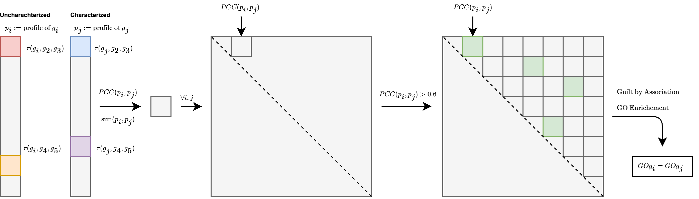

## 2026.01.13

- [x] Wandb sync of recent #IGB
- [x] #GH Get a inference comparison on deletion versus larger dataset [[Performance Diff 010 009|experiments.010-kuzmin-tmi.performance-diff-010-009]]

## 2026.01.14

- [x] Collected 668 uncharacterized and 684 dubious genes [[experiments.013-uncharacterized-genes.scripts.count_dubious_and_uncharacterized_genes]]
- [x] Analyzed 44,619 triple interactions involving uncharacterized genes [[experiments.013-uncharacterized-genes.scripts.triple_interaction_enrichment_of_uncharacterized_genes]]
- [x] Found 3 essential ∩ uncharacterized genes, identified YCR016W annotation discrepancy [[experiments.013-uncharacterized-genes.scripts.uncharacterized_essential_overlap]]

- [x] Refactored inference/eval configs from r0/E006_M## to m00/m01/m02 naming convention
- [x] ADH/ALD triple knockout case study for 2,3-butanediol production (Ng et al. 2012) [[Trigenic_interaction_adh1_adh3_adh5|experiments.010-kuzmin-tmi.scripts.trigenic_interaction_adh1_adh3_adh5]]
- [x] Costanzo2016 SMF/DMF/ε lookup for ADH1/ADH3/ADH5/ALD6 genes [[Adh_ald_costanzo2016_lookup|experiments.010-kuzmin-tmi.scripts.adh_ald_costanzo2016_lookup]]
- [x] Improved graph recovery metric documentation with intuition/interpretation format [[Graph_recovery|torchcell.viz.graph_recovery]]

- [x] Complete 3-step pipeline: gene collection, triple interaction analysis, essential overlap [[experiments.013-uncharacterized-genes.scripts.013-uncharacterized-genes]]
- [x] Identified 2,852 extreme TMI interactions involving 178 uncharacterized genes [[experiments.014-genes-enriched-at-extreme-tmi.scripts.analyze_extreme_interactions]]
- [x] Created 4 multi-panel figures showing extreme interaction patterns [[experiments.014-genes-enriched-at-extreme-tmi.scripts.visualize_extreme_interactions]]
- [x] Refactored analysis pipeline into modular data processing and visualization steps [[experiments.014-genes-enriched-at-extreme-tmi.scripts.014-genes-enriched-at-extreme-tmi]]
- [x] Enhanced frontmatter script with shebang preservation, clean note naming, and smart test file logic [[notes.assets.scripts.add_frontmatter]]
- [x] Fixed 7 experiment note files to follow H2 header convention with summaries: [[experiments.006-kuzmin-tmi.2025.11.04.storage-calculations]], [[experiments.006-kuzmin-tmi.2025.11.06.dango-vs-lazy-profile-comparison]], [[experiments.006-kuzmin-tmi.2025.11.06.ddp-device-fix]], [[experiments.006-kuzmin-tmi.2025.11.06.gpu-mask-vectorization]], [[experiments.006-kuzmin-tmi.2025.11.06.preprocessing-workflow]], [[experiments.006-kuzmin-tmi.2025.11.06.uint8-preprocessing-solution]], [[experiments.006-kuzmin-tmi.2025.11.06.vectorization-final-fix]], [[Experiment 087a Work in Progress|experiments.006-kuzmin-tmi.scripts.087a.wip]]
- [x] Cancelling out graph reg [[Key Question to Answer - Does Graph Reg Help|torchcell.losses.point_dist_graph_reg#key-question-to-answer---does-graph-reg-help]]
- [x] Updated microarray description and txt string - no code update. [[schema|torchcell.datamodels.schema]]
- [x] Reorganized SPELL scripts into experiment dir, removed torchcell/analysis module [[experiments.015-spell.scripts.spell_analysis]]
- [x] Fixed SPELL imports and paths for experiment directory structure [[experiments.015-spell.scripts.run_phase1_spell_analysis]]
- [x] Phase 1 SPELL pipeline: load studies, extract metadata, analyze 14k conditions [[experiments.015-spell.scripts.spell_analysis]]
- [x] Created comprehensive SPELL coverage analysis with 4-panel visualization [[experiments.015-spell.scripts.spell_coverage_analysis]]
- [x] Analyzed 15 condition categories, prioritized Environment subclass implementation [[experiments.015-spell.scripts.spell_coverage_analysis]]

## 2026.01.15

- [x] Description of the current wip investigating spell data - expression data shown on SGD over all conditions for queried gene [[Spell|torchcell.datasets.scerevisiae.spell]]
- [x] Small investigation into ref bio  yeast compendium which contains > 12,000 samples - will need to compare with `spell` → [[2026.01.15 - Other Related Datasets|torchcell.datasets.scerevisiae.spell#20260115---other-related-datasets]]
- [x] Plan for characterizing uncharacterized genes - simple layout from my interpretation. Need to check exact procedure 

- [x] Migrated run_all.py to shell script with fail-fast execution for 012-sameith-kemmeren pipeline [[experiments.012-sameith-kemmeren.scripts.012-sameith-kemmeren]]
- [x] Fixed sign inversion bug in Kemmeren dataset - correlation now correctly positive (+0.599 median) [[experiments.012-sameith-kemmeren.scripts.gene_by_gene_expression_correlation]]
- [x] Verified metadata quality with QC checks for perturbation counts and outlier detection [[experiments.012-sameith-kemmeren.scripts.verify_metadata]]
- [x] Generated expression distribution box plots for single and double mutants [[experiments.012-sameith-kemmeren.scripts.single_mutant_expression_distributions]]
- [x] Created triangular heatmap comparing Kemmeren and Sameith double mutant datasets [[experiments.012-sameith-kemmeren.scripts.double_mutant_combined_heatmap]]
- [x] Analyzed gene-by-gene Pearson and Spearman correlations across both datasets [[experiments.012-sameith-kemmeren.scripts.gene_by_gene_expression_correlation]]
- [x] Compared mean expression values for overlapping double mutants between studies [[experiments.012-sameith-kemmeren.scripts.kemmeren_sameith_overlap_analysis]]
- [x] Documented noise comparison analysis - currently broken, requires investigation for technical replicate variance [[experiments.012-sameith-kemmeren.scripts.noise_comparison_analysis]]

## 2026.01.16

- [x] worktree merge and delete → [[worktree-setup|user.Mjvolk3.torchcell.tasks.weekly.2026.03.worktree-setup]]
- [ ]
