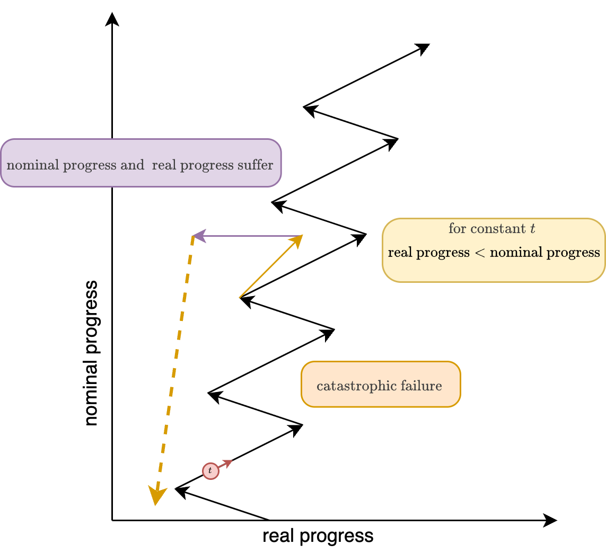

## 2026.01.26

- [x] Reset on wt → changing to n_samples to `n_replicates` because it is clear language when trying to use llm to find data. Previous thought was that `n_replicates` under an `experiment` was just the `n_samples` for that `experiment`. Replicates` is clearer and we are getting better extraction

## 2026.01.27

- [x] #WT saving data in two different places, fixed this so that we have option → Updated `.vscode/tasks.json` for `data-local` and `data-main`. [[scripts.setup-worktree]]
- [x] #WT more general python setup, moved some #M1 specific tasks to `torchcell-delta.code-workspace`
- 

- [ ] #WT add ref data to kemmeren - looks like there is one large pooled ref.
- [ ] phenotype-derivable-statistics
- [ ] First agent with anthropic sdk - Find papers  

***

- [ ] [[user.Mjvolk3.torchcell.tasks.weekly.2026.04.expression-schema.wip]]
- [ ] [[fitness-interaction-n_samples|user.Mjvolk3.torchcell.tasks.weekly.2026.03.fitness-interaction-n_samples]]

- [ ] Add n to fitness interaction data
- [ ] Add examples or clarify the schema design to avoid ambiguity in property definitions.

- [ ] Do we have robust way of handling labels? Did we do by some other method?  [[Generate_calmorph_labels|scripts.generate_calmorph_labels]]

- [ ] Build db

***

Review

## 2025.12.17

- [ ] Add a check to the final gene list to see if we have any genes overlapped with the double gene expression #GH

- [ ] Kemmeren, Sameith dataset verify metadata #M1

- [ ] Follow up on the dataset outlier comparison by reporting the spearman at snapshot for very best model across the different scenarios. → From quick comparison it looks like spearman for datasets with more data are still higher. Test datasets are obviously not exactly the same. →

- [ ] Expression datasets write adapters #M1

- [ ] Start DB build over night #GH

## 2025.12.20

- [x] Is expression data from SGD web browser available in the gene json? → It is not it comes from SPELL
- [ ] Are there images associated with [yeast-gfp data](https://yeastgfp.yeastgenome.org/). Yes if needed.. Maybe they do have some more information then just categorical classification? Maybe not.

***

 Move to ideas notes

- Studying epistasis through knockouts ... maybe not feasible... too many parts.
- Do locations of proteins change depending on populations changes of different kinds of proteins. We know that proteins go to different places. Maybe you can track this probabilistically, but can you shift the distribution of other proteins?
- The GFP-tagged library is distributed by < Invitrogen >.
- The RFP-tagged strains used for the colocalization studies can be
- If we could obtain these strains

***

- [ ] Email CW
