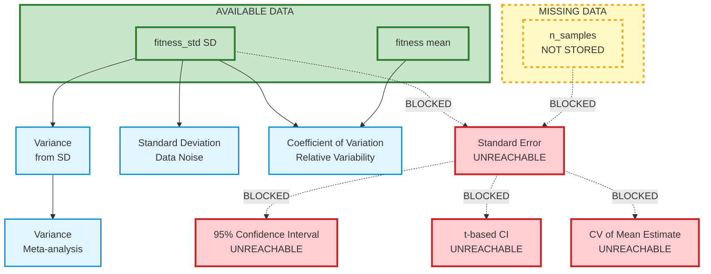
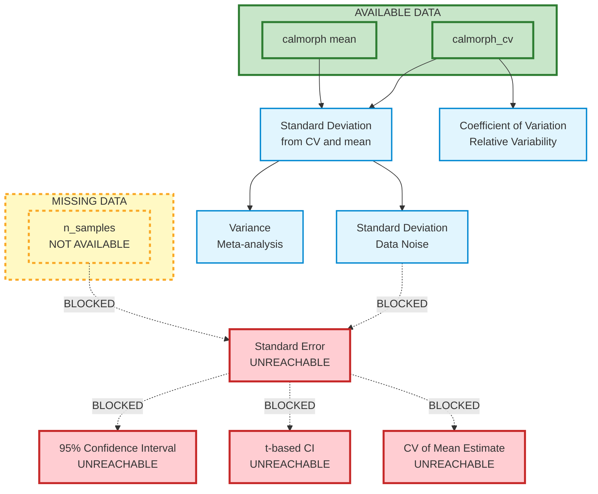
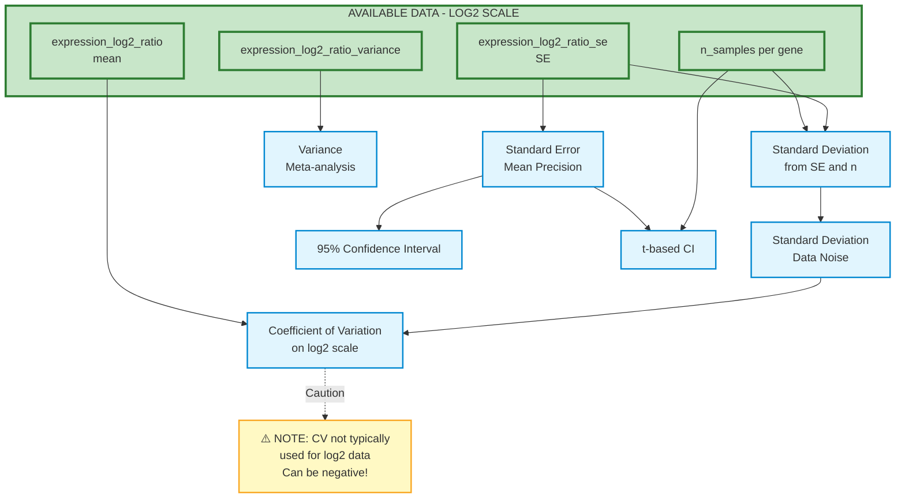
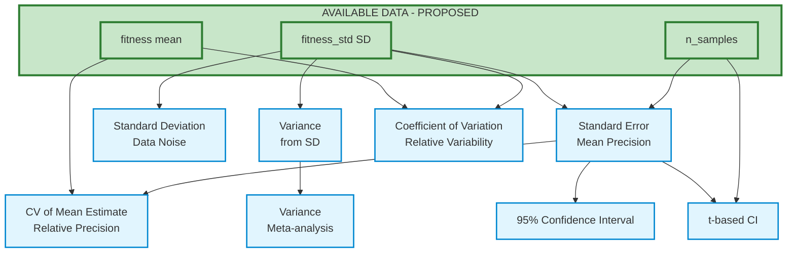

## 2026.01.28 - Dataset-Specific Statistics Computation

This document shows what statistics are computable from the actual data available in each phenotype type. **Red boxes** indicate statistics that **cannot be computed** due to missing input data.

## 1. FitnessPhenotype (Costanzo2016) - CURRENT

**Available Data:**

- `fitness` (mean fitness ratio)
- `fitness_std` (standard deviation)
- ⚠️ **NO n_samples** (not currently stored in schema)

**Computation Graph:**



**Result:** ⚠️ **Partial computation** - Can compute SD, Variance, and CV, but **cannot compute SE or CI** without sample size.

**What can be computed:**

- $\sigma^2 = \sigma \times \sigma$ ✅
- $CV = \frac{\text{fitness\_std}}{\text{fitness}} \times 100\%$ ✅

**What CANNOT be computed:**

- $SE = \frac{\text{fitness\_std}}{\sqrt{n}}$ ❌ (missing n)
- $CI = \text{fitness} \pm 1.96 \times SE$ ❌ (needs SE, which needs n)
- $CV_{SE} = \frac{SE}{\mu}$ ❌ (needs SE, which needs n)

**Problem:** Cannot switch `label_statistic_name` from `"fitness_std"` to `"fitness_se"` without n_samples!

## 2. CalMorphPhenotype (Ohya2005)

**Available Data:**

- `calmorph` (base morphological measurements - means)
- `calmorph_coefficient_of_variation` (CV values)
- ⚠️ **NO n_samples**

**Computation Graph:**



**Result:** ⚠️ **Partial computation** - Can derive SD and Variance from CV, but **cannot compute SE, CI, or CV_SE** without sample size.

**What can be computed:**

- $\sigma = \frac{CV \times \mu}{100}$ ✅
- $\sigma^2 = \sigma^2$ ✅
- $CV$ ✅ (already provided)

**What CANNOT be computed:**

- $SE = \frac{\sigma}{\sqrt{n}}$ ❌ (missing n)
- $CI = \mu \pm 1.96 \times SE$ ❌ (needs SE, which needs n)
- $CV_{SE} = \frac{SE}{\mu}$ ❌ (needs SE, which needs n)

**Recommendation:** If Ohya2005 paper reports sample sizes, add `calmorph_n_samples` field to enable SE computation.

## 3. MicroarrayExpressionPhenotype (Kemmeren2014)

**Available Data:**

- `expression_log2_ratio` (mean log2 fold change)
- `expression_log2_ratio_se` (standard error on log2 scale)
- `expression_log2_ratio_variance` (variance on log2 scale)
- `n_samples` (per-gene replicate counts)

**Computation Graph:**



**Result:** ✅ **All statistics computable** - SE and n_samples enable full reconstruction of SD, Variance, and CI.

**Key formulas (on log2 scale):**

- $\sigma = SE \times \sqrt{n}$
- $\sigma^2$ ✅ (already provided as `expression_log2_ratio_variance`)
- $CI = \bar{y} \pm 1.96 \times SE$ where $\bar{y}$ is mean log2 ratio

**Important note:** CV is typically **not used** for log2 expression data because:

- Log2 values can be negative (downregulated genes)
- Zero mean is possible (no change)
- CV = σ/μ becomes undefined or misleading when μ ≈ 0

**Alternative:** Use SE directly as uncertainty measure, or confidence intervals for hypothesis testing.

## Summary Table - Current State

| Dataset | Phenotype | Available Stats | Can Compute | Cannot Compute | Reason |
|---------|-----------|----------------|-------------|----------------|--------|
| Costanzo2016 | FitnessPhenotype | mean, SD | Variance, CV | SE, CI, CV_SE | ❌ Missing n_samples |
| Ohya2005 | CalMorphPhenotype | mean, CV | SD, Variance | SE, CI, CV_SE | ❌ Missing n_samples |
| Kemmeren2014 | MicroarrayExpressionPhenotype | mean, SE, Variance, n | SD, CI | None | ✅ Complete data (log2 scale) |

**Key finding:** Both Costanzo2016 and Ohya2005 are limited by missing `n_samples`.

## Recommendations - Current State

### For Costanzo2016 (FitnessPhenotype)

⚠️ **Cannot switch to SE** - Currently using `"fitness_std"` but cannot switch `label_statistic_name` to `"fitness_se"` without n_samples field.

### For Ohya2005 (CalMorphPhenotype)

⚠️ **Consider adding n_samples** if available from paper:

- Would enable SE computation for uncertainty quantification
- Would enable confidence intervals for hypothesis testing
- Currently limited to scale-independent CV for variability

### For Kemmeren2014 (MicroarrayExpressionPhenotype)

✅ **Already optimal** - Using SE as primary statistic on log2 scale is correct approach for expression data.

---

## PROPOSED: FitnessPhenotype with n_samples

### Proposed Schema Addition

Add `n_samples` field to `FitnessPhenotype`:

```python
class FitnessPhenotype(Phenotype, ModelStrict):
    graph_level: str = "global"
    label_name: str = "fitness"
    label_statistic_name: str = "fitness_se"  # CHANGED from fitness_std
    fitness: float = Field(description="wt_growth_rate/ko_growth_rate")
    fitness_se: float | None = Field(
        default=None,
        description="fitness standard error (primary uncertainty statistic)"
    )
    fitness_std: float | None = Field(
        default=None,
        description="fitness standard deviation (raw data from publication)"
    )
    n_samples: int | None = Field(  # NEW FIELD
        default=None,
        description="Number of replicate measurements"
    )
```

### Proposed Data Availability

- `fitness` (mean fitness ratio) ✅
- `fitness_std` (standard deviation) ✅
- `fitness_se` (standard error) ✅ (computed from SD and n)
- `n_samples` (number of replicates) ✅ **NEW**

### Proposed Computation Graph



**Result:** ✅ **All statistics computable** - fitness_std and n_samples enable computation of SE, CI, and CV metrics.

### Benefits of Adding n_samples

1. **Enable SE computation:**
   - $SE = \frac{\text{fitness\_std}}{\sqrt{\text{n\_samples}}}$
   - Use SE as primary statistic (`label_statistic_name = "fitness_se"`)

2. **Enable confidence intervals:**
   - $CI_{95\%} = \text{fitness} \pm 1.96 \times SE$
   - $CI_t = \text{fitness} \pm t_{\alpha/2, n-1} \times SE$

3. **Enable deduplication with inverse-variance weighting:**
   - Weight experiments by precision: $w = \frac{1}{SE^2}$
   - Experiments with more replicates automatically weighted higher

4. **Enable proper uncertainty quantification:**
   - SE measures precision of mean estimate (better for ML training)
   - SD measures data variability (useful for QC)
   - Both available for different purposes

5. **Consistency with Kemmeren2014:**
   - Both use SE as primary statistic
   - Both store n_samples for reconstruction
   - Unified approach across datasets

### Data Source

Costanzo2016 paper reports:

- Query strains: **n = 68** biological replicates
- Array strains: **n = 4** technical replicates
- Double mutants: **n = 4** technical replicates (typically)

This information is available and can be stored in the schema.

### Implementation

```python
# In Costanzo2016 dataset loader
fitness_se = fitness_std / math.sqrt(n_samples)

phenotype = FitnessPhenotype(
    fitness=row[smf_key],
    fitness_std=fitness_std,      # Keep for reproducibility
    fitness_se=fitness_se,         # PRIMARY statistic
    n_samples=n_samples,           # Enable reconstruction
)
```

### Summary Table - Proposed State

| Dataset | Phenotype | Available Stats | Can Compute | Cannot Compute | Status |
|---------|-----------|----------------|-------------|----------------|--------|
| Costanzo2016 | FitnessPhenotype | mean, SD, **n** | SE, Variance, CV, CI | None | ✅ Complete with proposal |
| Ohya2005 | CalMorphPhenotype | mean, CV | SD, Variance | SE, CI, CV_SE | ❌ Still missing n |
| Kemmeren2014 | MicroarrayExpressionPhenotype | mean, SE, Variance, n | SD, CI | None | ✅ Already complete |

**Impact:** Adding `n_samples` to FitnessPhenotype brings it to parity with MicroarrayExpressionPhenotype for statistical rigor.
