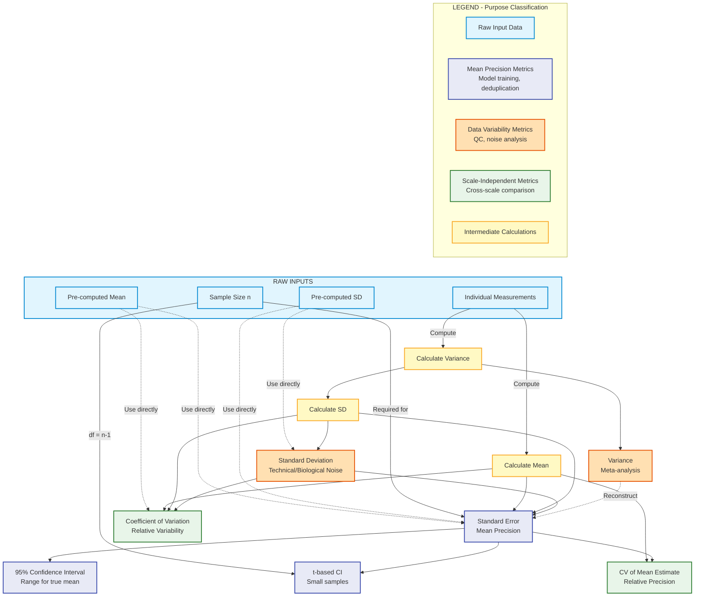

## Costanzo Fitness Raw Data

- fitness
- fitness std

## Ohya Morphology Raw Data

- calmorph label
- CV of label

## Kemmeren Expression Raw Data

- Log 2 fold change
- We compute SE of log 2 fold change

## Desiderata

It would be good to have some standard way of comparing some statistic across similar types of data but I think this is mostly unreasonable... It is too contingent on the setup of the experiment, protocol etc. Instead something more realistic is maybe to still report a `label_statistic` but to try and provide all data for constructing different statistics.

For example ff we have

- `n_replicates`
- `mean`
- `std`

Then we could create `SE`

If we have raw data we should always be able to compute any stat we might want.

## Flow Chart of Possible Statistics

### Mathematical Definitions

#### Raw Inputs

| Notation | Formula                    | Description                                                |
|----------|----------------------------|------------------------------------------------------------|
| $x_i$    | Individual measurement $i$ | Raw observations from experiment                           |
| $n$      | Sample size                | Number of independent measurements                         |
| $\mu$    | Pre-computed mean          | $\mu = \frac{1}{n}\sum_{i=1}^{n} x_i$                      |
| $\sigma$ | Pre-computed SD            | $\sigma = \sqrt{\frac{1}{n-1}\sum_{i=1}^{n}(x_i - \mu)^2}$ |

#### Intermediate Calculations (Yellow)

| Statistic          | Formula                                                                      | When to Compute                |
|--------------------|------------------------------------------------------------------------------|--------------------------------|
| Mean               | $\mu = \frac{1}{n}\sum_{i=1}^{n} x_i$                                        | When you have raw measurements |
| Variance           | $\sigma^2 = \frac{1}{n-1}\sum_{i=1}^{n}(x_i - \mu)^2$                        | For aggregation, meta-analysis |
| Standard Deviation | $\sigma = \sqrt{\sigma^2} = \sqrt{\frac{1}{n-1}\sum_{i=1}^{n}(x_i - \mu)^2}$ | Characterize data spread       |

**Alternative formulas (from other statistics):**

- Variance from SE: $\sigma^2 = SE^2 \times n$
- SD from SE: $\sigma = SE \times \sqrt{n}$
- Variance from SD: $\sigma^2 = \sigma \times \sigma$ (by definition)

#### Data Variability Metrics (Orange)

**Purpose:** Quantify the spread/noise in raw observations

| Statistic               | Formula                                                    | Interpretation                       |
|-------------------------|------------------------------------------------------------|--------------------------------------|
| Standard Deviation (SD) | $\sigma = \sqrt{\frac{1}{n-1}\sum_{i=1}^{n}(x_i - \mu)^2}$ | Typical deviation from mean          |
| Variance                | $\sigma^2 = \frac{1}{n-1}\sum_{i=1}^{n}(x_i - \mu)^2$      | Squared deviations (for aggregation) |

**Use cases:**

- SD: QC thresholds, understanding measurement noise
- Variance: Meta-analysis (inverse-variance weighting), combining studies

**Reconstruction formulas:**

- From SE and n: $\sigma = SE \times \sqrt{n}$
- From CV and mean: $\sigma = CV \times \mu / 100$ (if CV in %)

#### Mean Precision Metrics (Indigo)

**Purpose:** Quantify confidence in the estimated mean

| Statistic               | Formula                                                                | Interpretation                               |
|-------------------------|------------------------------------------------------------------------|----------------------------------------------|
| Standard Error (SE)     | $SE = \frac{\sigma}{\sqrt{n}}$                                         | Precision of mean estimate                   |
| 95% Confidence Interval | $[\mu - 1.96 \times SE, \mu + 1.96 \times SE]$                         | 95% chance true mean in this range (large n) |
| t-based CI              | $[\mu - t_{\alpha/2, df} \times SE, \mu + t_{\alpha/2, df} \times SE]$ | For small samples, $df = n-1$                |

**Expanded formulas:**

- SE from raw data: $SE = \frac{1}{\sqrt{n}} \sqrt{\frac{1}{n-1}\sum_{i=1}^{n}(x_i - \mu)^2}$
- SE from SD and n: $SE = \frac{\sigma}{\sqrt{n}}$
- Margin of error (95% CI): $MOE = 1.96 \times SE = 1.96 \times \frac{\sigma}{\sqrt{n}}$
- Margin of error (t-based): $MOE = t_{\alpha/2, n-1} \times SE$ where $\alpha = 0.05$ for 95% CI

**Use cases:**

- SE: Model training (uncertainty weights), deduplication
- CI: Hypothesis testing, determining if means differ significantly

**Key insight:** SE decreases with $\sqrt{n}$, so doubling precision requires 4× more samples

#### Scale-Independent Metrics (Green)

**Purpose:** Compare variability across different measurement scales

| Statistic                     | Formula                                 | Interpretation               |
|-------------------------------|-----------------------------------------|------------------------------|
| Coefficient of Variation (CV) | $CV = \frac{\sigma}{\mu} \times 100\%$  | Relative variability of data |
| CV of Mean Estimate           | $CV_{SE} = \frac{SE}{\mu} \times 100\%$ | Relative precision of mean   |

**Expanded formulas:**

- CV from raw data: $CV = \frac{\sqrt{\frac{1}{n-1}\sum_{i=1}^{n}(x_i - \mu)^2}}{\mu} \times 100\%$
- CV from SD and mean: $CV = \frac{\sigma}{\mu} \times 100\%$
- $CV_{SE}$ from CV: $CV_{SE} = \frac{CV}{\sqrt{n}}$
- $CV_{SE}$ from SE and mean: $CV_{SE} = \frac{SE}{\mu} \times 100\% = \frac{\sigma}{{\mu\sqrt{n}}} \times 100\%$

**Validity constraints:**

- ✓ Valid when $\mu > 0$ and $|\mu| \gg \sigma$ (mean far from zero)
- ✗ Invalid for log2 fold changes (can be negative or near zero)
- ✗ Invalid for interval scales (temperature, pH) where zero is arbitrary

**Use cases:**

- CV: Morphology features with different units (μm, angles, ratios)
- $CV_{SE}$: Comparing experimental precision across studies with different means

**Example interpretation:**

- CV = 10% → SD is 10% of the mean (e.g., mean = 100, SD = 10)
- $CV_{SE}$ = 2% → SE is 2% of the mean (high precision estimate)

#### Complete Reconstruction Table

Given combinations of statistics, here's what you can compute:

| Have            | Can Compute WITHOUT n                            | Requires n                                      |
|-----------------|--------------------------------------------------|-------------------------------------------------|
| $\mu, \sigma$   | $\sigma^2$, $CV = \frac{\sigma}{\mu}$            | $SE = \frac{\sigma}{\sqrt{n}}$, $CV_{SE}$       |
| $\mu, SE$       | $CV_{SE} = \frac{SE}{\mu}$                       | $\sigma = SE \times \sqrt{n}$, $\sigma^2$, $CV$ |
| $\mu, CV$       | $\sigma = \frac{CV \times \mu}{100}$, $\sigma^2$ | $SE = \frac{\sigma}{\sqrt{n}}$, $CV_{SE}$       |
| $\mu, \sigma^2$ | $\sigma = \sqrt{\sigma^2}$, $CV$                 | $SE = \frac{\sigma}{\sqrt{n}}$, $CV_{SE}$       |

**When you MUST store n:**

✓ Converting between SD and SE (most common need)
✓ Deduplication with inverse-variance weighting
✓ Computing confidence intervals
✓ Comparing precision across experiments
✓ Model training with uncertainty weights

**When n is OPTIONAL:**

- You only use one statistic type consistently (e.g., always CV, never SE)
- n is constant across entire dataset (can store at dataset level)
- You never need to convert between statistics

**For TorchCell framework:** n is **essential** because you:

1. Want to switch Costanzo from SD → SE as primary statistic
2. Need deduplication across experiments with varying sample sizes
3. Combine data from multiple sources (Costanzo, Kemmeren, Ohya)
4. Train models with uncertainty-weighted loss functions

#### Special Case: Log-Scale Statistics

For expression data and fitness ratios, compute statistics on log scale:

| Statistic   | Formula                                                                           | Notes                  |
|-------------|-----------------------------------------------------------------------------------|------------------------|
| Log2 values | $y_i = \log_2(x_i)$                                                               | Transform FIRST        |
| Mean log2   | $\bar{y} = \frac{1}{n}\sum_{i=1}^{n} y_i = \frac{1}{n}\sum_{i=1}^{n} \log_2(x_i)$ | NOT $\log_2(\bar{x})$! |
| SD log2     | $\sigma_y = \sqrt{\frac{1}{n-1}\sum_{i=1}^{n}(y_i - \bar{y})^2}$                  | On log scale           |
| SE log2     | $SE_y = \frac{\sigma_y}{\sqrt{n}}$                                                | On log scale           |

**⚠️ Common mistake:**

- ❌ WRONG: $\bar{y} = \log_2(\frac{1}{n}\sum x_i)$ - taking log of mean
- ✓ RIGHT: $\bar{y} = \frac{1}{n}\sum \log_2(x_i)$ - mean of logs

**Why log scale matters:**

- Fold changes are multiplicative: 2× upregulation and 0.5× downregulation have equal magnitude
- Log scale makes these symmetric: $\log_2(2) = 1$ and $\log_2(0.5) = -1$
- Errors more normally distributed on log scale
