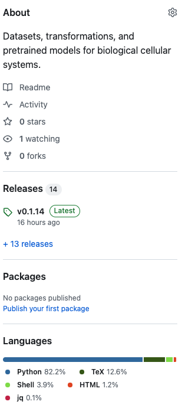
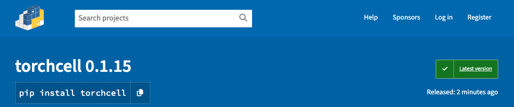

## Semantic-Release for Versioning

@Mjvolk3.torchcell.tasks.deprecated.2024.06.18

```
python -m pip install python-semantic-release
```

### Semantic-Release for Versioning - pyproject.toml

```toml
[tool.semantic_release]
version_variables = [
    "pyproject.toml:version",
    "torchcell/__version__.py:__version__",
]
branch = "main"
upload_to_pypi = "true"
```

Goes by `MAJOR.MINOR.PATCH` distinction

### Semantic-Release for Versioning - GitHub Actions

We rely on github actions to update versions via assigning a version tag with each release. Any time we want to bump the versioning we can just add one of the following to the next git commit.

- `"major"=="BREAKING CHANGE:"`
- `"minor"=="feat:"`
- `"patch"=="fix:"`

I believe a separate commit is made via github actions which then adds the tag. This means that the tag does not appear immediately in github uppon receiving the push and it is the reason we have resorted to publishing to PyPi from local instead of via git hub actions [[Bash Script used for Publishing on PyPI|dendron://torchcell/pypi-publish#bash-script-used-for-publishing-on-pypi]]. I could not find a way to make the publishing action conditioned on the `".github/workflows/semantic-release.yaml"` action completion. Since we really should base the publishing on the latest version tag, it is not straightforward how to do this.

### Semantic-Release for Versioning - Standard Operating Procedure

- (1) Big brain 🧠 has made progress and wants to update the software version

- (2) Commit with any of the designated text for MAJOR.MINOR.PATCH

Example:

```git
git add .
git commit -m "fix: database to infinity"
```

- (3) Go to [github torchcell](https://github.com/Mjvolk3/torchcell) and check until `".github/workflows/semantic-release.yaml"` has completed and the release version updates accordingly.



⛔️ See how in later examples we are updating to `v0.1.15`, if you see `v0.1.14` the github action isn't complete and you cannot yet publish to pypi.

- (4) Now back on local you will see that the versioning is out of date. You can check this by looking at ay of the files listed in `version_variables` in the `pyproject.toml`. Since github actions bumps the version remotely we now need to sync. `git fetch` and `git merge` to see version update.

Example:

Check these files for current version and you will see mismatch.

```toml
version_variables = [
    "pyproject.toml:version",
    "torchcell/__version__.py:__version__",
]
```

Once the github action has completed, and the versioning has been bumped remotely, update the local version via `git fetch` and `git merge`.

```bash
michaelvolk@M1-MV torchcell % git fetch                                                                                                         17:03
remote: Enumerating objects: 7, done.
remote: Counting objects: 100% (7/7), done.
remote: Compressing objects: 100% (2/2), done.
remote: Total 7 (delta 5), reused 7 (delta 5), pack-reused 0
Unpacking objects: 100% (7/7), 834 bytes | 119.00 KiB/s, done.
From https://github.com/Mjvolk3/torchcell
   ee61890..d226d07  main       -> origin/main
 * [new tag]         v0.1.15    -> v0.1.15
michaelvolk@M1-MV torchcell % git merge                                                                                                         17:04
Updating ee61890..d226d07
Fast-forward
 CHANGELOG.md             | 11 +++++++++++
 pyproject.toml           |  2 +-
 torchcell/__version__.py |  2 +-
 3 files changed, 13 insertions(+), 2 deletions(-)
```

- (5) Now we can easily publish to pypi with `twine`. There are a few command commands, we wo have simplified things with running a VsCode task to run `tc: publish pypi`. Where `tc` stands for torchcell. [[Bash Script used for Publishing on PyPI|dendron://torchcell/pypi-publish#bash-script-used-for-publishing-on-pypi]]

Example:

```bash
 *  Executing task in folder torchcell: source /Users/michaelvolk/Documents/projects/torchcell/notes/assets/scripts/tc_publish_pypi.sh 

* Creating virtualenv isolated environment...
* Installing packages in isolated environment... (setuptools>=69.0.2, wheel)
* Getting build dependencies for sdist...
/private/var/folders/t3/hcfdx0qs0rsd9bm4230xv_zc0000gn/T/build-env-eyl1b_up/lib/python3.11/site-packages/setuptools/config/expand.py:134: SetuptoolsWarning: File '/Users/michaelvolk/Documents/projects/torchcell/LICENSE' cannot be found
  return '\n'.join(
running egg_info
writing torchcell.egg-info/PKG-INFO
writing dependency_links to torchcell.egg-info/dependency_links.txt
writing entry points to torchcell.egg-info/entry_points.txt
...
... # Deleted some text for brevity
...
adding 'torchcell/viz/__init__.py'
adding 'torchcell/viz/fitness.py'
adding 'torchcell/viz/genetic_interaction_score.py'
adding 'torchcell/yeastmine/__init__.py'
adding 'torchcell/yeastmine/graphs.py'
adding 'torchcell/yeastmine/yeastmine.py'
adding 'torchcell-0.1.15.dist-info/METADATA'
adding 'torchcell-0.1.15.dist-info/WHEEL'
adding 'torchcell-0.1.15.dist-info/entry_points.txt'
adding 'torchcell-0.1.15.dist-info/top_level.txt'
adding 'torchcell-0.1.15.dist-info/RECORD'
removing build/bdist.macosx-11.0-arm64/wheel
Successfully built torchcell-0.1.15.tar.gz and torchcell-0.1.15-py3-none-any.whl
Uploading distributions to https://upload.pypi.org/legacy/
Uploading torchcell-0.1.15-py3-none-any.whl
100% ━━━━━━━━━━━━━━━━━━━━━━━━━━━━━━━━━━━━━━━━ 234.8/234.8 kB • 00:00 • 1.2 MB/s
Uploading torchcell-0.1.15.tar.gz
100% ━━━━━━━━━━━━━━━━━━━━━━━━━━━━━━━━━━━━━━━━ 167.1/167.1 kB • 00:00 • 335.6 MB/s

View at:
https://pypi.org/project/torchcell/0.1.15/
 *  Terminal will be reused by tasks, press any key to close it. 
```

(6) Can now check [pypi torchcell](https://pypi.org/project/torchcell/) for updated version.


