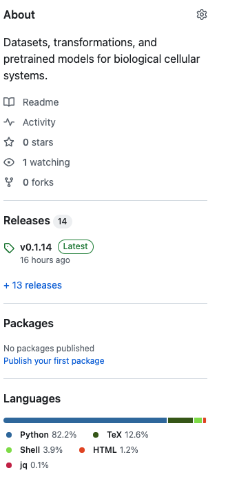
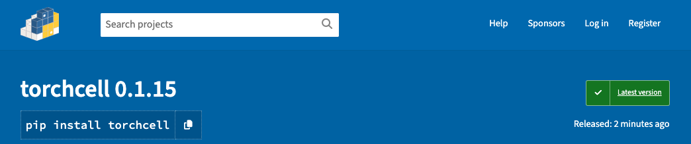

## Semantic-Release for Versioning

@Mjvolk3.torchcell.tasks.deprecated.2024.06.18

```
python -m pip install python-semantic-release
```

### Semantic-Release for Versioning - pyproject.toml

```toml
[tool.semantic_release]
version_variables = [
    "pyproject.toml:version",
    "torchcell/__version__.py:__version__",
]
branch = "main"
upload_to_pypi = "true"
```

Goes by `MAJOR.MINOR.PATCH` distinction

### Semantic-Release for Versioning - GitHub Actions

We rely on github actions to update versions via assigning a version tag with each release. Any time we want to bump the versioning we can just add one of the following to the next git commit.

- `"major"=="BREAKING CHANGE:"`
- `"minor"=="feat:"`
- `"patch"=="fix:"`

I believe a separate commit is made via github actions which then adds the tag. This means that the tag does not appear immediately in github uppon receiving the push and it is the reason we have resorted to publishing to PyPi from local instead of via git hub actions [[Bash Script used for Publishing on PyPI|dendron://torchcell/pypi-publish#bash-script-used-for-publishing-on-pypi]]. I could not find a way to make the publishing action conditioned on the `".github/workflows/semantic-release.yaml"` action completion. Since we really should base the publishing on the latest version tag, it is not straightforward how to do this.

### Semantic-Release for Versioning - Standard Operating Procedure

- (1) Big brain 🧠 has made progress and wants to update the software version

- (2) Commit with any of the designated text for MAJOR.MINOR.PATCH

Example:

```git
git add .
git commit -m "fix: database to infinity"
```

- (3) Go to [github torchcell](https://github.com/Mjvolk3/torchcell) and check until `".github/workflows/semantic-release.yaml"` has completed and the release version updates accordingly.



⛔️ See how in later examples we are updating to `v0.1.15`, if you see `v0.1.14` the github action isn't complete and you cannot yet publish to pypi.

- (4) Now back on local you will see that the versioning is out of date. You can check this by looking at ay of the files listed in `version_variables` in the `pyproject.toml`. Since github actions bumps the version remotely we now need to sync. `git fetch` and `git merge` to see version update.

Example:

Check these files for current version and you will see mismatch.

```toml
version_variables = [
    "pyproject.toml:version",
    "torchcell/__version__.py:__version__",
]
```

Once the github action has completed, and the versioning has been bumped remotely, update the local version via `git fetch` and `git merge`.

```bash
michaelvolk@M1-MV torchcell % git fetch                                                                                                         17:03
remote: Enumerating objects: 7, done.
remote: Counting objects: 100% (7/7), done.
remote: Compressing objects: 100% (2/2), done.
remote: Total 7 (delta 5), reused 7 (delta 5), pack-reused 0
Unpacking objects: 100% (7/7), 834 bytes | 119.00 KiB/s, done.
From https://github.com/Mjvolk3/torchcell
   ee61890..d226d07  main       -> origin/main
 * [new tag]         v0.1.15    -> v0.1.15
michaelvolk@M1-MV torchcell % git merge                                                                                                         17:04
Updating ee61890..d226d07
Fast-forward
 CHANGELOG.md             | 11 +++++++++++
 pyproject.toml           |  2 +-
 torchcell/__version__.py |  2 +-
 3 files changed, 13 insertions(+), 2 deletions(-)
```

- (5) Now we can easily publish to pypi with `twine`. There are a few command commands, we wo have simplified things with running a VsCode task to run `tc: publish pypi`. Where `tc` stands for torchcell. [[Bash Script used for Publishing on PyPI|dendron://torchcell/pypi-publish#bash-script-used-for-publishing-on-pypi]]

Example:

```bash
 *  Executing task in folder torchcell: source /Users/michaelvolk/Documents/projects/torchcell/notes/assets/scripts/tc_publish_pypi.sh 

* Creating virtualenv isolated environment...
* Installing packages in isolated environment... (setuptools>=69.0.2, wheel)
* Getting build dependencies for sdist...
/private/var/folders/t3/hcfdx0qs0rsd9bm4230xv_zc0000gn/T/build-env-eyl1b_up/lib/python3.11/site-packages/setuptools/config/expand.py:134: SetuptoolsWarning: File '/Users/michaelvolk/Documents/projects/torchcell/LICENSE' cannot be found
  return '\n'.join(
running egg_info
writing torchcell.egg-info/PKG-INFO
writing dependency_links to torchcell.egg-info/dependency_links.txt
writing entry points to torchcell.egg-info/entry_points.txt
...
... # Deleted some text for brevity
...
adding 'torchcell/viz/__init__.py'
adding 'torchcell/viz/fitness.py'
adding 'torchcell/viz/genetic_interaction_score.py'
adding 'torchcell/yeastmine/__init__.py'
adding 'torchcell/yeastmine/graphs.py'
adding 'torchcell/yeastmine/yeastmine.py'
adding 'torchcell-0.1.15.dist-info/METADATA'
adding 'torchcell-0.1.15.dist-info/WHEEL'
adding 'torchcell-0.1.15.dist-info/entry_points.txt'
adding 'torchcell-0.1.15.dist-info/top_level.txt'
adding 'torchcell-0.1.15.dist-info/RECORD'
removing build/bdist.macosx-11.0-arm64/wheel
Successfully built torchcell-0.1.15.tar.gz and torchcell-0.1.15-py3-none-any.whl
Uploading distributions to https://upload.pypi.org/legacy/
Uploading torchcell-0.1.15-py3-none-any.whl
100% ━━━━━━━━━━━━━━━━━━━━━━━━━━━━━━━━━━━━━━━━ 234.8/234.8 kB • 00:00 • 1.2 MB/s
Uploading torchcell-0.1.15.tar.gz
100% ━━━━━━━━━━━━━━━━━━━━━━━━━━━━━━━━━━━━━━━━ 167.1/167.1 kB • 00:00 • 335.6 MB/s

View at:
https://pypi.org/project/torchcell/0.1.15/
 *  Terminal will be reused by tasks, press any key to close it. 
```

(6) Can now check [pypi torchcell](https://pypi.org/project/torchcell/) for updated version.



## 2026.09.29 - Tag map, the parser that reads it, and release-before-build

Plan: [[plan.data-release-program.2026.09.29]], Decision 5 (T4, issue #467).

### What each commit tag does now

Measured on python-semantic-release 10.4.1 (the installed version) with the config in
`pyproject.toml`; `tests/scripts/test_release_parser.py` pins it on the last 30 real
subjects of `main`.

| tag | bump | note |
|---|---|---|
| `API` | major | also any tag with `!` (`FIX(x)!: ...`) or a `BREAKING CHANGE:` paragraph |
| `FEAT`, `ENH`, `DEP`, `DEV`, `REV` | minor | |
| `FIX`, `BUG`, `BLD`, `MAINT`, `PERF` | patch | `FIX` and `PERF` are new to the map; a `FIX(...)` used to release nothing |
| `DOC`, `DOCS`, `NOTE`, `TST`, `TEST`, `STY`, `CI`, `REL`, `BENCH` | none | allowed, so they are not parser noise; `DOCS`, `NOTE` and `CI` are new |
| anything else (`fig(008): ...`, the `1.2.1` bump commit) | not parsed | ignored by the release |

The parser is `scripts/release_parser.py:TorchcellCommitParser` ([[scripts.release_parser]]):
the conventional parser plus `major_tags`. The `scipy` parser used until now accepts
`TAG: subject` and `TAG: scope: subject` only; on the last 30 subjects 23 did not parse
because they carry the `TAG(scope): subject` form, so `FIX(losses): ...` bumped nothing
however `patch_tags` was set. With the new parser those 30 subjects give 8 patch, 20 no
release, 2 unparsed. Consequence: the first push to `main` after this lands releases
`1.2.2`, since five `FIX` commits, `PERF(ops)` and `MAINT(ci)` sit above `v1.2.1`.

### Cut the source release before the KG build

The KG release names a package version (`torchcell_version`, `torchcell_tag` in the
manifest, the `KgRelease` node and the committed snapshot,
[[torchcell.knowledge_graphs.releases]]). For the tag to be a real package release:

1. Land everything the build should serialize under, then push a bumping commit to
   `main` (`FEAT:` for a minor, `FIX:` for a patch, `API:` or `!` for a major);
   `semantic-release.yaml` tags `vX.Y.Z` and pushes the bump commit
   (`torchcell/__version__.py`, `pyproject.toml`).
2. Check out that tag in the build checkout (`TORCHCELL_SRC` at `vX.Y.Z`, clean tree)
   and run the full build (`gilahyper_live_rebuild-slurm_docker.slurm`) or the increment.
   `stamp` records `torchcell.__version__` and `git describe --tags --exact-match HEAD`
   of that checkout; a build from an untagged commit records the version with tag None
   and the status table shows `1.2.x (untagged)`.
3. The slurm script writes `database/releases/<release>.json` (+ `.closures.json`) into
   the checkout; commit them, run `python scripts/kg_compat_page.py`, commit the page.

The bootstrapped snapshot for `2026.09.21-ab6d8c5d` records `1.2.0` with tag None: the
build ran from `ab6d8c5d`, between `v1.2.0` (2026.07.01) and `v1.2.1` (2026.09.27).

## 2026.09.29 - Bumps are deliberate: REL minor, DB patch, API major

The first map of the day (`FEAT` minor, `FIX` patch) moved `main` from `1.2.1` to `1.5.0`
in one evening, one bump per landed PR, and the version stopped meaning anything. The map
is now the three tags below; every other allowed tag, `FEAT` and `FIX` included, parses
with no bump, so `main` is "latest" between releases and a version is something we cut.

| tag | bump | when |
|---|---|---|
| `API` | major | a public interface changes; also any tag with `!` or a `BREAKING CHANGE:` paragraph |
| `REL` | minor | a source release, cut before a KG build so the release names a tagged version (step 1 of the section above) |
| `DB` | patch | a database compatibility change: a new snapshot under `database/releases/`, a supported-query registry change (`docs_page` edits excepted), a schema closure change that alters what the served graph serializes |
| `FEAT`, `ENH`, `DEP`, `DEV`, `REV`, `FIX`, `BUG`, `BLD`, `MAINT`, `PERF`, `DOC`, `DOCS`, `NOTE`, `TST`, `TEST`, `STY`, `CI`, `BENCH` | none | allowed, so the parser does not treat them as noise |

`DB` is a patch because the compatibility matrix (`docs/source/database/compatibility.md`,
`scripts/kg_compat_page.py`) is keyed by `major.minor`: a patch changes which KG releases
a package version is checked against without changing what the package promises. The
release-before-build recipe above is unchanged except that step 1 now reads `REL: ...`
for the minor, `DB: ...` for the patch. `tests/scripts/test_release_parser.py` pins the
map on the same 30 real subjects (now 28 no-release, 2 unparsed) and on one subject per
bumping tag; `docs/source/guide/contributing.md` carries the same table.

## 2026.09.30 - PyPI publishing rejoins the release

PyPI stopped at 0.2.8 (uploaded 2024-09-20) while GitHub releases reached v1.5.0, because `upload_to_pypi = "true"` in `[tool.semantic_release]` is a python-semantic-release v7 option that the v8+ action ignores; nothing built a distribution and nothing uploaded one. The last hand path was the VS Code task `tc: publish pypi` (commit a36711669, 2024-02-13), which ran `python -m build` and `twine upload dist/*` from a local checkout.

The release workflow now does the whole job on a bumping push. `build_command = "python -m pip install build && python -m build"` builds the wheel and sdist inside the semantic-release step; `python-semantic-release/publish-action` attaches `dist/*` to the GitHub release; `pypa/gh-action-pypi-publish` uploads them to PyPI through trusted publishing from the job's `pypi` environment (`id-token: write`), so no PyPI token is stored. Both publish steps are gated on `steps.release.outputs.released == 'true'`, so a push that parses with no bump publishes nothing. The action is pinned to `v10.7.0` instead of `master`.

Checked locally on 293780e4b: `python -m build` produced `torchcell-1.5.0-py3-none-any.whl` (2.4 MB, 539 files, the `py.typed`, adapter and KG configuration, `.cql` queries and registry included, no `tests/` or `experiments/`) and `torchcell-1.5.0.tar.gz` (2.0 MB); `twine check` passed both. The PyPI page renders `README.md`, so its logo now points at the raw GitHub URL, and the placeholder `description` and `keywords` from the package template are replaced.

One step is outside the repository: the trusted publisher has to be registered once on pypi.org (project `torchcell`, owner `Mjvolk3`, repository `torchcell`, workflow `semantic-release.yaml`, environment `pypi`). Until it is, the first bumping push still tags and creates the GitHub release with the dist attached, and only the PyPI step fails. The next `REL` commit after that registration is the first version on PyPI since 0.2.8.

## 2026.10.01 - Release 1.6.0 and a manual publish for an existing tag

`REL` commit cutting 1.6.0, the first release the workflow builds and publishes to PyPI. GitHub releases had reached v1.5.0 (tagged 2026-09-30 00:26 UTC) while PyPI still showed 0.2.8 (2024-09-20): the publish steps landed about a day after v1.5.0 (PR #547, 1af45722f), and none of the 93 commits on `main` since then carried a bumping tag (`FIX`, `TST`, `DOCS`, `NOTE`, one `FEAT`), so every run of the workflow ended green with both publish steps skipped. No credential had been exercised. This release is the first run that exercises the bump, the build, the GitHub release upload and the PyPI publish together.

Checked locally on 483e0668a before the release: `python -m build` produced `torchcell-1.5.0-py3-none-any.whl` (2,458,659 bytes) and `torchcell-1.5.0.tar.gz` (2,059,449 bytes), and `twine check` passed.

The workflow also gains a manual path, `gh workflow run semantic-release.yaml -f tag=vX.Y.Z` (job `publish-tag`): it checks out an existing tag, builds it, refuses a build whose version is not the tag's, replaces the assets on the GitHub release and publishes to PyPI under the same `pypi` environment, so the trusted publisher registered for `semantic-release.yaml` covers it. It never bumps. It exists because a failed PyPI step cannot be retried by re-running the release job: on a re-run python-semantic-release finds no new commit, reports `released == false`, and the publish steps are skipped. The push-triggered `release` job is unchanged apart from running only on `push`.

## 2026.10.01 - 1.6.0 published: what the first real release run showed

The release run on the `REL` commit (36933195045) bumped 1.5.0 to 1.6.0, tagged `v1.6.0`, built the wheel and sdist and attached them to the GitHub release; its PyPI step failed with `invalid-publisher` ("valid token, but no corresponding publisher"), because no trusted publisher was registered on pypi.org yet. After the publisher was added (repository `Mjvolk3/torchcell`, workflow `semantic-release.yaml`, environment `pypi`), `gh workflow run semantic-release.yaml -f tag=v1.6.0` (run 36936717998) published the tag: PyPI and the GitHub release now hold the same two files, `torchcell-1.6.0-py3-none-any.whl` (2,458,862 bytes) and `torchcell-1.6.0.tar.gz` (2,059,663 bytes).

Every release produces two runs of the workflow. The first, on the releasing commit, bumps and publishes. The second, on the bot's own bump commit (titled with the version, here "1.6.0"), finds nothing to release and skips both publish steps while ending green; its step list still shows "Publish dist to PyPI", greyed out. A green run titled with the version is therefore not evidence of a publish: read the first run, or check `https://pypi.org/pypi/torchcell/<version>/json`.

## 2026.10.01 - PATCH, a source patch release

The tag map had one patch tag, `DB`, defined as a database compatibility change, so a small source release could only be cut as a minor (`REL`) or mislabeled as a database change. `PATCH` fills that gap: a deliberate source patch release with no interface or database change, for a packaging, README or documentation correction that has to reach PyPI. PyPI freezes the project description per release, so a README fix is visible there only in a new version.

| Bump | Tag | Meaning |
|---|---|---|
| major | `API` | a public interface changes |
| minor | `REL` | a source release, cut before a KG build |
| patch | `DB` | a database compatibility change |
| patch | `PATCH` | a source patch release, no interface or database change |
| none | everything else, `FEAT` and `FIX` included | no release |

Bumps stay deliberate: `FIX` and `DOCS` still release nothing. The first use is 1.6.1, which carries the README corrected after 1.6.0 (the overview figure by absolute URL, one dataset per line in the download table). Files: `patch_tags` and `allowed_tags` in `pyproject.toml`, the parser docstring, `tests/scripts/test_release_parser.py` (the level map and a `PATCH(release): ...` subject), and the table in `docs/source/guide/contributing.md`.

## 2026.10.06 - KG 3.0 gets its paired package release, 1.6.2

The two full builds of October ran without the release-before-build recipe. KG 2.0 (`2026.10.02-833970cd`) and KG 3.0 (`2026.10.06-4b293d34`, job 3297, 51 datasets, 100,127,515 nodes) were both built from `main` at `1.6.1 (untagged)`, and their snapshot commits carried the subject tag `RELEASE(kg)`, which is not in `allowed_tags`, so neither bumped a version. The compatibility page therefore shows every published tag as `partial` against KG 3.0 (20 datasets drifted from `v1.6.1`), and the only software compatible with the served store is `main` itself: `python -m torchcell.knowledge_graphs.releases --repo . compat --version latest` on `e6367528b` reports 51 compatible, 0 drifted, 0 unchecked.

This `DB(kg)` commit cuts `1.6.2` from that state as the package release paired with KG 3.0. Its schema surface is the one the store was serialized under, so the page will show `v1.6.2` compatible with `2026.10.06-4b293d34` once the tag exists and the page is regenerated. The snapshot and the `KgRelease` node still record the build checkout as `1.6.1 (untagged)`, which is what they observed; the pairing with `v1.6.2` is recorded by a retag step that follows in the pairing-gates change (build gate, client gate, pairs table, deploy step), together with the rule that a snapshot commit is `DB(kg): ...` so the bump is never skipped again.

## 2026.10.06 - Pairs: one package release per KG release, enforced

The gap the October builds exposed (the section above) is closed at four points, all landed with the `feat/kg-release-pairing` branch.

1. **Build gate.** `gilahyper_live_rebuild-slurm_docker.slurm` refuses to start unless the build commit carries a `vX.Y.Z` tag and the fingerprint checkout sits on it, so `stamp` records the tag. The recipe: land the work, push `REL` (minor) or `DB`/`PATCH` (patch), wait for the `vX.Y.Z` bump commit on `main`, build from it. The snapshot commit after the build is `DB(kg): <release> snapshot ...`, never `RELEASE(kg)`.
2. **Client gate.** `Neo4jQueryRaw._connect` reads the resolved database's `KgRelease` node and runs `releases.require_paired` against the installed schema surface before opening a driver. Any drifted or unverified dataset, or a store with no release node, raises `IncompatibleReleaseError` naming the paired package and the remedy. No override.
3. **Pairs table.** `docs/source/database/compatibility.md` opens with one row per release and its paired package; the matrix says `incompatible`, not `partial`; a paired tag that does not read its release fails `scripts/kg_compat_page.py --check`, which now runs in CI (`docs.yaml`, job `query-drift`).
4. **Deploy step.** `scripts/kg_release.sh deploy <release>` restores an archived release into the serving DBMS, checks its node against `release.json`, moves `latest`, and ends with `ops.sh sync` (exit 1 on DIVERGED or an unpaired store). `restore-test` proves an artifact restores; `retag` repairs an untagged build.

The repair for the existing releases: `1.6.2` cut on 2026-10-06 (PR #679, run on `9a3407ba8`, tag on bump commit `56dfd59e0`, published to PyPI), and `releases retag` paired `2026.09.21-ab6d8c5d` with `v1.2.1`, `2026.10.02-833970cd` with `v1.6.1`, `2026.10.06-4b293d34` with `v1.6.2`. The served store's node is retagged by `kg_release.sh retag 2026.10.06-4b293d34 v1.6.2` under slurm.

The retag edits are pairing metadata on existing snapshots (no closure, record or registry changes), so they land under `FEAT(kg)` and bump nothing; a `DB` is for a new snapshot or a closure change.

Pairing policy is **exact tag**, with the matrix as the record of which other tags happen to read a release: a `PATCH` or `DB` patch on the same line that leaves every closure fingerprint unchanged (the schema-impact hook refuses an unacknowledged change) reads the release too, and the pairs table lists it under *reads it*, but the release names one package, the one it was built from or retagged to.

## 2026.10.08 - 1.7.0 cut for KG 4.0

Landed on 2026-10-08, all through the merge queue: non-journal source types on `Publication` (`source_type`, `title`, `identifier`; PR #778), dataset visibility (`ExperimentDataset.visibility`, the `torchcell/datasets/private_torchcell/` namespace, the build and release gates; #778, #785), typed integrated cassettes on `StrainBackground` with the shared bAID background used by Lian 2019 and the new private `InhibitorBioscreenVolk2021Dataset` (#778, #785), Vanacloig 2022's Table S1 doses, vehicles and reported percent values with `ConcentrationUnit.percent` (#765, #807), the Costanzo 2021 raw refusal (#804), the kg_manifest conf resolution (#806), the staleness gate over module-level vocabularies (#808), SI capture tooling (#803) and the bulk dev-store rebuild (#809).

`Publication` sits in every served closure, so every one of the 103 mapped dev stores reads stale and the served store (KG 3.0, `2026.10.06-4b293d34`) must be rebuilt in full. This `REL` cuts `1.7.0` as the package the next build pairs with; the dev stores are rebuilt from it (`gilahyper_build_dataset_lmdbs_array.slurm`) and the live rebuild runs from the tagged bump commit with `INCLUDE_PRIVATE=1`, the first store to carry a private dataset. The snapshot commit after the build is `DB(kg): ...`.
