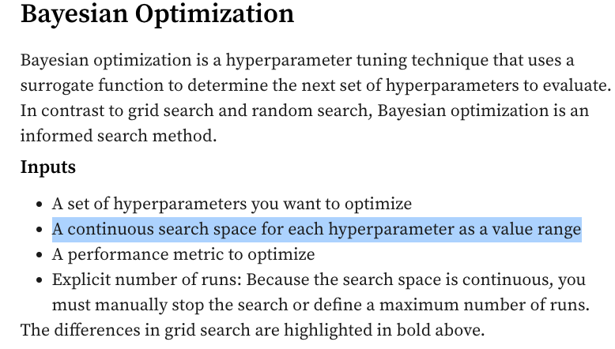

## 2024.04.02 - Wandb Bayesian Optimization Only Operates on Continuous Variables

[wandb article](https://wandb.ai/site/articles/intro-to-mlops-hyperparameter-tuning)

They also say,

> But because Bayesian optimization is an informed search, it cannot be parallelized like the other two.

I am not sure exactly what this means, it seems that parts can be parallelized meaning you should be able to run say the first four with random seeds on 4 gpu then which ever finishes first can make the next informed decision...

Say I have 4 gpus. will the first four runs be random. Then run 5, for whichever gpu finished first, should be based on bayesian optimization? Then what about run 6 for the second gpu that finishes since it will have the same information that run 5 had, but cannot be duplicate of run 5. I wonder if they've sorted this out...

[Github Issue - Parallel Sweep in Bayesian Search](https://github.com/wandb/wandb/issues/2793)

[wandb bayes_search source](https://github.com/wandb/sweeps/blob/master/src/sweeps/bayes_search.py)
